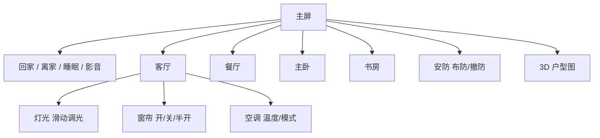
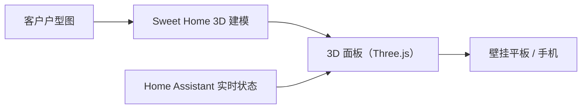

# 客户A · 界面设计

> 设计原则：**好看、好用、小白 5 秒上手**。三个界面载体：客厅壁挂平板（主）、手机 App（随身）、3D 户型图（亮点）。

## 1. 设计原则

- **一屏一目的**：主屏只看最重要的（天气、场景、安防状态），细节进房间页
- **大按钮、中文、少层级**：家人（含老人小孩）都能用
- **真实反映状态**：灯亮着就显示亮，窗帘开着就显示开，不靠记忆
- **夜间模式**：自动跟随日落，壁挂平板夜间变暗

## 2. 客厅壁挂平板（主界面）

客厅墙面挂一台平板，常驻显示，回家一眼看到全屋状态：

- **顶部**：时间、天气、全屋温度、安防布防状态
- **中部**：四个常用场景大按钮 —— 回家 / 离家 / 睡眠 / 影音
- **底部**：房间切换（客厅 / 餐厅 / 主卧 / 书房 / 阳台…）
- **房间页**：该房间的灯、窗帘、空调、传感器一目了然，点击即控

## 3. 3D 可视化户型图（亮点页）

客户提供户型图后，我们把它做成 **3D 立体户型图**，作为全屋总览页：

- **立体房间模型**：一眼看懂全屋结构，房间按真实布局排列
- **设备实时状态**：灯光亮/灭、窗帘开/合、门锁状态、摄像头画面，直接在 3D 模型上显示
- **点击交互**：点房间进入该房间控制，点设备直接操作
- **动态效果**：灯亮时房间发光、窗帘动画开合、布防时房子显示「保护中」

> [!note] 技术说明（给客户的一句话）
> 3D 户型图基于户型图建模（Sweet Home 3D 制作），通过我们自研的 3D 面板接入家庭平台，设备状态实时刷新。整体 3D 需要 1–2 周制作周期，验收时一起交付。

效果示意图（架构预览，实际以交付为准）：

## 4. 手机 App（随身）

- 同一套界面在手机上自动适配，出门在外也能看能控
- **推送通知**：安防告警、漏水/烟雾、家人回家，手机实时收到
- 支持多账号：全家人都有自己的登录，各自控制自己的房间

## 5. 语音界面

- 小爱音箱：说「开客厅灯」「关窗帘」「调空调到 26 度」
- AI 智能体：说复杂指令「我出门了，关灯关窗帘，启动扫地机」（详见 [[04_语音与智能体|语音与智能体]]）

## 6. 交付清单

| 交付项 | 说明 |
|--------|------|
| 主题 Dashboard | 主屏 + 场景页 + 房间页，深色/浅色自动切换 |
| 3D 户型图面板 | 户型图建模 + 3D 交互面板 + 实时状态（待户型图） |
| 手机 App 界面 | 与平板同源，自适应 |
| 使用培训 | 验收当天给全家人演示一遍 |
