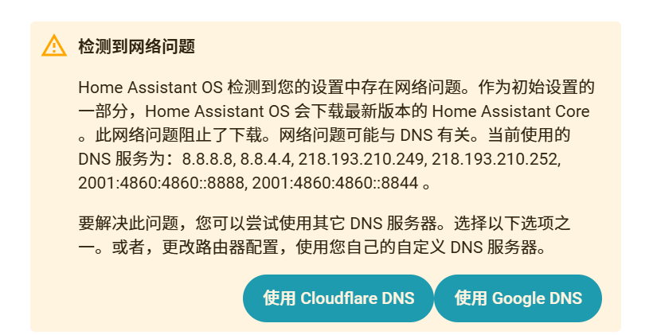

# 第八章 故障排查手册与长期运维

> [!summary]
> 本章是排障手册 + 运维清单：错误码 1001–1005 与数据库 `.recover` 重建、8123 / 8124 / 4357 端口与正确重启方式、时区与 NTP 判别、首次启动网络死循环排障、四种国内远程访问方案对比，以及每周 / 每月的长期检查清单。命令与参数来自深度研究素材 §四，采集时间 2026-08-06。

## 8.1 错误码速查与数据库修复

### 8.1.1 错误码速查

> [!warning] 来源说明
> 下表为社区博客整理，以实际系统日志与官方文档为准（采集时间 2026-08-06）。

| 错误码 | 含义 | 常见处理 |
|--------|------|----------|
| 1001 | 网络接口错误 | 检查网卡是否识别、接口名是否正确 |
| 1002 | 依赖工具缺失 | 补装 / 修复依赖，重跑安装校验 |
| 1003 | 启动失败 | 查看 `journalctl` 与启动日志定位崩溃点 |
| 1004 | 数据库不存在 | 检查数据库文件是否丢失 / 被误删，必要时重建 |
| 1005 | 配置文件格式错误 | 校验 YAML 缩进与类型，回滚最近改动 |

### 8.1.2 无 IP 问题

断电重启后 [[01_绪论|HAOS]] 常比 DHCP 先启动，接口不再重试就"拿不到 IP"。社区解法是手动把接口切回自动获取：

```bash
network update enp1s0 --ipv4-method auto
```

> [!tip] 建议静态 IP
> 给 [[01_绪论|HAOS]] 配固定 IP（路由器 DHCP 绑定或静态配置），既避免断电后无 IP，也让远程访问、自动化回调更稳定。

### 8.1.3 数据库损坏与 .recover 重建

HA 长期高频写入（尤其装在 TF 卡 / 异常断电）可能让 SQLite 数据库损坏。用 SQLite 自带的 `.recover` 把数据恢复到新库：

```bash
# 先按 8.2 的"正确重启"停掉 HA，再在配置目录执行
sqlite3 database.sqlite3 ".recover" | sqlite3 new.db
mv database.sqlite3 database.sqlite3.bak
mv new.db database.sqlite3
```

若重建后仍频繁出问题：把数据库迁移到 MariaDB，或确认存储已迁到 SSD（见第七章）。

> [!warning] 非正常断电是主要诱因
> 数据库损坏多来自直接断电。[[01_绪论|HAOS]] 里"正确重启"必须走界面，而不是拔电或硬关机。

## 8.2 端口、诊断通道与正确重启

### 8.2.1 三个端口各管什么

| 端口 | 归属 | 用途 |
|------|------|------|
| 8123 | Core / Web UI | 日常访问的仪表盘 |
| 8124 | Supervisor API | Supervisor 管理接口 |
| 4357 | HassOS Observer | 系统级诊断，Core 起不来时也能用 |

Core 完全起不来、8123 打不开时，用 4357 通道确认系统状态：

```bash
curl http://homeassistant.local:4357/
```

返回系统健康信息，能帮你区分"是 Core 崩了"还是"整个系统起不来"。

### 8.2.2 正确重启

[[01_绪论|HAOS]] 的"正确重启"路径是：**设置 → 系统 → 硬件**，从界面触发重启 / 关机。走界面等于通知各组件优雅退出，数据库落盘后再断电。

> [!warning] 别拔电
> 直接断电十有八九会留下损坏的 SQLite 数据库。真遇到"卡死"需要强制重启，重启后第一件事是跑 8.1.3 的 `.recover` 检查。

## 8.3 时间同步排障

时间错乱会让 HTTPS 证书校验失败、自动化不触发、更新拉不下来。先看状态：

```bash
timedatectl
```

看 `System clock synchronized: yes` 即为成功。时间不对时，先判别是时区还是 NTP：

| 现象 | 根因 | 处理 |
|------|------|------|
| 差整 8 小时 | 时区未设 | 设置时区（Asia/Shanghai） |
| 差几分钟且持续增大 | NTP 同步失败 | 检查 NTP 源连通、配置国内源 |

国内 NTP 源（配置方法见第四章 `/etc/systemd/timesyncd.conf`）：`ntp1~7.aliyun.com`、`ntp.tencent.com`、`ntp.ntsc.ac.cn`、`cn.pool.ntp.org`。容器环境用 chrony 加载项，把 `ntp_pool` 改成 `cn.pool.ntp.org`。

> [!tip] 时间是一切更新的前提
> 证书、自动化、OTA 全依赖准确时间。NTP 国内化是"稳定"的隐性基础，别只当小事。

## 8.4 首次启动网络死循环（Core 拉取卡死）

> [!warning] 现象
> 首次初始化向导报「检测到网络问题」，日志反复打印 `Home Assistant Core installation in progress`，几十分钟原地打转。这不是机器坏了，是 [[04_手动配置国内源|第四章]] 预言的「首次启动拉 ~700MB Core 组件」在国内网络下的典型表现：Supervisor 反复拉取 Core 镜像，但解析不到地址或下载不到镜像。

### 8.4.1 排查顺序（从快到慢）

**① 向导里换 DNS（先试这个，2 分钟）**


DNS 列表里常混着 8.8.8.8 / 8.8.4.4（Google，国内不可达）和 ISP/教育网地址。在向导提示框选「使用自定义 DNS」：

```text
223.5.5.5       # 阿里 DNS
119.29.29.29    # 腾讯 DNSPod
114.114.114.114
```

IPv6 留空，保存后重试。若只是解析问题，这一步就能过。

**② 确认 VMware 网络本身通（换 DNS 还不行再做）**

- 虚拟机网络适配器必须是 **Bridged 桥接** + 勾选真实有线网卡，不要用 NAT / 仅主机 / 无线网卡（见第三章 3.2）；
- 确认 VM 能拿到 IP：DHCP 能下发 DNS 说明网络基本通。

**③ ghcr.io 拉不动 → 控制台提前配 4.3 国内镜像（核心）**

DNS 通了仍死循环，就是 ghcr.io 瓶颈。此时还没过初始化、SSH 开不了，但 **VM 控制台可以 `login` 进 root shell**，提前把 [[04_手动配置国内源|4.3]] 的镜像映射配好：

```bash
# 在 VMware 控制台（不是浏览器）里：
login                          # 进入 root shell，无密码

cp /usr/share/hassio/docker.json /usr/share/hassio/docker.json.bak
vi /usr/share/hassio/docker.json
# {
#   "registries": {},
#   "registries_mirror": { "ghcr.io": "ghcr.nju.edu.cn", "docker.io": "docker.nju.edu.cn" }
# }

systemctl restart hassio-supervisor
```

回浏览器向导点重试（或刷新页面）。Supervisor 再拉 Core 就走 `ghcr.nju.edu.cn`，几分钟内完成。

> [!warning] 若保存提示只读
> 根文件系统只读、`vi` 存不进去时，说明该版本这个文件在只读区，直接走 ④。

**④ 治本方案：换 HAOS-CN `-full` 完整包**

免初始化等待、内置全套国内加速，Core 已内置不再现场下载。把 VM 磁盘换成 [[05_HAOS-CN极速版]] 的 `-full` 包重做即可（注意该包目前标为公测）。

### 8.4.2 时间同步是隐藏诱因

Core 拉取走 HTTPS，证书校验依赖准确时间。VMware 上 VM 时钟继承 Windows 宿主时间——如果宿主时间不准（差数年），会表现成「拉取莫名其妙失败」。排查前先确认 Windows 宿主时间正确，或用 8.3 的时间判别法。

> [!tip] 过了这关后立刻补 4.3 / 4.5
> 首次启动能进向导 ≠ 国内化完成。Add-on 商店、系统更新、时间同步还会继续撞国内网络问题，按第四章逐节补完再开始日常使用。

## 8.5 国内远程访问方案对比

| 方案 | 前提条件 | 优点 | 注意点 |
|------|----------|------|--------|
| Tailscale | 无 | 官方插件、零配置、个人首选 | 访问地址形如 `.ts.net:8123` |
| Cloudflare Tunnel | 自有域名 | 无需公网 IP、可叠加访问控制 | 国内部分地区被污染，需先测连通 |
| FRP | 一台公网 VPS | 可控性强、性能好 | 需要维护 VPS |
| 公网 IP + Nginx 反代 | 运营商给公网 IP | 最直接 | 勿裸映射 8123，务必套 Nginx 反代 + HTTPS |

> [!warning] 勿裸映射 8123
> 把 8123 直接端口映射到公网等于裸奔，会招来扫描与爆破。即使走"公网 IP + 端口映射"，也必须用 Nginx 反代加 HTTPS、加访问鉴权。

## 8.6 长期运维检查清单

### 每周

- [ ] 打开 [[01_绪论|HAOS]] 界面，确认 Core / Supervisor 运行正常
- [ ] 检查 Google Drive 里最新备份时间戳（应不早于 2 天）
- [ ] 看 `/config/home-assistant-rollback.log` 有无意外回滚记录
- [ ] `timedatectl` 确认时间同步正常

### 每月

- [ ] 确认可用性：`curl http://homeassistant.local:4357/` 返回正常
- [ ] 清点备份：按世代保留策略清理过期备份
- [ ] 检查更新：Core / Supervisor / 加载项是否有待升级，按 7.3 策略逐版本升级
- [ ] 检查国内源是否仍有效（Docker 公益镜像站失效常见，失效则按第四章更换源）

> [!warning] 公益镜像源会"隔天失效"
> Docker 公益镜像站失效非常常见。平时多配几个源（第四章 12 源故障转移链），并在每月清单里实际验证一次 `docker info` 的 Registry Mirrors 是否命中。

## 本章 Checklist

- [ ] 能识别 1001–1005 错误码并知道大致方向
- [ ] 遇到无 IP 会跑 `network update enp1s0 --ipv4-method auto`
- [ ] 数据库损坏时会用 `.recover` 重建
- [ ] 知道 8123 / 8124 / 4357 三个端口各管什么
- [ ] 重启只走「设置 → 系统 → 硬件」，不拔电
- [ ] 时间不对能判别是时区还是 NTP
- [ ] 首次启动死循环时按「换 DNS → 查桥接 → 控制台配镜像 → 换 HAOS-CN」排查
- [ ] 已选定远程访问方案（Tailscale / Cloudflare Tunnel / FRP / Nginx 反代）
- [ ] 已建立每周 + 每月运维清单节奏

---

> ⬅️ 上一章：[[07_稳定运行保障|第七章 稳定运行保障——存储、备份与升级]] ｜ 📖 [[部署 HAOS 详细教程|返回索引]] ｜ 下一章：[[09_HACS安装与国内源|第九章：HACS 安装与国内源]] ➡️
