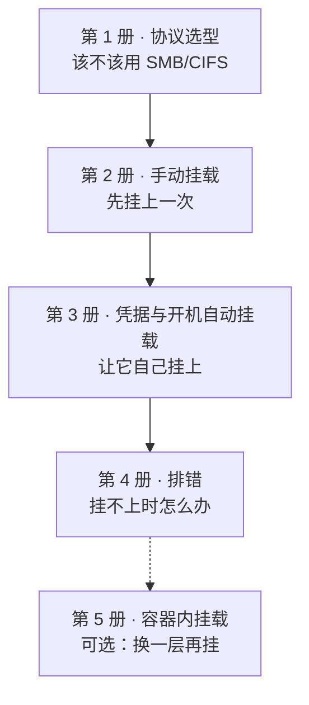

# SMB/CIFS 共享文件夹挂载到 Linux 服务器

> **一句话**：把 Windows / NAS（含飞牛 FNOS）上的共享文件夹，用 `mount -t cifs` 挂到 Debian / Ubuntu 服务器上，并让它在开机后自动挂上、出问题时能自己查出来。

这是一个 5 册系列：从「该不该用 SMB/CIFS」的判断，到手动挂载、凭据与开机自动挂载、排错，最后一册是容器场景的可选小节。

## 分册导航

| 册 | 标题 | 解决什么问题 | 读完你能 |
| --- | --- | --- | --- |
| 1 | [[SMB挂载-01-协议选型]] | 动手前先判断：该不该走 SMB/CIFS、共享端支持哪一版方言、挂上以后谁来管权限 | 说清「方言」是协商结果而非固定版本，并知道为什么不该把 `vers=` 写死 |
| 2 | [[SMB挂载-02-手动挂载]] | 装 `cifs-utils`、挂载前用 `smbclient` 探测、写出并读懂 `mount -t cifs` 的每个选项 | 挂上共享，并说清 `uid`/`gid`、`file_mode`、`iocharset`、`vers`、`sec` 各自管什么、边界在哪 |
| 3 | [[SMB挂载-03-凭据与开机自动挂载]] | 把密码收进权限正确的凭据文件，写对 `/etc/fstab` 行，并搞懂 systemd 的开机顺序 | 服务器离线时开机不被卡住，并能在三条回落路线之间做出选择 |
| 4 | [[SMB挂载-04-排错]] | `mount error(13)` 的完整证据链、errno 数值与易错点、方言协商的核对方法、Windows 侧签名导致的连不上 | 拿到一个错误码时能判断问题落在认证、网络还是方言协商上，而不是去背错误码清单 |
| 5 | [[SMB挂载-05-容器内挂载]] | 容器里直接 `mount` CIFS 为什么不稳，以及更稳妥的两条替代路径 | 知道该在宿主机挂好再 bind mount 进容器，而不是给容器加权限（**全册为社区经验**） |

## 链路总览

## 前置要求

- 一台 Debian / Ubuntu 服务器，有 root 或 sudo 权限。
- 一个可用的 SMB/CIFS 共享端：Windows 主机、NAS（本系列以飞牛 FNOS 为例）或 Samba 服务器。
- 会基本的命令行操作；对 `mount`、`/etc/fstab` 有概念更好，没有也能跟下来（第 2 册从零开始）。
- 第 5 册额外需要：Docker 基本使用经验；没有也不影响第 1–4 册的连贯性。

## 学完能做什么

- 判断一个共享场景该不该走 SMB/CIFS，而不是凭「听说 SMB 更通用」下手。
- 写出并读懂一条完整的 `mount -t cifs` 命令，知道每个选项管什么、哪一层在生效。
- 把凭据放进权限正确的文件，写出服务器离线也不会卡住开机的 `/etc/fstab` 行。
- 拿到 `mount error(N)` 时走证据链定位方向，而不是挨个试协议版本。
- 说清哪些结论有官方文档背书、哪些只是社区经验或推断——这套笔记把每条结论的层级都标出来了。

## 执行顺序建议

1. **只想知道怎么挂** → 直接读第 2 册，遇到权限语义问题回第 1 册 1.3。
2. **要长期稳定挂载** → 第 1 → 2 → 3 册顺着读。
3. **已经挂过但挂不上 / 动不动掉** → 先读第 4 册，再回第 3 册核对 fstab 行。
4. **共享是给容器用的** → 第 2、3 册 + 第 5 册。

## 来源与可信度标注

本系列每条结论都带层级标注。读的时候请按层级分配信任度：

| 标注 | 含义 | 本系列的典型例子 |
| --- | --- | --- |
| 官方口径 | 来自发行版 / 上游官方文档，正文标 SID + 锚点 | `mount.cifs(8)`、`systemd.mount(5)`、`smbclient(1)`、`findmnt(8)`、Microsoft Learn |
| `[社区]` 社区经验 | 论坛、第三方教程等非官方来源，未获上游确认 | 飞牛 FNOS 相关说法（S10/S11）、Docker 容器内挂载（S12） |
| `[推断]` | 由现有素材推出，无一手明文 | errno 数值与 `mount error(N)` 的对应关系、cifs 是否被 systemd 判为网络挂载 |
| `[缺口]` | 素材未覆盖，正文明确不补写 | `file_mode`/`dir_mode` 默认数值、FNOS 默认方言、容器所需 capability |

> [!warning] 引用来源时请带版本
> man page 与 systemd 的行为随版本变化，本系列引用默认值时一律带版本号（如「cifs-utils 7.4-1」「systemd 252」）。同一条结论在不同版本上可能不同。

> [!note] 正文里的 `02 §六.1`、`03_outline.md` 是什么
> 这套笔记由项目的学习笔记流程产出，意图文件、资料台账与大纲（`00_intent.md` / `02_deep_research.md` / `03_outline.md`）都放在项目工作区，**不在 vault 里**。正文中「（02 §六.1）」这类标注是**回指台账的具体小节**，用于说明「这条结论出自哪份素材的哪一节」，不是 vault 内的双链——点不开是正常的。日常查阅看本页下面的「附录：来源总表」即可，它已经把台账 §二 合并进来了。

## 附录：来源总表

本表汇总第 1–5 册「本章来源」小节中列出的全部来源（去重）；层级与版本/日期取自 `02_deep_research.md` §二「来源总表」，仅作合并，不新增来源、不改写来源描述。

| SID | 层级 | 版本 / 日期 | 涉及分册 |
| --- | --- | --- | --- |
| S01a | official | cifs-utils **2:7.4-1**，页面更新 2025-06-12 | 第 1、2、3、4 册 |
| S01b | official | cifs-utils **2:7.0-2**，页面更新 2022-08-26 | 第 2、3 册 |
| S02 | official | systemd **252.36** / **257.13** / **262~rc3** | 第 3 册 |
| S03 | official | **页面无版本/日期标注** | 第 3、4 册 |
| S04 | official | 页面标注 **2025-03-12**（探测阶段记录为 ms.date 2025-02-28 / updated 2026-09-08，**两处不一致，写作以页面实际标注为准**） | 第 1、2、4 册 |
| S05 | official | 标 2024-04-18，**正文含 2008/9.04/12.04 遗留** | 第 2、3 册 |
| S06 | official | scraped 2026-09-18 | 第 1、2、3 册 |
| S07 | official | ms.date 2025-08-13（updated 2025-09-15） | 第 2、4 册 |
| S08 | official | 2025-12-03，**Resolution 正文在订阅墙后** | 第 4 册 |
| S09 | secondary | 2024-06-29，**原帖无任何回复** | 第 3 册 |
| S10 | community | 2026-01-12 | 第 2、3 册 |
| S11 | community | n/a | 第 2 册 |
| S12 | community | 2018-12-19（续帖至 2026-01-07） | 第 5 册 |
| S13 | official | 手册自述对应 cifs vfs 2.18（≈ Linux 5.0） | 第 1、2、4 册 |
| S14 | official | n/a | 第 4 册 |
| S15 | official | 内核源码 master | 第 4 册 |
| S16 | 历史一手 | **2007**，对 SMB3.1.1/NFSv4.2 已过时 | 第 1 册 |
| S17a | official | Samba **4.17.12**（2023-10-10）／ **4.22.8**（2026-02-19），两版相关段落逐字一致 | 第 2、4 册 |
| S17b | official | util-linux 2.43.devel-1062-f，2026-08-03 | 第 2、3、4 册 |

## 已知缺口与待核实

这些是写这套笔记时**主动留下**的空缺。正文遇到它们时会明确标注，不补写、不猜。

| # | 问题 | 现状 |
| --- | --- | --- |
| G1 | `mount error(N)` 的数字是否直接等于 errno | 未证实。`mount.cifs(8)` 全文无映射表；cifs-utils 源码三次抓取均被 HTTP 429 拒绝。正文一律写「按 errno 推断」（第 4 册 4.2、4.5） |
| G2 | 红帽 KB 的 Resolution 步骤 | 订阅墙后不可读，只引用其 Issue / Environment 可见小节（第 4 册 4.5） |
| G3 | 哪些 fstype 被 systemd 判为「网络挂载」 | `systemd.mount(5)` 全文未出现 cifs/smbfs，相关说法一律标 `[推断]`（第 3 册） |
| G4 | `nofail` 究竟取消哪几条依赖 | systemd 252 与 257/262 措辞不同，原文从未逐条说明，正文只写「取消 required 身份与 target 排序」 |
| G5 | 飞牛 FNOS 的默认方言 / SMB1 状态 / 签名默认值 | 无任何官方文档，只有社区帖，FNOS 段落全部标「社区经验」，不写默认值（第 2 册 2.5.2） |
| G6 | Docker 容器内挂载所需 capability | 只有论坛经验且说法互相矛盾，正文不给确定清单，只给「优先 bind mount」的稳妥建议（第 5 册） |
| G7 | `file_mode`/`dir_mode` 的默认数值 | man page 只说 "overrides the default file mode"，全文搜 `0755`/`0644` 零命中，**不写具体数值**（第 2 册 2.4.2） |
| G8 | `mount -a` 与 fstab 联动的语义 | 素材无描述，只作命令使用，不展开语义（第 3、4 册） |
| G9 | Windows 侧自动协商「在何种条件下选中哪个方言」 | 官方文档未说明，只写默认方言与手工 `vers=`（第 4 册 4.3） |
| G10 | `serverino` 何时该用 `noserverino` | 原文只说「默认启用」，不给建议，正文不提 |

> [!note] 顺带一提：两个抓取环境的坑
> 记录在此供后续复用——`crawl.sh` 的输出文件名按域名生成，同域名不同 URL 会**互相覆盖**（不同 suite / 不同页面必须建子目录）；`www.samba.org` 官方 man 页对本机环境返回 HTTP 403（反爬），改用 `manpages.debian.org` 镜像并 diff 两个 Samba 版本确认段落一致（详见 `02_deep_research.md` §七）。

## 相关笔记

- [[网络协议详解-WebDAV_Samba_FTP_iSCSI]] —— WebDAV / Samba / FTP / iSCSI 一族协议的横向对比，第 1 册选型的上游背景
- [[OpenList网盘挂载-00-总目录]] —— 另一条「挂载」路线：WebDAV + rclone 把网盘挂成宿主机目录
- [[Docker容器服务访问宿主机文件]] —— 容器读写宿主机文件的挂载选型、权限对齐与安全边界（第 5 册的延伸）
- [[linux/linux MOC]] —— 本系列已收录进 Linux 主题目录

---

> 🧭 本系列共 5 册 ｜ 从这里开始：[[SMB挂载-01-协议选型]]
