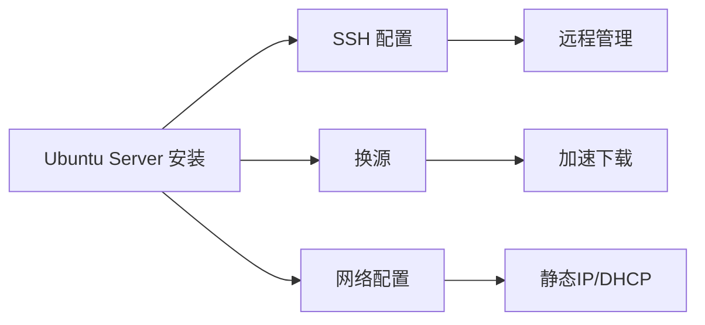
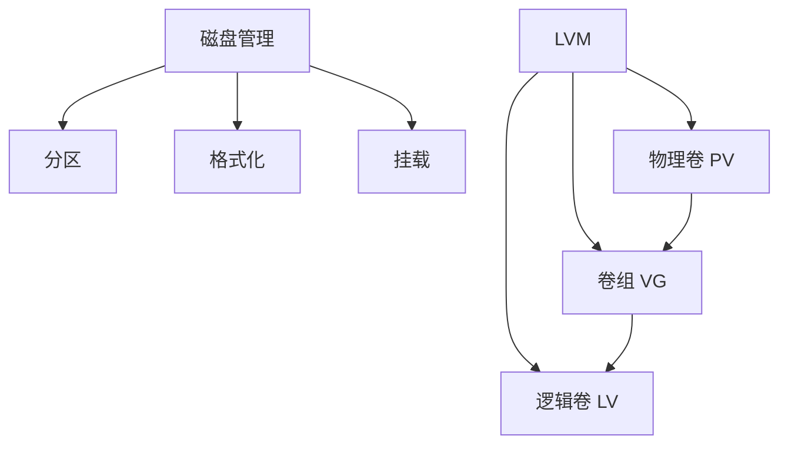
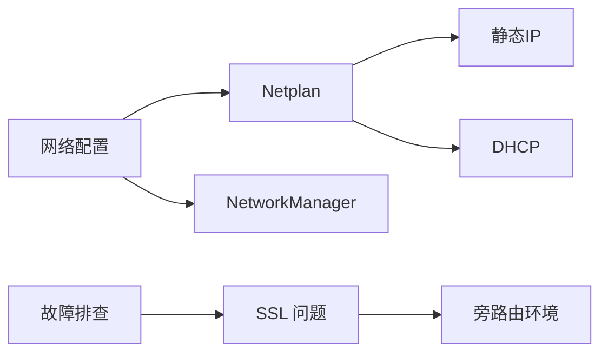
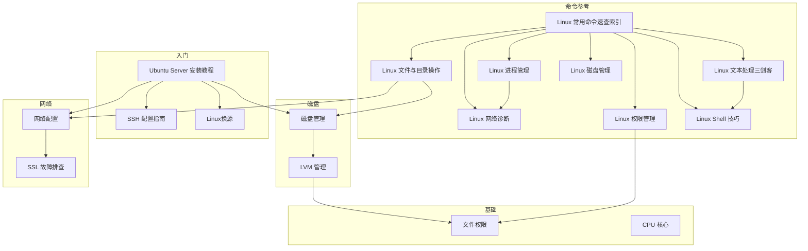

# Linux 学习笔记 MOC

> [!info] 概述
> 本 MOC 整理了 Linux 系统学习的核心笔记，涵盖系统安装、磁盘管理、网络配置、系统基础、常用命令参考等内容。

---

## 📚 快速导航

### 入门必读

| 笔记 | 说明 |
|------|------|
| [[Ubuntu Server 安装教程]] | Ubuntu Server 完整安装指南，包含分区、LVM 配置 |
| [[Ubuntu Server SSH 配置指南]] | SSH ���程连接配置，密钥认证最佳实践 |
| [[Linux换源]] | 国内镜像源配置，加速软件下载 |
| [[WSL-Windows子系统forLinux]] | Windows 内置 Linux 子系统使用指南 |

### 磁盘与存储

| 笔记 | 说明 |
|------|------|
| [[linux磁盘相关的知识]] | 磁盘分区、格式化、挂载基础 |
| [[linux的LVM管理]] | LVM 逻辑卷管理，动态扩容 |

### 常用命令参考

| 笔记 | 说明 |
|------|------|
| [[Linux 常用命令速查索引]] | 命令主题索引，快速定位对应笔记 |
| [[linux常用命令/Linux 文件与目录操作]] | ls、cp、mv、rm、find、tar 等文件操作 |
| [[linux常用命令/Linux 文件内容查看与搜索]] | cat、less、grep 文件查看与搜索 |
| [[linux常用命令/Linux 文本处理三剑客]] | sed、awk、cut、sort、uniq 文本处理 |
| [[linux常用命令/Linux 进程管理与系统监控]] | ps、top、systemctl、journalctl |
| [[linux常用命令/Linux 网络诊断与排障]] | ping、curl、ss、tcpdump 网络工具 |
| [[linux常用命令/Linux 权限管理基础]] | chmod、chown、umask、特殊权限 |
| [[linux常用命令/Linux 磁盘与存储管理]] | df、du、fdisk、mount |
| [[linux常用命令/Linux 软件包管理]] | apt、dnf、pacman 跨发行版 |
| [[linux常用命令/Linux Shell 实用技巧]] | 管道、重定向、别名、一行命令 |

### 系统基础

| 笔记 | 说明 |
|------|------|
| [[cpu的线程和内核]] | CPU 核心与线程概念，性能监控 |
| [[linux的文件权限]] | chmod、chown 权限管理 |

### 网络配置

| 笔记 | 说明 |
|------|------|
| [[linux如何修改网络信息]] | Netplan 静态 IP、DHCP 配置 |
| [[Ubuntu curl SSL连接问题排查]] | 旁路由环境 SSL 连接故障排查 |

---

## 🗂️ 主题分类

### 一、系统安装与配置

#### 1.1 Ubuntu Server 安装教程
- **适用场景**：服务器部署、虚拟机安装
- **关键点**：LVM 分区、OpenSSH 安装
- **相关**：[[linux的LVM管理]] | [[linux磁盘相关的知识]]

#### 1.2 Ubuntu Server SSH 配置指南
- **适用场景**：远程服务器管理
- **关键点**：密钥认证、禁用 root 登录
- **相关**：[[Ubuntu Server 安装教程]]

#### 1.3 Linux换源
- **适用场景**：国内网络环境
- **关键点**：清华/阿里云镜像、DEB822 格式（24.04+）、apt 密钥管理
- **相关**：[[linux如何修改网络信息]]

#### 1.4 WSL (Windows Subsystem for Linux)
- **适用场景**：Windows 开发环境
- **关键点**：WSL 2、VS Code 集成、Docker 支持
- **相关**：无

---

### 二、磁盘与存储管理

#### 2.1 Linux 磁盘相关知识
- **核心概念**：分区表（MBR/GPT）、文件系统（ext4/xfs）、挂载
- **常用命令**：`lsblk`、`fdisk`、`mkfs`、`mount`
- **相关**：[[linux的LVM管理]] | [[linux的文件权限]]

#### 2.2 Linux LVM 管理
- **核心概念**：PV → VG → LV 三层架构
- **常用场景**：动态扩容、快照备份
- **相关**：[[linux磁盘相关的知识]] | [[cpu的线程和内核]]

---

### 三、系统基础

#### 3.1 CPU 核心与线程
- **核心概念**：物理核心 vs 逻辑线程、超线程技术
- **常用命令**：`lscpu`、`top`、`htop`
- **相关**：[[linux磁盘相关的知识]] | [[linux的LVM管理]]

#### 3.2 Linux 文件权限
- **核心概念**：rwx 权限、chmod/chown、用户组管理
- **常用命令**：`chmod`、`chown`、`usermod`
- **相关**：[[linux磁盘相关的知识]] | [[linux的LVM管理]]

---

### 四、网络配置与故障排查

#### 4.1 Linux 网络配置
- **核心概念**：Netplan YAML 配置、静态 IP/DHCP
- **常用命令**：`ip a`、`netplan apply`、`nmcli`
- **相关**：[[Linux换源]] | [[Ubuntu curl SSL连接问题排查]]

#### 4.2 Ubuntu curl SSL 连接问题排查
- **核心问题**：旁路由 ICMP 重定向导致 SSL 握手失败
- **解决方案**：MASQUERADE、禁用 ICMP 重定向
- **相关**：[[linux如何修改网络信息]]

---

### 五、常用命令参考

#### 5.1 Linux 常用命令速查索引
- **适用场景**：命令速查导航，快速定位对应主题笔记
- **相关**：所有 Linux 命令主题笔记

#### 5.2 Linux 文件与目录操作
- **适用场景**：日常文件管理、批量操作
- **命令**：`ls`、`cp`、`mv`、`rm`、`find`、`tar`
- **相关**：[[linux常用命令/Linux 文件内容查看与搜索]]

#### 5.3 Linux 文件内容查看与搜索
- **适用场景**：日志查看、内容搜索
- **命令**：`cat`、`less`、`head`、`tail`、`grep`
- **相关**：[[linux常用命令/Linux 文本处理三剑客]]

#### 5.4 Linux 文本处理三剑客
- **适用场景**：日志分析、数据处理、批量替换
- **命令**：`sed`、`awk`、`cut`、`sort`、`uniq`
- **相关**：[[linux常用命令/Linux Shell 实用技巧]]

#### 5.5 Linux 进程管理与系统监控
- **适用场景**：服务管理、性能监控、故障排查
- **命令**：`ps`、`top`、`systemctl`、`journalctl`
- **相关**：[[linux常用命令/Linux 网络诊断与排障]]

#### 5.6 Linux 网络诊断与排障
- **适用场景**：网络连通性排查、HTTP 测试、抓包分析
- **命令**：`ping`、`curl`、`ss`、`tcpdump`、`dig`
- **相关**：[[linux如何修改网络信息]]

#### 5.7 Linux 权限管理基础
- **适用场景**：文件权限设置、多用户协作、安全加固
- **命令**：`chmod`、`chown`、`umask`
- **相关**：[[linux的文件权限]] | [[linux常用命令/Linux 用户管理]]

#### 5.8 Linux 用户管理
- **适用场景**：用户账户管理、密码策略、sudo 提权、用户组管理
- **命令**：`useradd`、`passwd`、`sudo`、`su`、`groupadd`
- **相关**：[[linux常用命令/Linux 权限管理基础]]

#### 5.9 Linux 磁盘与存储管理
- **适用场景**：磁盘空间告警、分区管理、挂载配置
- **命令**：`df`、`du`、`fdisk`、`mount`
- **相关**：[[linux磁盘相关的知识]]

#### 5.10 Linux 软件包管理
- **适用场景**：软件安装、系统更新
- **命令**：`apt`、`dnf`、`pacman`
- **相关**：[[Linux换源]]

#### 5.11 Linux Shell 实用技巧
- **适用场景**：提升命令行效率、脚本编写
- **命令**：管道、重定向、别名、快捷键
- **相关**：[[linux常用命令/Linux 文本处理三剑客]]

---

## 🔗 知识关联图

---

## 📝 学习路径建议

### 路径一：服务器管理员
1. [[Ubuntu Server 安装教程]] → [[Ubuntu Server SSH 配置指南]] → [[Linux换源]]
2. [[linux常用命令/Linux 文件与目录操作]] → [[linux常用命令/Linux 磁盘与存储管理]] → [[linux磁盘相关的知识]]
3. [[linux常用命令/Linux 网络诊断与排障]] → [[linux如何修改网络信息]] → [[linux的文件权限]]

### 路径二：开发环境搭建
1. [[WSL-Windows子系统forLinux]] → [[Linux换源]]
2. [[linux常用命令/Linux Shell 实用技巧]] → [[linux常用命令/Linux 文本处理三剑客]]
3. [[linux常用命令/Linux 权限管理基础]] → [[linux常用命令/Linux 软件包管理]]

### 路径三：命令与排障进阶
1. [[Linux 常用命令速查索引]]（入口导航）
2. [[linux常用命令/Linux 文本处理三剑客]] → [[linux常用命令/Linux 网络诊断与排障]]
3. [[Ubuntu curl SSL连接问题排查]] → [[linux如何修改网络信息]]

---

## 📌 最近更新

| 文件 | 更新日期 |
|------|----------|
| [[Linux 常用命令速查索引]] | 2026-07-29 |
| [[linux常用命令/Linux 用户管理]] | 2026-07-29 |
| [[linux常用命令/Linux 文件与目录操作]] | 2026-07-29 |
| [[linux常用命令/Linux 文本处理三剑客]] | 2026-07-29 |
| [[linux常用命令/Linux 网络诊断与排障]] | 2026-07-29 |
| [[Linux换源]] | 2026-07-28 |
| [[Ubuntu curl SSL连接问题排查]] | 2026-03-29 |
| [[WSL-Windows子系统forLinux]] | 2026-03-29 |
| [[linux如何修改网络信息]] | 2026-03-07 |

---

## 相关文档

- [[../00-索引/MOC|主索引]]
