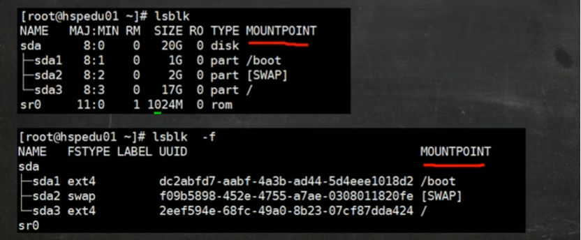
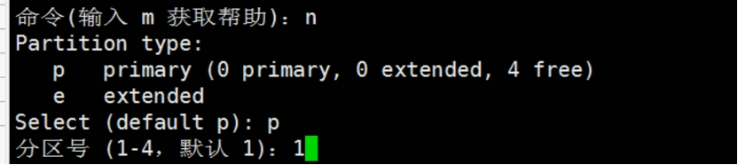

---
tags:
  - linux
---

# 什么是磁盘与分区

## 磁盘（Disk）

磁盘（如 SSD 或 HDD）是存储数据的物理设备，例如：

1.  /dev/sda、/dev/nvme0n1（Linux 下）

2.  C:\\, D:\\（Windows 下是逻辑盘，不是物理盘）

一块物理磁盘最初是"一整块"，如果直接使用，不便于管理，因此我们要"分区（Partition）"。比如我们有一个1T的硬盘，为了方便管理于是分成了C、D、E等分区。

## 分区（Partition）的概念

分区就是把一个物理磁盘逻辑上划分**为若干独立区域。**

**每个区域都有独立的文件系统（如 NTFS、ext4
等），**可以单独格式化、挂载、或安装操作系统。

📘 作用举例：

  -----------------------------------------------------------------------
  分区类型                            功能
  ----------------------------------- -----------------------------------
  系统分区（如 C:）                   存放操作系统文件

  数据分区（如 D:、E:）               存放用户数据

  EFI/引导分区                        启动系统时使用

  交换分区（Linux Swap）              内存不够时使用虚拟内存
  -----------------------------------------------------------------------

#  Linux文件系统和分区

## 先明确核心结论

在 Linux 中，**所有文件最终都存放在某个分区（partition）上**，

**但用户看到的只是一个统一的目录树（filesystem tree）。**

**目录本身只是"路径节点"，真正的数据是挂载（mount）到这些节点的分区里。**

## Linux 的文件系统结构（逻辑视图）

Linux 采用 **单一目录树（Single Directory Tree）** 的设计：

/

├── bin/ → 系统命令

├── boot/ → 启动文件

├── etc/ → 配置文件

├── home/ → 用户主目录

├── var/ → 日志/缓存

└── mnt/ → 临时挂载点

无论你有多少块磁盘、多少个分区，这个 **/ 目录树都是统一的一棵树。**

**不同分区通过"挂载（mount）"的方式被连接到这棵树的不同节点上。**

## 分区（Partition）与文件系统（Filesystem）

  -------------------------------------------------------------------------
  概念         作用                                 举例
  ------------ ------------------------------------ -----------------------
  分区         磁盘的物理划分（存储空间的边界）     /dev/sda1, /dev/sdb2

  文件系统     用于在分区上组织文件的结构           ext4, xfs, btrfs, fat32

  挂载点       把文件系统连接到目录树中的一个目录   /, /home, /mnt/data
  -------------------------------------------------------------------------

## 用一个例子理解

假设你有两块分区：

/dev/sda1：系统分区

/dev/sdb1：数据分区

如果你执行如下挂载：

sudo mount /dev/sda1 /

sudo mount /dev/sdb1 /home

那么结构变成：

/ → /dev/sda1 的内容

└── home/ → /dev/sdb1 的内容

这时：

/etc/passwd 在 /dev/sda1

/home/user/file.txt 在 /dev/sdb1

🧠 所以你看到 /home/user/file.txt 只是一个路径，

但**文件真正存在于 /dev/sdb1 这个分区中。**

## 如果没有挂载，会怎样？

若 /dev/sdb1 没挂载到 /home：

1.  /home 目录仍然存在，但只是 / 分区中的一个普通空文件夹；

2.  当你挂载 /dev/sdb1 到 /home 时：

    a)  原来的 /home 内容会被临时"隐藏"；

    b)  显示的内容变成 /dev/sdb1 里的内容；

    c)  卸载（umount /home）后，原来 /home 目录里的内容又会出现。

📦 因此挂载操作本质上是"把分区的文件系统连接到一个目录节点"。

# 硬盘说明

在 Linux 中，**硬盘是一个块设备（block
device）**，用来存储文件系统数据。

操作系统通过设备文件（如 /dev/sda）与硬盘通信。

简单来说：

"/dev/sda" 是硬盘在系统中的名字，

"/dev/sda1" 是这块硬盘上的一个分区。

## Linux 硬盘的命名规则

Linux 把**硬盘和分区都表示为 /dev
目录下的"设备文件"**，命名规则取决于硬盘接口类型：

  ----------------------------------------------------------------------------
  硬盘类型            命名示例                    含义
  ------------------- --------------------------- ----------------------------
  SATA / SCSI / SAS   /dev/sda, /dev/sdb,         第一块、第二块、第三块硬盘
                      /dev/sdc                    

  NVMe（PCIe SSD）    /dev/nvme0n1, /dev/nvme1n1  第 0、1 块 NVMe 设备

  USB 移动硬盘        /dev/sdb, /dev/sdc          插入顺序决定

  eMMC 存储（嵌入式） /dev/mmcblk0                嵌入式板载闪存
  ----------------------------------------------------------------------------

## 分区命名规则

在硬盘名后加上分区编号表示分区：

  -----------------------------------------------------------------------
  硬盘设备          第一个分区        第二个分区        第三个分区
  ----------------- ----------------- ----------------- -----------------
  /dev/sda          /dev/sda1         /dev/sda2         /dev/sda3

  /dev/nvme0n1      /dev/nvme0n1p1    /dev/nvme0n1p2    /dev/nvme0n1p3

  /dev/mmcblk0      /dev/mmcblk0p1    /dev/mmcblk0p2    /dev/mmcblk0p3
  -----------------------------------------------------------------------

💡 注意：

1.  SATA 硬盘直接加数字；

2.  NVMe / eMMC 要加 p（例如 /dev/nvme0n1p1），以区分数字部分。

## Linux 硬盘的分区表类型

磁盘的"分区表（Partition Table）"定义了分区的布局方式。

  ------------------------------------------------------------------------
  分区表类型        说明           启动模式   特点
  ----------------- -------------- ---------- ----------------------------
  MBR (Master Boot  老式分区方式   传统 BIOS  最多 4 个主分区，最大 2TB
  Record)                                     

  GPT (GUID         新式标准       UEFI       支持 128
  Partition Table)                            个分区，容量更大，更安全
  ------------------------------------------------------------------------

✅ 现代 Linux（特别是用 UEFI 启动的系统）几乎都使用 **GPT 分区表。**

## Linux 硬盘结构（逻辑视图）

以一块 GPT 格式的硬盘 /dev/sda 为例：

物理硬盘：/dev/sda

├── /dev/sda1 → EFI 启动分区 (/boot/efi)

├── /dev/sda2 → Linux 根分区 (/)

├── /dev/sda3 → 交换分区 (swap)

└── /dev/sda4 → 数据分区 (/home)

# 磁盘分区体系

现在主要有**主分区（Primary）**、**扩展分区（Extended）**、**逻辑分区（Logical）**

## 背景：MBR 分区表的历史限制

在早期（上世纪 80-90 年代），硬盘使用 **MBR（Master Boot Record）
分区表**结构。

它的结构非常有限：

1.  MBR 总共只有 512字节，其中：

    a)  前 446 字节存放引导程序；

    b)  后 64 字节存放分区表（4 个分区描述 × 每个 16 字节）；

    c)  最后 2 字节是分区表签名。

💡 这意味着 MBR 只能记录 最多 4 个分区！

于是问题来了👇

我有 1 块 1TB 的硬盘，只能分 4 个区？

我想分更多怎么办？

## 为了解决"最多 4 个分区"的限制，才有了扩展分区

  ------------------------------------------------------------------------------------------------
  分区类型             英文名     作用                               特点
  -------------------- ---------- ---------------------------------- -----------------------------
  主分区（Primary      Primary    系统可直接识别、引导的分区         MBR中最多只能有4个
  Partition）                                                        

  扩展分区（Extended   Extended   "容器"分区，用来装逻辑分区         只能有1个
  Partition）                                                        

  逻辑分区（Logical    Logical    实际数据分区，存在于扩展分区内部   可以有很多个（5、6、7\...）
  Partition）                                                        
  ------------------------------------------------------------------------------------------------

## MBR 结构图理解

┌──────────────────────────┐

│ MBR（主引导记录） │

│ ├─ 引导程序（446字节） │

│ └─ 分区表（64字节，4项） │

└──────────────────────────┘

可能的分区布局示意：

┌──────────────────────────────────────────┐

│ 主分区1 (Primary 1) │

├──────────────────────────────────────────┤

│ 主分区2 (Primary 2) │

├──────────────────────────────────────────┤

│ 主分区3 (Primary 3) │

├──────────────────────────────────────────┤

│ 扩展分区 (Extended) │

│ ├─ 逻辑分区5 (Logical 1) │

│ ├─ 逻辑分区6 (Logical 2) │

│ └─ 逻辑分区7 (Logical 3) │

└──────────────────────────────────────────┘

💡 所以：

1.  一个硬盘可以有：

    a)  最多 **4个主分区**

    b)  或者 **3个主分区 + 1个扩展分区**

    c)  **扩展分区里再放多个逻辑分区**

## 三种分区的对比

  -------------------------------------------------------------------------------------
  对比项             主分区                 扩展分区         逻辑分区
  ------------------ ---------------------- ---------------- --------------------------
  是否可引导         ✅ 可以安装系统        ❌ 不可直接使用  ❌ 一般用于数据

  数量限制           最多4个                只能1个          理论上不限（通常几十个）

  是否直接存数据     ✅ 是                  ❌               ✅ 是
                                            否（只是容器）   

  是否在扩展分区内   ❌ 否                  ❌ 否            ✅ 是

  在 Linux 中设备名  /dev/sda1～/dev/sda4   无实际设备名     从 /dev/sda5 开始
  -------------------------------------------------------------------------------------

## 举个实际例子（MBR分区）

Disk /dev/sda: 500GB

Partition Table: msdos

Number Start End Size Type File system

1 1MB 100GB 100GB primary ntfs

2 100GB 200GB 100GB primary ext4

3 200GB 300GB 100GB primary ext4

4 300GB 500GB 200GB extended

5 300GB 400GB 100GB logical ext4

6 400GB 500GB 100GB logical ext4

你可以看到：

1.  分区 1\~3 是主分区；

2.  第4个是扩展分区；

3.  扩展分区中有逻辑分区5和6。

## 现代系统的解决方案：GPT

现在新的硬盘几乎都用 **GPT（GUID Partition
Table），它完全抛弃了这些复杂的限制：**

  -------------------------------------------------------------------------
  对比项                  MBR                     GPT
  ----------------------- ----------------------- -------------------------
  支持磁盘容量            最大 2TB                理论上 8ZB（几乎无限）

  分区数量                最多4个主分区           默认128个分区（可扩展）

  是否需要扩展/逻辑分区   ✅ 需要                 ❌ 不需要

  引导方式                BIOS                    UEFI

  是否有备份分区表        ❌ 无                   ✅ 有（主表+备份表）
  -------------------------------------------------------------------------

GPT 分区表根本不需要考虑"主分区 / 扩展分区 / 逻辑分区"的问题了。

# 添加一个硬盘的流程

1.  查看设备挂载情况

2.  分区

3.  格式化

4.  挂载

5.  设置自动挂载

## 查看所有设备挂载的情况

命令：

lsblk

或

lsblk -f

MOUNTPOINT就是对应分区的挂载点。

SIZE就是分区的大小。

NAME MAJ:MIN RM SIZE RO TYPE MOUNTPOINTS

sda 8:0 0 100G 0 disk

├─sda1 8:1 0 50G 0 part /

└─sda2 8:2 0 50G 0 part /home

sdb 8:16 0 500G 0 disk

解释：

1.  /dev/sda：第一块磁盘（已分区）

2.  /dev/sdb：第二块磁盘（还没分区）

3.  TYPE 为 disk 表示整块磁盘；part 表示分区。

## 进行分区

**fdisk、gdisk 和 parted**
都是用于**磁盘分区的命令行工具**，但它们各自有不同的使用场景和特点。

下面我来帮你系统地梳理一下三者的区别、联系和使用习惯👇

### 三者的定位与区别

  ---------------------------------------------------------------------------------------------------------------------------
  工具     主要用途            支持的分区表类型         特点                               适用场景
  -------- ------------------- ------------------------ ---------------------------------- ----------------------------------
  fdisk    经典分区工具        MBR（Master Boot         最常见、最基础、命令简单           传统 BIOS
                               Record），部分新版支持                                      启动系统，小容量磁盘（\<2TB）
                               GPT                                                         

  gdisk    GPT 专用版的 fdisk  GPT（GUID Partition      界面类似 fdisk，专为 GPT 磁盘设计  新系统、UEFI
                               Table）                                                     启动、大容量磁盘（\>2TB）

  parted   高级分区管理        支持 MBR + GPT           支持动态调整分区大小，脚本化操作   需要调整分区大小或图形化前端（如
                                                                                           GParted）
  ---------------------------------------------------------------------------------------------------------------------------

### 它们的关系（简化理解）

可以这样理解这三个工具的"进化"关系：

fdisk ------\> gdisk ------\> parted

(老一代) (GPT版fdisk) (现代通用分区器)

1.  fdisk 适用于 传统 BIOS + MBR

2.  gdisk 适用于 UEFI + GPT

3.  parted 是 通吃型工具，现代 Linux 发行版（如
    Ubuntu、Fedora）更推荐使用它

### 命令行分区流程对比

#### 用 fdisk 分区（MBR）

sudo fdisk /dev/sda

进入交互界面后常用命令：

m \# 帮助

p \# 查看分区表

n \# 新建分区

d \# 删除分区

w \# 写入保存

q \# 退出不保存

我们用n开始新建分区

这里填的分区号，表示要创建或编辑第几个分区。比如输入 1 表示第一个分区（/dev/sda1），输入 2 表示第二个分区（/dev/sda2）。分区的大小是由后面的 Last sector 决定的。

First sector (2048-\..., default 2048): \[按回车\]

Last sector, +sectors or +size{K,M,G,T,P} (default \...): +50G

**First sector (2048-\..., default 2048):**

💬 意思：

1.  询问分区的**起始扇区号。**

2.  每个磁盘被划分成很多"扇区"（sector，通常每个扇区512字节）。

3.  通常从 **2048** 开始（前面留出一点空间给引导记录）。

✅ 操作：

1.  直接按回车 → 使用默认的起始位置 2048；

2.  表示从磁盘开头之后的第一个可用扇区开始创建分区。

**Last sector, +sectors or +size{K,M,G,T,P} (default \...): +50G**

💬 意思：

询问你要让这个分区到哪里结束。

你可以用三种方式输入：

1.  输入具体扇区号；

2.  输入相对长度（+100M, +50G 等）；

3.  直接回车默认用剩余所有空间。

✅ 操作说明：

1.  你输入了 +50G → 表示分区大小为 50GB；

2.  fdisk 会自动计算结束扇区位置。

用w保存后执行：

sudo partprobe \# 通知内核重新读取分区表

#### 用 gdisk 分区（GPT）

sudo gdisk /dev/sda

常用命令几乎与 fdisk 一样：

n 新建分区

p 打印分区表

d 删除分区

w 写入保存

区别是：

1.  gdisk 的分区号默认从 1 开始

2.  可以查看 UUID 和分区类型 GUID

**1️⃣启动 gdisk**

sudo gdisk /dev/sdb

输出：

GPT fdisk (gdisk) version 1.0.9

Partition table scan:

MBR: not present

BSD: not present

APM: not present

GPT: not present

Creating new GPT entries.

Command (? for help):

这几行是 gdisk 启动时自动扫描磁盘 的结果：

  -----------------------------------------------------------------------
  标识                 含义
  -------------------- --------------------------------------------------
  MBR                  是否检测到传统主引导记录分区表

  BSD                  是否检测到BSD类型分区（很少见）

  APM                  是否检测到苹果的旧式分区表（Apple Partition Map）

  GPT                  是否检测到GUID分区表
  -----------------------------------------------------------------------

📢 全部显示 not present 说明：

这块磁盘是**全新的、未分区的，还没有任何分区表结构。**

所以 gdisk 自动为你创建了一份新的 GPT 分区表。

2️⃣ 查看帮助

?

常见命令：

n 新建分区

d 删除分区

p 打印分区表

t 改类型

w 写入磁盘

q 退出不保存

**3️⃣ 创建新分区**

n

系统提示：

Partition number (1-128, default 1): 1

First sector (34-\..., default = 2048): \[回车\]

Last sector (2048-\..., default = \...): +50G

Hex code or GUID (L to show codes, Enter = 8300): \[回车\]

**Partition number (1-128, default 1): 1**

1.  意思： 这是要创建的分区编号。

2.  GPT 允许多达 128 个分区（MBR 只能 4 个主分区）。

3.  输入 1（或直接回车默认），表示创建第一个分区 /dev/sdb1。

**👉 如果你以后创建第二个分区，就会是 /dev/sdb2，以此类推。**

**First sector (34-\..., default = 2048): \[回车\]**

1.  "扇区 (sector)" 是磁盘最小的逻辑存储单位（一般为 512B 或 4K）。

2.  GPT 前面 34 个扇区 是分区表和头信息（保护区），不能用。

3.  默认的 2048 是一个对齐值（对齐到 1MB 边界，提高性能）。

**📌 推荐做法：**

**一般直接回车，使用默认值 2048，系统自动选择最优对齐位置。**

**Last sector (2048-\..., default = \...): +50G**

1.  这里决定分区的 结束位置 或 大小。

2.  你可以：

    a)  直接写 +50G 表示 50GB 大小；

    b)  或写具体扇区号（很少这么干）；

    c)  或直接回车默认使用"剩余所有空间"。

**Hex code or GUID (L to show codes, Enter = 8300): \[回车\]**

GPT 分区每个都有一个"类型 GUID"，用 16 进制代码表示用途。

常见类型代码如下👇

  ------------------------------------------------------------------------
  代码          类型                说明
  ------------- ------------------- --------------------------------------
  8300          Linux filesystem    普通的 ext4/xfs 等 Linux
                                    文件系统（默认）

  8200          Linux swap          交换分区

  EF00          EFI System          UEFI 启动分区
                Partition           

  0700          Microsoft basic     NTFS/FAT32（Windows）
                data                
  ------------------------------------------------------------------------

📌 一般情况下直接回车（默认 8300）即可创建普通数据分区。

**4️⃣ 查看结果**

p

示例输出：

Number Start (sector) End (sector) Size Code Name

1 2048 104857599 50.0 GiB 8300 Linux filesystem

**5️⃣ 保存并退出**

w

系统提示你是否确认写入 → 输入 Y。

#### 用 parted 分区（支持 MBR/GPT）

sudo parted /dev/sda

输出：

GNU Parted 3.4

Using /dev/sdb

Welcome to GNU Parted! Type \'help\' to view a list of commands.

(parted)

常见命令：

mklabel gpt \# 创建 GPT 分区表

mkpart primary ext4 0% 50% \# 创建一个从 0%-50% 的 ext4 主分区

print \# 查看分区

rm 1 \# 删除第 1 个分区

quit \# 退出

1.  **创建 GPT 分区表**

(parted) mklabel gpt

2.  **创建分区**

(parted) mkpart primary ext4 0% 50%

解释：

primary → 主分区

ext4 → 文件系统类型（只是标记，不会真正格式化）

0% 50% → 使用磁盘前一半空间

3.  **查看分区信息**

(parted) print

输出：

Model: ATA VBOX HARDDISK (scsi)

Disk /dev/sdb: 107GB

Sector size (logical/physical): 512B/512B

Partition Table: gpt

Number Start End Size File system Name Flags

1 1049kB 53.7GB 53.7GB primary

① Model: ATA VBOX HARDDISK (scsi)

1.  说明：这是磁盘型号。

2.  "VBOX HARDDISK" 表示你正在使用 VirtualBox 虚拟机中的虚拟硬盘。

3.  "(scsi)" 表示虚拟机模拟的是 SCSI 接口类型
    的磁盘（其实底层可能是SATA）。

💡 虽然写着 SCSI，但在VirtualBox里这是虚拟接口，并不代表真实SCSI硬盘。

② Disk /dev/sdb: 107GB

1.  /dev/sdb 表示这是 **第二块磁盘（a是第一块，b是第二块，以此类推）。**

2.  总容量约 **107GB。**

📦 换句话说：

你现在有一块107GB的虚拟硬盘 /dev/sdb。

③ Sector size (logical/physical): 512B/512B

1.  逻辑扇区大小：512字节

2.  物理扇区大小：512字节

👉 说明这块磁盘采用的是标准的 512字节扇区格式。

④ Partition Table: gpt

1.  磁盘使用的是 **GPT 分区表（GUID Partition Table）。**

2.  比老式 MBR（主引导记录）更现代，支持：

    a)  超过 2TB 的大磁盘；

    b)  超过4个主分区；

    c)  更强的分区一致性和备份。

⑤ 分区列表说明

  ------------------------------------------------------------------------
  列名                                含义
  ----------------------------------- ------------------------------------
  Number                              分区编号（第几个分区）

  Start / End                         分区的起止位置（单位：字节或扇区）

  Size                                分区大小

  File system                         当前文件系统类型（ext4、xfs等）

  Name                                分区名称（可选标签）

  Flags                               标志位（如 boot、esp 等）
  ------------------------------------------------------------------------

⑥ 当前具体内容

  -----------------------------------------------------------------------
  字段          值               含义
  ------------- ---------------- ----------------------------------------
  Number        1                表示 /dev/sdb1 是第一个分区

  Start         1049kB           从 1MB 位置开始（对齐用）

  End           53.7GB           到 53.7GB 结束

  Size          53.7GB           分区大小

  File system   （空）           说明还没有格式化文件系统

  Name          primary          名称（仅作标记）

  Flags         （空）           没有设置启动或ESP标志
  -----------------------------------------------------------------------

✅ GPT 是 Linux 现代系统推荐的分区方案。

4.  **退出**

(parted) quit

### 总结对比

  ----------------------------------------------------------------------------------------
  工具     分区表类型          命令风格    是否交互     是否支持动态调整   适用场景
  -------- ------------------- ----------- ------------ ------------------ ---------------
  fdisk    MBR（新版部分支持   传统简洁    交互式       ❌                 小磁盘 / BIOS
           GPT）                                                           

  gdisk    GPT 专用            类似 fdisk  交互式       ❌                 新系统 / 大磁盘

  parted   MBR + GPT           现代化      交互 &       ✅                 大容量 / 脚本 /
                                           非交互皆可                      图形前端
  ----------------------------------------------------------------------------------------

💡 推荐练习顺序：

1.  从 fdisk 开始学（最易理解）

2.  再试 gdisk（感受 GPT 的优势）

3.  最后学习 parted（更灵活、现代化）

## 格式化分区

"格式化分区"就是**为分区创建文件系统**的过程，让系统能够在该分区上存储文件。

### 分区类型 vs 文件系统类型（根本区别）

  ------------------------------------------------------------------------------------------------------------------------
  概念                       定义                                   举例                            谁负责设置
  -------------------------- -------------------------------------- ------------------------------- ----------------------
  分区类型（Partition Type） 告诉系统"这个分区打算干什么"           Linux filesystem、EFI           在 fdisk / gdisk /
                                                                    system、swap、Windows Basic     parted 创建分区时定义
                                                                    Data                            

  文件系统类型（Filesystem   决定分区内部如何存储文件（数据结构）   ext4、xfs、ntfs、fat32、btrfs   在
  Type）                                                                                            mkfs（格式化）时定义
  ------------------------------------------------------------------------------------------------------------------------

📌 比喻：

分区类型就像「标签」贴在盒子外面写"这是一个Linux盘"；\
文件系统类型则是「盒子里」的分区方法，比如你用抽屉、隔板或格子来放东西。

我用在创建分区时的定义只是一个 **元数据标签**（记录在分区表中的 type
code），**不会真的创建文件系统**。

真正的文件系统（即能存文件）必须再执行：

mkfs.ext4 /dev/sdb1

所以：

1.  parted / gdisk 设置的类型：只是"计划使用什么"。

2.  mkfs 命令：才是"真的建立文件结构"。

### 格式化命令示例

#### 格式化为 ext4（最常见）

sudo mkfs.ext4 /dev/sdb1

💡 ext4 是目前 Linux 默认的文件系统，通用、稳定。

#### 格式化为 xfs（性能好，常用于服务器）

sudo mkfs.xfs /dev/sdb1

#### 格式化为 FAT32（跨系统兼容）

sudo mkfs.vfat -F 32 /dev/sdb1

💡 可在 Windows、macOS、Linux 间通用，但不支持大文件（\>4GB）。

#### 格式化为 NTFS（适合与 Windows 共用）

sudo mkfs.ntfs /dev/sdb1

#### 创建交换分区（swap）

sudo mkswap /dev/sdb2

## 挂载

挂载（mount）是你真正**让分区可以使用、访问文件的关键一步**。

### 什么是"挂载（mount）"

Linux 没有像 Windows 那样的"C盘、D盘"概念。

它只有一个单一的文件系统树结构：

/

├── home/

├── usr/

├── var/

└── mnt/

挂载（mount）就是：

把一个分区（例如 /dev/sdb1）"接"到文件系统的某个目录（如 /mnt/data）上。

从那一刻起，**访问 /mnt/data，就是在访问 /dev/sdb1 的内容。**

### 进行挂载

#### 创建一个挂载点目录

sudo mkdir /mnt/data

💡 /mnt 是系统临时挂载目录，

如果你想长期使用，也可以放在 /data、/home/xxx/data 下。

#### 执行挂载命令

sudo mount /dev/sdb1 /mnt/data

#### 验证是否挂载成功

df -h

输出示例：

Filesystem Size Used Avail Use% Mounted on

/dev/sdb1 50G 1G 49G 2% /mnt/data

✅ 说明挂载成功，可以在 /mnt/data 里读写文件了。

### 卸载挂载（umount）

当你不再需要访问这个分区时：

sudo umount /mnt/data

或者用设备名：

sudo umount /dev/sdb1

💡
注意：卸载前必须关闭该目录内的所有文件，否则系统会提示"设备正忙（device
is busy）"。

### 设置"开机自动挂载"

前面的挂载方式在你电脑主机重启后就没有又要重新挂载。

如果你想让分区开机自动挂载，需要编辑 /etc/fstab。

#### 获取分区的 UUID

sudo blkid /dev/sdb1

示例输出：

/dev/sdb1: UUID=\"4bcd8c74-abc3-4d6c-9922-83a0a3e06a61\" TYPE=\"ext4\"

#### 编辑 /etc/fstab

sudo nano /etc/fstab

在文件末尾添加一行：

UUID=4bcd8c74-abc3-4d6c-9922-83a0a3e06a61 /mnt/data ext4 defaults 0 2

**1️⃣ UUID=4bcd8c74-abc3-4d6c-9922-83a0a3e06a61**

1.  表示 **要挂载的磁盘分区。**

2.  UUID（Universally Unique Identifier）是每个文件系统唯一的标识符。

3.  使用 UUID 挂载比 /dev/sdb1 更稳定：

    a)  如果磁盘顺序改变（比如插了新硬盘），设备名可能变成 /dev/sdc1；

    b)  使用 UUID 就不会出错。

**2️⃣ /mnt/data**

1.  表示 **挂载点目录。**

2.  分区的数据会映射到这个目录下。

3.  挂载后，访问 /mnt/data 就相当于访问磁盘分区中的内容。

**3️⃣ ext4**

1.  分区的 **文件系统类型。**

2.  这里是 ext4，Linux 下最常用的文件系统。

3.  其他可能的值：xfs、btrfs、vfat、ntfs 等。

**4️⃣ defaults**

1.  **挂载选项**，控制挂载行为。

2.  defaults 是一组默认选项，等同于：

rw,suid,dev,exec,auto,nouser,async

3.  rw → 可读写

4.  suid → 允许 set-user-identifier 或 set-group-identifier 权限

5.  dev → 允许访问设备文件

6.  exec → 允许执行二进制文件

7.  auto → 开机自动挂载

8.  nouser → 普通用户不能挂载

9.  async → 异步 I/O，提高性能

10. 可以根据需求修改，例如：

noatime,nodiratime \# 不更新访问时间，提高性能

ro \# 只读挂载

**5️⃣ 0**

1.  **dump 备份选项。**

2.  0 → 不需要 dump 工具备份

3.  1 → 需要备份

在现代 Linux 中一般都用 0。

**6️⃣ 2**

1.  **fsck 文件系统检查顺序。**

2.  开机时 fsck 会检查文件系统完整性：

    a)  0 → 不检查

    b)  1 → 最先检查（通常根分区 /）

    c)  2 → 其次检查（非根分区）

#### 测试配置是否正确

sudo mount -a

✅ 如果没有报错，说明配置成功，重启后会自动挂载。

# 交换分区

## 交换分区（Swap）是什么？

**交换分区（Swap Partition）** 是 Linux
系统在磁盘上划出来的一块特殊区域，

用来**临时充当内存（RAM）的"后备空间"。**

📖 通俗地说：

当你的内存不够用了，系统就会把暂时不用的数据从内存"搬"到磁盘上的 Swap
区。

等需要时再"搬"回来。

## 类比理解

可以这样比喻👇

  -----------------------------------------------------------------------
  组件           对应的比喻                       组件
  -------------- -------------------------------- -----------------------
  内存（RAM）    你的办公桌，速度快，但空间有限   内存（RAM）

  磁盘（Swap）   旁边的柜子，速度慢，但容量大     磁盘（Swap）
  -----------------------------------------------------------------------

💡 当桌面（RAM）放不下东西时，就临时把不常用的资料放到柜子（Swap）里。

这样虽然慢一点，但总比"没地方放"强。

## Swap 有几种形式

Linux 有两种方式实现 Swap：

  -----------------------------------------------------------------------
  类型                    说明                          常见文件
  ----------------------- ----------------------------- -----------------
  交换分区（Swap          在分区阶段专门分一块区用作    /dev/sda2 等
  Partition）             swap                          

  交换文件（Swap File）   在已有分区中创建一个 swap     /swapfile
                          文件                          
  -----------------------------------------------------------------------

💡 现代系统常用第二种方式（swapfile），更灵活，易于调整大小。

## Swap 的作用

**1️⃣ 内存不足时提供"应急空间"**

当程序占用太多内存时，系统会把不活跃的内容（如后台程序的数据）放到 Swap
中，从而：

1.  防止系统直接卡死；

2.  避免 OOM（Out Of Memory，内存溢出）崩溃。

**2️⃣ 支持休眠（Hibernate）**

在休眠时，系统会把当前内存的内容完整写入 Swap 中。

下次开机时再从 Swap 读取回来，实现"关机前的状态恢复"。

💡 如果想使用系统休眠，Swap 空间必须 ≥ 内存大小。

**3️⃣ 提升内存调度灵活性**

系统会根据数据使用频率自动在 RAM 和 Swap 之间调整，

让常用数据保持在内存，冷数据放在 Swap，提高效率。

## Swap 的大小应该多大？

  -----------------------------------------------------------------------
  设备内存（RAM）         推荐 Swap 大小          说明
  ----------------------- ----------------------- -----------------------
  ≤ 2GB                   内存的 2 倍             小内存设备

  4GB \~ 8GB              与内存相同              普通桌面系统

  ≥ 16GB                  2GB \~ 4GB 即可         足够大时仅做应急

  若要休眠                ≥ 内存大小              必须满足休眠需求
  -----------------------------------------------------------------------

💡 对于现代服务器或桌面电脑，Swap 主要是"保险用途"，

而对于嵌入式设备（如树莓派、ESP32网关），Swap 可显著防止 OOM。

## 创建与启用 Swap 的方法

### 方法 1：分区法

（你在用 fdisk 或 gdisk 时可这样建）

**1️⃣ 创建分区**

在 gdisk 中输入：

Command (? for help): n

设置类型为：

Hex code or GUID (L to show codes, Enter = 8300): 8200

8200 是 Swap 的类型代码。

**2️⃣ 格式化为 swap：**

sudo mkswap /dev/sdb2

**3️⃣ 启用：**

sudo swapon /dev/sdb2

**4️⃣ 查看：**

swapon \--show

### 方法 2：创建 Swap 文件

（推荐）

sudo fallocate -l 4G /swapfile

sudo chmod 600 /swapfile

sudo mkswap /swapfile

sudo swapon /swapfile

查看：

swapon \--show

开机自动启用：

编辑 /etc/fstab：

/swapfile none swap sw 0 0

## 查看系统当前 Swap 使用情况

free -h

示例输出：

total used free shared buff/cache available

Mem: 15Gi 3.1Gi 9.8Gi 200Mi 2.2Gi 11Gi

Swap: 2Gi 0Mi 2Gi

**第一行：标题**

  -----------------------------------------------------------------------
  字段                 含义
  -------------------- --------------------------------------------------
  total                总量

  used                 已使用量

  free                 空闲量

  shared               共享内存（多进程共享的部分，通常是 tmpfs）

  buff/cache           系统缓冲区和缓存占用的内存

  available            可用内存（实际可给新程序使用，不用担心 cache）
  -----------------------------------------------------------------------

**第二行：Mem → 物理内存**

  ---------------------------------------------------------------------------------
  字段                    值         说明
  ----------------------- ---------- ----------------------------------------------
  total                   15Gi       系统总内存

  used                    3.1Gi      已被程序占用的内存（不包含缓存）

  free                    9.8Gi      现在完全空闲的内存

  shared                  200Mi      多个进程共享的内存量

  buff/cache              2.2Gi      系统用来做文件缓存和缓冲的内存（可以被回收）

  available               11Gi       实际可用内存（free + buff/cache - kernel
                                     reserved），新程序可以直接用）
  ---------------------------------------------------------------------------------

💡 重点：

1.  Linux 会尽量用空闲内存做缓存，但缓存会在程序需要时被回收。

2.  所以 available 才是你真正能用的内存量。

**第三行：Swap → 交换分区**

  -----------------------------------------------------------------------
  字段                                值
  ----------------------------------- -----------------------------------
  total                               2Gi

  used                                0Mi

  free                                2Gi
  -----------------------------------------------------------------------

💡 解释：

1.  Swap 是硬盘上的虚拟内存，用来当物理内存不足时暂存数据。

2.  如果 used=0Mi → 当前系统物理内存够用，Swap 没被用。

3.  Swap 使用会比 RAM 慢很多，所以只在内存紧张时才用。

### 一句话总结

1.  你的系统有 **15Gi 内存 + 2Gi Swap**

2.  当前 **3.1Gi 内存被程序使用**

3.  系统 **缓存了 2.2Gi**

4.  **还有 11Gi 可直接用**

5.  Swap 没被使用，说明内存充足

# 最常用：看磁盘总体情况（先看这个）

## 看磁盘是否满了（必看）

df -h

示例输出：

Filesystem Size Used Avail Use% Mounted on

/dev/vda1 40G 38G 1.2G 97% /

tmpfs 3.8G 0 3.8G 0% /dev/shm

重点看这几列：

1.  **Size**：总容量

2.  **Used**：已使用

3.  **Avail**：可用（最重要）

4.  **Use%**：使用率（\>90% 就危险）

5.  **Mounted on**：挂载点（一般看 /）

👉 如果 / 是 **100%**，你现在遇到的所有问题都说得通。

## 看磁盘分区结构（了解你有几块盘）

lsblk

示例：

NAME MAJ:MIN RM SIZE RO TYPE MOUNTPOINT

vda 252:0 0 40G 0 disk

└─vda1 252:1 0 40G 0 part /

👉 常见情况：

1.  只有一块盘：vda

2.  云服务器：基本只有一个分区挂 /

# 定位是谁占空间（重点！）

## ✅ 3️⃣ 看根目录下谁最占空间（非常关键）

sudo du -h \--max-depth=1 / \| sort -h

你会看到类似：

1.  500M /boot

2.  1.2G /usr

3.  8.5G /var

4.  25G /home

👉 下一步就盯着 **最大的那个目录** 深挖

## 看 home 下哪个用户占空间

du -h \--max-depth=1 /home

或你自己：

du -h \--max-depth=1 \~

## 精确定位缓存 / 模型 / docker

### pip 缓存

du -sh \~/.cache/pip

### conda 缓存

du -sh \~/.conda

### huggingface / torch

du -sh \~/.cache/huggingface

du -sh \~/.cache/torch

### docker（如果装过）

sudo du -sh /var/lib/docker
