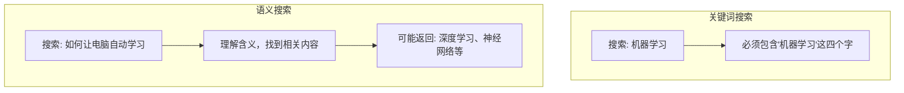
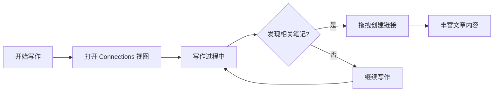

# Obsidian Smart Connections 使用指南

> [!info] 概述
> **一句话定义**：Smart Connections 是 Obsidian 的本地优先语义搜索插件，使用 AI 嵌入技术自动发现笔记之间的关联。
> **通俗比喻**：就像给每个笔记配了一个"智能图书管理员"，当你打开某本书时，它会自动告诉你"这几本书和你在看的有关联"。

## 核心概念

### 是什么

Smart Connections 是一款 Obsidian 社区插件，它使用**本地 AI 嵌入（Embeddings）技术**来：
- 自动发现笔记之间的语义关联
- 提供基于含义的搜索（而非关键词匹配）
- 在写作时实时推荐相关笔记

### 为什么需要

传统 Obsidian 笔记管理面临的问题：

| 问题 | 传统方案的局限 | Smart Connections 的解决 |
|------|----------------|-------------------------|
| 找不到笔记 | 关键词搜索依赖精确匹配 | 语义搜索，意思相近就能找到 |
| 手动链接麻烦 | 需要自己记住并添加 `[[wikilink]]` | 自动推荐相关笔记 |
| 知识孤岛 | 笔记分散，难以发现关联 | 可视化展示笔记关系 |
| 上下文丢失 | 写作时忘记之前的相关内容 | 实时提醒相关笔记 |

### 通俗理解

**🎯 比喻**：想象你有一个超级记忆助手
- 你写了一堆笔记，时间久了就忘了
- Smart Connections 就像给每个笔记贴上"智能标签"（嵌入向量）
- 当你打开某个笔记时，它会自动说："嘿，这三个笔记和你现在看的内容很像！"
- 即使你用的词不同，只要意思相近，它也能找到

**📦 核心工作流程**：
```
┌─────────────────────────────────────────────────────────┐
│                    Open → Scan → Act                     │
├─────────────────────────────────────────────────────────┤
│  1. Open    打开任意笔记（作为锚点）                        │
│  2. Scan    查看右侧面板的关联推荐                          │
│  3. Act     拖拽结果创建链接，或复制到剪贴板                  │
└─────────────────────────────────────────────────────────┘
```

> [!info] 📚 来源
> - [官方文档 - Getting Started](https://smartconnections.app/smart-connections/getting-started/)
> - [官方概览页面](https://smartconnections.app/smart-connections/)

---

## 安装与配置

### 1. 安装插件


**具体步骤**：
1. 打开 Obsidian 设置（`⌘/Ctrl + ,`）
2. 进入 **第三方插件** → **浏览**
3. 搜索 **"Smart Connections"**
4. 点击 **安装**，然后 **启用**

### 2. 首次运行

安装后，插件会自动开始**索引你的笔记库**：
- 首次索引可能需要几分钟到几十分钟（取决于笔记数量）
- 索引过程在本地进行，**不需要 API Key**
- 索引完成后即可使用

### 3. 打开核心视图

通过以下方式访问功能：

| 功能 | 命令面板命令 | 侧边栏图标 |
|------|-------------|-----------|
| Connections 视图 | `Open: Connections view` | 🔗 连接图标 |
| Lookup 视图 | `Open: Lookup view` | 🔍 搜索图标 |
| 随机笔记 | `Open: Random note from connections` | 🎲 随机图标 |

> [!tip] 推荐设置
> 为常用命令设置快捷键：**设置 → 快捷键 → 搜索 "Connections"**

> [!info] 📚 来源
> - [官方安装指南](https://smartconnections.app/smart-connections/getting-started/)

---

## 核心功能详解

### 1. Connections 视图（关联面板）

这是最常用的功能，显示与当前笔记相关的内容。

```
┌─────────────────────────────────────────┐
│  Connections 视图                        │
├─────────────────────────────────────────┤
│  ▶ 0.89  相关笔记A.md                    │
│     这是笔记A的预览内容...                │
│  ▼ 0.85  相关笔记B.md                    │
│     ┌─────────────────────────┐         │
│     │ 展开的详细内容显示       │         │
│     └─────────────────────────┘         │
│  ▶ 0.82  相关笔记C.md                    │
└─────────────────────────────────────────┘
```

**界面元素说明**：

| 元素 | 功能 |
|------|------|
| **分数（0.89）** | 语义相似度，越高越相关 |
| **展开/折叠** | 显示或隐藏笔记内容预览 |
| **播放/暂停** | 控制是否随笔记切换更新结果 |
| **Lookup 按钮** | 打开语义搜索面板 |

**交互操作**：

| 操作 | 效果 |
|------|------|
| **拖拽到笔记** | 自动创建 `[[wikilink]]` 链接 |
| **⌘/Ctrl + 悬停** | 显示 Obsidian 原生预览 |
| **点击** | 在新标签页打开该笔记 |
| **右键 → Hide** | 隐藏该结果 |
| **右键 → Unhide all** | 恢复所有隐藏结果 |

> [!info] 📚 来源
> - [官方 Connections 视图指南](https://smartconnections.app/smart-connections/getting-started/)

### 2. Smart Lookup（语义搜索）

**语义搜索 vs 关键词搜索**：



**使用技巧**：
- 用**自然语言提问**，像问朋友一样
- 从**宽泛问题**开始，再添加 1-2 个约束
- **不要求精确匹配**，语义理解会找到相关内容

**示例查询**：
- ❌ 关键词式：`docker 容器 更新`
- ✅ 语义式：`如何更新正在运行的 Docker 容器到最新版本？`

### 3. 随机笔记（发现功能）

从当前笔记的关联中随机打开一个，用于：
- 发现被遗忘的知识
- 激发新的灵感
- 建立意外连接

---

## 设置与调优

> [!tip] 设置入口
> 打开 **设置 → 第三方插件 → Smart Connections**（或 **Connections Pro**）

设置分为两大类：
- **Connections 设置**：控制**显示什么结果**（本节内容）
- **Smart Environment 设置**：控制**索引和嵌入什么内容**（见 [[#Smart Environment 设置]]）

---

### 一、Connections 列表设置

进入 **设置 → Smart Connections → Connections lists**


#### 1. Connection results type（结果类型）

| 选项 | 说明 | 使用场景 |
|------|------|----------|
| **Sources** | 返回整篇笔记（较粗粒度，通常更快） | 想要概览式浏览、快速扫描 |
| **Blocks** | 返回笔记内的段落/块（更精细，通常更慢） | 想要精确匹配到具体段落 |

> [!tip] 建议
> 选择 **Blocks** 时，需要确保 Smart Environment 也配置了嵌入块级别的内容。

#### 2. Results limit（结果数量）

控制显示多少条关联结果（默认 20 条）：
- **降低**：减少 UI 负载，聚焦最相关的结果
- **提高**：查看更多候选笔记

#### 3. Show full path（显示完整路径）⚡ PRO

启用后，结果会显示文件夹路径，帮助：
- 区分同名的不同笔记
- 了解匹配结果在笔记库中的位置

#### 4. Render markdown（渲染 Markdown）⚡ PRO

启用后，结果预览会渲染 Markdown 格式。
- **开启**：获得富文本预览
- **关闭**：减少渲染开销，显示纯文本

---

### 二、显示设置

进入 **设置 → Smart Connections → Display**


#### 1. Connections List Component（列表组件）⚡ PRO

选择 Connections 列表的渲染方式：
- **List only**：仅显示列表（最快）
- **Graph + List**：同时显示图谱和列表（空间探索）

#### 2. Connections list item（列表项样式）⚡ PRO

选择每个结果的显示模板：
- 不同的渲染器可能显示不同的元数据、预览或控制按钮
- 主要是个 UI 偏好设置

#### 3. Connections sidebar location（侧边栏位置）

选择打开 Connections 视图时的侧边栏位置：
- **右侧栏**：专用面板，推荐
- **左侧栏**：靠近文件导航

---

### 三、评分算法设置

进入 **设置 → Smart Connections → Score algorithm**


#### Scoring algorithm（评分算法）⚡ PRO

选择如何计算当前笔记与候选笔记的相似度：

| 算法 | 说明 |
|------|------|
| **Cosine Similarity** | 基于余弦相似度（推荐起点） |
| **Similarity Adjusted by Feedback** | 根据你的反馈调整相似度 |
| **Similarity Weighted by Feedback** | 根据反馈加权相似度 |
| **Similarity Weighted by Key + Frontmatter** | 根据关键词和 Frontmatter 加权 |

> [!tip] 建议
> 初学者从 **Cosine Similarity** 开始，熟悉后再尝试反馈相关的算法。

---

### 四、排序算法设置

进入 **设置 → Smart Connections → Ranking algorithm**


#### Ranking algorithm（排序算法）⚡ PRO

排序是**第二步**操作，在初始评分后重新排列结果：
- 适合在需要精确排序时使用
- 可以应用更重的算法（如 Reranking 模型）

#### Re-ranking model algorithm（重排序模型）⚡ PRO

使用重排序模型调整结果顺序：
- 需要在 Smart Environment Pro 设置中配置默认重排序模型
- 适合追求精度的场景

```
┌────────────────────────────────────────────────────────────┐
│                    评分与排序流程                           │
├────────────────────────────────────────────────────────────┤
│  1. Scoring（评分）                                         │
│     └─→ 计算当前笔记与所有候选的相似度分数                    │
│                                                            │
│  2. Ranking（排序）                                         │
│     └─→ 对高分候选应用重排序模型，精细调整顺序                │
│                                                            │
│  3. Display（显示）                                         │
│     └─→ 按 Results limit 显示最终结果列表                   │
└────────────────────────────────────────────────────────────┘
```

---

### 五、过滤器设置

进入 **设置 → Smart Connections → Filters**


> [!important] 重要区分
> - **Connections 过滤器**：隐藏结果（笔记仍被索引）
> - **Smart Environment 设置**：阻止笔记被索引

#### 过滤器匹配规则

| 过滤器类型 | 格式 | 匹配规则 |
|-----------|------|----------|
| **路径过滤器** | 逗号分隔的路径片段 | 区分大小写，子串匹配 |
| **Frontmatter 过滤器** | 每行一个匹配器 | 不区分大小写，键值匹配 |

#### 1. Exclude inlinks（排除反向链接）⚡ PRO

排除已经链接到当前笔记的笔记：
- 用于发现**新链接建议**，而非重复现有链接

#### 2. Exclude outlinks（排除正向链接）⚡ PRO

排除当前笔记已链接的笔记：
- 避免重复推荐已存在的链接

#### 3. Include filter（包含过滤器）⚡ PRO

**逗号分隔**的路径片段，只显示匹配的笔记：

```
Daily/, Projects/ClientA/, People/
```

#### 4. Exclude filter（排除过滤器）⚡ PRO

**逗号分隔**的路径片段，排除匹配的笔记：

```
templates/, archive/, .trash/
```

> [!warning] 优先级
> 排除过滤器**优先于**包含过滤器。如果一个路径同时出现在两者中，它会被排除。

#### 5. Frontmatter include filter（Frontmatter 包含）⚡ PRO

**每行一个** Frontmatter 匹配器：

```
status:open
type:meeting
project:client-a
```

- `key` 匹配任何值
- `key:value` 匹配特定值

#### 6. Frontmatter exclude filter（Frontmatter 排除）⚡ PRO

```
status:done
status:archived
area:private
```

#### 7. Hide frontmatter blocks in results（隐藏 Frontmatter 块）⚡ PRO

使用 **Blocks** 结果类型时，隐藏来自 YAML Frontmatter 的块：
- 让结果聚焦于笔记内容而非元数据

---

### 六、内联连接设置 ⚡ PRO

进入 **设置 → Smart Connections → Inline connections**


#### 1. Show inline connections（显示内联连接）

启用后，在每个块旁边显示该块的关联连接：
- 悬停连接图标查看该块的关联列表

#### 2. Inline connections score threshold（分数阈值）

设置显示内联连接的最低分数（0 到 1）：
- **提高**：减少噪音，只显示强匹配
- **降低**：查看更多内联匹配

#### 3. Skip code blocks（跳过代码块）

启用后，不在代码块内显示内联连接：
- 适合笔记中有大量代码片段的场景

---

### 七、底部连接栏设置 ⚡ PRO

进入 **设置 → Smart Connections → Footer connections**


#### Show footer connections（显示底部连接）

启用后，在每篇笔记底部显示 Connections 区域：
- 特别适合移动端使用
- 提供一致的浏览相关笔记的位置

---

### 八、Lookup 列表设置

进入 **设置 → Smart Connections → Lookup lists**


#### 1. Lookup results type（Lookup 结果类型）

选择 Lookup 返回 **Sources**（笔记）或 **Blocks**（段落）。

#### 2. Results limit（结果数量）⚡ PRO

调整 Lookup 显示的结果数量（默认 20）：
- 减少：更快更简洁
- 增加：查看更多候选

---

### Smart Environment 设置

管理嵌入模型和索引，控制**什么内容被索引**：

| 设置项 | 说明 |
|--------|------|
| **Embedding Model** | 选择嵌入模型（本地或云端） |
| **Sources** | 配置哪些文件夹参与索引 |
| **Force Re-Index** | 强制重新索引（修改模型后需要） |

> [!info] 📚 更多详情
> 参见 [Smart Environment 设置官方文档](https://smartconnections.app/smart-environment/settings/)

---

### 设置快速参考表

| 设置 | 改变什么 | 何时使用 |
|------|----------|----------|
| **Connection results type** | Sources = 整篇笔记；Blocks = 段落/块 | Sources 用于快速概览；Blocks 用于精确匹配 |
| **Results limit** | 每篇笔记显示多少结果 | 降低提升速度；提高查看更多候选 |
| **Include/Exclude filters** | 按路径限制候选 | 聚焦项目区域；隐藏归档/模板 |
| **Frontmatter filters** | 按 YAML 元数据限制 | 聚焦特定状态的笔记 |
| **Scoring algorithm** | 初始相似度计算方式 | 从 Cosine Similarity 开始 |
| **Ranking algorithm** | 重排序策略 | 需要更精确排序时启用 |
| **Inline score threshold** | 内联显示的最低分数 | 提高=减少噪音；降低=更多匹配 |
| **Footer connections** | 笔记底部显示关联 | 移动端友好浏览 |

> [!info] 📚 来源
> - [官方 Connections 设置文档](https://smartconnections.app/smart-connections/settings/)
> - [官方 Smart Environment 设置](https://smartconnections.app/smart-environment/settings/)

---

## Core vs Pro 版本对比

| 功能 | Core（免费） | Pro（付费） |
|------|-------------|-------------|
| Connections 侧边栏 | ✅ | ✅ |
| Smart Lookup | ✅ | ✅ |
| 本地嵌入 | ✅ | ✅ |
| 离线使用 | ✅ | ✅ |
| 移动端支持 | ✅ | ✅ |
| 内联连接（Inline） | ❌ | ✅ |
| 底部连接栏（Footer） | ❌ | ✅ |
| 图谱视图 | ❌ | ✅ |
| Bases 集成 | ❌ | ✅ |
| 高级排序控制 | ❌ | ✅ |

> [!tip] 建议
> 初学者从 **Core 版本**开始，熟悉后再考虑 Pro 版本的高级功能。

---

## 实用工作流

### 工作流 1：写作时发现关联



### 工作流 2：构建"相关文档"章节

当你完成一篇笔记后：
1. 打开该笔记
2. 查看 Connections 视图中的推荐
3. 拖拽 3-5 个最相关的链接到笔记底部
4. 创建 `## 相关文档` 章节

### 工作流 3：使用 Smart Lookup 复习

当你想复习某个主题时：
1. 打开 Lookup 视图
2. 用自然语言描述你想找的内容
3. 浏览返回的相关笔记
4. 建立新的知识连接

---

## 隐私与安全

Smart Connections 采用**本地优先**设计：

| 特性 | 说明 |
|------|------|
| **本地嵌入** | 默认在设备上进行嵌入计算 |
| **笔记不离开设备** | Core 版本不需要上传笔记 |
| **可选云服务** | 如需更强大的模型，可选择云端 API |
| **离线可用** | 索引完成后，完全离线使用 |

> [!warning] 隐私提示
> 如果启用云端嵌入模型，笔记内容会被发送到相应的 API 服务。

---

## 常见问题

### Q1: 安装后没有显示结果？

**解决方案**：
1. 确保已打开 Connections 视图（命令面板或侧边栏）
2. 切换到另一个笔记触发更新
3. 检查笔记是否有足够的内容（太短的笔记可能没有关联）
4. 等待索引完成

### Q2: 结果不准确？

**可能原因**：
- 笔记内容太短或太相似
- 嵌入模型不够好
- 需要调整 Filters 排除干扰内容

**解决方案**：
- 在设置中尝试不同的嵌入模型
- 排除模板、日记等文件夹
- 增加笔记的内容深度

### Q3: 会拖慢 Obsidian 吗？

- **首次索引**：大型笔记库可能需要较长时间
- **日常使用**：设计为轻量级，不影响正常使用
- **优化建议**：减少 Results limit，排除不需要的文件夹

### Q4: 支持 iOS/Android 吗？

**是的**！Smart Connections 支持移动端：
- 核心功能完全可用
- Pro 版本提供更适合移动端的界面（Footer 连接栏）

> [!info] 📚 来源
> - [官方 FAQ](https://smartconnections.app/smart-connections/)

---

## 与其他概念的关系

| 概念 | 关系 |
|------|------|
| [[05-其他主题/RAG技术入门指南]] | Smart Connections 使用了 RAG 的核心技术——嵌入向量检索 |
| [[如何使用obsidian做笔记]] | Smart Connections 是 Obsidian 笔记增强工具 |
| [[01-基础概念/Agent智能体]] | Smart Connections 可以配合 AI Agent 使用（Smart Chat 功能） |

---

## 最佳实践

1. **定期使用**：养成打开 Connections 视图的习惯
2. **主动链接**：发现关联时立即创建链接
3. **调整设置**：根据笔记库特点优化 Filters
4. **结合使用**：与 Smart Context、Smart Chat 配合使用
5. **移动端同步**：索引会同步，移动端也可使用

---

## 个人笔记

> [!personal] 💡 我的理解与感悟
> （此处记录个人学习心得，更新时会被保留）

---

## 相关文档

- [[如何使用obsidian做笔记]]
- [[05-其他主题/RAG技术入门指南]]
- [[AI学习/00-索引/MOC]]

---

## 参考资料

### 官方资源
- [Smart Connections 官方网站](https://smartconnections.app/) - 完整产品介绍
- [官方 Getting Started 指南](https://smartconnections.app/smart-connections/getting-started/) - 安装和快速入门
- [官方概览页面](https://smartconnections.app/smart-connections/) - 功能介绍
- [GitHub 仓库](https://github.com/brianpetro/obsidian-smart-connections) - 源代码和问题反馈

### 社区资源
- [Obsidian 社区插件页面](https://obsidian.md/plugins?id=smart-connections) - 插件下载
- [Getting Started Story](https://smartconnections.app/story/smart-connections-getting-started/) - 图文教程

### 视频教程
- [Getting Started with Smart Connections](https://www.youtube.com/watch?v=niX9U8znJAo) - YouTube 教程
- [1 Obsidian AI Plugin You Need](https://www.youtube.com/watch?v=d30jraaUmeY) - 功能演示
