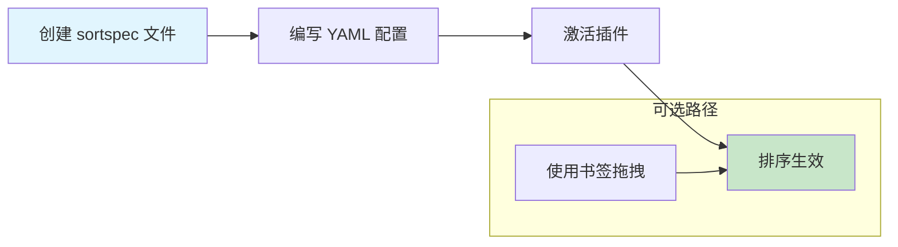

# Obsidian Custom Sort 自定义排序插件

> [!info] 概述
> **一句话定义**：通过 YAML 配置或书签拖拽，实现对 Obsidian 文件列表的自定义排序。
>
> **通俗比喻**：就像给书架上的书贴上"排序规则标签"，让它们自动按你想要的方式排列，而不是只能按名称或时间排序。

## 核心概念

### 是什么

Obsidian Custom Sort 是一个社区插件，允许用户通过配置文件（`sortspec`）或书签功能，对文件列表进行精细化的自定义排序。

### 为什么需要

Obsidian 原生只支持有限的排序方式（名称、修改时间、创建时间等），当你需要：

- 让重要文件置顶
- 按特定逻辑排列项目文件
- 文件夹和文件混合排序

这个插件就能派上用场。

### 两种排序模式

| 模式 | 说明 | 适用场景 |
|:-----|:-----|:---------|
| **Config-driven** | 通过 YAML 配置文件定义规则 | 需要精细化、自动化排序 |
| **Drag and Drop** | 通过书签拖拽排序 | 需要手动调整顺序 |

---

## 工作流程



---

## 快速上手

> [!example] 步骤一：安装插件
> 1. 打开 **设置** → **社区插件**
> 2. 浏览搜索 `Custom Sort`
> 3. 安装并启用

> [!example] 步骤二：创建排序配置文件
> 在需要自定义排序的文件夹中，创建一个名为 `sortspec` 的笔记（无需后缀，Obsidian 会自动识别）。

> [!example] 步骤三：添加排序规则
> 在 `sortspec` 笔记的顶部添加 YAML front matter：
>
> ```yaml
> ---
> sorting-spec: |
>   order-desc: a-z
> ---
> ```

> [!example] 步骤四：激活插件
> 点击左侧功能区的排序图标（或使用命令面板搜索 "Custom Sort: toggle"），激活自定义排序。

> [!example] 步骤五：验证效果
> 返回文件列表，确认排序已按规则生效。

> [!tip] 提示
> `sortspec` 文件本身不会出现在排序后的列表中，它是隐藏的配置文件。

---

## 排序方法速查

### 基础排序命令

| 命令 | 效果 | 示例 |
|:-----|:-----|:-----|
| `order-asc: a-z` | 字母顺序（a-z），数字智能处理（2 在 11 前） | `1-note.md` → `2-note.md` → `11-note.md` |
| `order-desc: a-z` | 反向字母顺序（z-a） | `zebra.md` → `apple.md` |
| `order-asc: true a-z` | 纯字母顺序（11 在 2 前） | `11-note.md` → `2-note.md` |
| `order-desc: true a-z` | 纯反向字母顺序 | 同上反向 |
| `order-asc: created` | 按创建日期（旧→新） | 最早创建的排前面 |
| `order-desc: created` | 按创建日期（新→旧） | 最新创建的排前面 |
| `order-asc: modified` | 按修改日期（旧→新） | 最早修改的排前面 |
| `order-desc: modified` | 按修改日期（新→旧） | 最新修改的排前面 |

### 文件/文件夹优先

| 命令 | 效果 |
|:-----|:-----|
| `files-first` | 文件排在文件夹前面 |
| `folders-first` | 文件夹排在文件前面（默认行为） |

### 书签排序

| 命令 | 效果 |
|:-----|:-----|
| `by-bookmarks-order` | 按书签顺序排序（需配合书签插件使用） |

---

## 高级功能

### 优先级前缀

使用 `/!` `/!!` `/!!!` 为规则添加优先级：

```yaml
---
sorting-spec: |
  /! important: ...
  /!! very-important: ...
  /!!! top-priority: ...
---
```

> [!note] 优先级说明
> 优先级越高（`!!!` 最高），规则越先匹配。

### 通配符匹配

支持类似正则的通配符：

| 通配符 | 含义 |
|:-------|:-----|
| `\d` | 单个数字 |
| `\d+` | 一个或多个数字 |
| `\a+` | 一个或多个字母 |
| `*` | 任意字符 |

**示例**：匹配所有以数字开头的文件

```yaml
---
sorting-spec: |
  target-folder: /
  \d+: order-asc: a-z
---
```

### 组合排序组

使用 `/+` 前缀将多个项目归为同一排序组：

```yaml
---
sorting-spec: |
  /+ project-files: README.md CHANGELOG.md
  /+ project-files: order-asc: a-z
---
```

### target-folder 匹配

限定规则生效的文件夹范围：

```yaml
---
sorting-spec: |
  target-folder: Projects
  order-desc: modified
---
```

> [!info] 支持的匹配方式
> - 路径匹配：`target-folder: Projects/2024`
> - 名称匹配：`target-folder: name:Daily`
> - 正则匹配：`target-folder: /Projects\/\d{4}/`
> - 通配符匹配：`target-folder: *-notes`

---

## 实战配置示例

> [!success] 场景一：项目文件夹按重要性排序

```yaml
---
sorting-spec: |
  target-folder: Projects
  /!!! README.md
  /!! CHANGELOG.md
  /! TODO.md
  <default>: order-desc: modified
---
```

**效果**：README 始终在最前，其次是 CHANGELOG，然后是 TODO，其余按修改时间倒序。

---

> [!success] 场景二：日记文件夹按日期倒序

```yaml
---
sorting-spec: |
  target-folder: Daily
  order-desc: a-z
---
```

**效果**：最新的日记排在最前面（假设文件名包含日期）。

---

> [!success] 场景三：文件优先于文件夹

```yaml
---
sorting-spec: |
  target-folder: Inbox
  files-first: true
  order-desc: modified
---
```

**效果**：所有文件排在文件夹前，且按修改时间倒序。

---

> [!success] 场景四：混合排序（置顶 + 默认排序）

```yaml
---
sorting-spec: |
  target-folder: Notes
  /+ pinned: index.md overview.md
  /+ pinned: order-asc: a-z
  <default>: order-desc: modified
---
```

**效果**：`index.md` 和 `overview.md` 置顶并按字母排序，其余文件按修改时间倒序。

---

## 常见问题

> [!question] Q: 配置后排序没有生效？
> **A:** 检查以下几点：
> 1. 确认 `sortspec` 文件名正确（全小写，无扩展名）
> 2. 确认 YAML 格式正确（`sorting-spec:` 后有 `|` 符号）
> 3. 确认插件已激活（功能区图标高亮）
> 4. 尝试刷新文件列表（切换到其他文件夹再切回来）

> [!question] Q: 如何让排序规则应用到子文件夹？
> **A:** 在父文件夹创建 `sortspec`，并使用 `target-folder` 指定子文件夹路径。或在子文件夹单独创建 `sortspec`。

> [!question] Q: 排序会影响实际文件位置吗？
> **A:** 不会。排序仅影响 Obsidian 内的显示顺序，实际文件系统中的顺序不变。

> [!question] Q: 可以拖拽排序吗？
> **A:** 可以。使用 `by-bookmarks-order` 命令配合书签插件，通过调整书签顺序实现拖拽排序效果。

---

## 与其他概念的关系

| 概念 | 关系 |
|:-----|:-----|
| [[Obsidian]] | 本插件用于增强 Obsidian 文件列表排序能力 |
| [[obsidian的使用/Obsidian Smart Connections 使用指南]] | 同为文件管理相关插件 |
| 书签插件（Core） | 配合使用可实现拖拽排序 |

---

## 参考资料

- [官方 GitHub 仓库](https://github.com/SebastianMC/obsidian-custom-sort)
- [官方使用手册](https://github.com/SebastianMC/obsidian-custom-sort/blob/master/docs/manual.md)

---

## 个人笔记

> [!personal] 我的理解与感悟
>
> （此处记录你的使用心得、踩坑记录、最佳实践等）
