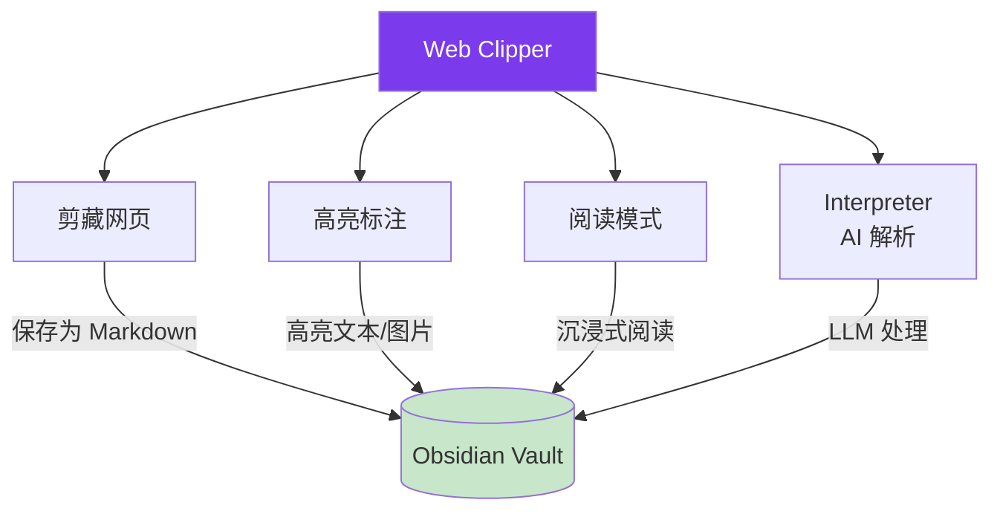
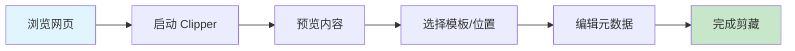

# Obsidian Web Clipper 使用教程

> [!info] 概述
> **一句话定义**：Obsidian Web Clipper 是 Obsidian 官方推出的免费浏览器扩展，让你高亮、剪藏网页内容并以 Markdown 格式保存到本地 vault。
>
> **通俗比喻**：就像给 Obsidian 装了一个"智能复印机"，浏览网页时遇到有价值的内容，点一下就能把内容"复印"进你的知识库，而且是纯文本 Markdown 格式，完全属于你自己。

## 安装与设置

### 支持的浏览器

| 浏览器 | 安装来源 |
|:------:|:--------:|
| Chrome | [Chrome Web Store](https://chromewebstore.google.com/detail/obsidian-web-clipper/cnjifjpddelmedmihgijeibhnjfabmlf) |
| Firefox | [Firefox Add-ons](https://addons.mozilla.org/en-US/firefox/addon/web-clipper-obsidian/) |
| Safari | [App Store](https://apps.apple.com/us/app/obsidian-web-clipper/id6720708363)（macOS / iOS / iPadOS） |
| Edge | [Edge Add-ons](https://microsoftedge.microsoft.com/addons/detail/obsidian-web-clipper/eigdjhmgnaaeaonimdklocfekkaanfme) |

> [!tip] Chromium 内核通用
> Chrome Web Store 版本同时适用于 Brave、Arc、Orion 等 Chromium 内核浏览器。

### 连接 Vault

1. 右键点击浏览器工具栏的 Clipper 图标，选择 **选项**（Options）或点击扩展面板中的 ⚙️ 齿轮图标进入设置页面
2. 在左侧导航选择 **常规**（General），找到 **保管库**（Vault）配置区域
3. 在输入框中输入你的 Obsidian 保管库名称（必须与保管库名称**完全匹配**），按 **回车键** 添加
4. 已添加的保管库会显示在列表中，点击 🗑️ 图标可删除
5. 确保 Obsidian 桌面端已开启 URI 支持（见下方配置）

> [!tip] 重要前提
> - 确保 Obsidian 在剪藏时处于**运行状态**，否则连接会失败
> - 保管库名称**大小写敏感**，必须与 Obsidian 中显示的名称完全一致
> - 默认情况下，剪藏的笔记会保存到当前打开的保管库；只有在需要保存到其他保管库时才需要手动添加

### 开启 Obsidian URI 支持

Clipper 通过 `obsidian://` 协议与 vault 通信，需要在 Obsidian 中开启：

1. 打开 Obsidian 设置
2. 进入 **核心插件** (Core Plugins)
3. 找到 **URI 支持** (URI Support) 并启用
4. 移动端同样支持此功能

> [!info] 📚 来源
> - [Obsidian Help - Web Clipper](https://obsidian.md/help/web-clipper) - 官方帮助文档
> - [GitHub - obsidian-clipper](https://github.com/obsidianmd/obsidian-clipper) - 官方仓库

## 核心功能概览

Web Clipper 提供四大核心功能：



| 功能 | 说明 |
|:----:|:------|
| **剪藏 (Clip)** | 将网页内容保存为 Markdown 笔记 |
| **高亮 (Highlighter)** | 在网页上高亮标注文本和图片，保存后可复用 |
| **阅读模式 (Reader)** | 无干扰的沉浸式阅读视图 |
| **Interpreter** | 利用 LLM 自然语言处理网页内容，提取结构化数据 |

### 剪藏网页

标准剪藏流程：



1. **浏览网页** - 打开任意你想保存的网页
2. **启动 Clipper** - 点击浏览器工具栏的 Obsidian 图标，或使用快捷键
3. **预览内容** - 弹出面板会显示提取的内容预览
4. **选择模板/位置** - 选择模板和 vault 中的目标文件夹
5. **编辑元数据** - 可编辑标题、添加标签
6. **完成剪藏** - 点击保存按钮

### 高亮标注

Web Clipper 支持在网页上高亮标注：

1. 通过扩展面板的高亮图标、快捷键或右键菜单开启高亮模式
2. 选中文本、图片或页面元素进行高亮
3. 高亮内容会被保存，下次访问同一页面时仍可查看
4. 剪藏时高亮内容通过 `{{highlights}}` 或 `{{content}}` 变量捕获

**高亮行为设置**（Web Clipper Settings）：

| 选项 | 说明 |
|:----:|:------|
| Highlight the page content | 在正文中用 `==highlight==` 语法嵌入高亮 |
| Replace the page content | 仅返回高亮内容列表，不含原文 |
| Do nothing | 返回原文，不包含高亮 |

**高亮模板示例：**

```markdown
## 我的高亮
{{highlights|map: item => item.text|join:"\n\n"}}
```

> [!info] 📚 来源
> - [Highlight Web Pages - Obsidian Help](https://obsidian.md/help/web-clipper/highlight) - 高亮功能文档

### 阅读模式 (Reader)

Web Clipper 内置阅读模式，提供无干扰的沉浸式阅读体验，去除网页上的广告、弹窗等干扰元素。

### Interpreter（AI 解析器）

Interpreter 是 Web Clipper 的 AI 功能，利用语言模型（LLM）处理网页内容：

- 提取特定文本片段
- 总结或解释信息
- 格式转换
- 翻译文本

> [!note] Interpreter 配置
> 1. 前往 Web Clipper 设置 → **Interpreter**
> 2. 开启 **Enable Interpreter**
> 3. 配置 Provider 和 Model（见下方模型选择）
> 4. 在模板中使用 Prompt 变量（`{{"your prompt"}}`）
> 5. 剪藏时点击 **interpret** 按钮处理

**支持的模型提供商：**

| Provider | 特点 |
|:--------:|:----:|
| Anthropic | Claude 系列 |
| OpenAI | GPT 系列 |
| Google Gemini | Gemini 系列 |
| DeepSeek | DeepSeek 模型 |
| Ollama | 本地运行，完全隐私 |
| OpenRouter | 多模型路由 |
| xAI Grok | Grok 模型 |
| Azure OpenAI | 企业级部署 |

> [!tip] 推荐使用小模型
> 官方建议使用较小的模型（如 Claude Haiku、Gemini Flash、Llama 3B/8B、OpenAI Mini），因为它们更快且对 Web Clipper 任务表现足够好。

**Ollama 本地模型配置：**

1. 安装 [Ollama](https://ollama.com/)
2. 在 Interpreter 设置中添加 Ollama provider（无需 API key）
3. 启动 Ollama 服务器时需设置 CORS：

```bash
OLLAMA_ORIGINS=moz-extension://*,chrome-extension://*,safari-web-extension://* ollama serve
```

> [!warning] Ollama 上下文长度
> Ollama 默认上下文窗口为 2048 tokens，处理长网页可能不够。可以通过增加 `num_ctx` 参数或在模板中使用 Context 字段限制处理范围来解决。

> [!info] 📚 来源
> - [Interpret Web Pages - Obsidian Help](https://obsidian.md/help/web-clipper/interpreter) - Interpreter 文档

## 模板系统详解

### 什么是模板

模板是预设的格式规则，控制剪藏后的 Markdown 结构。通过模板，你可以自定义保存内容的格式，让剪藏的笔记符合你的知识库规范。

模板系统的语法灵感来自 [Twig](https://twig.symfony.com/) 和 [Liquid](https://shopify.github.io/liquid/) 模板语言。

### 变量系统

Web Clipper 提供 **五种类型的变量**，可在笔记名称、保存位置、属性和正文中使用。

> [!tip] 查看当前页面变量
> 使用扩展中的 `...` 图标可以查看当前页面的所有可用变量。

#### 1. 预设变量（Preset Variables）

预设变量根据页面内容自动生成，适用于大多数网站：

| 变量 | 说明 |
|:----:|:------|
| `{{title}}` | 页面标题 |
| `{{url}}` | 当前 URL |
| `{{content}}` | 正文内容（或高亮/选中文本），Markdown 格式 |
| `{{contentHtml}}` | 正文内容，HTML 格式 |
| `{{fullHtml}}` | 完整页面 HTML（未经处理） |
| `{{author}}` | 文章作者 |
| `{{description}}` | 页面描述/摘要 |
| `{{published}}` | 发布日期，可用 `date` 过滤器格式化 |
| `{{date}}` | 当前日期，可用 `date` 过滤器格式化 |
| `{{time}}` | 当前日期和时间 |
| `{{domain}}` | 域名 |
| `{{site}}` | 站点名称或出版商 |
| `{{image}}` | 社交分享图片 URL |
| `{{favicon}}` | 网站图标 URL |
| `{{selection}}` | 当前选中文本，Markdown 格式 |
| `{{selectionHtml}}` | 当前选中文本，HTML 格式 |
| `{{highlights}}` | 高亮内容（含文本和时间戳） |
| `{{words}}` | 字数统计 |

> [!note] `{{content}}` 的行为
> `{{content}}` 会尝试提取页面的主要内容，这可能不总是你想要的。如果需要更精确的提取，可以使用 Selector 变量。

#### 2. Prompt 变量（AI 驱动）

Prompt 变量利用语言模型用自然语言提取和修改数据。语法为 `{{"your prompt"}}`（双引号是关键）。

**需要开启 Interpreter 功能。**

| 示例 | 说明 |
|:----:|:------|
| `{{"a summary of the page"}}` | 提取页面摘要 |
| `{{"a three bullet point summary, translated to French"}}` | 三点摘要并翻译为法语 |
| `{{"author of the book"}}` | 提取书籍作者（跨站通用） |

Prompt 结果可用过滤器后处理：`{{"a summary of the page"|blockquote}}`

> [!warning] Prompt 变量的权衡
> - ✅ 极其灵活，跨站点通用（如不同书店的书信息提取）
> - ❌ 执行较慢，可能有费用和隐私考虑
> - 💡 如果数据格式一致，优先使用 Selector 或 Schema 变量

#### 3. Meta 变量

提取页面 meta 元素数据，包括 Open Graph 数据：

| 语法 | 说明 |
|:----:|:------|
| `{{meta:name:description}}` | 获取 meta name 为 description 的内容 |
| `{{meta:property:og:title}}` | 获取 og:title 属性内容 |

#### 4. Selector 变量

使用 CSS 选择器提取页面元素内容：

| 语法 | 说明 |
|:----:|:------|
| `{{selector:h1}}` | 返回所有 `h1` 元素的文本 |
| `{{selector:.author}}` | 返回 `.author` 类元素的文本 |
| `{{selector:img.hero?src}}` | 返回 `.hero` 图片的 `src` 属性 |
| `{{selector:a.main-link?href}}` | 返回锚点的 `href` 属性 |
| `{{selectorHtml:body\|markdown}}` | 返回 body 的 HTML 并转为 Markdown |

> [!tip] Selector 变量最佳场景
> 适合结构固定的特定网站。如果多个元素匹配，返回数组，可用数组过滤器（如 `join`、`map`）处理。

#### 5. Schema.org 变量

提取页面中 schema.org JSON-LD 结构化数据：

| 语法 | 说明 |
|:----:|:------|
| `{{schema:@Type:key}}` | 从指定类型中提取 key 的值 |
| `{{schema:@Type:parent.child}}` | 提取嵌套属性 |
| `{{schema:@Type:arrayKey[*].property}}` | 提取数组中所有元素的某个属性 |
| `{{schema:author}}` | 简写形式，匹配任意类型中的 `author` 属性 |
| `{{schema:author[*].name}}` | 返回所有作者名称的数组 |

> [!info] 📚 来源
> - [Variables - Obsidian Help](https://obsidian.md/help/web-clipper/variables) - 变量完整文档

### 过滤器系统（Filters）

过滤器用于修改变量的输出，语法为 `{{variable|filter}}`，支持链式调用：`{{variable|filter1|filter2}}`

#### 日期过滤器

| 过滤器 | 示例 | 结果 |
|:------:|:----:|:----:|
| `date` | `{{date\|date:"YYYY-MM-DD"}}` | 格式化日期 |
| `date_modify` | `"2024-12-01"\|date_modify:"+1 year"` | `"2025-12-01"` |
| `duration` | `"PT1H30M"\|duration:"HH:mm:ss"` | `"01:30:00"` |

#### 文本转换过滤器

| 过滤器 | 说明 |
|:------:|:------|
| `lower` / `upper` | 转为小写/大写 |
| `capitalize` | 首字母大写 |
| `title` | 转为 Title Case |
| `camel` / `pascal` / `snake` / `kebab` | 命名风格转换 |
| `trim` | 去除首尾空白 |
| `uncamel` | camelCase 转空格分隔 |
| `replace` | 文本替换（支持正则） |
| `safe_name` | 转为安全文件名 |
| `decode_uri` | URL 解码 |

#### Markdown 格式过滤器

| 过滤器 | 说明 | 示例 |
|:------:|:------|:------|
| `blockquote` | 添加引用前缀 `> ` | `{{content\|blockquote}}` |
| `callout` | 创建 callout | `{{content\|callout:("info", "标题")}}` |
| `list` | 转为列表（支持 `task`、`numbered`） | `{{tags\|list}}` |
| `table` | 转为表格 | `{{data\|table:("列1", "列2")}}` |
| `link` | 转为 Markdown 链接 | `{{url\|link:"标题"}}` |
| `wikilink` | 转为 Obsidian wikilink | `{{page\|wikilink:"别名"}}` |
| `image` | 转为图片语法 | `{{src\|image:"alt"}}` |
| `footnote` | 转为脚注 | `{{refs\|footnote}}` |
| `fragment_link` | 转为文本片段链接 | `{{highlights\|fragment_link}}` |

#### HTML 处理过滤器

| 过滤器 | 说明 |
|:------:|:------|
| `markdown` | HTML 转 Markdown |
| `remove_html` | 移除指定 HTML 元素及其内容 |
| `remove_tags` | 移除指定 HTML 标签（保留内容） |
| `remove_attr` | 移除指定 HTML 属性 |
| `strip_tags` | 移除所有 HTML 标签 |
| `strip_attr` | 移除所有 HTML 属性 |
| `strip_md` | 移除所有 Markdown 格式 |

#### 数组和对象过滤器

| 过滤器 | 说明 |
|:------:|:------|
| `first` / `last` | 获取数组首/末元素 |
| `join` | 合并为字符串 |
| `split` | 拆分为数组 |
| `slice` | 截取部分元素 |
| `map` | 映射转换每个元素 |
| `merge` | 合并数组 |
| `unique` | 去重 |
| `nth` | 按 CSS nth-child 语法筛选 |
| `length` | 获取长度 |
| `object` | 对象操作（keys/values/array） |
| `template` | 应用模板字符串 |

> [!info] 📚 来源
> - [Filters - Obsidian Help](https://obsidian.md/help/web-clipper/filters) - 过滤器完整文档

### 模板逻辑（Logic）

> [!warning] 版本要求
> 模板逻辑功能需要 Obsidian Web Clipper 1.0.0 及以上版本。

模板支持条件、循环和变量赋值，语法灵感来自 Twig 和 Liquid。

#### 条件逻辑

```twig

Author: {{author}}

Author: Unknown

```

**支持的操作符：**

| 类型 | 操作符 |
|:----:|:------|
| 比较 | `==` `!=` `>` `<` `>=` `<=` `contains` |
| 逻辑 | `and` (`&&`) `or` (`\|\|`) `not` (`!`) |

**示例：**

```twig

    类型：评测文章

    类型：草稿

```

#### 变量赋值

```twig

文件名：{{slug}}.md
```

#### 循环

```twig

- {{item.name}}

```

**循环变量：**

| 变量 | 说明 |
|:----:|:------|
| `loop.index` | 当前迭代（从 1 开始） |
| `loop.index0` | 当前迭代（从 0 开始） |
| `loop.first` | 是否为第一次迭代 |
| `loop.last` | 是否为最后一次迭代 |
| `loop.length` | 总数量 |

#### 回退值（Fallback）

```twig
{{title ?? "Untitled"}}
{{title ?? headline ?? "No title"}}
```

> [!info] 📚 来源
> - [Logic - Obsidian Help](https://obsidian.md/help/web-clipper/logic) - 模板逻辑文档

### 模板示例

#### 基础通用模板

```markdown
---
title: {{title}}
source: {{url}}
author: {{author}}
date: {{date|date:"YYYY-MM-DD"}}
tags: [网页剪藏]
---

# {{title}}

> 来源：[{{title}}]({{url}})
{{if author}}> 作者：{{author}}{{/if}}
> 剪藏时间：{{date|date:"YYYY-MM-DD"}}

## 摘要
{{description}}

## 正文
{{content}}
```

#### AI 增强模板（使用 Interpreter）

```markdown
---
title: {{title}}
source: {{url}}
date: {{date|date:"YYYY-MM-DD"}}
tags: [AI摘要, 网页剪藏]
---

# {{title}}

## AI 摘要
{{"a three bullet point summary of this page"|blockquote}}

## 关键信息
- 作者：{{author ?? "未知"}}
- 发布时间：{{published ?? "未知"}}
- 域名：{{domain}}

## 正文
{{content}}
```

#### 跨站书籍模板（Prompt 变量 + Schema）

```markdown
---
title: {{"book title"}}
author: {{"author of the book"}}
price: {{"price of the book"}}
source: {{url}}
date: {{date|date:"YYYY-MM-DD"}}
tags: [书籍, 想读]
---

# {{"book title"}}

## 书籍信息
- 作者：{{"author of the book"}}
- 价格：{{"price of the book"}}

## 简介
{{description}}

## AI 推荐理由
{{"why should I read this book, in 3 bullet points"|blockquote}}
```

#### 特定网站模板（Selector 变量）

```markdown
---
title: {{title}}
source: {{url}}
author: {{selector:.author-byline}}
date: {{date|date:"YYYY-MM-DD"}}
tags: [文章]
---

# {{title}}

## 作者
{{selector:.author-byline}}

## 正文
{{selectorHtml:article.main-content|markdown}}
```

## 常见问题与解决方案

### 连接失败

> [!warning] 症状
> 点击保存后提示无法连接到 Obsidian

**解决方案：**

1. 检查 Obsidian 是否正在运行
2. 确认 URI 支持已开启（设置 → 核心插件 → URI 支持）
3. 检查 vault 名称或路径是否正确
4. 尝试重启 Obsidian 和浏览器

### 内容提取不完整

> [!warning] 症状
> 剪藏的内容缺少部分文字或图片

**解决方案：**

1. 等待页面完全加载后再剪藏
2. 使用 `{{fullHtml}}` 获取完整 HTML，再用过滤器处理
3. 使用 Selector 变量精确提取需要的元素
4. 部分动态加载网站可使用高亮功能手动选择内容

### Interpreter 运行缓慢

**解决方案：**

1. 使用较小的模型（如 Claude Haiku、Gemini Flash）
2. 在模板中设置 Context 字段，限制发送给 LLM 的内容范围：

```twig
{{selectorHtml:#main}}
```

3. 使用 HTML 过滤器（`remove_html`、`strip_tags`）进一步精简上下文

### Ollama 403 错误

**解决方案：**

确保启动 Ollama 服务器时设置了正确的 CORS 来源：

```bash
OLLAMA_ORIGINS=moz-extension://*,chrome-extension://*,safari-web-extension://* ollama serve
```

> [!info] 📚 来源
> - [Troubleshoot Web Clipper - Obsidian Help](https://obsidian.md/help/web-clipper/troubleshoot-web-clipper) - 故障排除文档

## 隐私说明

Web Clipper 将内容**本地保存**到你的 Obsidian vault，遵循 Obsidian 的[隐私政策](https://obsidian.md/privacy)。你的数据不会被收集，也不收集任何使用指标。代码[开源](https://github.com/obsidianmd/obsidian-clipper)可审计。

> [!warning] Interpreter 隐私提示
> Interpreter 使用第三方模型提供商时，请求会直接发送到你选择的提供商。Obsidian 不会收集或存储你的任何数据。如需完全离线运行，可使用 Ollama 等本地模型。

## 与其他工具对比

| 特性 | Obsidian Web Clipper | 简单书签 | Evernote Clipper | Notion Clipper | Readwise Reader |
|:----:|:--------------------:|:--------:|:----------------:|:--------------:|:---------------:|
| 数据存储 | 完全本地 | 依赖云端 | 云端 | 云端 | 云端 |
| 格式 | Markdown | 链接 | 富文本 | 富文本 | Markdown |
| 费用 | 免费 | 免费 | 订阅制 | 免费/付费 | 订阅制 |
| AI 功能 | Interpreter | 无 | 无 | 无 | 有 |
| 高亮标注 | 原生支持 | 无 | 有限 | 无 | 有 |
| 模板自定义 | 高度灵活（含逻辑） | 无 | 有限 | 有限 | 有限 |
| 第三方依赖 | 无 | 无 | 有 | 有 | 有 |

**核心优势：**

- Markdown 原生输出，与 Obsidian 生态完美整合
- 数据完全自主，不依赖任何第三方服务
- 强大的模板系统：变量 + 过滤器 + 逻辑 + AI
- 内置高亮标注和阅读模式
- 开源免费，社区活跃

## 参考资料

### 官方资源
- [Obsidian Help - Web Clipper](https://obsidian.md/help/web-clipper) - 官方帮助文档主页
- [Variables - Obsidian Help](https://obsidian.md/help/web-clipper/variables) - 变量完整文档
- [Filters - Obsidian Help](https://obsidian.md/help/web-clipper/filters) - 过滤器完整文档
- [Logic - Obsidian Help](https://obsidian.md/help/web-clipper/logic) - 模板逻辑文档
- [Interpreter - Obsidian Help](https://obsidian.md/help/web-clipper/interpreter) - AI 解析器文档
- [Highlight - Obsidian Help](https://obsidian.md/help/web-clipper/highlight) - 高亮功能文档
- [GitHub - obsidian-clipper](https://github.com/obsidianmd/obsidian-clipper) - 官方开源仓库

### 社区资源
- [Obsidian Web Clipper + AI (YouTube)](https://www.youtube.com/watch?v=DS75Vw4IyoA) - AI 剪藏教程视频

## 相关概念

| 概念 | 关系 |
|:----:|:------|
| [[Obsidian]] | Clipper 是 Obsidian 官方的浏览器扩展 |
| [[Obsidian URI]] | Clipper 通过 URI 协议与 Obsidian 通信 |
| [[Markdown]] | 剪藏内容以 Markdown 格式保存 |
| [[Defuddle]] | Clipper 内置使用 Defuddle 进行内容提取和 Markdown 转换 |

## 个人笔记

> [!personal] 我的使用心得
> （此处记录你的使用体验、技巧发现、踩坑记录等）
