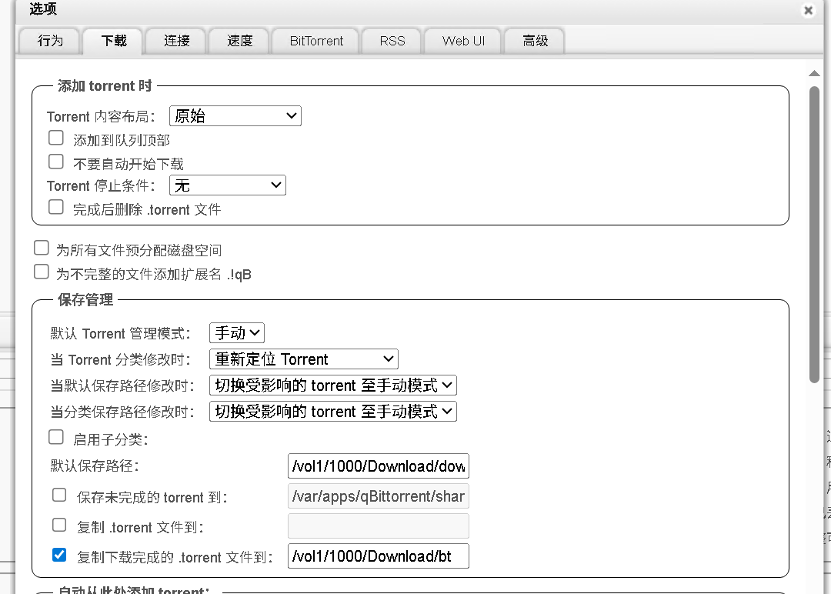

# 下**砸**qBittorrent

目前qB分为官方版和增强版。

## qBittorrent 官方版

**特点**

1.  **来源：**qBittorrent 官方网站 / GitHub 发布的稳定版本。

2.  **核心功能：**

    a)  支持 BT、磁力链接下载

    b)  支持 RSS 自动下载

    c)  WebUI（网页远程控制）

    d)  下载队列管理、限速控制、种子管理

**优势：**

1.  稳定、可靠

2.  跨平台（Windows、Linux、macOS）

3.  社区活跃，有定期更新

**缺点：**

1.  默认界面比较简单

2.  没有一些高级功能或优化（例如更强的缓存优化或去广告）

## qBittorrent 增强版 / 优化版

**注意：**不同社区可能有不同称呼，比如 "qBittorrent Enhanced Edition" 或
"qBittorrent Advanced Build"。一般是第三方改版，不是官方维护的。

**特点**

1.  **增强功能：**

    a)  改进 WebUI 界面，更美观

    b)  增加下载优化选项（内存缓存优化、多线程优化）

    c)  自带 RSS 高级过滤器、定时任务

    d)  可能去掉官方版一些广告或不必要组件

2.  **第三方插件：**

    a)  有些增强版内置了 Tracker 服务器监控、IP 过滤增强

3.  **优势：**

    a)  对高级用户更友好

    b)  下载更快、更稳定（在一些系统/场景下）

4.  **缺点：**

    a)  不是官方发布，安全性略低

    b)  更新不如官方稳定，可能出现兼容性问题

    c)  部分增强版可能捆绑非官方插件，需要注意来源

# 基本设置

## 配置下载

这里主要是配置下载的保存路径和你种子的保存路径

1.  在**默认保存路径**中：换成你电脑或者是nas相应的文件夹路径

2.  在**复制下载完的.torrent文件到**：这个选项的作用就是对种子文件进行备份。以防后面数据丢失。

!

## 配置BitTorrent

这里我们要自动添加我们的tracker服务器到这里的**自动添加以下tracker到新的torrent**,这个选择中。

我们可以在下面找到相应的tracker：

```
公共 Tracker 列表合集：https://trackerslist.com/#/zh

Tracker
列表（GitHub）：https://github.com/XIU2/TrackersListCollection/blob/master/README-ZH.md
```

!

## 速度和Web UI

保持默认即可

## 高级

在高级配置中如果有**自动更新**选项最好关闭，并且打开**总是向同级的所有
Tracker 汇报**

!

## 缓存设置（重要）

**设置 → 下载 → 缓存**

| 设置项 | 推荐值 | 说明 |
|--------|--------|------|
| 磁盘缓存大小 | 256-512MB | 内存越大可设置越大，减少磁盘写入 |
| 磁盘缓存 TTL（生存时间） | 60s | 缓存保留时间 |

> [!tip]
> **优化建议**：
> - NAS 或大内存设备：设置 512MB-1GB
> - 普通电脑：设置 256-512MB
> - 小内存设备：保持默认

# 进阶设置

## 种子管理

**设置 → 下载 → 种子管理**

| 选项 | 推荐设置 | 用途 |
|------|----------|------|
| 做种比率限制 | 0.5-1.0 | 达到分享比率后自动停止 |
| 做种时间限制 | 0（无限） | 做种时长 |
| 最大活动种子数 | 10-20 | 同时活跃的种子数量 |

## 队列设置

**设置 → 下载 → 队列**

| 选项 | 推荐设置 | 说明 |
|------|----------|------|
| 最大活动下载数 | 3-5 | 同时下载的任务数 |
| 最大活动上传数 | 10-20 | 同时上传的任务数 |

> [!note]
> **为什么设置队列？**
> 避免同时下载过多任务导致硬盘 I/O 过载，影响速度

## 连接数设置

**设置 → 连接**

| 选项 | 推荐设置 | 说明 |
|------|----------|------|
| 全局最大连接数 | 500-1000 | 同时连接的总 Peers 数 |
| 每个下载的最大连接数 | 100-200 | 单种子的最大连接数 |
| 最大上传连接数 | 10-20 | 同时上传的连接数 |

# 常用操作技巧

## 1. 快速移动下载位置

**方法 1：右键 → 设置保存路径**

- 选中要移动的种子
- 右键 → 设置保存路径
- 选择新位置

**方法 2：拖拽（部分版本支持）**

直接拖拽种子到新的保存文件夹

## 2. 强制重新校验

当文件可能损坏时：

- 右键 → 强制重新校验
- qB 会逐块校验文件完整性
- 损坏的块会重新下载

## 3. 复制磁力链接

右键 → 复制磁力链接

方便分享给其他人或其他下载工具

## 4. 批量操作

选中多个种子后可以：
- 批量暂停/恢复
- 批量删除
- 批量设置类别
- 批量设置保存路径

## 5. RSS 自动下载

**设置 → RSS**

1. 添加 RSS 订阅源
2. 设置自动下载规则
3. 支持正则表达式匹配

示例规则：
- 关键词：`4K|BluRay`
- 包含：`.mkv|.mp4`
- 不包含：`.exe|.zip`

## 6. 搜索插件

**工具 → 搜索 → 搜索插件**

安装搜索插件后可以直接在 qB 内搜索：
- 支持多个搜索引擎
- 无需打开浏览器
- 直接添加下载

# 速度优化建议

## 网络优化

**设置 → 速度**

| 选项 | 建议值 | 说明 |
|------|--------|------ |
 | 下载速率限制 | 0（无限制）或根据带宽设置 | 全局下载限速 |
| 上传速率限制 | 带宽的 80-90% | 保留一些带宽 |
| 备用上传速率 | 带宽的 30% | 有其他下载活动时的限速 |

## 硬盘优化

**设置 → 下载 → 磁盘 IO**

| 选项 | 建议设置 | 说明 |
|------|----------|------|
| 磁盘 IO 模式 | Default | 默认模式 |
| 磁盘 IO 读线程 | 1 | 减少读取线程 |
| 磁盘 IO 写线程 | 1-2 | 减少写入线程 |
| 启用异步 IO | ✅ | 提高效率 |

# WebUI 远程控制

**设置 → Web UI**

| 选项 | 设置 | 说明 |
|------|------|------|
| 端口 | 8080 | 访问端口 |
| 用户名 | 自定义 | 登录用户名 |
| 密码 | 自定义 | 登录密码 |
| 启用 HTTPS | 推荐开启 | 加密连接 |
| 本地主机 | 关闭（如需外网访问） | 允许外网访问 |

访问地址：
- HTTP：`http://服务器IP:端口`
- HTTPS：`https://服务器IP:端口`

# 备份和恢复

## 备份配置

qB 配置文件位置：

- **Windows**：`C:\Users\用户名\AppData\Roaming\qBittorrent`
- **macOS**：`~/Library/Application Support/qBittorrent`
- **Linux**：`~/.config/qBittorrent`

关键文件：
- `qBittorrent.conf` - 主配置文件
- `rss` - RSS 配置
- `rss_rules` - RSS 规则

## 恢复配置

1. 关闭 qB
2. 备份原配置文件
3. 覆盖新的配置文件
4. 重启 qB

# 快捷键

| 快捷键 | 功能 |
|--------|------|
| `Ctrl+D` | 删除种子 |
| `Ctrl+E` | 删除种子和数据 |
| `F5` | 刷新 |
| `Ctrl+P` | 暂停 |
| `Ctrl+S` | 开始 |
| `Delete` | 删除选中项 |