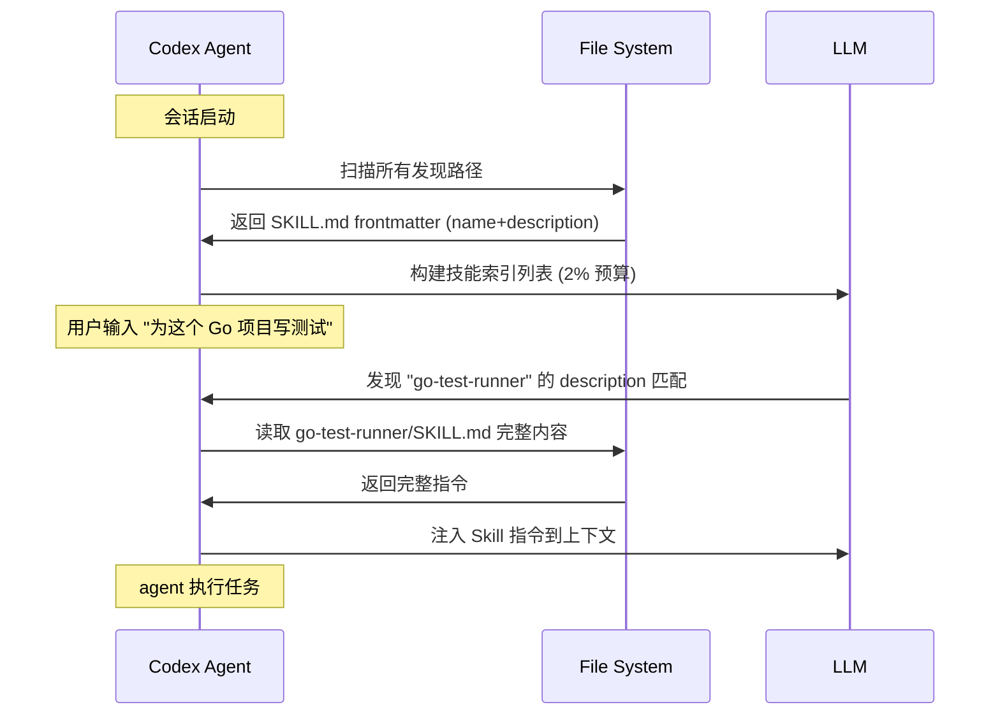

# Skills 技能系统 —— 创建、注册与共享

第三章我们深入了 AGENTS.md 的分层级联机制和 Starlark 规则引擎——它们定义了 agent 如何理解项目规范。但指令文件有容量限制（32 KiB），不可能也不应该把所有操作指南塞进 AGENTS.md。真正强大的行为扩展方式是创建**可复用的 Skill（技能）包**：一个 Skill 封装了让 agent 完成特定任务所需的所有指令、脚本和参考文档，可以被跨项目甚至跨工具共享。

本章将全面解析 Codex 的 Skills 系统。你会发现一个关键事实：**Codex 和 Claude Code 共享同一套 Agent Skills Standard**。这意味着，只要遵循标准 frontmatter 和目录结构，同一个 Skill 目录可以被两个工具同时发现和加载。这是目前两套配置体系之间最无缝的桥梁——不夸张地说，Skills 是你在 Codex 和 Claude Code 之间"一次编写，处处运行"的最佳切入点。

> **Claude Code 对照**：如果你用过 Claude Code 的 Skills（`/skill-name` 调用 + description 自动加载），那么核心概念你已经掌握了。Codex 的 Skills 遵循相同的基础标准，但增加了自己的扩展（如 `agents/openai.yaml`、渐进式延迟加载、内置创建器）。理解差异就理解了全局。

## 1. Skills 是什么？

Skills 是一套**标准化的可复用能力包**。每个 Skill 是一个目录，包含让 agent 完成特定任务的指令（SKILL.md）、可选的辅助脚本（scripts/）、参考文档（references/）和模板资源（assets/）。

Skill 的设计哲学是：

- **可发现**：agent 启动时扫描所有已安装的 Skills，构建可用技能列表
- **按需加载**：只有在用户显式调用或上下文触发时才完整读取 SKILL.md
- **自包含**：每个 Skill 独立成目录，不依赖外部文件（相对路径引用从 Skill 根目录解析）
- **跨工具复用**：基于 Agent Skills Standard，Codex 和 Claude Code 共享同一标准

### Skills vs 指令文件

Skill 和 AGENTS.md 有一个核心区别：**AGENTS.md 是全局性的工作规范，Skill 是场景化的能力注入**。

| | AGENTS.md | Skill |
|--|-----------|-------|
| 作用范围 | 整个项目/会话 | 特定任务场景 |
| 触发方式 | 自动加载 | 显式调用或 description 隐式匹配 |
| 容量 | 32 KiB 上限 | 无硬性上限（按需加载） |
| 复用性 | 项目内或全局 | 跨项目、跨工具 |
| 内容 | 工作规范、约定、协议 | 任务指令、脚本、参考文档 |

## 2. Skills 目录结构

一个标准的 Skill 目录结构如下：

```
my-skill/
├── SKILL.md              # 必选：技能定义，含 frontmatter + 指令正文
├── scripts/              # 可选：agent 可调用的可执行脚本
│   └── setup.sh
├── references/           # 可选：参考文档、规范、示例
│   └── api-docs.md
├── assets/               # 可选：模板文件、代码样板、资源
│   └── template.py
└── agents/
    └── openai.yaml       # 可选：Codex 特有的 UI 元数据和 MCP 依赖声明
```

从结构可以看出，一个 Skill 的核心只有 **SKILL.md** 是必须的。其他目录按需添加。这种设计让 Skill 既可以是纯指令（仅一个 Markdown 文件），也可以是包含完整工具链的能力包（含脚本和参考文档）。

### 2.1 与 Claude Code 的目录结构对比

Claude Code 的 Skills 目录结构几乎相同，唯一的区别是发现路径：

```text
# Codex 发现路径
.agents/skills/my-skill/SKILL.md

# Claude Code 发现路径
.claude/skills/my-skill/SKILL.md
```

**目录内部结构完全一致**——因为两者均遵循 Agent Skills Standard。这就为后续的符号链接共享奠定了基础。

## 3. SKILL.md 深度解析

SKILL.md 是每个 Skill 的核心文件，包含两个部分：YAML frontmatter（元数据）和 Markdown 正文（指令）。

### 3.1 Frontmatter 的标准字段

```yaml
---
name: skill-name              # 必填。1-64 字符，小写字母+数字+连字符
description: "..."            # 必填。隐式匹配的关键，把核心场景词放前面
---
```

只有两个必填字段：`name` 和 `description`。但它们的战略重要性完全不同：

- **`name`**：技能的唯一标识，用户通过 `/skill-name` 显式调用时使用。也是系统索引的键。命名规范是小写字母、数字和连字符的组合，不能有空格。
- **`description`**：**这是最重要的元数据字段**。Codex 在索引阶段仅扫描 name + description 来决定是否将 Skill 推荐给用户。description 的文本会被用于隐式匹配——当用户在对话中提及"写测试"时，一个 description 包含 "test" 或 "testing" 的 Skill 会自动被 Codex 加载。

```yaml
---
name: go-test-runner
description: "Run Go tests with coverage, race detection, and benchmark analysis. Ideal for Go developers doing TDD, CI debugging, or performance profiling."
---
```

> **最佳实践**：把最关键的场景词放在 description 开头。Codex 会在 token 预算不足时截断 description，从尾部开始截——所以重要信息放前面。

### 3.2 Frontmatter 扩展字段（Claude Code 特有）

Claude Code 在标准 frontmatter 基础上增加了自己的扩展字段。如果你的 Skill 需要在 Claude Code 中使用，可以额外添加：

```yaml
---
name: code-explorer
description: "Explore unfamiliar codebases with interactive browsing and documentation generation."
context: fork                # Claude Code 特有：声明为子代理技能
allowed-tools:              # Claude Code 特有：限制可用工具
  - Read
  - Write
  - Bash
  - Glob
---
```

需要注意：这些扩展字段对 Codex 是透明的——它们会被 Codex 忽略（因为标准 frontmatter 解析器会跳过不认得的字段），不会产生副作用。因此**你可以放心地在同一个 SKILL.md 中包含两个工具的扩展字段**。

### 3.3 指令正文

frontmatter 之后的全部内容就是 Skill 的指令正文。它告诉 agent 如何执行这个 Skill。一个良好的 Skill 正文应该：

- 清晰地定义 Skill 的目标和边界
- 给出具体的执行步骤
- 包含最佳实践和注意事项
- 引用 scripts/ 或 references/ 中的辅助文件（使用相对路径）

```markdown
# Go Test Runner

Run Go tests in the current project with comprehensive output.

## Usage

1. Run `go test ./... -v -race -count=1` to execute all tests
2. If coverage analysis is requested, also run `go test ./... -coverprofile=coverage.out`
3. Present results in a formatted summary

## Conventions

- Always show failed tests first, then the summary
- For flaky tests, run 3 times before reporting failure
- Respect existing `-tags` in the Go build environment

## Reference

See `references/testing-guide.md` for detailed testing strategies.
```

### 3.4 完整 SKILL.md 示例

下面是一个从零到一的完整示例，展示 Codex 和 Claude Code 共享兼容的写法：

```yaml
---
name: api-doc-generator
description: "Generate API documentation from OpenAPI/Swagger specs or Go struct comments. Supports swagger, openapi, go comments, and yaml."
context: fork
allowed-tools:
  - Read
  - Write
  - Bash
  - Glob
---

# API Documentation Generator

Generate API reference documentation from OpenAPI specs or Go source code comments.

## Capabilities

- Parse OpenAPI 3.x and Swagger 2.0 YAML/JSON files
- Extract Go struct comments and generate Markdown docs
- Output to `docs/api/` directory

## Workflow

1. **Detect source type**:
   - If `openapi.yaml` or `swagger.yaml` exists in project root → parse OpenAPI
   - If `*.go` files contain struct comments → parse Go comments
   - Otherwise ask user which mode

2. **Parse and validate** the input

3. **Generate** Markdown documentation with:
   - Table of contents
   - Endpoint summary table (method + path + description)
   - Detailed request/response schemas
   - Example curl commands

4. **Output** to `docs/api/{version}/index.md`

## Quality Checks

- Verify all endpoints are documented
- Check for missing response schemas
- Validate curl examples are syntactically correct

## Reference

See `references/openapi-example.yaml` for a sample spec file.
```

这个 Skill 同时包含了 Claude Code 的 `context` 和 `allowed-tools` 字段，Codex 会忽略它不认识的字段，Claude Code 则能正常使用它们。

## 4. 发现路径：五层作用域

Codex 的 Skills 发现机制覆盖五个作用域，按优先级排列：

```
REPO  >  USER  >  ADMIN  >  SYSTEM  >  Plugin
```

### 4.1 各作用域详解

| 作用域 | Codex 路径 | Claude Code 路径 | 说明 |
|--------|-----------|-----------------|------|
| **REPO** | `.agents/skills/`（当前目录→父目录→仓库根） | `.claude/skills/<name>/` | 项目绑定，可被版本控制 |
| **USER** | `$HOME/.agents/skills/` | `~/.claude/skills/<name>/` | 当前用户全局可用 |
| **ADMIN** | `/etc/codex/skills/` | Enterprise managed | 企业/团队级强制技能 |
| **SYSTEM** | 内置（`skill-creator` 等） | N/A | Codex 内置技能 |
| **Plugin** | `<plugin>/skills/<name>/` | `<plugin>/skills/<name>/` | 插件携带的技能 |

### 4.2 REPO 作用域的向上遍历

对于 REPO 作用域，Codex 会从当前工作目录开始向上遍历到 Git 仓库根目录，在每一级检查 `.agents/skills/` 目录。这意味着：

```
project-root/
├── .agents/skills/          # 仓库级技能，整个项目可见
│   └── code-review/
├── src/
│   ├── .agents/skills/      # 模块级技能，仅 src/ 下可见
│   │   └── api-docs/
│   └── web/
│       └── .agents/skills/  # 更细粒度的技能
│           └── react-tester/
└── docs/
    └── .agents/skills/
        └── spell-check/
```

这种设计允许你按目录层级组织技能——通用技能放项目根，特定模块的技能放对应子目录。

### 4.3 USER 作用域

对于个人全局技能，放在 `~/.agents/skills/` 目录下。Codex 会扫描该目录中所有一级子目录下的 SKILL.md 文件：

```bash
# USER 作用域预期结构
~/.agents/skills/
├── code-reviewer/
│   └── SKILL.md
├── shell-scripter/
│   └── SKILL.md
└── doc-generator/
    └── SKILL.md
```

### 4.4 SYSTEM 内置技能

Codex 内置了两个重要的 SYSTEM 级技能：

- **`skill-creator`**：交互式创建新技能的工具。在聊天中使用 `/skill-creator` 调用，它引导你完成 skill 创建全程。
- **`skill-installer`**：从远程仓库或模板安装技能的工具。使用 `/skill-installer` 调用。

这两个技能在 Claude Code 中不存在——Claude Code 需要手工创建 Skills 目录和 SKILL.md 文件。

## 5. 渐进式延迟加载机制

这是 Codex Skills 系统在工程实现上最精妙的设计之一。由于 Skills 数量可能非常多（几十上百个），如果每次启动都加载所有 Skills 的完整内容，会浪费大量 token。Codex 采用五阶段渐进式加载：

### 5.1 索引阶段（Index Phase）

启动时，Codex 遍历所有发现路径下的 Skills，**仅读取每个 SKILL.md 的 frontmatter**——提取 `name` 和 `description` 两个字段，加上文件路径。这是非常廉价的操作，因为 frontmatter 通常只有几十字节。

```python
# 伪代码：索引阶段的逻辑
skills_index = []

for path in all_discovery_paths:
    for skill_dir in list_subdirs(path):
        frontmatter = parse_frontmatter(skill_dir / "SKILL.md")
        skills_index.append({
            "name": frontmatter["name"],          # 必填
            "description": frontmatter["description"],  # 必填
            "path": skill_dir,
        })
```

### 5.2 Token 预算约束（Token Budget）

索引完成后，Codex 将 skill 列表格式化成自然语言描述。这个列表的总大小受 **2% 上下文窗口** 或 **8000 字符**（取较小值）约束。

如果 Skills 数量过多导致列表超限：

1. **先截断描述**：从每项描述的尾部开始截，直到总长度达标
2. **再省略技能**：如果截到极致仍然超标，从列表末尾开始省略技能，并记录警告

这意味着，排在前面的 Skills（想象中按相关性排序）更有可能被完整展示给 LLM。

### 5.3 触发加载（Trigger Load）

Codex agent 在以下情况决定是否完整加载某个 Skill：

- **显式调用**：用户输入 `/skill-name`（斜杠 + 技能名）
- **隐式匹配**：LLM 判断用户当前请求与某个 Skill 的 description 匹配
- **技能列表查看**：用户输入 `/skills` 列出可用技能

### 5.4 完整加载（Full Load）

当 Codex 决定使用某个 Skill 时，才读取完整的 SKILL.md 文件。如果该 Skill 引用了 `scripts/`、`references/` 或 `assets/` 中的文件，这些内容在 agent 实际执行过程中按需读取。



### 5.5 与 Claude Code 的加载机制对比

| 维度 | Codex | Claude Code |
|------|-------|-------------|
| 加载策略 | 五阶段渐进式加载 | description 自动加载 |
| 索引阶段 | 仅读 frontmatter | 无独立索引阶段 |
| Token 预算 | 2% 或 8000 字符（取小） | 无硬性预算（整体上下文管理） |
| 描述截断 | 从尾部截断，仍超标则省略技能 | 无截断机制 |
| 触发方式 | 显式 `/skill` + 隐式匹配 | 显式 `/skill-name` + description 自动 |
| 动态注入 | 无 | 支持 `` !`command` `` Shell 注入 |

Codex 的设计更适合大规模技能库的管理——当你有 50+ 个技能时，Claude Code 的"全 description 自动加载"会显著占用上下文，而 Codex 的渐进式加载只提供索引。

## 6. 启用与禁用 Skill

Skills 默认全部启用。如果需要禁用某个 Skill（比如与项目的其他工具冲突，或者你暂时不需要），可以在 `config.toml` 中配置：

```toml
# ~/.codex/config.toml
[[skills.config]]
path = "/home/user/.agents/skills/legacy-formatter/SKILL.md"
enabled = false
```

配置要点：

- `path` 必须是 SKILL.md 的完整路径（不是目录路径）
- `enabled = false` 禁用对应 Skill
- 支持配置多条 `[[skills.config]]` 来管理多个 Skill
- `path` 也可以是项目内的 `.agents/skills/` 路径

```toml
# 禁用多个 Skill 的示例
[[skills.config]]
path = ".agents/skills/deprecated-linter/SKILL.md"
enabled = false

[[skills.config]]
path = ".agents/skills/experimental-formatter/SKILL.md"
enabled = false
```

> **Claude Code 对照**：Claude Code 没有类似的禁用机制。要么把 Skill 从目录移走，要么通过 Managed Settings 在企业级层面控制。Codex 的 `[[skills.config]]` 提供了更细粒度的本地控制。

## 7. agents/openai.yaml：Codex 特有的扩展层

这是 Codex 独有的扩展机制，Claude Code 中不存在。`agents/openai.yaml` 是 Skill 目录下的一个可选文件，用于定义 Skill 在 Codex UI 中的展示信息以及运行时行为。

### 7.1 文件位置与作用

```
my-skill/
├── SKILL.md
└── agents/
    └── openai.yaml      # 可选：Codex UI 元数据 + MCP 依赖
```

### 7.2 字段详解

```yaml
# my-skill/agents/openai.yaml
interface:
  display_name: "Go Test Runner"          # UI 中展示的技能名
  short_description: "Run Go tests"       # UI 中展示的简短描述
  icon_small: "assets/icons/test-16.png"  # 小图标（16x16）
  icon_large: "assets/icons/test-32.png"  # 大图标（32x32）
  brand_color: "#3B82F6"                  # 品牌色（十六进制）

policy:
  allow_implicit_invocation: false        # 是否允许隐式调用（默认 true）

dependencies:
  tools:                                  # 声明的 MCP 工具依赖
    - filesystem
    - github
```

| 字段路径 | 必填 | 说明 |
|---------|------|------|
| `interface.display_name` | 否 | UI 中显示的技能名称（支持空格和特殊字符） |
| `interface.short_description` | 否 | UI 中的简短描述（显示在技能卡片上） |
| `interface.icon_small` | 否 | 小图标路径（相对于 Skill 目录） |
| `interface.icon_large` | 否 | 大图标路径（相对于 Skill 目录） |
| `interface.brand_color` | 否 | 品牌色（十六进制，如 `#3B82F6`） |
| `policy.allow_implicit_invocation` | 否 | 默认 `true`。设为 `false` 时只有用户显式调用才加载 |
| `dependencies.tools[]` | 否 | Skill 依赖的 MCP 工具列表，确保这些工具在 Skill 运行前已就绪 |

### 7.3 使用场景

`agents/openai.yaml` 的最常见用途是控制隐式调用。如果你的 Skill 是高度敏感或资源密集型的（比如一个会修改大量文件的"批量重构"技能），你可能不希望它被自动触发：

```yaml
# bulk-refactor/agents/openai.yaml
policy:
  allow_implicit_invocation: false
```

这样，这个 Skill 只有在用户显式使用 `/bulk-refactor` 时才会被加载，不会在对话中意外触发。

另一个常见用途是声明 MCP 工具依赖。如果你的 Skill 需要与 GitHub API 交互：

```yaml
# pr-reviewer/agents/openai.yaml
dependencies:
  tools:
    - github
```

这告诉 Codex 在执行该 Skill 前确保 `github` MCP 服务器已就绪。

## 8. 内置创建工具：skill-creator 与 skill-installer

Codex 提供了两个内置 Skill 来管理 Skills 本身——这在 Claude Code 中是没有的。

### 8.1 skill-creator（交互式创建）

在 Codex 聊天中输入 `/skill-creator`，启动交互式创建向导：

```
/codex> /skill-creator

I'll help you create a new skill. Let me gather some information:

1. What should the skill be named? (lowercase, hyphens allowed)
> go-test-runner

2. Write a concise description (this is used for matching):
> Run Go tests with coverage, race detection, and benchmark analysis

3. What should this skill do? (describe the behavior):
> The skill should run Go tests in the current project...
```

创建完成后，Codex 会自动生成 SKILL.md 并放置到适当的发现路径（默认 `~/.agents/skills/`）。

### 8.2 skill-installer（从模板或仓库安装）

`/skill-installer` 从远程仓库或模板安装 Skill：

```
/codex> /skill-installer https://github.com/my-org/skills/go-test-runner
```

Codex 会克隆仓库并将技能目录链接或复制到发现路径中。

> **最佳实践**：使用 `skill-creator` 创建新技能时，你会得到一个基础骨架。建议创建后立即检查生成的 SKILL.md，补充详细的指令和示例。

## 9. Skill 共享方案：在 Codex 和 Claude Code 之间共享

这是本章最具实操价值的部分。由于 Codex 和 Claude Code 共享同一套 Agent Skills Standard，它们的 Skill 目录结构完全兼容，区别仅在于发现路径不同：

```
# Codex 发现路径
.agents/skills/<name>/SKILL.md

# Claude Code 发现路径
.claude/skills/<name>/SKILL.md
```

因此，共享 Skill 的核心思路是：**维护一份源文件，同时在两个工具各自的发现路径下建立引用**。

### 9.1 方案一：符号链接共享（推荐）

维护一个独立的技能仓库，然后将技能目录符号链接到两个工具的发现路径。

```bash
# 1. 创建独立技能目录
mkdir -p ~/shared-skills

# 2. 创建或复制技能到共享目录
mkdir -p ~/shared-skills/go-test-runner
# 将 SKILL.md 及附属文件放入 ~/shared-skills/go-test-runner/

# 3. 链接到 Codex 发现路径
ln -s ~/shared-skills/go-test-runner ~/.agents/skills/go-test-runner

# 4. 链接到 Claude Code 发现路径
ln -s ~/shared-skills/go-test-runner ~/.claude/skills/go-test-runner
```

执行后，两个工具都能发现同一个 Skill：

```bash
# 验证链接
ls -la ~/.agents/skills/go-test-runner
# lrwxr-xr-x  ...  ~/.agents/skills/go-test-runner -> ~/shared-skills/go-test-runner

ls -la ~/.claude/skills/go-test-runner
# lrwxr-xr-x  ...  ~/.claude/skills/go-test-runner -> ~/shared-skills/go-test-runner
```

**优点**：一份源文件，两个工具同步更新。修改 SKILL.md 后两个工具下次启动自动生效。

**缺点**：需要额外维护一个共享目录。Codex 特有文件（`agents/openai.yaml`）和 Claude 特有字段（如 `context: fork`）混在同一目录中，不过不会互相干扰。

### 9.2 方案二：独立技能仓库（团队级）

将 Skills 作为独立的 Git 仓库维护，团队中每个人都 clone 后建立符号链接。

```bash
# 1. 创建技能仓库（假设已托管在 GitHub）
git clone https://github.com/my-org/shared-skills.git ~/shared-skills

# 2. 批量创建符号链接
for skill_dir in ~/shared-skills/*/; do
    skill_name=$(basename "$skill_dir")
    ln -s "$skill_dir" ~/.agents/skills/"$skill_name"
    ln -s "$skill_dir" ~/.claude/skills/"$skill_name"
done

# 3. 更新时只需 git pull
cd ~/shared-skills && git pull
```

可以用一个简单的脚本来自动化这个过程：

```bash
#!/bin/bash
# ~/sync-skills.sh

SHARED_DIR="$HOME/shared-skills"
CODEX_DIR="$HOME/.agents/skills"
CLAUDE_DIR="$HOME/.claude/skills"

# 创建发现目录（如果不存在）
mkdir -p "$CODEX_DIR" "$CLAUDE_DIR"

# 更新共享仓库
cd "$SHARED_DIR" && git pull

# 重建符号链接
for skill_dir in "$SHARED_DIR"/*/; do
    skill_name=$(basename "$skill_dir")
    [ -L "$CODEX_DIR/$skill_name" ] || ln -s "$skill_dir" "$CODEX_DIR/$skill_name"
    [ -L "$CLAUDE_DIR/$skill_name" ] || ln -s "$skill_dir" "$CLAUDE_DIR/$skill_name"
done

echo "Skills synced: $(ls -d "$SHARED_DIR"/*/ | wc -l) skills"
```

### 9.3 方案三：项目内共享（Monorepo 嵌套）

如果项目同时使用 Codex 和 Claude Code，可以在项目内同时放置两个工具的 Skills 目录：

```
project-root/
├── .agents/
│   └── skills/              # Codex 发现路径
│       └── code-reviewer/
│           └── SKILL.md
├── .claude/
│   └── skills/              # Claude Code 发现路径
│       └── code-reviewer/   # 使用符号链接避免重复
│           # ln -s ../../.agents/skills/code-reviewer/SKILL.md SKILL.md
```

在 `.claude/skills/` 下创建指向 `.agents/skills/` 的符号链接，保持源文件唯一。

### 9.4 共享兼容性注意事项

| 要素 | 兼容性 | 说明 |
|------|--------|------|
| SKILL.md frontmatter | 完全兼容 | name + description 是两个工具的通用标准 |
| SKILL.md 正文 | 完全兼容 | 标准 Markdown 指令，工具无关 |
| `context: fork` 字段 | Claude 特有 | Codex 忽略 |
| `allowed-tools` 字段 | Claude 特有 | Codex 忽略 |
| `$ARGUMENTS` 参数 | Claude 特有 | Codex 不支持参数传递 |
| `scripts/` 目录 | 完全兼容 | 双方 agent 均可调用脚本 |
| `references/` 目录 | 完全兼容 | 双方 agent 均可读取参考文档 |
| `agents/openai.yaml` | Codex 特有 | Claude Code 忽略此文件 |
| Shell 注入 `!`command`` | Claude 特有 | Codex 不支持 |

## 10. Codex vs Claude Code Skills 关键差异总表

以下是两个工具在 Skills 维度的全面对比：

| 维度 | Codex | Claude Code |
|------|-------|-------------|
| **内置创建器** | `$skill-creator` + `$skill-installer`（交互式创建+安装） | 无（手工创建目录和 SKILL.md） |
| **调用方式** | `/skills` 列出 + 斜杠调用 + description 隐式匹配 | `/skill-name` + description 自动加载 |
| **渐进式加载** | 五阶段：索引→预算→触发→完整→执行 | description 自动全文加载 |
| **技能列表格式** | 列表受 2%/8000 字符预算约束 | 所有 skill description 自动注入 |
| **禁用机制** | `[[skills.config]]` + `enabled=false` | 移出目录 或 Managed Settings |
| **子代理模式** | 无 | `context: fork` 声明 |
| **参数传递** | 无 | `$ARGUMENTS` / `$0` / `$1` |
| **工具限制** | 无 | `allowed-tools` 字段 |
| **Shell 注入** | 无 | `` !`command` `` 动态上下文 |
| **UI 元数据** | `agents/openai.yaml`（图标、品牌色、显示名） | 无 |
| **MCP 依赖声明** | `agents/openai.yaml` `dependencies.tools[]` | 无 |
| **隐式调用控制** | `policy.allow_implicit_invocation` | 无法单独控制（全量描述自动匹配） |
| **领域特定技能** | 无 | 领域特定技能（如 Agent Skills） |
| **发现路径** | `.agents/skills/`（REPO） | `.claude/skills/<name>/`（REPO） |
| **标准兼容** | **Agent Skills Standard** 完全兼容 | **Agent Skills Standard** 完全兼容 |

### 10.1 关键差异详细解读

**调用方式差异**：Claude Code 中每个 Skill 自动注入 description，agent 自主判断是否加载。Codex 则采用"先索引后加载"模式，description 仅作为索引，在判断匹配后才完整加载。这意味着 Codex 在技能数量多时效率更高，但 Claude Code 的匹配更即时。

**子代理差异**：Claude Code 支持 `context: fork`，允许一个 Skill 启动一个完全隔离的子代理执行任务，不影响主会话上下文。Codex 没有这个机制——Skill 指令直接注入到主会话上下文中。

**参数传递差异**：Claude Code 支持 `$ARGUMENTS`、`$0`、`$1` 等参数占位符，让同一个 Skill 接受不同参数执行不同变体。Codex 不支持参数传递，Skill 要么完整加载要么不加载。

## 本章小结

- **Skills 是标准化的可复用能力包**，每个 Skill 是一个目录，核心是 SKILL.md（frontmatter + 指令正文）。与 AGENTS.md 的"全局规范"不同，Skills 是"场景化能力注入"，按需加载，用完即放。
- **frontmatter 的 `name` 和 `description` 是唯一必填字段**，但 `description` 的战略意义更大——它决定了隐式匹配的成功率。Codex 在索引阶段仅扫描这两个字段，token 预算不足时会从尾部截断 description。
- **发现路径覆盖五层作用域**：REPO（`.agents/skills/` 向上遍历）→ USER（`~/.agents/skills/`）→ ADMIN（`/etc/codex/skills/`）→ SYSTEM（内置）→ Plugin（插件绑定）。Claude Code 的路径结构类似，但具体路径不同。
- **渐进式延迟加载是 Codex 的核心优化**：索引阶段仅读 frontmatter，2%/8000 字符预算约束索引列表，触发后才完整读取 SKILL.md。这在拥有大量 Skills 时效率远高于 Claude Code 的全量 description 注入。
- **`agents/openai.yaml` 是 Codex 特有的扩展层**，用于定义 UI 元数据（显示名、图标、品牌色）、隐式调用控制（`allow_implicit_invocation`）和 MCP 工具依赖声明。
- **`skill-creator` 和 `skill-installer` 是 Codex 内置的管理工具**，Claude Code 中不存在。它们让创建和安装 Skill 变得交互式和自动化。
- **Codex 和 Claude Code 共享 Agent Skills Standard**，这是两者之间最无缝的桥梁。通过符号链接，可以在一份源文件上同时服务于两个工具。这是"一次编写，处处运行"的最佳切入点。
- **关键差异集中在调用方式、子代理、参数传递和工具限制**。Codex 更擅长大规模技能库的高效管理，Claude Code 的 Skill 功能更丰富（子代理、参数、Shell 注入）。

## 下一章预告

Skills 是"注入 agent 脑中的知识"，但有些任务不适合注入到主会话中执行——它们需要独立的执行环境、专用的工具集，甚至是不同的模型和沙箱策略。这就是 **Agents（子代理）** 的用武之地。下一章我们将深入 Codex 的子代理系统和 MCP 服务配置，对比 Claude Code 的 agents 机制，并看到两者在代理模式上的本质差异。
