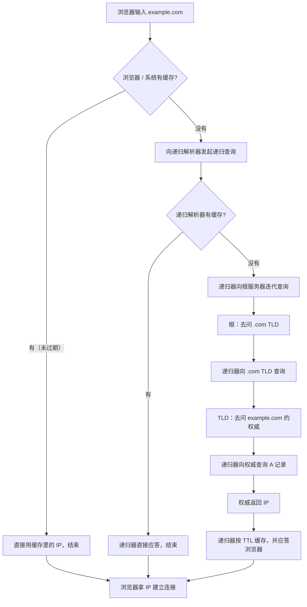

# 第1章 域名与 DNS 原理——从「电话簿」到一次完整解析

在浏览器地址栏敲下 `example.com`，按回车，网页出现。看起来一步到位，背后其实是一场横跨全球的「接力问路」——你的电脑并不认识 `example.com`，它只认一串数字：**IP 地址**。域名到 IP 的翻译工作，由一个庞大而精密的系统完成，它叫 **DNS**。

这一章把这套系统从头拆到尾，回答一个问题：**一个域名到底是怎么变成一个 IP、又是怎么被你的设备拿到的？** 你会看到域名的层级结构、DNS 四类服务器的接力关系、TTL 与缓存的真实行为、常见记录类型，以及两个绕不开的经典坑。最后我们用 `dig` 亲手看一次真实解析，并用一节浅览中文域名（IDN）。

本章是全书地基：第 2 章选域名、第 3 章备案、第 4 章配解析、第 5 到 7 章把域名接上服务，全部建立在你对「解析链路」的理解之上。

## 1.1 域名是什么与层级

域名是一串**点分标号（label）**序列。看 `www.aliyun.com`：它由 `www`、`aliyun`、`com` 三个标号组成，中间用点分隔，读的时候**从右往左范围逐级收窄**[^c1-4]：

```text
www . aliyun . com
 │      │      └── 顶级域 TLD（Top-Level Domain）
 │      └───────── 二级域名：主域 / apex（裸域）
 └──────────────── 三级域名：子域（subdomain）
```

- `.com` 是**顶级域（TLD）**；
- `aliyun.com` 是**二级域名**，也是我们常说的**主域 / 裸域（apex）**——这是你在注册商那里买到并每年续费的那个名字；
- `www.aliyun.com` 是**三级域名 / 子域**。`www` 没有任何特殊地位，它本质只是一个约定俗成的子域名[^c1-4][^c1-3]。

在域名这棵树上，最顶端还有一个看不见的**根（root）**，写作一个尾点 `.`。一个「完整合格域名（FQDN）」理论上以这个点结尾，例如 `www.aliyun.com.`。日常输入时尾点被省略，但 DNS 内部始终按带根的结构处理。所以更完整的层级是：

```text
.（根）→ .com（TLD）→ aliyun.com（主域）→ www.aliyun.com（子域）
```

这套层级最重要的设计意图是**委托（delegation）**：没有任何一台服务器需要知道全世界的域名。每一层只负责告诉你「下一层去问谁」——`.com` 之下有哪些主域，由管理 `.com` 的服务器来回答；`aliyun.com` 之下有哪些子域，则由 `aliyun.com` 的权威服务器来回答。逐级下查，最高层是根[^c1-4]。

> [!tip] 大白话：域名层级像「写快递地址，但从大到小排」
> 把域名想成快递地址的倒写版：`.com` 像「中国」（一个大的分类），`aliyun` 像「杭州某某园区某栋楼」（主域，你租下的那间房），`www` 像「这栋楼里的前台 3 号窗口」（子域）。DNS 的派送逻辑是：先按「中国」找到片区，再按「园区」找到楼，最后按「窗口」找到人。所以「买域名」买的是主域这间「房」；之后你在房里怎么隔间（加子域），完全由你说了算。

## 1.2 DNS 是什么

**DNS（Domain Name System，域名系统）** 是一套把「人类好记的域名」翻译成「机器好找的 IP」的**分布式数据库**——常用比喻是「电话簿」：你记不住朋友的电话号码（IP），但记得住名字（域名），查一下电话簿就行。区别在于，这本电话簿不是一本，而是由无数台服务器协同组成、按 1.1 的层级委托关系组织起来的[^c1-2]。DNS 协议默认走 **UDP 53** 端口，数据较大或出错时回退到 **TCP 53**[^c1-2]。

理解 DNS，先分清两组**角色**划分[^c1-2][^c1-4]：

1. **按服务范围分：公网 DNS 与内网 DNS。**
   - 公网 DNS 服务全球互联网上「公开」的域名，是人人可查的那一套。
   - 内网 DNS 跑在公司或家庭局域网里，负责解析 `nas.local`、`pi.hole` 这类只在内网有意义的主机名。你以后自建服务时，很可能会同时接触这两套。
2. **按职能分：权威（authoritative）与递归（recursive）。**
   - **权威域名服务器**持有一份或多份区域的「原始档案」，是某域名记录**最终的事实源**。比如 `aliyun.com` 的权威服务器，才真正「有权」回答 `www.aliyun.com` 指向哪个 IP。权威服务器位于解析链路的末端[^c1-2][^c1-4]。
   - **递归解析器（recursive resolver）**站在客户端这一侧，替你去问：它在查询链的起点帮你「代查到底」，并把结果缓存下来供后续复用。你的电脑通常不会直接问权威服务器，而是把问题交给一个递归解析器——它可能是运营商（ISP）提供的，也可能是你手动配置的公共解析器（如 `1.1.1.1`、`8.8.8.8`）[^c1-2]。

> [!tip] 大白话：DNS 是那本自动更新的电话簿
> 把 DNS 想成**电话簿**：没有它，你要上网就得记每个网站的一串数字 IP，就像背下所有朋友的手机号，根本记不住。DNS 这本「电话簿」还能自动更新——网站换了 IP，改一次记录，全世界按新号码打。你只需要记 `example.com` 这个「名字」，剩下的查号、转接，DNS 帮你干完。

**为什么不用 IP 直接访问？** 一是人记不住、容易错；二是 IP 可能经常变（尤其自建服务 + 动态 IP），而域名这个「名字」可以保持稳定，指向关系随时可改。域名把「名字」与「地址」解耦——这正是你后续做解析托管、CDN、HTTPS 时反复利用的性质。

DNS 本身还有安全与隐私的加强机制，例如防伪造的 **DNSSEC**、加密 DNS 请求的 **DoH/DoT**。本章先不做展开，第 4 章谈域名安全基线时会用到[^c1-4]。

## 1.3 一次未缓存的解析：四类服务器与典型八步

要理解解析，先分清三种**查询方式**[^c1-2]：

- **递归查询**：你要求对方「代查到底，给我最终答案」。客户端 → 递归解析器，就是递归查询。
- **迭代查询**：对方不替你跑腿，只告诉你「下一步去问谁」。递归解析器 → 根/TLD/权威，都是迭代查询。
- **非递归查询**：对方缓存里正好有答案，或它自己就是权威，直接应答，不用再往别处问。

一次**完全没有缓存**的解析，会依次惊动四类服务器：**递归解析器 → 根服务器 → TLD 服务器 → 权威服务器**，教科书常把这条链路拆成典型的 8 步[^c1-2]。以访问 `example.com` 为例：

1. 浏览器发现本地没有 `example.com` 的缓存，向配置好的**递归解析器**发起一次递归查询：「example.com 的 IP 是多少？」
2. 递归解析器自己也没有缓存，只好从最顶层开始问：向一台**根服务器**发起迭代查询。
3. 根服务器不存主机记录，但它知道 `.com` 由谁管，于是把 **`.com` TLD 服务器**的地址告诉递归解析器。
4. 递归解析器转问 `.com` TLD 服务器：「你知道 example.com 吗？」
5. `.com` TLD 服务器也不知道 `example.com` 的 A 记录，但它保存着 `example.com` 的 NS 记录——也就是**权威服务器是谁**，于是把权威服务器地址返回。
6. 递归解析器向 `example.com` 的**权威服务器**请求 A 记录。
7. 权威服务器在自己的区域档案里查到答案，把 IP 返回给递归解析器。
8. 递归解析器把 IP 原路返回给浏览器，并按这条记录的 **TTL** 在本地缓存一份，供下次直接使用[^c1-2][^c1-4]。

注意第 3、5 步的关键：**中间每一层给的都不是最终答案，而是「下一站去问谁」**。上层服务器只存下一级服务器的地址，逐级下查，最高层是根[^c1-4]。这种「委托」设计让 DNS 不需要任何中央总机——每台服务器只需管理自己那一小片。

### 未缓存 vs 缓存命中：同一机制的两个状态

很多人困惑「网上说先查根服务器，可我的解析看起来一瞬间就完成了」——这两句话都没错，区别只在于**有没有缓存**。下面这张流程图把两条路径并排画出来：缓存命中就跳步，未缓存才走完整条委托链[^c1-2]：



缓存的层级不止浏览器一层。**浏览器 → 操作系统 → 递归解析器**会逐级缓存查询结果，每一级都可能让下一次查询「提前结束」[^c1-2]。所以第 4 章排障时会反复提醒你：先分清你看到的是「某一层缓存里的旧答案」还是「真没生效」。

> [!tip] 大白话：递归解析器是你的私人秘书
> 把递归解析器想成**一个帮你跑腿的秘书**。你只说一句「帮我查 example.com 在哪」，秘书就替你跑遍各部门（根、TLD、权威），最后把地址告诉你，还在自己桌上留了张便签（缓存），下次你再问同一个名字，她翻便签秒回，不用再跑一趟。而「迭代」则是另一种风格：别人不帮你跑，只告诉你「这事儿你该去问 A，A 会告诉你问 B」——路要你自己走，秘书帮你全走完。

**一个补充**：如果查的是一个子域（如 `www.example.com`），权威服务器可能不会直接给 IP，而是返回一条 **CNAME** 指向另一个域名，这时解析器还得再去问那个域名的权威服务器，链路上会多一跳。这个细节在以后配置 CDN、给服务加域名时非常常见，1.5 节会专门讲 CNAME[^c1-2]。

## 1.4 TTL、各级缓存与「DNS 传播」真相

### TTL：这条记录能在缓存里活多久

**每一条 DNS 记录都带一个 TTL（Time To Live，生存时间）**，它表示「这条记录可以在缓存里保留/被复用的秒数」——本质上是一个**缓存刷新间隔**：到期后缓存作废，下次查询必须重新向上游确认[^c1-1][^c1-4]。

TTL 的取值是一把双刃剑：

- **TTL 越小**，缓存的答案越快过期，你改记录后全世界「看到新值」越快，但代价是每个缓存都更频繁地回源查询，权威服务器压力更大；
- **TTL 越大**，缓存复用率高、查询次数少，但你改了解析后，旧值会在各级缓存里赖得更久[^c1-1][^c1-4]。

> [!tip] 大白话：TTL 是牛奶的保质期
> 把 TTL 想成**牛奶保质期**。递归解析器拿到一条记录就像拿到一盒牛奶，保质期内（TTL 未到）直接喝（直接用缓存），过了保质期就扔掉、重新去超市进货（回源查询）。所以 TTL 设得短，改了解析大家很快喝到「新牛奶」；设得长，旧牛奶在很多人冰箱里放得久——这就是「改解析要等」的根源。

### 「DNS 传播」不是传播，是各缓存各自过期

你可能听过「DNS 传播需要时间」。这个说法容易误导。**DNS 传播并不是一个「新记录像水波一样扩散到全球」的过程**——权威服务器的记录是**即时**更新的，真正需要时间的是：全球无数个缓存（浏览器、操作系统、运营商递归器……）各自按自己的 TTL **逐批过期**，过期后才重新向上游拿到新值[^c1-5]。所以：

- 改完解析后的同一时刻，**不同地区、不同网络的人看到新旧不一**是常态——他们的缓存剩余寿命不同；
- 生效快慢受多个因素影响：记录自身的 **TTL**、各级缓存是否遵守 TTL（个别 ISP 缓存会忽略 TTL 强留旧值）、根/TLD 层面的更新节奏等；
- 给一个通用的经验值：通常**数小时到数天**内全球陆续生效[^c1-5]。

> [!warning] 易错点：「秒级生效」多为商业宣传
> 一些解析服务商宣称「解析秒级生效」，这类说法多带商业立场（例如厂商自家产品卖点），**并不等于互联网上所有缓存都会秒级更新**。更准确的心智模型是：**权威侧的变化是即时的，公网侧的可见性取决于 TTL 与各级缓存的过期节奏**。第 4 章动手改解析时，我们会用这个模型去判断「到底生效了没有」[^c1-5]。

**给你的实操含义**：如果你计划改解析（比如切换服务器、换 CDN），**最好提前把 TTL 调低（例如 60 秒）**，等一段时间让旧值在各级缓存里先过期，再真正动手改——这样新记录能快速铺开，而不是被旧 TTL 拖住[^c1-4]。

你还可以亲手查看浏览器这一层的 DNS 缓存：Chrome 地址栏打开 `chrome://net-internals/#dns` 即可看到浏览器缓存了哪些域名[^c1-2]。第 4 章排障时，「清浏览器缓存 / 等 TTL 过期」会是第一件要检查的事。

## 1.5 记录类型速查表与两个经典坑

域名真正「干活」靠的是挂在它名下的各种**DNS 记录**。下表是入门最常用的十种[^c1-1][^c1-4]：

| 记录类型 | 作用（一句话） | 常见用途 |
|---|---|---|
| **A** | 把域名指向一个 **IPv4** 地址 | 网站服务器、API 指向 |
| **AAAA** | 把域名指向一个 **IPv6** 地址 | 同上，IPv6 环境 |
| **CNAME** | 把域名**别名**转发到另一个域名（本身不给 IP） | `www` 指向主域、指向 CDN 厂商域名 |
| **MX** | 指定该域名的**邮件接收服务器** | 收信路由（常配多个，带优先级） |
| **TXT** | 任意文本，机器可读 | SPF 反垃圾、域名所有权/SSL 验证 |
| **NS** | 声明该域由哪些**权威域名服务器**托管 | 决定「谁说了算」，切解析托管时改它 |
| **SOA** | 该域管理信息的「起始授权记录」 | 记录主权威服务器、刷新策略等 |
| **SRV** | 定位「某服务跑在哪台机器 + 哪个端口」 | 游戏/聊天/办公类服务发现 |
| **PTR** | 反向查询：IP → 域名 | 反垃圾邮件、日志溯源（与 A 相反方向） |
| **CAA** | 声明**允许哪些 CA 机构**为该域签发证书 | HTTPS 证书策略，可被子域继承 |

> [!note] 细节：TXT 的长度上限
> TXT 记录在协议层单条字符串上限为 255 字节，需要更长时可**拼接多条字符串**。部分服务商控制台把单条 TXT 的录入上限设成 512 字符，这是「产品录入上限」而非协议限制——两者语境不同，别混为一谈[^c1-4]。这条在以后做证书 DNS-01 验证、SPF 时可能踩到。

### 坑一：CNAME 不能用于根域（apex）

先理解 CNAME 的本质：A 记录直接给你 IP，而 **CNAME 不提供 IP**，它只说「我是某某的别名，你去问那个名字」。因此一条 CNAME 记录的生效，依赖它指向的那个名字最终解析出 IP[^c1-1]。

麻烦在于：DNS 规则规定 **CNAME 不能与其它记录共存**——一旦某名字是 CNAME，它就只能是「别名」，不能再有 A/AAAA/MX/TXT 等其它记录。而**根域（apex，裸主域，如 `example.com`）天然必须存在 NS、SOA 等记录**，所以根域上放不了 CNAME[^c1-1][^c1-4]。

> [!tip] 大白话：CNAME 是店门口贴的「搬家纸条」
> 把 CNAME 想成店门口贴的一张纸条：「本店已搬到隔壁 xxx」——它不告诉你具体门牌号，只告诉你**去哪家再问**。问题是这张纸条只能贴在「租来的店面」上，而根域（`example.com` 本身）是「整栋楼的物业处」，物业处必须挂着各种正式招牌（NS/SOA），没地方再贴搬家纸条。所以想让根域也享受「别名转发」的效果，得用服务商提供的 **ALIAS / ANAME** 这类特殊记录：它们在权威侧帮你把目标「摊平」成 A/AAAA 再返回，根域因此能用[^c1-1][^c1-4]。

### 坑二：主机记录 `@` 与泛解析 `*`

在解析服务商的控制台里加记录时，会让你填「主机记录」（也叫主机名）。几个特殊写法要知道[^c1-4]：

- **`@` = 主域本身**。比如在 `example.com` 的解析里，主机记录填 `@`，就是给 `example.com` 这个裸域配记录（通常配 A/AAAA 指到服务器，或用 ALIAS 指向 CDN）。
- **`www` = 子域 `www.example.com`**，其它子域同理，填什么就是什么子域。
- **`*` = 泛解析（wildcard）**：匹配**所有没有单独定义**的子域。例如填一条 `*` 的 A 记录，那么 `foo.example.com`、`anything.example.com` 都会得到同一个答案。

泛解析看起来省事——一条记录覆盖所有子域，但**别拿它当兜底**。原因是它把「没配置的子域」也变成了「有答案」，这会带来一串麻烦：你想排查某个子域怎么解析到错误 IP 时，它把「漏配」掩盖了；本应返回「查无此域（NXDOMAIN）」的名字全被接住，而不少安全/校验机制恰恰依赖 NXDOMAIN 来判断「这个子域不该存在」[^c1-4]。

> [!warning] 易错点：`@` 与 `*` 别写错
> 给主域加记录却把主机记录留空或填错成 `www`，会导致「裸域打不开、www 能开」；反过来把本意是「只给主域」的记录填成 `*`，则会把所有子域一并接管。加记录前先在心里念一遍：「我这行是给谁配的——`@` 主域、`www`、还是全子域 `*`？」这是 DNS 控制台里最常见的低级事故来源。

## 1.6 用 dig 看一次真实解析

概念讲完，动手看实物。`dig` 是 Linux/macOS 上自带的 DNS 查询工具（没有的话可用 `apt install dnsutils` / `brew install bind` 安装；Windows 用 `nslookup`，命令见本节末尾）。它的好处是把一次 DNS 查询的来龙去脉**开箱给你看**[^c1-6]。

下面命令都可直接执行：

```bash
# 默认查 A 记录（IPv4）
dig example.com

# 只看答案，省略花括号与统计
dig example.com +short

# 查指定记录类型
dig example.com MX
dig example.com NS

# 指定用某个递归解析器（绕过本机/ISP 默认设置）
dig @1.1.1.1 example.com

# 从根开始走完整条「根 → TLD → 权威」委托链
dig +trace example.com
```

`dig example.com` 的输出类似下面（**数值为示意**，用文档保留网段 `192.0.2.1` 代替真实 IP；实际查询会得到真实地址）：

```text
; <<>> DiG 9.10.6 <<>> example.com
;; ->>HEADER<<- opcode: QUERY, status: NOERROR, id: 12345
;; flags: qr rd ra; QUERY: 1, ANSWER: 1, AUTHORITY: 0, ADDITIONAL: 1

;; ANSWER SECTION:
example.com.		3600	IN	A	192.0.2.1

;; Query time: 23 msec
```

重点看两处：

- **`status: NOERROR`** 是本次查询的结果码（RCODE），含义见下表[^c1-6]：

| RCODE | 含义 |
|---|---|
| `NOERROR` | 正常，有答案（即使答案为空也可能返回它） |
| `NXDOMAIN` | 域名**不存在**（拼错 / 真的没注册 / 记录没配） |
| `SERVFAIL` | 上游或权威服务器**故障**，解析器无法拿到有效回答 |
| `REFUSED` | 服务器**拒绝**服务（例如该递归器不允许你的递归请求） |

- **`ANSWER SECTION`** 是真正的答案：`example.com.` 这条 A 记录，`3600` 是它的 TTL（秒），`192.0.2.1` 是对应的 IP。

`dig +trace example.com` 会一口气展示委托链的每一跳：根服务器怎么把 `.com` 指给 TLD，`.com` 怎么把 `example.com` 指给它的权威服务器，最后权威返回 A 记录。输出较长，但结构就是 1.3 节那 8 步的「实况录像」，值得完整看一次（示意骨架）[^c1-6]：

```text
; <<>> DiG 9.10.6 <<>> +trace example.com
.			518400	IN	NS	a.root-servers.net.       ← 根
com.			172800	IN	NS	a.gtld-servers.net.      ← .com TLD
example.com.		172800	IN	NS	a.iana-servers.net.      ← 权威
example.com.		3600	IN	A	192.0.2.1                 ← 最终答案
```

### 改了解析为什么还没生效？用 dig 三步定位

这是 DNS 排障最实用的一招，思路是「拿一个新递归器和默认递归器对比」[^c1-6]：

```bash
# 1. 默认解析（走本机/ISP 配置的递归器）
dig yourdomain.com

# 2. 指定一个公共递归器（通常是新的）
dig @1.1.1.1 yourdomain.com
```

判断逻辑：

- 如果 **`@1.1.1.1` 已是新值，而默认还是旧值** → 说明权威端已生效，你看到的旧值是**本机 / 运营商缓存的旧记录还没过期**（等 TTL，或刷新本地缓存，Chrome 可看 `chrome://net-internals/#dns`）[^c1-2][^c1-6]；
- 如果**两边都还是旧值** → 大概率**权威端真的还没生效**，检查是不是改错了托管方、记录没保存、或改的域名不是同一个；
- 想绕过所有递归缓存看「最终事实」，可以直接问权威服务器：`dig +trace yourdomain.com` 找到它的 NS，再 `dig @<权威服务器> yourdomain.com`[^c1-6]。

```bash
# 直接问权威服务器，绕过递归缓存（把权威换成 +trace 输出的 NS）
dig @a.iana-servers.net example.com
```

> [!example] Windows 对照命令
> Windows 没有 `dig`，用 `nslookup` 做同样的查询：`nslookup example.com`（默认查 A）、`nslookup -type=MX example.com`（查 MX）、`nslookup example.com 8.8.8.8`（指定递归器）[^c1-6]。

## 1.7 IDN / 中文域名简介

最后浅看一类特殊的域名。DNS 底层只认 **ASCII** 字符（字母、数字、连字符），中文等本地文字不能直接出现在 DNS 报文里。**国际化域名（IDN）** 的目标，就是让用户能用本地文字（如中文）注册和访问域名。做法是：浏览器和注册系统在背后自动把本地文字转成一种以 `xn--` 开头的 ASCII 编码，称为 **A-label / Punycode**——真正在 DNS 里传输和存储的，仍是 ASCII[^c1-3]。也就是说，你看到的是「中文.中国」，DNS 世界里它长成 `xn--…` 的样子。

IDN 不是小打小闹：截至 2021 年，已有 37 种语言、23 种文字、154 个 IDN 顶级域被纳入根区；IDN 注册量约 830 万个，其中 77% 落在国家/地区顶级域（ccTLD）之下[^c1-3]。

但 IDN 的现实障碍不在技术编码，而在**「通用接受（Universal Acceptance, UA）」**：软件、邮箱系统、表单校验等必须能正确处理非 ASCII 的域名和邮箱地址，否则就会出现「域名能注册、却在很多地方用不起来」的尴尬[^c1-3]。

> [!note] 开放问题
> Punycode 的具体编码规则，以及利用形近字（如拉丁字母与西里尔字母同形）的**同形攻击**风险，超出了本章范围，本笔记不做展开——若你以后要正经用中文域名，建议另行补一篇技术源，把「显示层长得像、底层编码完全不同」的安全含义搞清。

## 本章小结

> [!summary] 关键 takeaways
> - **域名是点分层级**：`.` 根 → `.com` TLD → `aliyun.com` 主域/apex → `www.aliyun.com` 子域，从右往左范围逐级收窄。
> - **DNS 是分布式电话簿**：权威服务器持「原始档案」（最终事实源），递归解析器替你代查并缓存；中间各层只告诉下一站去问谁，没有中央总机。
> - **一次未缓存解析走四类服务器**：递归解析器 → 根 → TLD → 权威（典型 8 步）；有缓存就跳步——「先查根」和「秒回」是同一机制的两个状态。
> - **TTL 是缓存的保质期**：TTL 越小生效越快、查询越频繁；「DNS 传播」实为各级缓存按 TTL 各自过期，通用经验值是数小时到数天，「秒级生效」多为商业宣传。
> - **两个经典坑**：CNAME 不能放根域/apex（根域要别名效果用 ALIAS/ANAME）；主机记录 `@` 指主域、`*` 是泛解析，别拿泛解析兜底。
> - **排障用 dig**：`dig @1.1.1.1` 与默认对比判断「本地缓存旧」还是「真没生效」，`dig +trace` 看委托链，RCODE 分 NOERROR/NXDOMAIN/SERVFAIL/REFUSED。

下一章进入「花钱」环节：不同后缀首年价格为何那么便宜、续费为何大涨，注册商到底替你管什么——你会带着本章的层级与 TTL 心智，去选第一个真正属于你的域名。

---

[^c1-1]: A1 · DNS records（Cloudflare Learning）· https://www.cloudflare.com/learning/dns/dns-records/
[^c1-2]: A2 · What is DNS?（Cloudflare Learning）· https://www.cloudflare.com/learning/dns/what-is-dns/
[^c1-3]: A3 · Enabling IDNs（ICANN Blog，2021-06）· https://www.icann.org/en/blogs/details/hello-world-enabling-internationalized-domain-names-idns-16-6-2021-en
[^c1-4]: A4 · DNS 基本概念（阿里云云解析）· https://help.aliyun.com/zh/dns/basic-concepts-dns2-0
[^c1-5]: A5 · 什么是 DNS 传播？（IBM Think）· https://www.ibm.com/cn-zh/think/topics/dns-propagation
[^c1-6]: A6 · DNS 排障工具 dig/nslookup/host（Red Hat）· https://www.redhat.com/en/blog/DNS-name-resolution-troubleshooting-tools
