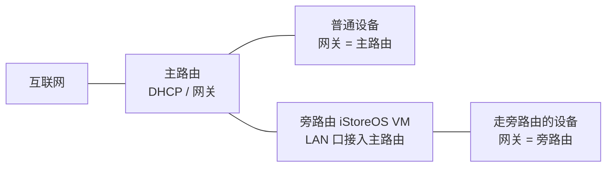

## 第 1 章 认识 iStoreOS 与旁路由方案选型

动手安装之前，先花几分钟弄清三件事：iStoreOS 是什么、本教程要用的「旁路由」拓扑长什么样、官方给了哪几种接入方案以及我们选哪条安装路线。本章不碰任何命令，只讲概念与选型。

### 1.1 iStoreOS 是什么

iStoreOS 是基于 **OpenWrt 深度优化**的开源智能路由系统，保留 OpenWrt 的灵活性，同时简化了交互、增强了稳定性 [iStoreOS 官网介绍](https://site.istoreos.com/about)。它内置 **iStore 软件中心**，可以一键安装应用，并且支持 **Docker**（Jellyfin/Emby、HomeAssistant 等都能跑）。全开源、多硬件适配、安全沙箱，是它区别于其他固件的三个关键词 [iStoreOS 官网介绍](https://site.istoreos.com/about)。

> [!tip] 大白话
> 把 OpenWrt 想成一套「毛坯房」：功能齐全但都要自己装修。iStoreOS 是它的「精装修」版——内置应用商店（iStore 软件中心），常见插件点一下就能装，上手门槛低很多。所以选它做软路由，折腾成本更低。

### 1.2 软路由 / 旁路由：本教程的拓扑

**旁路由**的定义很关键：一台额外的路由设备通过 **LAN 口接入主路由**，分担特定网络任务，它**不直接连接互联网**，也**不改变主网络的拓扑与 IP 段** [iStoreOS 旁路由实践](https://doc.istoreos.com/zh/guide/istoreos/practice/BypassRouter.html)。数据流靠**网关设置**来引导：手动把某台设备的网关指向旁路由，或由 DHCP 分配。

本教程的既定前提是：**你已有一台独立主路由**。飞牛 fnOS 里的 iStoreOS 虚拟机以「旁路由」身份接入它，普通设备照常走主路由，只有想「过一下」旁路由的设备才把网关指向它。拓扑示意如下：

> [!tip] 大白话
> 把主路由想成小区大门，旁路由想成楼里的「值班管家」。大门该走的车还走大门；只有你点名「请管家代收」的东西，才会先送到管家那儿。旁路由不动你家的门牌号（IP 段），只是多了一个可选的转发点。

### 1.3 旁路由的三种官方方案概览

官方把「如何更好地使用旁路由」整理成三种方案 [iStoreOS 旁路由实践](https://doc.istoreos.com/zh/guide/istoreos/practice/BypassRouter.html)：

| 方案 | 主路由 | 旁路由 | 优点 |
|------|--------|--------|------|
| 手动静态 IP | 任意路由，默认开 DHCP | iStoreOS **关 DHCP** | 最简单，适合新手 |
| 旁路由 DHCP 接管 | 任意路由，**关 DHCP**、网关设旁路由 | iStoreOS **开 DHCP** 全面接管 | 适应性最广 |
| (华硕)浮动网关 | 华硕 ASUSGO 固件 | iStoreOS + 浮动网关插件 | 自动切换 |

因为本教程以「已有独立主路由」为前提，后续只展开前两种，第三种仅在进阶时提及。

> [!warning] 铁律预告
> 一个局域网**不能同时存在两个 DHCP**（DHCP 是负责分配 IP 的「发号员」）[iStoreOS 网络问题排查](https://doc.istoreos.com/zh/guide/istoreos/question/about_network.html)。谁开谁关，是后面配置旁路由时的核心判断，先记住这条铁律。

### 1.4 两条安装路线选型

在飞牛上装 iStoreOS，本教程介绍两条经过验证的路线：

- **方法 A（推荐新手）**：直接在 fnOS 虚拟机 UI 里导入 img 镜像，走 quickstart 初始化、网络向导配旁路由，依赖 fnOS 虚拟机 v0.9.0+ 的 img 直导支持 [飞牛论坛精华帖](https://club.fnnas.com/forum.php?mod=viewthread&tid=26481)。
- **方法 B（偏进阶备选）**：用官方预制 `fnOS_temp.iso` 引导虚拟机，再通过 SSH 用 `virsh attach-disk` 挂载 efi 镜像，适用于方法 A 引导失败、或想用 UEFI/efi 固件做精确控制的场景 [CSDN 教程](https://blog.csdn.net/u013262414/article/details/155347617)。

> [!tip] 大白话
> 方法 A 像「插 U 盘装系统」，图形界面点几下就好；方法 B 像「用命令行手工挂载」，更灵活但要会 SSH。新手先走 A，A 走不通再回头用 B，两条路通向同一个旁路由终点。

### 本章小结

- iStoreOS 是基于 OpenWrt 的「精装修」开源智能路由系统，内置软件中心、支持 Docker。
- 旁路由通过 LAN 口接入主路由，不直连互联网、不改 IP 段，靠网关设置引导数据流。
- 官方旁路由三种方案中，本教程按「已有独立主路由」前提只展开前两种。
- 安装路线：新手走方法 A（UI 直导 img），进阶或 A 失败再走方法 B（temp ISO + virsh）。
- 铁律：一个局域网不能同时存在两个 DHCP。
