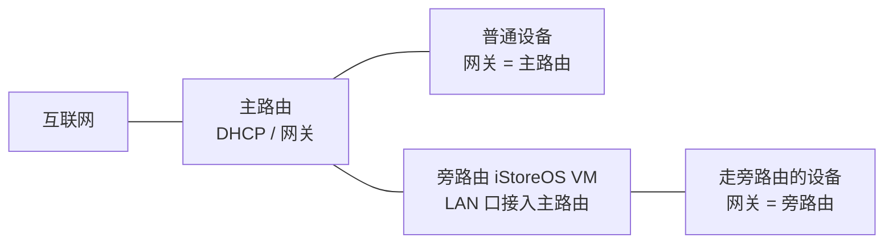

# 飞牛上安装配置 iStoreOS（软路由）

> 一句话定位：以「已有独立主路由」为拓扑前提，手把手教你在飞牛 fnOS 虚拟机上用方法 A（UI 直导 img）安装 iStoreOS 并配置成旁路由接入现有网络，进阶只覆盖科学上网/插件，另附方法 B 备选与常见排错。

## 目录

1. 第 1 章 认识 iStoreOS 与旁路由方案选型
2. 第 2 章 前置准备
3. 第 3 章 方法 A：用 UI 直导 img 创建虚拟机（主流程）
4. 第 4 章 初始化 iStoreOS 并访问后台
5. 第 5 章 备选方案：方法 B（temp ISO + SSH virsh）
6. 第 6 章 配置旁路由接入现有主路由（核心）
7. 第 7 章 进阶：科学上网与插件
8. 第 8 章 常见问题排查

---

## 第 1 章 认识 iStoreOS 与旁路由方案选型

动手安装之前，先花几分钟弄清三件事：iStoreOS 是什么、本教程要用的「旁路由」拓扑长什么样、官方给了哪几种接入方案以及我们选哪条安装路线。本章不碰任何命令，只讲概念与选型。

### 1.1 iStoreOS 是什么

iStoreOS 是基于 **OpenWrt 深度优化**的开源智能路由系统，保留 OpenWrt 的灵活性，同时简化了交互、增强了稳定性 [iStoreOS 官网介绍](https://site.istoreos.com/about)。它内置 **iStore 软件中心**，可以一键安装应用，并且支持 **Docker**（Jellyfin/Emby、HomeAssistant 等都能跑）。全开源、多硬件适配、安全沙箱，是它区别于其他固件的三个关键词 [iStoreOS 官网介绍](https://site.istoreos.com/about)。

> [!tip] 大白话
> 把 OpenWrt 想成一套「毛坯房」：功能齐全但都要自己装修。iStoreOS 是它的「精装修」版——内置应用商店（iStore 软件中心），常见插件点一下就能装，上手门槛低很多。所以选它做软路由，折腾成本更低。

### 1.2 软路由 / 旁路由：本教程的拓扑

**旁路由**的定义很关键：一台额外的路由设备通过 **LAN 口接入主路由**，分担特定网络任务，它**不直接连接互联网**，也**不改变主网络的拓扑与 IP 段** [iStoreOS 旁路由实践](https://doc.istoreos.com/zh/guide/istoreos/practice/BypassRouter.html)。数据流靠**网关设置**来引导：手动把某台设备的网关指向旁路由，或由 DHCP 分配。

本教程的既定前提是：**你已有一台独立主路由**。飞牛 fnOS 里的 iStoreOS 虚拟机以「旁路由」身份接入它，普通设备照常走主路由，只有想「过一下」旁路由的设备才把网关指向它。拓扑示意如下：



> [!tip] 大白话
> 把主路由想成小区大门，旁路由想成楼里的「值班管家」。大门该走的车还走大门；只有你点名「请管家代收」的东西，才会先送到管家那儿。旁路由不动你家的门牌号（IP 段），只是多了一个可选的转发点。

### 1.3 旁路由的三种官方方案概览

官方把「如何更好地使用旁路由」整理成三种方案 [iStoreOS 旁路由实践](https://doc.istoreos.com/zh/guide/istoreos/practice/BypassRouter.html)：

| 方案 | 主路由 | 旁路由 | 优点 |
|------|--------|--------|------|
| 手动静态 IP | 任意路由，默认开 DHCP | iStoreOS **关 DHCP** | 最简单，适合新手 |
| 旁路由 DHCP 接管 | 任意路由，**关 DHCP**、网关设旁路由 | iStoreOS **开 DHCP** 全面接管 | 适应性最广 |
| (华硕)浮动网关 | 华硕 ASUSGO 固件 | iStoreOS + 浮动网关插件 | 自动切换 |

因为本教程以「已有独立主路由」为前提，后续只展开前两种，第三种仅在进阶时提及。

> [!warning] 铁律预告
> 一个局域网**不能同时存在两个 DHCP**（DHCP 是负责分配 IP 的「发号员」）[iStoreOS 网络问题排查](https://doc.istoreos.com/zh/guide/istoreos/question/about_network.html)。谁开谁关，是后面配置旁路由时的核心判断，先记住这条铁律。

### 1.4 两条安装路线选型

在飞牛上装 iStoreOS，本教程介绍两条经过验证的路线：

- **方法 A（推荐新手）**：直接在 fnOS 虚拟机 UI 里导入 img 镜像，走 quickstart 初始化、网络向导配旁路由，依赖 fnOS 虚拟机 v0.9.0+ 的 img 直导支持 [飞牛论坛精华帖](https://club.fnnas.com/forum.php?mod=viewthread&tid=26481)。
- **方法 B（偏进阶备选）**：用官方预制 `fnOS_temp.iso` 引导虚拟机，再通过 SSH 用 `virsh attach-disk` 挂载 efi 镜像，适用于方法 A 引导失败、或想用 UEFI/efi 固件做精确控制的场景 [CSDN 教程](https://blog.csdn.net/u013262414/article/details/155347617)。

> [!tip] 大白话
> 方法 A 像「插 U 盘装系统」，图形界面点几下就好；方法 B 像「用命令行手工挂载」，更灵活但要会 SSH。新手先走 A，A 走不通再回头用 B，两条路通向同一个旁路由终点。

### 本章小结

- iStoreOS 是基于 OpenWrt 的「精装修」开源智能路由系统，内置软件中心、支持 Docker。
- 旁路由通过 LAN 口接入主路由，不直连互联网、不改 IP 段，靠网关设置引导数据流。
- 官方旁路由三种方案中，本教程按「已有独立主路由」前提只展开前两种。
- 安装路线：新手走方法 A（UI 直导 img），进阶或 A 失败再走方法 B（temp ISO + virsh）。
- 铁律：一个局域网不能同时存在两个 DHCP。

概念与选型清楚了，接下来把开工需要的硬件、固件和虚拟化环境备齐。

---

## 第 2 章 前置准备

动手创建虚拟机之前，先把「硬件、固件、虚拟化环境」三样东西备齐。这一章相当于开工前的工具箱检查：清单不多，但每一项都卡着后面的步骤，漏掉一个就可能半路折返。

### 2.1 准备清单总览

按本教程（方法 A 为主、方法 B 备选）需要准备：

- 一台已安装飞牛 fnOS 的 x86 设备，网络连接使用**有线网口或聚合网口**（无线网口不支持 OVS，见 2.3）[飞牛官方帮助中心](https://help.fnnas.com/articles/v1/virtual-machine/install)。
- 一台**已有独立主路由**：旁路由拓扑以它作为上游网络，后续配置旁路由时需按其方案调整它的 DHCP / 网关。
- 一台能上网的电脑和**浏览器**：用于访问 iStoreOS 后台。
- **压缩/解压工具**：把固件 `img.gz` 解压成 `img`。
- **SSH 客户端**：方法 B 需要（Windows 自带命令行即可），并在飞牛 fnOS 系统设置中开启 SSH。

> [!tip] 大白话 OVS
> 把 OVS 想成「虚拟总机」：虚拟机数据包的进出、虚拟机之间的互通，都由它统一转发。启用后虚拟机才拿到属于自己的隔离虚拟网络；它只有线网口和聚合网口支持，无线网口不行（S1）。

### 2.2 下载 iStoreOS x86_64 固件

进入官方固件仓库目录 [fw.koolcenter.com/iStoreOS/x86_64/](https://fw.koolcenter.com/iStoreOS/x86_64/)（S6），文件名遵循统一规律：

```text
istoreos-{版本}-{日期}-x86-64-squashfs-combined.img.gz
```

例如 `istoreos-24.10.8-2026073111-x86-64-squashfs-combined.img.gz`（约 230 MiB）。目录里越靠前越新，**选中间日期最新的一个**（S3, S6）。

- **方法 A**：下载 `squashfs-combined.img.gz` 即可。
- **方法 B**：需要 `x86_64_efi` 目录下的 `-efi.img.gz`，外加预制引导包 `fnOS_temp.iso`，两者都上传到飞牛并记下存放目录路径（S9）。

> [!tip] 大白话 squashfs-combined
> 把 `combined` 想成「系统 + 引导二合一」的整包：既装了系统本体，又带启动引导，导入后虚拟机才能直接开机。所以方法 A 选它最省事。

### 2.3 安装并准备 fnOS 虚拟机环境

1. **安装虚拟机应用**：管理员账号登录，打开**应用中心**，找到**虚拟机**点击安装；完成后桌面出现图标（S1, S8）。
2. **启用 OVS**：打开**系统设置 → 网络管理**，在对应网络连接的更多按钮中点击「启用 OVS」（S1）。
3. **开启硬件虚拟化**：重启进 BIOS/UEFI（常见按键 `Del`/`F2`/`F10`/`Esc`），把 **Intel VT-x** 或 **AMD SVM（AMD-V）** 设为 Enabled，保存退出（S1）。
4. **驱动**：Linux 系统（含 OpenWrt/iStoreOS）自带 VirtIO 驱动，虚拟磁盘、网卡选 VirtIO 类型无需额外装驱动（S1）。

> [!tip] 大白话 VT-x / AMD-V
> 把硬件虚拟化想成「房东允许隔间出租」：CPU 开启硬件加速模式后，虚拟机才能直接跑在真实核心上，又快又稳；不开则只能靠软件模拟，又慢又容易出问题。所以这一步要在 BIOS 里提前确认打开（S1）。

### 2.4 提前知道的两个差异

社区教程与官方文档有两处不一致，先在这里对齐口径：

1. **img 直导 vs 解压导入**：iStoreOS 官方 x86 实机文档说下载后不需要解压（Rufus/Ventoy 写盘直接选 gz）[iStoreOS x86 安装文档](https://doc.istoreos.com/zh/guide/istoreos/install_x86.html)；但飞牛论坛精华教程在导入虚拟机前先把 img.gz 解压成 img，且有回帖反馈 iStoreOS 的 gz 直接导入飞牛会引导失败（immortalwrt 却可以）[飞牛论坛教程](https://club.fnnas.com/forum.php?mod=viewthread&tid=26481)。**本教程主流程按「先解压成 img 再导入」写**，若直导失败可改走方法 B（S3, S8）。
2. **默认密码差异**：官方文档写默认账号 `root`、密码 `password`；另一篇教程则说初始未设密码，浏览器直接登录后再设置 [CSDN 教程](https://blog.csdn.net/u013262414/article/details/155347617)。两者并存，登录时按实际情况处理（S3, S9）。

> [!warning] 以官方最新页面为准
> 固件文件名、下载路径、默认密码与版本细节都可能随更新变化，动手前一律以官方最新页面为准。

### 本章小结

- 准备清单：x86 设备（有线/聚合网口）、独立主路由、浏览器、解压工具、SSH 客户端。
- 固件下载：`fw.koolcenter.com/iStoreOS/x86_64/`，命名 `istoreos-{版本}-{日期}-x86-64-squashfs-combined.img.gz`，选日期最新。
- 方法 A 用 combined 镜像；方法 B 需 `x86_64_efi` 的 `-efi.img.gz` 与 `fnOS_temp.iso`。
- fnOS 侧：应用中心装「虚拟机」→ 网络管理启用 OVS → BIOS 开启 VT-x/AMD-V。
- 两个差异：建议先解压成 img 再导入；默认密码 `root/password`，若无则直接登录后设置。

准备工作就绪，第 3 章进入正题：用方法 A 在飞牛虚拟机里把 iStoreOS 镜像创建成虚拟机。

---

## 第 3 章 方法 A：用 UI 直导 img 创建虚拟机（主流程）

前两章已经备好了 iStoreOS 固件、装好了「虚拟机」应用并启用了 OVS，本章进入正题：在飞牛 fnOS 的「虚拟机」应用里，用方法 A 把 iStoreOS 镜像创建成一台虚拟机。全程不需要命令行，跟着 UI 一步步点即可，这也是[飞牛论坛精华帖推荐给新手的路径](https://club.fnnas.com/forum.php?mod=viewthread&tid=26481)。核心只有一件事：**先把下载的 img.gz 解压成 img，再让飞牛导入并做一次格式转换**。

### 3.1 上传固件并解压成 img

上一步下载到的固件文件名形如 `istoreos-{版本}-{日期}-x86-64-squashfs-combined.img.gz`，先把它传到飞牛上并解压：

1. 打开 fnOS 的「文件管理」，把 `.img.gz` 文件上传到任意目录（例如下载目录）。
2. 在文件管理里找到该文件，右键解压，得到一个 `.img` 后缀的镜像文件。

这一步是本教程的**主流程**：S8 教程在导入飞牛虚拟机前会先解压成 img，社区回帖也反馈 iStoreOS 的 gz 直接导入飞牛有时会引导失败报错（immortalwrt 则可直导），解压成 img 后再导入则正常。注意，iStoreOS 官方 x86 实机文档提到物理机写盘时不需要解压——那是物理机写盘场景，与飞牛虚拟机导入场景不同。固件文件名与解压方式一律「以官方最新页面为准」。

> [!tip] 大白话
> 把 img 想成一块「已经装好 iStoreOS 的硬盘的完整快照」，系统、分区、引导全都在里面。导入 img 等于把整块硬盘原样交给虚拟机，开机就能直接用；而 `.img.gz` 只是这块快照打了压缩包，先解压就是「拆包」，拆完才是那块完整的盘。

### 3.2 创建虚拟机：选择 img 镜像并格式转换

1. 打开「虚拟机」应用，在虚拟机列表页右上角点击「创建虚拟机」。
2. 输入虚拟机名称（如 iStoreOS），操作系统类型选择 **Linux**，版本按列表选择，点击「下一步」（S8）。
3. 镜像选择处选中刚解压出来的 img 文件，点击「下一步」进入**格式转换**。飞牛会把 img 转换为其虚拟磁盘格式，耐心等待即可，耗时取决于镜像大小与硬盘速度（S8、[飞牛官方帮助](https://help.fnnas.com/articles/v1/virtual-machine/install)）。
4. 主板类型与主板固件保持默认即可——调整不当可能导致引导失败，且创建后无法修改（S1）。
5. CPU 核心、内存按宿主机硬件情况调整，也可以先按默认创建，后续都能再改；已开启 VT-x/AMD-V 时，虚拟化类型默认且建议选择「硬件虚拟化」（S1）。

> [!tip] 大白话
> 把「格式转换」想成搬家后把打包好的行李拆包归位：img 是 iStoreOS 打包好的整箱行李，飞牛要先按自己的收纳规则重新归置，虚拟机才能认识这块盘。所以看到转换进度条时别急着跳过，等它走完。

### 3.3 磁盘与网卡：先小盘后扩容，网卡按需添加

进入「添加储存空间」页面，注意**第一个虚拟磁盘的大小固定为 2433 MB，创建时改不了也删不了**，先照默认完成创建；创建完成后可以编辑扩容，也可以继续添加新虚拟磁盘，最多 8 个。磁盘总线类型、存储空间、容量按需选择，Linux 系统自带 VirtIO 驱动，不需要像 Windows 那样额外装驱动（S8、S1）。

进入「添加虚拟网络」页面为虚拟机添加网卡：选择 **OVS 网口**、合适的网络类型，MAC 地址可随机生成也可手动输入；**多网口小主机可以添加多个网卡**，最多 8 个虚拟网络。Linux 同样自带网络 VirtIO 驱动（S1、S8）。

完成创建后**先不要启动**，回到虚拟机列表，对刚创建的虚拟机点「编辑」→「磁盘」，此时之前不能改的 2433 MB 就可以扩容了，按需调整容量——iStoreOS 一般 **20G 足够**（S8）。

> [!tip] 大白话
> 第一个磁盘 2433 MB 是系统自带的「最小起步盘」，创建时锁死不让改，是为了保证镜像能顺利写入；等虚拟机建好后再把盘子换大（扩容），就像先搬进小房间安顿好，再换大房间。OVS 网口则是给虚拟机发的一张「虚拟门禁卡」，靠它连进飞牛的虚拟网络，所以网口和网络类型要选对。

### 3.4 硬件直通（可选，用不到就跳过）

硬件直通让虚拟机直接访问宿主机物理硬件（显卡、声卡、USB、网卡），性能更高但有风险（[飞牛硬件直通文档](https://help.fnnas.com/articles/v1/virtual-machine/passthrough)）。如果只是把 iStoreOS 当旁路由用，完全不需要，直接下一步跳过。

若确实需要，飞牛官方要求的前置工作（S2）：

1. 在 BIOS 中启用 VT-x（Intel）/ AMD-V（AMD）以及 IOMMU（Intel VT-d / AMD-Vi）。
2. 在宿主机 GRUB 配置中声明开启 IOMMU，更新 GRUB 配置并重启验证。
3. 配置禁止所直通设备的驱动加载（如 vfio、blacklist 模块），避免宿主机与设备资源竞争。
4. 为设备分配合适的 IOMMU 分组，确保资源隔离；直通 PCI 设备时需将同一 IOMMU 分组的设备一并直通。

飞牛 UI 操作路径：虚拟机应用侧边栏「硬件」→ 打开「硬件直通选项」→ 阅读免责声明后确认开启；之后在创建或编辑虚拟机界面，点「添加设备」即可添加 USB 或 PCI 设备（S2）。

> [!warning] 网卡直通风险
> 直通网卡前必须确保宿主机保留至少一块可用网卡，否则宿主机自身会断网失联，且前置要求高（IOMMU/VT-d + GRUB + 驱动禁用）。官方明确不建议非专业用户操作，本章不展开（S2）。

> [!tip] 大白话
> 硬件直通等于把「整间房的钥匙」直接交给虚拟机独占，性能最好；但宿主机（房东）自己手里得留把钥匙——保留一块可用网卡，否则房东自己都进不了门。家里没这份需求就别开。

### 本章小结

- 方法 A 主流程是「**先解压成 img 再导入**」：img.gz 直导可能引导失败，解压成 img 后导入更稳（S8）。
- 创建虚拟机时操作系统类型选 Linux，选中解压后的 img，耐心等待格式转换完成（S8、S1）。
- 首个虚拟磁盘 2433 MB 创建时不可改/删，创建后编辑虚拟机即可扩容，iStoreOS 一般 20G 足够（S8）。
- 网卡选 OVS 网口，多网口小主机可添加多个；Linux 自带 VirtIO 驱动，无需额外安装（S1、S8）。
- 硬件直通是可选步骤，前置要求高（IOMMU/VT-d + GRUB + 驱动禁用），网卡直通必须保留宿主可用网卡，非专业用户不建议（S2）。

虚拟机创建完成，但 iStoreOS 还只是一张未启动的系统盘，第 4 章开机、初始化并访问后台。

---

## 第 4 章 初始化 iStoreOS 并访问后台

虚拟机创建完成只是第一步——iStoreOS 此时还只是一张未启动的系统盘。本章接通最后一段：开机、通过 VNC 看到命令行、用 `quickstart` 初始化到你的局域网，最后用浏览器进入后台。

### 4.1 开机与 VNC 连接

在飞牛 fnOS 虚拟机列表里选中刚创建的 iStoreOS 虚拟机，启动后用 **VNC** 连接访问控制台 [飞牛虚拟机部署 iStoreOS 做旁路由教程（S8）](https://club.fnnas.com/forum.php?mod=viewthread&tid=26481)。首次启动需等待自动安装镜像，看到提示后敲一次回车即可。

> [!tip] 大白话：VNC 黑屏
> 把 VNC 想成「给虚拟机插了一块屏幕」。屏幕黑着不代表机器没开机——只要系统能通过 IP 提供服务，就说明它活着。VNC 黑屏但 IP 可访问时，直接改用浏览器访问，属正常现象 [S8 回帖]。

### 4.2 quickstart 初始化并修改 LAN IP

进入命令行后输入 `quickstart` 回车，或输入 `qu` 再按 Tab 自动补全 [飞牛虚拟机部署 iStoreOS 做旁路由教程（S8）](https://club.fnnas.com/forum.php?mod=viewthread&tid=26481) [x86 物理机安装 iStoreOS（S3）](https://doc.istoreos.com/zh/guide/istoreos/install_x86.html)：

```bash
quickstart
```

按键盘下键选择 **Change LAN IP** 回车，然后依次输入：
1. 局域网里未被占用的静态 IP，回车；
2. 子网掩码，回车。

设置完成即可正常访问后台 [S8]。

> [!tip] 大白话：Change LAN IP
> 默认 LAN IP 相当于出厂门牌号，和你家小区（网段）对不上。Change LAN IP 就是「换一个自家小区里没人占用的门牌号」，换完邻居设备才找得到它。

### 4.3 浏览器访问后台与默认账号

浏览器输入刚设置的静态 IP 即可进入后台 [S8]。默认账号 `root`、密码 `password` [飞牛虚拟机部署 iStoreOS 做旁路由教程（S8）](https://club.fnnas.com/forum.php?mod=viewthread&tid=26481) [x86 物理机安装 iStoreOS（S3）](https://doc.istoreos.com/zh/guide/istoreos/install_x86.html)。

> [!warning] 默认密码跨版本有差异
> 部分固件初始未设密码，首次登录时直接设置管理员密码 [飞牛 fnOS 安装 iStoreOS（S9）](https://blog.csdn.net/u013262414/article/details/155347617)。默认密码、固件文件名等一律「以官方最新页面为准」。

> [!tip] 大白话：root/password
> 把它想成新设备出厂配的「万能钥匙」。多数固件统一发 root/password 这把钥匙；个别版本换了锁（未设密码等）。开不了门就先查官方最新说明。

### 4.4 中文化设置

后台显示英文、没有中文选项时，在终端执行三条命令修复 [S8 回帖]：

```bash
uci set luci.languages.zh_cn='中文 (Chinese)'
uci set luci.main.lang='zh_cn'
uci commit luci
```

> [!tip] 大白话：uci
> uci 是 iStoreOS/OpenWrt 的「配置记事本」。三条命令等于写下「启用中文、默认中文」并保存，最后一行 `uci commit luci` 是「落笔生效」，漏了它配置不会保存。

### 本章小结

- 启动虚拟机后用 VNC 连接，首次启动等待自动安装、按提示敲回车。
- VNC 黑屏但 IP 可访问属正常现象，改用浏览器访问。
- 用 `quickstart`（或 `qu` + Tab）选 Change LAN IP，设置未被占用的静态 IP 与子网掩码。
- 浏览器访问该 IP，默认账号 `root` / 密码 `password`，跨版本差异以官方最新为准。
- 界面为英文时，用三条 `uci` 命令启用并切换到中文。

以上是方法 A 的主流程。若你在方法 A 中遇到引导失败，或想改用 UEFI/efi 固件做精确控制，第 5 章提供备选方法 B。

---

## 第 5 章 备选方案：方法 B（temp ISO + SSH virsh）

第 4 章走的是飞牛虚拟机 UI 直接导入 img 的路径，多数新手一次就能成功；但如果你遇到引导失败、想改用 UEFI/efi 固件，或者希望通过 virsh 精确控制虚拟机磁盘，这一章介绍备选方法 B：用预制引导包 `fnOS_temp.iso` 先把虚拟机「带起来」，再通过 SSH 把正式的 efi 镜像挂载进去。

### 5.1 适用场景与镜像准备

方法 B 主要适用于两类场景：一是方法 A 的 UI 直导 img 引导失败（报错进不了系统）；二是想用 UEFI/efi 固件、走 virsh 做精确控制 [^c5-1]。它比方法 A 多了一段 SSH 命令行操作，但能绕开 img.gz 直导的兼容性问题。

需要准备两个镜像，均来自 KoolCenter：

- **预制引导包** `fnOS_temp.iso`：<https://fw0.koolcenter.com/iStoreOS/Virtual/fnOS_temp.iso>，作用是帮助启动正式 iStoreOS。
- **正式 efi 镜像**：从 <https://fw.koolcenter.com/iStoreOS/x86_64_efi/> 下载最新版，文件名形如 `istoreos-{版本}-{日期}-x86-64-squashfs-combined-efi.img.gz`。

把两个镜像上传到飞牛任意目录，并**记下镜像所在文件夹的完整路径**，后面 SSH 操作要用。示例路径 `/vol1/1001/downloads/` 是博主的环境，请替换为你的实际目录 [^c5-1]。

> [!tip] 大白话
> 把 `fnOS_temp.iso` 想成一张「临时工牌」：先刷它进场（把虚拟机启动起来），但真正干活的是后面挂载进去的「正式员工」——`-efi.img`。所以两个镜像缺一不可。

### 5.2 创建 UEFI 虚拟机

先在飞牛上完成三件准备：系统设置中**开启 SSH**（仅管理员账户可启用，账户带 SSH 标识才可操作）；应用中心**安装「虚拟机」套件**；网络面板中**开启 OVS** [^c5-1]。

然后新建虚拟机，三个关键选择：

- 操作系统类型选 **Linux，6.x-2.6 kernel**。
- **主板固件必须选 UEFI**——这是方法 B 的关键，配合 efi 镜像使用。
- 系统镜像选择 `fnOS_temp.iso`。

之后一路「下一步」完成创建即可 [^c5-1]。

> [!tip] 大白话
> 把「主板固件」想成开机时的「门禁系统」：UEFI 是新式门禁，方法 B 的 efi 镜像只认新卡。固件不选 UEFI，就像拿旧卡刷新门禁，系统进不去。

### 5.3 SSH + virsh 挂载正式镜像

在本地电脑打开 SSH 客户端（Windows 自带命令行、putty、Xshell 等均可），连接飞牛并提权：

```bash
ssh 你的fnos用户名@fnos地址
sudo -i                                            # 提权，会让输入密码
cd /vol1/1001/downloads/                           # 进入镜像目录，替换为你的实际目录
gzip -d istoreos-24.10.4-…-x86-64-squashfs-combined-efi.img.gz  # 解压正式镜像
ls -l                                              # 看到 -efi.img 说明解压成功
```

解压出 `-efi.img` 后，先用 `virsh list --all` 查看虚拟机列表，找到那台 shut off（关机）状态的 iStoreOS 虚拟机，记下它的 Name：

```bash
virsh list --all
# Id   Name       State
# ---------------------------
# 20   ypiufp9b   running
# -    169h7uow   shut off

virsh attach-disk 169h7uow /vol1/1001/downloads/istoreos-24.10.4-…-x86-64-squashfs-combined-efi.img vdb --driver qemu --subdriver raw --persistent
# Disk attached successfully
```

`attach-disk` 把解压后的 img 作为第二块磁盘 `vdb` 挂载进虚拟机；`--persistent` 表示重启后挂载依然保留 [^c5-1]。

回到飞牛虚拟机 UI，磁盘界面会新增一块硬盘（没有就手动添加一块），然后开机 [^c5-1]。

> [!tip] 大白话
> `virsh attach-disk` 相当于给已经装好的虚拟机机箱「热插一块硬盘」，`--persistent` 表示这块硬盘用螺丝拧死了、重启也不会掉。所以解压后的 img 要放在固定路径，别随便删。

### 5.4 初始化与收尾

通过 VNC 连接虚拟机，看到 "IStoreOS is ready" 说明启动成功。在命令行执行：

```bash
quickstart
# 出现接口信息（Show Interfaces）时直接敲回车
```

按提示完成初始化：设置一个局域网内未被占用的静态 IP 和子网掩码（博主示例初始 IP 为 `192.168.31.97`，以你的实际环境为准 [^c5-1]）。随后在浏览器访问该 IP——此时尚未设置管理员密码，直接点击登录，进入后台后设置管理员密码，再完成旁路由的网络配置并保存配置。

到这里，方法 B 的安装与初始化全部完成，iStoreOS 虚拟机可以正常启动并从浏览器访问后台，软路由的基础配置已经就绪。

[^c5-1]: CSDN 博客《飞牛 fnOS 安装 iStoreOS 作为软路由（旁路由）》<https://blog.csdn.net/u013262414/article/details/155347617>

无论方法 A 还是方法 B，装好 iStoreOS 只是第一步，第 6 章把它接入现有主路由，配置成旁路由。

---

## 第 6 章 配置旁路由接入现有主路由（核心）

前几章解决了"把 iStoreOS 装起来"，但此刻它还是个"孤岛"：有独立 IP、能打开后台，却没有任何设备流量经过它。本章解决核心问题——把这台虚拟机配置成**旁路由**接入现有主路由，让局域网设备能按需把流量交给它处理。全程以后台 UI 为主，不需要命令行。依据 iStoreOS 官方旁路由实践文档 [S4 如何更好地使用旁路由](https://doc.istoreos.com/zh/guide/istoreos/practice/BypassRouter.html)、官方网络问题排查 [S5](https://doc.istoreos.com/zh/guide/istoreos/question/about_network.html) 与飞牛论坛精华教程 [S8](https://club.fnnas.com/forum.php?mod=viewthread&tid=26481) 编写。虚拟机场景下，iStoreOS 的虚拟网卡（OVS 网络）经由宿主机有线网口接入主路由的局域网，等效于把旁路由的 LAN 口插进了主路由的 LAN 口。

### 6.1 网络向导：把 iStoreOS 声明为旁路由

登录 iStoreOS 后台，点击 **网络向导 → 配置为旁路由**。这是官方推荐入口，出错概率最低（S5）。向导需要填四项，全部与主路由同网段：

1. **静态 IP**：填初始化时用 `quickstart` 设置的那个 IP 即可，也可换成同网段未被占用的地址（在主路由后台查看已连接设备清单，避开即可）。
2. **子网掩码**：与主路由一致，家用场景一般是 `255.255.255.0`。
3. **网关地址**：填**主路由的 LAN 口 IP**（通常就是主路由的后台管理地址）。旁路由自己不认识的流量，都由它转交主路由。
4. **DNS**：向导默认填的是阿里公共 DNS，可自行修改。

填完点击保存配置，回到首页右上角就能看到刚设置的静态 IP 与自动获取的 IPv6 公网地址（S8）。不同固件版本的菜单名可能略有差异，以官方最新页面为准。

> [!tip] 大白话：网关和 DNS 分别是什么？
> 把上网想成"小区住户往外寄快递"：**网关**是小区大门，所有出小区的包裹先汇聚到门口再被转交出去；**DNS** 是门口的号码本，你把网址丢给它，它告诉你对应的真实门牌号（IP）。旁路由就是小区里新开的"快递代收点"——谁把包裹送到这里，谁就让它帮忙拆包处理后再转交。

### 6.2 方案一：手动静态 IP（最简，适合新手）

目标：**主路由照常干活，iStoreOS 只作可选通道，谁想走谁手动指定**（S4）。

- **主路由侧**：保持默认，DHCP 继续开启，什么都不用改（S4）。
- **iStoreOS 侧**：在网络向导里**关闭 DHCPv4 服务**，只保留网关转发能力（S8、S4）。
- **效果**：局域网其他设备照常由主路由分配 IP、正常上网；只有手动指定走旁路由的设备，才把流量交给 iStoreOS 处理。

为什么叫"手动静态 IP"？因为要让设备走旁路由，得把它改成手动 IP，网关、DNS 指向旁路由（见下文）。这套方案对新手最友好——改错了改回"自动获取"即可，不影响整个网络。

### 6.3 方案二：旁路由接管 DHCP（适应性最广）

想让**全屋默认都走旁路由**（统一科学上网、去广告等），就采用接管方案（S4）：

- **主路由侧**：**关闭 DHCP**，并把主路由的网关设置指向旁路由 IP（S4）。
- **iStoreOS 侧**：在网络向导里**开启 DHCP**，全面接管局域网，为所有设备分配 IP（S4）。
- **效果**：任何新接入的设备都由旁路由分配 IP，默认网关就是旁路由自己，全屋流量自动经过它。

> [!warning] 铁律：一个局域网不能同时存在两个 DHCP
> 主路由和旁路由**只能有一个开启 DHCP**（S5）。DHCP 就是"前台发门禁卡"：两个前台同时给一台设备发卡，设备会收到互相矛盾的配置，结果就是一会儿能上网、一会儿断网。方案二务必先关主路由 DHCP，再开旁路由 DHCP，顺序别反。

### 6.4 让指定设备走旁路由

无论选哪个方案，都可以单独指定某台设备走旁路由：把该设备从"自动获取 IP"改成**手动 IP**，并把**网关和 DNS 都填成旁路由的 IP**（S8）。手机、电脑都可以在网络设置里这样改。

```text
IP 地址：192.168.31.99     # 示例：同网段未被占用的地址，请替换为你实际的网段
子网掩码：255.255.255.0
网关：192.168.31.250       # 旁路由 IP（示例值，来自 S8 实际案例）
DNS：192.168.31.250        # 旁路由 IP
```

> [!tip] 大白话：为什么网关填旁路由 IP，流量就走旁路由了？
> 设备上网的第一步，是把数据包交给"网关"。你把网关写成旁路由的 IP，等于把快递先送到代收点，代收点可以拆包检查、转发、加料（科学上网、广告过滤），再转交给真正的大门（主路由网关）；不指定的话，快递就直送大门，绕开旁路由。

官方与社区都确认：**不需要多网口机器，单网口也完全可以做旁路由**，只要其他设备的网关和 DNS 指向旁路由 IP 即可（S8）。

### 6.5 开启 IPv6（可选）与排错速查

**开启 IPv6（可选）**：在网络向导页面勾选"**开启自动获取 IPv6**"，保存后即可获得 IPv6 公网地址，后续可用于 DDNS 远程访问（S8）。不急着用可以跳过，不影响旁路由功能。

**排错速查**：配置完成后若设备无法上网，按官方文档顺序检查两处（S5）：

1. **网络 → 接口 → LAN**：确认"**使用默认网关**"已勾选。
2. **网络 → 防火墙 → 区域里的 LAN**：把"**IP 动态伪装**"勾上。这一步在小米等主路由的组网中很常见——这类主路由会拦下从其他网关转发来的流量，需要伪装成本地流量才放行。

> [!tip] 大白话：IP 动态伪装是什么？
> 旁路由把数据包转发给主路由，主路由一看"这不是我发的"，直接拒收。伪装就是让旁路由把包裹的面单换成"自己人"的本地面单再投递，主路由就会放行。所以遇到"旁路由设了但上不了网"，先检查这两处勾选。

### 本章小结

- 接入入口是 **网络向导 → 配置为旁路由**，只需填静态 IP、子网掩码、网关、DNS 四项。
- 只想部分设备走旁路由 → **方案一（手动静态 IP）**：主路由保持 DHCP 开启，iStoreOS 关闭 DHCP 只做转发。
- 想全屋默认走旁路由 → **方案二（旁路由接管 DHCP）**：主路由关闭 DHCP 并把网关指向旁路由，iStoreOS 开启 DHCP。
- 铁律：**一个局域网不能同时存在两个 DHCP**。
- 指定设备走旁路由：设备改手动 IP，**网关和 DNS 都指向旁路由 IP**；单网口即可，无需多网口。
- 设备上不了网时，依次检查 **LAN「使用默认网关」** 与 **防火墙「IP 动态伪装」**。

旁路由配置完成后，第 7 章看一下最常见的进阶需求：科学上网与插件安装。

---

## 第 7 章 进阶：科学上网与插件

旁路由配好之后，最常见的进阶需求就是科学上网、广告过滤这类插件能力。官方默认固件并不会预装这些，本章只给出安装入口与可选进阶方向。

### 7.1 安装科学上网类插件

iStoreOS 官方默认固件不含科学上网插件，需要自行安装[飞牛论坛精华帖](https://club.fnnas.com/forum.php?mod=viewthread&tid=26481)。最省事的入口是内置的 **iStore 软件中心**——它是 iStoreOS 官方提供的一键安装应用的地方[官网](https://site.istoreos.com/about)：登录后台 → 打开 iStore 软件中心 → 搜索插件名即可。社区回帖中常被推荐的插件是 **Are-u-ok**[飞牛论坛精华帖](https://club.fnnas.com/forum.php?mod=viewthread&tid=26481)。

> [!tip] 大白话
> 把 iStore 软件中心想成手机里的「应用商店」：官方固件只是系统本体，想加什么功能就去商店里「下载 App」。所以固件不带科学上网是正常的，去软件中心装一个就行。

科学上网需要填写的节点、订阅等细节因人而异，本教程不展开，请在插件内自行完成配置。

### 7.2 可选：Docker 目录迁移（一句话带过）

默认根目录仅占 2G，其余空间需手动格式化后才能使用；Docker 目录可迁移到新分区（「快速配置 → 目录迁移」）[飞牛论坛精华帖](https://club.fnnas.com/forum.php?mod=viewthread&tid=26481)。本章不展开。

> [!tip] 大白话
> 把 Docker 想成「储物柜」，系统盘是个只能放 2G 的小房间。想多放东西，就先把旁边的空房间（未格式化分区）收拾出来，再把柜子搬过去。

### 7.3 其他进阶方向一览

- **DDNS 远程访问**：配置旁路由时若开启了自动获取 IPv6，后续可配合 DDNS 实现远程访问[飞牛论坛精华帖](https://club.fnnas.com/forum.php?mod=viewthread&tid=26481)。仅提示方向，不展开。
- **硬件直通**：网卡直通性能更高，但需先完成 IOMMU（Intel VT-d / AMD-Vi）等前置配置，且必须确保宿主机保留可用网卡，否则宿主会断网失联；非专业用户不建议[飞牛官方硬件直通帮助](https://help.fnnas.com/articles/v1/virtual-machine/passthrough)。仅提示方向，不展开。

### 本章小结

- 官方默认固件不含科学上网插件，通过内置 iStore 软件中心自行安装即可（社区常推荐 Are-u-ok）。
- 节点、订阅等科学上网细节不在本教程范围，请在插件内自行配置。
- 根目录仅 2G，Docker 目录可迁移到手动格式化后的新分区。
- DDNS 远程访问依赖 IPv6；网卡直通门槛高、风险大，非专业用户不建议。

装机与配置过程中可能遇到各种问题，第 8 章整理了一张常见问题排查速查表，方便对号入座。

---

## 第 8 章 常见问题排查

从镜像导入到旁路由生效，每一步都可能冒出「失联」「黑屏」「上不了网」之类的状况。本章把社区里真实踩过的坑整理成 10 行速查表，按「安装与启动」「网络与访问」两类对号入座，末尾附排错通用原则。查表时先看现象，再对照原因/解决即可。

### 8.1 安装与启动类问题

| 现象 | 原因/解决 | 参考 |
| --- | --- | --- |
| iStoreOS 的 img.gz 直接导入飞牛引导失败、报错 | iStoreOS 的 gz 压缩格式特殊（immortalwrt 可直导、iStoreOS 不行）；先解压成 img 再导入，仍失败可改试方法 B | 7.1 |
| VNC 黑屏无显示，但 IP 能访问后台 | 属正常现象，不用重装；改用浏览器访问该 IP 即可 | 7.2 |
| 启用 OVS 后重启宿主机失联 | OVS 网络中断所致；动 OVS 前务必给宿主机保留一块可用管理网卡 | 7.3 |
| 默认 192.168.100.1 访问不了后台 | LAN 口/网段不对；用 quickstart 改成与主路由同网段的静态 IP | 7.4 |
| 改完 LAN IP 重启又恢复 192.168.100.1 | 配置未保存/未生效；重新走网络向导再保存一次 | 7.5 |

> [!tip] 大白话
> 把「网卡直通」想成把宿舍唯一能上网的网线直接插给虚拟机，宿主机自己反而没网用了。所以无论动 OVS 还是做直通，都得先给宿主机留一块可用管理网卡，否则一重启宿主就失联。

### 8.2 网络与访问类问题

| 现象 | 原因/解决 | 参考 |
| --- | --- | --- |
| 系统英文、无中文选项 | 终端执行 uci 中文化命令（见下方代码块） | 7.6 |
| 固件默认没有科学上网插件 | 官方默认固件不含；在 iStore 软件中心自行下载安装（如 Are-u-ok 等） | 7.7 |
| 磁盘根目录只有 2G 空间 | 其余空间未分配；磁盘「三个点」→ 未分区 → 格式化后挂载，Docker 目录可迁移到新分区 | 7.8 |
| 网卡直通后宿主机失联 | 直通需 IOMMU/VT-d，且须先保留宿主可用网卡；非专业用户不建议直通 | 7.9 |
| 配好旁路由后设备无法上网 | 检查网关/DNS 是否指向旁路由；LAN 勾选「使用默认网关」；防火墙区域 LAN 勾选「IP 动态伪装」 | 7.10 |

英文界面改中文，SSH/VNC 连上终端执行：

```bash
uci set luci.languages.zh_cn='中文 (Chinese)'
uci set luci.main.lang='zh_cn'
uci commit luci
```

> [!tip] 大白话
> 「IP 动态伪装」像小区给所有住户发同一张门禁卡，物业（主路由）看门禁记录就知道是小区的人回来了。旁路由转发流量时不伪装，部分主路由（如小米）认不出「外来」流量，设备就上不了网。

> [!tip] 大白话
> 「默认网关」是设备出门必须走的唯一大门。旁路由要替设备转发上网，先得把 LAN 的默认网关勾上，否则流量进来出不去。

### 8.3 排错通用原则

- 默认密码、固件文件名、镜像路径跨版本/固件有差异（例如默认账号有 root/password 与「初始未设密码、登录后设置」两种说法并存），一律以官方最新页面为准。
- 社区普遍认为飞牛 fnOS 底层基于 Debian、虚拟机基于 KVM/libvirt（方法 B 的 virsh 命令是佐证），但官方无单点说明，属社区推断，不要据此判断宿主机细节。

**小结**

- 先分「安装与启动」「网络与访问」两类定位问题，再对照速查表逐项排查。
- 多数「失联」可归结为三点：没保留管理网卡、网段不对、或配置没保存。
- 拿不准的默认值，永远以官方最新文档为准。
