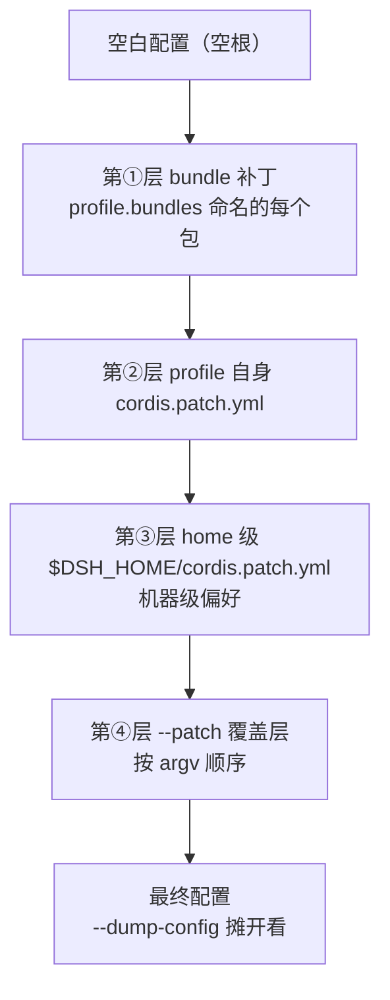

# 第七章 配置体系与常见坑清单

> [!summary] 本章导读
> 前面各章已经零散出现过 `cordis.yml`。这一章把 dsh 的配置体系讲完整——**补丁树四层怎么叠**、**Profile vs Agent Preset 两条轴**、**MCP 怎么接**——最后汇总一份 dsh 专属坑清单（含前面章节的坑，一屏可扫）。

## 7.1 补丁树：dsh 没有「一份完整配置」

dsh 的配置在**空根**上按顺序叠加多层 YAML 补丁[^d2]：

1. **bundle 补丁**：profile manifest 中 `dsh.profile.bundles` 列表命名的每个 bundle 补丁；
2. **profile 自身 `cordis.patch.yml`**（`$DSH_HOME/profiles/<名字>/cordis.patch.yml`）；
3. **home 级 `$DSH_HOME/cordis.patch.yml`**（机器级偏好，所有 profile 共享）；
4. **`--patch <path>` 覆盖层**（按 argv 顺序）。



**补丁语义**："Later layers win per row"——后层**按行覆盖，替换目标行的完整 config 值，不做深合并**，可插入新行[^d2]。

> [!warning] 按行替换，不做深合并
> 补丁不是 Git 式字段深合并：后层写同一行（同一插件 id）时，是拿这行的内容**整体替换**目标行。拿不准某层盖出了什么，用 `--dump-config` 摊开看合成结果[^d2]。

**排查利器**：

```bash
pnpm dsh --profile web --dump-default-config          # 只看 bundle 层
pnpm dsh --profile web --patch ./extra.yml --dump-config  # 含 profile/home 补丁与 --patch 覆盖层
```

## 7.2 两条轴：Profile（进程级）vs Agent Preset（会话级）

两个正交的维度[^d2][^d3]：

| | Profile | Agent Preset |
|---|---|---|
| 级别 | 进程级 | 会话级 |
| 决定 | 装**哪些 bundle**、什么顺序 | 会话里用**哪些工具/提示词/skill/子代理** |
| 类比 Claude Code | 启用哪些插件 + 核心配置 | 某个子代理 / agent 类型的配置 |

> [!tip] 大白话
> Profile 像「你电脑上装了哪些 App」；Agent Preset 像「你叫的是哪个角色的员工」。**装了什么 ≠ 用了什么，两条都要设**。

**Agent Preset 实操要点**[^d2][^d3]：

- **preset 即目录**：`agent.cordis.yml`（插件行装配清单，必需）+ 可选 `preset.yml`（只放展示文本 name/description），id=目录名；
- **内置 4 个**：`standard`（唯一母版）/ `code`（standard 副本 + Code Mode SDK）/ `cordis`（standard 副本 + 自指创作）/ `minimal`（双工具极简、`complete:true` 单句提示、仅 POSIX、Windows 不可用）；
- **用户预设放 `~/.dsh/.agent-presets/<id>/`**；发现不缓存，写完完全重启 dsh 后在会话选择器选用；
- **内置 preset 只读**（升级会覆盖）；写自己的 = 复制 → 改清单 → 换名；规范做法 `ctx.agentPresets.copy(from, id, name?)`；
- **设默认**：配置层写 `agent-presets: { default: <id> }`。

**插件接收配置**：`Config` 接口 + **Schemastery** schema（不能用普通对象），默认值写 schema 上；坏配置响亮失败（fiber FAILED）；HMR 热替换[^d2]。

## 7.3 MCP：每个 server 一个 mcp-client 实例

dsh 不做「往 `.dsh` 里放个配置文件」的魔法，MCP 是**每个 server 在 `cordis.yml` 里挂一个 `@deepseek-ai/dsh-mcp-client` 实例**[^b3][^d1]：

```yaml
- id: mcp-github
  name: '@deepseek-ai/dsh-mcp-client'
  config:
    serverName: github                # 必填，^[A-Za-z0-9_-]{1,32}$，跨实例唯一
    transport: stdio
    command: npx
    args: ['-y', '@modelcontextprotocol/server-github']
    env:
      GITHUB_TOKEN: '!!js process.env.GITHUB_TOKEN'
```

- 工具名 **`mcp__<serverName>__<工具名>`**——与 Claude Code / Codex 命名一致，权限规则可按 `mcp__github__*` 前缀统一写[^d1]；
- transport 二选一：`stdio`（command/args/env/cwd）或 `streamable-http`（url/headers）；`toolCallTimeoutMs`、`failOnStartupError`、`reconnect`（enabled 默认 true / initialDelayMs 500 / maxDelayMs 30000 / maxAttempts 10）[^b3]；
- 生命周期：boot 连接 → `listTools` → 注册；**HMR 热换**（改配置自动重连重注册）[^d1]；
- **只桥接 Tools**，Resources / Prompts 暂不消费[^d1]。

## 7.4 dsh 专属坑清单（一屏索引）

| 坑名 | 出处 | 一句话规避 |
|---|---|---|
| patch `name` 相对路径静默失效 | 第 2 章 | 不报错不警告，模块永远加载不上；**写绝对路径** |
| `--patch` 相对路径按仓库根解析 | 第 2 章 | 从插件目录跑会 ENOENT；在仓库根给全相对路径 `./git-log-plugin/dev-cordis.patch.yml` |
| hooks 桥接只跑 shell command | 第 5 章 | `http`/`mcp_tool`/`prompt`/`agent` 类型被跳过；`updatedInput` 不生效 |
| `configPath` 进程级 | 第 5 章 | 启动读一次、按启动 cwd 解析；不按 session 发现项目 hooks.json；写绝对路径或在该目录启动 |
| MCP 只桥接 Tools | 7.3 | Resources/Prompts 不出现；server 工具描述烂就是烂 |
| 补丁按行替换不深合并 | 7.1 | 同 id 整行覆盖；拿不准用 `--dump-config` |
| 内置 preset 只读 | 7.2 | 升级会覆盖；`minimal` 仅 POSIX、Windows 不可用 |
| skills 目录名 kebab-case、不支持嵌套 | 第 4 章 | `My Skill/` 不被发现；只一层 bundle 或扁平单文件 |
| subagent UNSUPPORTED_CAPABILITY | 第 6 章 | 选错 provider，不是重试能解决 |
| 同名第三方包 | 第 2 章 | 认准 `@deepseek-ai/dsh` / `deepseek-harness-sdk` |
| developer preview 破坏性变更 | 全篇 | README 明确 "THERE WILL BE COMPATIBILITY-BREAKING CHANGES"；反馈走 Discussions |

## 本章小结

> [!summary]
> - 补丁树四层：bundle → profile → home → `--patch`；后层按行替换、不深合并；`--dump-config` 排查；
> - Profile（装哪些 bundle）vs Agent Preset（会话用什么能力）两轴正交；preset 即目录、复制即造新、内置只读；
> - MCP 每 server 一个 `dsh-mcp-client` 实例；工具名 `mcp__<serverName>__<tool>`；只桥接 Tools；
> - 坑清单 11 条一屏索引，排错先对表、再回对应章节。

下一章：**最小可运行骨架总览 + 发布到 Obsidian**。

---

## 素材来源

[^b3]: B3 · dsh 官方 `docs/config-catalog.md`（mcp-client / hooks 桥接 / agent-presets），2026-08-16 抓取。
[^d1]: D1 · 你的 vault 笔记《03-配置实战-接入skills-hooks-mcp-rules》，2026-08-16。
[^d2]: D2 · 你的 vault 笔记《02-配置体系-补丁树Profile与bundle》，2026-08-16。
[^d3]: D3 · 你的 vault 笔记《12-实战-写自己的AgentPreset》，2026-08-16。
