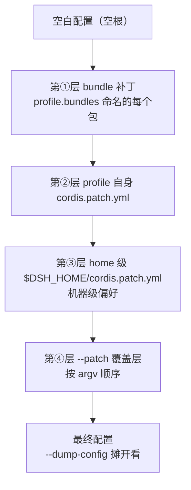

# 从零搭建 DeepSeek-Harness 工程：项目脚手架与 skills/hooks/subagents/rules/AGENTS 配置实战

> 这是一份从零搭建 DeepSeek-Harness（dsh）工程脚手架的实战笔记，以「使用 dsh」为主线：从先建哪些文件出发，依次拆解 rules/指令体系（AGENTS.md、CLAUDE.md 与 workspaceContext）、skills 放置与结构、hooks 桥接与原生插件、subagents 挂载、补丁树/Profile/Agent Preset/MCP 配置体系与常见坑清单，最后汇总最小可运行骨架并发布到 Obsidian。全程保留 dsh ↔ Claude Code 对照视角，帮助从 Claude Code 迁移过来的你快速上手。

## 目录

1. [[#第一章 先从心智模型开始——dsh 工程和 Claude Code 工程差在哪]]
2. [[#第二章 开始一个项目——先创建哪些文件]]
3. [[#第三章 Rules/指令体系——AGENTS.md、CLAUDE.md 与 workspaceContext]]
4. [[#第四章 Skills——往哪放、怎么写、扫描优先级]]
5. [[#第五章 Hooks——桥接复用 vs 原生插件]]
6. [[#第六章 Subagents——ctx.subagents 与 SubagentProvider]]
7. [[#第七章 配置体系与常见坑清单]]
8. [[#第八章 最小可运行骨架总览 + 发布到 Obsidian]]

---

# 第一章 先从心智模型开始——dsh 工程和 Claude Code 工程差在哪

> [!summary] 本章导读
> 搭建 dsh 工程之前，最该先做的是把心智模型转过来：**Claude Code 是「单体核心 + 扩展」，dsh 是「空壳 + 插件树」**。这个差异决定了后面所有文件的落点——为什么 rules 零迁移、为什么 skills 只是复制文件夹、为什么 hooks 要走 cordis.yml。读完你会先做出第一个关键决策：你是「**使用 dsh**」还是「**开发 dsh**」，这两条路的文件集合完全不同。

## 1.1 一句话定位：dsh 不是模型，而是可组装的 agent 运行时

官方核心公式：`Model + Harness = Agent`。dsh 是 DeepSeek 官方开源的 agent harness——不是模型或 API 客户端，而是「把模型接入文件系统、终端、网页、代码工具，组织上下文、工具调用与任务执行」的运行框架[^d5]。

> [!tip] 大白话
> 模型像发动机，dsh 是车架、方向盘和刹车。发动机决定动力，能不能上路由车架说了算——你搭的「工程脚手架」改的是驾驶体验，不是发动机。

与 Claude Code 的本质差异：**Claude Code 绑定 Claude 模型，框架与模型一体**；dsh 把两者解耦，模型只是可插拔的一层，可接第三方与 OpenAI-compatible 模型[^d5]。

## 1.2 核心架构：一切皆插件（无特权核心）

dsh 由 Cordis 框架驱动，官方 `AGENTS.md` 开篇第一句就是：**"DeepSeek Harness is a plugin-based agent harness on vendored Cordis: everything is a plugin."**[^b1]

这带来三个工程推论，直接影响脚手架怎么搭：

1. **没有特权核心**：模型适配器、工具注册表、会话日志、Agent loop、沙箱均可替换。你写的插件和官方 `dsh-tool-bash`、`web_search` 在架构上完全对等[^d5]。
2. **新增行为走扩展点，不改 loop**：官方明文 "Plugins, not loop changes: new behavior goes on documented extension points"[^b1]——想加能力是写插件，不是改框架。
3. **注册是 effect**：每个贡献走 `ctx.effect()` / `ctx.on()`，registry 的 `register()` 返回 disposer——插件卸载时自动清理它注册过的东西[^b1]。

对比 Claude Code 的「单体核心 + 扩展」：Claude Code 里你的扩展永远依附于一个不开源的单体核心；dsh 里**没有核心**，这是自由，也意味着你要自己理解插件生态的规则[^d5]。

> [!note] 这在 Claude Code 里相当于
> Claude Code 是「一间精装修好的房子，你可以往里添家具」；dsh 是「毛坯房，墙、门、水电都要以插件形式装」。添家具 vs 装房子，这是两个心态。

## 1.3 写能力 = 写代码，配置只是「装载」

新手最常见的挫败，是拿 Claude Code 的「改配置声明文件」思路去套 dsh[^d5]：

| | Claude Code | dsh |
|---|---|---|
| 加一个工具 | 配 MCP server / 写 command | 写 `defineTool({...})` 代码，`ctx.tools.register()` |
| 加一段指令 | 改 `CLAUDE.md` | 往 `ctx.systemPrompt.section()` 加段落，或直接写 `AGENTS.md` |
| 加一个 hook | 改 `settings.json` | 写插件监听 `ctx.on('tools/pre-execute', ...)` |
| 让它生效 | 改完即生效 | 用 `cordis.yml` patch **装进插件树** |

关键认知：**配置声明（YAML）只是「装载」的手段，能力本身是 TypeScript 代码**。所以 dsh 工程的脚手架里，`cordis.yml` 那几行不是核心，它背后挂的插件代码才是[^d5]。

## 1.4 第一个决策：使用 dsh，还是开发 dsh？

这一步决定你「先建哪些文件」。两条路的分野在官方文档里写得很清楚[^d5]：

| 路线 | 你想要的 | 文件集 | 启动方式 |
|---|---|---|---|
| **使用 dsh** | 把 dsh 当作项目的 agent 运行时，配 skills/rules/hooks/mcp | 项目根 `AGENTS.md`（或直接复用 `CLAUDE.md`）+ `.dsh/skills/` + `cordis.yml` | `npx @deepseek-ai/dsh web` |
| **开发 dsh** | 写插件/扩展（自定义工具、hook 插件、provider） | dsh 源码仓库 clone + 插件目录（`src/index.ts` + `dev-cordis.patch.yml`） | `pnpm dsh web --patch ./xxx.patch.yml` |

> [!warning] 别混
> 「使用」路线用 npx 一行启动；「开发」路线必须走源码构建（clone → `pnpm install` → `pnpm run build`），因为开发期插件用**相对仓库的绝对路径**挂进插件树，npx 没有仓库上下文、跑不了 `--patch` 开发循环[^d5]。

本笔记的主干是**「使用 dsh」的工程脚手架**——你问的「开始一个项目先建哪些文件、skills 放哪、hooks/subagents/rules/AGENTS 怎么配」，大部分答案落在使用路线上。写插件的细节（第 2 章会给出最小分支、后续指路你 vault 的插件开发分册）。

## 1.5 对照速查：Claude Code 概念 → dsh 工程里的等价物

| 你在 Claude Code 里的概念 | dsh 工程里的位置 |
|---|---|
| `CLAUDE.md` 指令 | 项目根 `AGENTS.md` 或 `CLAUDE.md`（默认都读，零迁移） |
| `.claude/skills/<name>/SKILL.md` | `.dsh/skills/<name>/SKILL.md`（或 `.agents/skills/`） |
| `.claude/rules/` | dsh 无独立 rules 目录——规则就是 `AGENTS.md`/`CLAUDE.md` 内容 |
| `settings.json` 的 hooks | cordis.yml 里挂桥接插件或原生 hook 插件 |
| `.claude/agents/*.md` subagent | `ctx.subagents.registerProvider` 显式注册 |
| `.mcp.json` MCP server | cordis.yml 里每 server 一个 `dsh-mcp-client` 实例 |
| 全局 `~/.claude/` | 用户级 `~/.dsh/`（AGENTS.md、skills、profiles、`.agent-presets`） |

> [!tip] 记住这张表
> 后面每章都会回到这张表。你的优势是从 Claude Code 迁移过来的——**迁移的加速器就是这张映射**，哪里卡住就回来对一下。

## 本章小结

> [!summary]
> - dsh = `Model + Harness = Agent` 里的 Harness，可组装的 agent 运行时，不是模型；
> - 架构核心「一切皆插件」、无特权核心：你写的插件与官方插件架构对等；
> - 写能力 = 写 TypeScript 代码，`cordis.yml` patch 只是「装载」手段；
> - 先做路线决策：**使用 dsh**（npx + 项目根配置）vs **开发 dsh**（源码 + 插件骨架）——本笔记主干是前者；
> - 保留 dsh ↔ Claude Code 对照表作为迁移加速器。

下一章进入正题：**开始一个项目，先创建哪些文件**——两条路线的最小文件集与目录职责总览。

---

## 素材来源

[^d5]: D5 · 你的 vault 笔记《DeepSeek-Harness 是什么 / 安装与快速上手 / 05-实战-起步-最小骨架与脚手架》，2026-08-16。
[^b1]: B1 · DeepSeek-Harness 官方仓库 `AGENTS.md`（"everything is a plugin"、扩展点、effect 注册），2026-08-16 抓取。

# 第二章 开始一个项目——先创建哪些文件

> [!summary] 本章导读
> 上一章做了路线决策。这一章落地：**两条路线分别先建哪几个文件**。先给「使用 dsh」路线的完整目录职责总览（你问的「先创建好哪些文件」的主答案），再给「开发 dsh」路线的最小插件 2 文件骨架。最后用一张图把项目根、`.dsh/`、`~/.dsh/` 三层各管什么讲清。

## 2.1 使用 dsh：项目根先建 1 个文件（可选第 2 个）

如果你只是想**用 dsh 作为项目的 agent 运行时**，最小集合其实很小：

```text
<你的项目根>/
├── AGENTS.md        # ① 指令文件（可选：直接复用已有 CLAUDE.md 也行）
└── .dsh/skills/     # ② 项目级技能源（有 skill 要放时再建，见第 4 章）
```

**为什么先建 `AGENTS.md`？**

dsh 的 `instructionFileCandidates` 默认值是 **`['AGENTS.md', 'CLAUDE.md']`**——它把两个都当指令文件候选，从 session 工作目录向上找最近含 `.git` 的祖先作为项目根，逐目录加载[^b3][^d1]。

> [!tip] 大白话
> dsh 默认两个都读。所以：
> - 你的 `CLAUDE.md` **原样生效，零迁移**；
> - 想加「只在这个项目生效」的补充，再写一个 `AGENTS.md`；
> - 想加「机器级偏好」，写 `~/.dsh/AGENTS.md`（见 2.3）。

## 2.2 目录职责总览：三层各管什么

dsh 没有「一份完整配置文件」，是**三层文件 + 一个用户级 home** 的分布式结构[^d1][^d2]：

| 位置 | 身份 | 类比 Claude Code | 放什么 |
|---|---|---|---|
| `<项目根>/AGENTS.md`、`CLAUDE.md` | 项目指令黑板 | 项目根 `CLAUDE.md` | rules 级规则（零迁移区） |
| `<项目根>/.dsh/skills/` | 项目级技能源 | `.claude/skills/` | **只有 skills** |
| `<项目根>/cordis.yml` | 试跑配置补丁 | `settings.json` | hooks 桥接、MCP、自定义插件（用 `--patch` 挂载） |
| `~/.dsh/`（`$DSH_HOME` 可覆盖） | 用户级 harness home | `~/.claude/` | 用户级 `AGENTS.md`、`skills/`、`profiles/`、`.agent-presets/`、`cordis.patch.yml` |

> [!warning] `.dsh` 不是 `.claude` 的翻版
> `.dsh` 是真实存在的「harness home」，但它只覆盖四块能力里的两块：**rules 不是放 `.dsh` 里、hooks 和 mcp 也不是**。rules 是项目根黑板（`AGENTS.md`/`CLAUDE.md`）；hooks 和 MCP 要走 `cordis.yml` 的插件系统「申请」。所以 `.dsh/skills/` 是你唯一需要亲手建的项目级 dsh 目录[^d1]。

## 2.3 开发 dsh：源码路径 + 最小插件 2 文件

如果你要写插件（自定义工具、hook 插件、subagent provider），必须走源码路径[^d5]：

```bash
# 1. 克隆官方仓库
git clone https://github.com/deepseek-ai/deepseek-harness.git
cd deepseek-harness

# 2. 安装依赖 + 构建
pnpm install
pnpm run build

# 3. 启动 Web UI（默认 http://127.0.0.1:3080）
pnpm dsh web
```

然后**最小插件 2 文件**（在仓库根目录下建插件目录）[^d5]：

```text
deepseek-harness/
├── git-log-plugin/
│   ├── src/index.ts            # ① 插件本体（apply 函数）
│   └── dev-cordis.patch.yml    # ② 注册 patch（把插件装进插件树）
└── ...（官方仓库其他内容）
```

**文件 1：`src/index.ts`**

```ts
import type { Context } from '@deepseek-ai/cordis'

export const name = 'git-log-plugin'

export function apply(ctx: Context) {
  console.log(`[${name}] plugin loaded!`)
}
```

要点：`export const name` 是诊断名（四名分离的第一个）；`apply(ctx)` 是插件入口，`ctx` 是上下文句柄[^d5]。

**文件 2：`dev-cordis.patch.yml`**

```yaml
# dev-cordis.patch.yml
- insert:
    - id: git-log
      name: '<你的 deepseek-harness 仓库绝对路径>/git-log-plugin/src/index.ts'
```

> [!warning] 头号坑：patch 的 `name` 必须绝对路径
> patch 的 `name` 会被加载器**直接当文件系统路径**定位模块，不相对工作目录换算。写相对路径**不会报错、不会警告**——只是模块永远加载不上。这种「没报错的静默」是新手最容易被消耗时间的地方[^d5]。

**加载验证**（必须回到 dsh 源码仓库根目录执行）：

```bash
pnpm dsh web --patch ./git-log-plugin/dev-cordis.patch.yml
# 期望：日志出现 [git-log-plugin] plugin loaded!
```

> [!note] 这在 Claude Code 里相当于
> 建 `.claude/skills/foo/SKILL.md` + 在设置里注册。Claude Code 是「改文件声明扩展」，dsh 是「写代码 + 用 patch 装进插件树」。

## 2.4 Web UI 首次配置（两条路共用）

无论哪条路，第一次跑起来都要在 Web UI 做两步首配[^d5]：

1. **Settings → Models 填 DeepSeek API Key**：保存即生效，无需重启；密钥是 write-only 的，明文存于 `$DSH_HOME/.credentials.yaml`。
2. **Choose workspace 选择项目目录**：dsh 以调用目录作为默认文件系统根。**不选工作区无法开始会话**。

跑通验证：新建会话发送一句话任务，涉及需审批的操作会弹确认（新会话默认 `workspace-write` 权限预设）。

headless 一次性任务（适合 CI）[^d5]：

```bash
pnpm dsh --profile headless "run the tests"
# 退出码：0=completed，1=failed；每次调用创建新 agent，无 resume
```

## 2.5 只使用不开发：npm 快跑路径

不想写插件时，一行启动，无需源码[^d5]：

```bash
# 路径一：npm（推荐），一行启动 Web UI
npx @deepseek-ai/dsh web

# 路径二：Python SDK（Python 3.10+，仅 Linux x64/arm64 或 macOS 14+ arm64）
pip install deepseek-harness-sdk
```

> [!warning] 认准官方包名
> `pip install deepseek-harness` 与 `npx @deepseek-harness/mcp` 均**非官方**。官方包名只有 `@deepseek-ai/dsh`（npm）与 `deepseek-harness-sdk`（Python）。

## 本章小结

> [!summary]
> - **使用 dsh**：项目根先建 `AGENTS.md`（或直接复用 `CLAUDE.md`，零迁移）+ 需要时建 `.dsh/skills/`；`cordis.yml` 用于试跑 hooks/mcp；
> - **开发 dsh**：源码路径（clone → pnpm install → build）+ 最小插件 2 文件（`src/index.ts` + `dev-cordis.patch.yml`），patch `name` 必须绝对路径；
> - 三层结构：项目根（指令/技能）、`cordis.yml`（插件配置）、`~/.dsh/`（用户级 home）；
> - Web UI 首配两步：API Key + workspace；headless 适合 CI（退出码 0/1）。

下一章讲 rules/指令体系的细节：**`AGENTS.md`、`CLAUDE.md` 与 `workspaceContext`**——零迁移背后到底发生了什么、怎么控制字节预算。

---

## 素材来源

[^b3]: B3 · dsh 官方 `docs/config-catalog.md`（workspaceContext 配置），2026-08-16 抓取。
[^d1]: D1 · 你的 vault 笔记《03-配置实战-接入skills-hooks-mcp-rules》，2026-08-16。
[^d2]: D2 · 你的 vault 笔记《02-配置体系-补丁树Profile与bundle》，2026-08-16。
[^d5]: D5 · 你的 vault 笔记《DeepSeek-Harness 是什么 / 安装与快速上手 / 05-实战-起步-最小骨架与脚手架》，2026-08-16。

# 第三章 Rules/指令体系——AGENTS.md、CLAUDE.md 与 workspaceContext

> [!summary] 本章导读
> 这是你迁移成本最低的一块：**你的 `CLAUDE.md` 在 dsh 里原样生效，零迁移**。但「零迁移」背后有一套精确的加载规则——默认读哪些文件、按什么顺序、项目根怎么找、字节预算怎么控。搞懂它，你才知道什么时候该写 `AGENTS.md`、什么时候写 `AGENTS.local.md`、什么时候动 `workspaceContext`。

## 3.1 默认读哪些文件：`AGENTS.md` + `CLAUDE.md` 都读

dsh 官方源码里 `instructionFileCandidates` 的默认值就是 **`['AGENTS.md', 'CLAUDE.md']`**[^b3][^d1]——它从 session 工作目录向上找最近的含 `.git` 的祖先作为项目根，逐个目录加载这些文件。

> [!example] 实操结论
> 什么都不用做。你现在的 `CLAUDE.md` 在 dsh 里照常被读。想加「只在这个项目生效」的补充，再写一个 `AGENTS.md`；想加「机器级偏好」，写 `~/.dsh/AGENTS.md`。

## 3.2 项目根怎么找 + 加载顺序

| 机制 | 规则 | 来源 |
|---|---|---|
| 项目根 | 从 session 工作目录向上找**最近含 `.git` 的祖先**；无 `.git` 用当前 cwd；`ctx.fs` 可用时走 fs 服务探测 | B3 |
| 加载范围 | 逐目录向上加载候选文件 | B3 |
| 本地覆盖 | 同目录 **`AGENTS.local.md` / `CLAUDE.local.md`** 在基础文件之后加载（覆盖同名目录的重复内容）；`localInstructionFileCandidates` 空则禁用 overlay | B3, D1 |
| 用户级 | 固定读 **`~/.dsh/AGENTS.md`**（`$DSH_HOME` 下），所有项目共享 | B3, D1 |

## 3.3 `workspaceContext`：字节预算与开关

`@deepseek-ai/dsh-agent-instructions` 插件（"User-facing workspace instruction loader configuration"）拥有 AGENTS.md/CLAUDE.md 加载能力。在 spine bundle 里字段是 `workspaceContext`[^b3]：

| 配置键 | 含义 |
|---|---|
| `dshHome` | harness home，含固定的用户全局 `AGENTS.md`；默认 `$DSH_HOME` 或 `~/.dsh` |
| `projectRootMarkers` | 标识项目根的目录项（向上 walk 用） |
| `maxBytes` | **一个渲染 baseline/动态批次的 UTF-8 字节上限**；非正数或非有限禁用加载 |
| `maxSourceBytes` | 单条指令文件读取的 UTF-8 上限；更大的文件被忽略 |
| `instructionFileCandidates` | 同目录项目候选；每个存在的文件都加载（同目录重复内容折叠到最早候选） |
| `localInstructionFileCandidates` | 本地覆盖候选，基础文件之后加载；空则禁用 |

**设 `false` 可整体关闭**：官方注释明确 "Workspace context instead requires an explicit byte budget or `false` because it changes model-visible input"——关闭后得到 hermetic prompts[^b3]。

> [!note] 这在 Claude Code 里相当于
> Claude Code 的 `claudeMdExcludes` / 记忆上限。dsh 用一个显式字节预算（`maxBytes`）而不是「行数」来约束指令文件对模型可见输入的影响。

## 3.4 官方仓库自身的惯例：CLAUDE.md symlink AGENTS.md

dsh 官方仓库 root/packages/examples 三处都用 `CLAUDE.md` symlink 到 `AGENTS.md`，**edit 真文件**（即 `AGENTS.md` 是 canonical source）[^b1]。

> [!tip] 迁移建议
> 如果你从 Claude Code 迁过来、想保持单一事实源：把规则写进 `AGENTS.md`（canonical），`CLAUDE.md` 用 symlink 或 `@AGENTS.md` import 指向它。dsh 两个都读，哪个是真文件都行，但别双份维护。

## 3.5 常见坑

1. **写了 `AGENTS.md` 又写 `CLAUDE.md` 两份重复规则**——两个都会加载，内容不一致时以覆盖顺序为准；不如一个真文件 + 一个 symlink/import。
2. **指令文件太大**——超过 `maxSourceBytes` 的单个文件被**忽略**（不是截断）；合理设置 `maxBytes` 控制模型可见输入，避免「陈规坟场」。
3. **以为 hooks/mcp 也放 `.dsh/`**——`.dsh` 只管技能 + 用户级 home；hooks/mcp 走 `cordis.yml`（第 5、7 章）。

## 本章小结

> [!summary]
> - `instructionFileCandidates` 默认 `['AGENTS.md', 'CLAUDE.md']`——**CLAUDE.md 零迁移**；
> - 项目根 = 最近含 `.git` 的祖先；逐目录向上加载；本地覆盖 `AGENTS.local.md`/`CLAUDE.local.md`；用户级 `~/.dsh/AGENTS.md`；
> - `workspaceContext` 控制自动加载与字节预算（`maxBytes`/`maxSourceBytes`/`projectRootMarkers`），设 `false` 整体关闭 → hermetic prompts；
> - 官方惯例：`CLAUDE.md` symlink `AGENTS.md`，edit 真文件；别双份维护。

下一章：**Skills——往哪放、怎么写、扫描优先级**。

---

## 素材来源

[^b1]: B1 · dsh 官方仓库 `AGENTS.md`，2026-08-16 抓取。
[^b3]: B3 · dsh 官方 `docs/config-catalog.md`（workspaceContext / agent-instructions），2026-08-16 抓取。
[^d1]: D1 · 你的 vault 笔记《03-配置实战-接入skills-hooks-mcp-rules》，2026-08-16。

# 第四章 Skills——往哪放、怎么写、扫描优先级

> [!summary] 本章导读
> 这是你问的「skills 放在那里」的完整答案。dsh 的 skills 格式与 Claude Code 兼容（`<name>/SKILL.md` 或 `<name>.md`），但**扫描根有六个、优先级 first-wins**。读完你会知道：项目级放哪、用户级放哪、custom/bundled 什么时候出现、SKILL.md 到底哪些字段是强制的、以及怎么把现成 Claude Code skills 一键搬过来。

## 4.1 六个扫描根：rank 表（first-wins）

dsh 的本地技能发现按 rank 顺序，**同名取先命中的**（first-wins）[^b2][^d1]：

| Rank | 源 | 根目录 |
|---|---|---|
| 100 | project-dsh | `<项目根>/.dsh/skills` |
| 200 | project-agents | `<项目根>/.agents/skills` |
| 300 | custom | `Config.customSkillDirs` |
| 400 | user-dsh | `~/.dsh/skills` |
| 500 | user-agents | `~/.agents/skills` |
| 600 | bundled | 包内自带（`Config.bundledSkillDir`） |

项目根 = 最近含 `.git` 的祖先；无 `.git` 用 cwd；`ctx.fs` 可用时 git-root walk 走 fs 服务（远程/沙箱工作区不落回宿主边界）[^b2]。

> [!tip] 大白话
> 六个抽屉从近到远：项目的 `.dsh` 最优先，其次 `.agents`，然后你自定义的、你机器级的、最后是包自带的。同一个 skill 名在多个抽屉出现，**近的赢**。

**同名解析细节**（来自官方 skills.md）：同层内按 rank → provider order → local order 决出；跨层 registry 是 host+per-scope 分层，**nearest layer 直接赢同名**，rank 只决定同层内；runtime 条目 outrank user 条目[^b2]。

## 4.2 格式：与 Claude Code 兼容，但 frontmatter 只强两键

**放置形式**：目录 bundle `<name>/SKILL.md` **或** 单文件 `<name>.md`；名字必须 kebab-case（`^[a-z0-9]+(?:-[a-z0-9]+)*$`）；**不支持**嵌套递归 `**/SKILL.md` 发现[^b2]。

**frontmatter 契约**：本地 provider 只读**两个精确 kebab-case 键**——`disable-model-invocation` 和 `user-invocable`，缺省字段视为 `true`。两者归一化为 `SkillInvocationPolicy`：`modelInvocable` / `userInvocable`；两键皆 `false` 则该 skill 只能被受信 `ctx.skills.get()` 调用[^b2]。

> [!note] 和 Claude Code 的差异
> Claude Code 的 SKILL.md frontmatter 里 `name`/`description` 决定自动加载；dsh 的本地 provider **不读 `name`/`description` 为强制字段**——它靠目录名（或文件名）当 skill 名。`SkillSummary`/`SkillDefinition` 里的 `name`/`description`/`whenToUse` 是 registry 级字段，不是 provider 强制 frontmatter。

最小 skill：

```text
.dsh/skills/my-skill/SKILL.md
```

```yaml
---
name: my-skill
description: Do something useful when the user asks for it.
---
正文指令……
```

> [!warning] 渐进式披露
> 目录只放 `name` + `description` 摘要（模型看到简介决定要不要读），正文不进每轮请求。所以**简介写没写清楚很关键**——模型只靠简介判断「要不要拉开抽屉」。

## 4.3 加载机制：热加载 + 按需读正文

- **目录被 watcher 监听，新建即热加载**，不用重启[^d1]；
- 模型侧通过一个 **`skill({name})` 工具**按需加载正文——`skill({name})` 先校验 kebab-case 名、找 summary、`isModelInvocable` 检查，再按调用 agent 的 cwd 重读完整定义并重查策略[^b2]；
- **全文不缓存**：registry 的每次 `get()` 重读当前正文（本地 provider rereads body）；所以改正文立即影响后续工具调用，不产生 catalog 消息、不改写旧工具结果[^b2]；
- 热更新：模型侧 `write`/`edit` 观测同步失效 provider；host watcher 覆盖 IDE/Git/shell/外部进程变更；watcher 失败会保留 last-good 视图[^b2]。

## 4.4 把现成 Claude Code skills 搬过来

迁移成本 = **复制文件夹**（格式兼容）[^d1]：

```bash
# 项目级
mkdir -p .dsh/skills
cp -r ~/.claude/skills/* .dsh/skills/

# 或用户级（所有项目共享）
cp -r ~/.claude/skills/* ~/.dsh/skills/
```

> [!note] 这在 Claude Code 里相当于
> `.claude/skills/<name>/SKILL.md` → `.dsh/skills/<name>/SKILL.md`。格式一样、frontmatter 兼容、热加载一样，只是目录根从 `.claude` 变成 `.dsh`。

## 4.5 常见坑

1. **目录名 / 文件名即 skill 名**，必须是 kebab-case；写 `My Skill/` 不会被发现。
2. **嵌套 `subdir/skill/SKILL.md` 不被发现**——只支持一层 bundle 或扁平单文件。
3. **忘了 `disable-model-invocation` 语义**——两键默认 `true`；想彻底私有化（只允许代码调用）两键都设 `false`。
4. **以为 `.dsh/` 还能放 hooks/mcp**——`.dsh/skills` 只管技能；hooks/mcp 走 `cordis.yml`（第 5、7 章）。

## 本章小结

> [!summary]
> - 六个扫描根 rank：`.dsh/skills`(100) → `.agents/skills`(200) → custom(300) → user-dsh(400) → user-agents(500) → bundled(600)，**first-wins**；
> - 格式：目录 bundle `<name>/SKILL.md` 或单文件 `<name>.md`，kebab-case，不支持嵌套递归；frontmatter 只强两键 `disable-model-invocation` / `user-invocable`；
> - 热加载 + `skill({name})` 工具按需读正文 + 全文不缓存；
> - 迁移 = 复制文件夹（格式与 Claude Code 兼容）。

下一章：**Hooks——桥接复用 vs 原生插件**。

---

## 素材来源

[^b2]: B2 · dsh 官方 `docs/subsystems/skills.md`，2026-08-16 抓取。
[^d1]: D1 · 你的 vault 笔记《03-配置实战-接入skills-hooks-mcp-rules》，2026-08-16。

# 第五章 Hooks——桥接复用 vs 原生插件

> [!summary] 本章导读
> dsh 的 hooks 有**两套完全不同的玩法**：桥接插件（复用你现成的 Claude Code hooks.json，迁移成本最低）和原生 cordis 插件（更强大，但要写代码）。读完你会知道：什么时候用桥接、什么时候写原生、桥接支持哪些 hook 点、两个必踩的坑、以及「这段配置写进哪个文件」。

## 5.0 心智前提：hook ⊂ 插件

先纠正一个概念：**hook 不是 dsh 的一等公民，插件才是**。dsh 里一切能力都是 cordis 插件（容器），hook 只是其中「监听扩展点、返回决策」的那一类职责[^d1]。

| 判断标准 | 例子 |
|---|---|
| 监听 `ctx.on(...)` 生命周期/执行类扩展点并返回决策 → **是 hook** | `tools/pre-execute` 权限门、`agent/pre-step` 策略 |
| 干别的（连 MCP server、桥接 Claude Code hooks、提供工具）→ **是插件但不是 hook** | `dsh-hooks-claude-code` 桥接插件、`dsh-mcp-client` |

## 5.1 桥接复用你现成的 Claude Code hooks（迁移成本最低）

装 `@deepseek-ai/dsh-hooks-claude-code` 桥接插件，它把你 `hooks.json`（或 settings 的 `hooks` 键）里的 shell 命令 hooks 翻译成 dsh 的类型化扩展点[^b3][^d1]：

```yaml
- id: hooks-cc
  name: '@deepseek-ai/dsh-hooks-claude-code'
  config:
    configPath: ./hooks.json        # 你现成的 Claude Code hooks 配置
    # projectDir 省略时，默认把 CLAUDE_PROJECT_DIR 导出为 session 工作目录
```

**支持的 hook 点**：`SessionStart` / `UserPromptSubmit` / `PreToolUse` / `PostToolUse` / `Stop` / `SubagentStart` / `SubagentStop`[^d1]。`CLAUDE_PROJECT_DIR` 会自动注入给 hook 进程，常见项目相对路径的 hook 不用改就能跑[^b3]。

**配置项**（config-catalog）[^b3]：

| 键 | 含义 |
|---|---|
| `configPath` | 指向 `hooks.json` 或 settings 文件（其 `hooks` 键为配置） |
| `pluginRoot` | 替换命令串里的 `${CLAUDE_PLUGIN_ROOT}` |
| `projectDir` | 替换 `${CLAUDE_PROJECT_DIR}` **并**导出为 hook 进程的 env；默认按 session workspace |
| `defaultTimeoutMs` | 默认每 hook 超时（CC 默认 600000） |
| `stderrSummaryMaxChars` | `hook/result` 事件持久化 stderr 摘要的字符上限 |

> [!note] 这段写进哪个文件？
> 这个 `- id: hooks-cc` 块是 **cordis.yml 补丁文件里的插件行**，不是丢进 `.dsh/` 目录的独立文件。落点按生效范围选[^d1]：

| 生效范围 | 写进哪个文件 | 怎么生效 |
|---|---|---|
| 项目里先试跑 | 项目根新建 `./cordis.yml` | `pnpm dsh web --patch ./cordis.yml` |
| 某个 profile 长期 | `~/.dsh/profiles/<name>/cordis.patch.yml` | 随该 profile 自动叠加（补丁树第②层） |
| 机器全局 | `~/.dsh/cordis.patch.yml` | 所有 profile 共享（补丁树第③层） |

两个前提：① 插件包要能解析——`name` 引用 npm 包，未安装先 `dsh plugin --profile <name> add @deepseek-ai/dsh-hooks-claude-code`；② `configPath: ./hooks.json` 是进程级、按启动 cwd 解析（见坑 2）。

## 5.2 原生插件（更强大，但要点编程）

「原生 hook」就是普通的 cordis 插件，监听类型化扩展点并返回决策[^d1]：

| 扩展点 | 用途 |
|---|---|
| `tools/pre-execute` | 权限门：allow / deny / ask |
| `tools/post-execute` | 改写展示内容或返回值 |
| `agent/pre-step` | 每步前的策略 |
| `agent/turn-stopping` | 结束前干预 |
| `subagent/start` / `subagent/end` | 子代理生命周期 |

```ts
ctx.on('tools/pre-execute', async (exec, next): Promise<PreToolDecision> => {
  if (!(await isAllowed(exec))) {
    return { kind: 'deny', reason: 'Denied by policy.' }
  }
  return next()
})
```

> [!tip] 选择建议
> 想「原样跑起现有 hooks」→ 桥接；想「写新的、复杂的策略」→ 原生插件。桥接是「兼容适配器，不是威力工具」——原生插件有类型化返回、完整 `ctx`、无序列化边界[^d1]。

## 5.3 三个坑（照搬前必看）

1. **hooks 桥接只跑 shell-form 的 `type: 'command'`**；`http` / `mcp_tool` / `prompt` / `agent` 类型的 hook 会被解析但跳过；`updatedInput`（工具入参改写）不生效，只记录告警[^d1]。
2. **`configPath` 是进程级**：启动时读一次，相对路径按进程启动 cwd 解析；**不会**像 Claude Code 那样按 session 自动发现项目里的 `hooks.json`（官方标记 `TODO(per-session-hook-config)`）[^b3][^d1]。要么写绝对路径，要么在 `hooks.json` 所在目录启动。
3. **别把 hooks 配置塞进 `.dsh/`**——`.dsh` 只管技能 + 用户级 home；hooks 走 `cordis.yml` 补丁层。

## 本章小结

> [!summary]
> - hook ⊂ 插件：hook 是监听扩展点返回决策的那类插件职责；
> - 桥接 `dsh-hooks-claude-code`：`configPath` 指向 hooks.json，支持 SessionStart/UserPromptSubmit/PreToolUse/PostToolUse/Stop/SubagentStart/SubagentStop；只跑 shell command；
> - 原生插件：`ctx.on('tools/pre-execute', ...)` 返回 deny/next，更强大；
> - 落点：试跑 `--patch ./cordis.yml` / profile `cordis.patch.yml` / home `cordis.patch.yml` 三层；
> - 两个坑：桥接只跑 shell command、`configPath` 进程级。

下一章：**Subagents——ctx.subagents 与 SubagentProvider**。

---

## 素材来源

[^b3]: B3 · dsh 官方 `docs/config-catalog.md`（hooks 桥接 / mcp-client），2026-08-16 抓取。
[^d1]: D1 · 你的 vault 笔记《03-配置实战-接入skills-hooks-mcp-rules》，2026-08-16。

# 第六章 Subagents——ctx.subagents 与 SubagentProvider

> [!summary] 本章导读
> 这是你问的「subagents 怎么配」在 dsh 里的答案。先说清最核心的差异：**Claude Code 从 `.claude/agents/*.md` 自动发现 subagent，dsh 用 `ctx.subagents.registerProvider` 显式注册**。本章给工程视角的最小挂载路径 + 关键契约速查，深挖请指路你 vault 的《DeepSeek-Harness Subagent 教程》分册（7 章，已覆盖心智/契约/选型/生命周期）。

## 6.0 先定位：工程脚手架里 subagent 只需要「选 + 挂」

写 dsh 工程时，绝大多数情况**不需要自己写 provider**——官方/社区已有现成的，你要做的是[^d4]：

1. **选 provider**：`spawn` / `fork` / `acp` / `dsh-sdk`；
2. **挂载**：在 cordis.yml 里 `dsh plugin add` + insert（或直接配 preset）；
3. **暴露给模型**：用 `dsh-tool-subagent` 把 provider 变成模型可调的工具。

只有你要「换执行后端 / 写自定义能力缝」时才去实现 `SubagentProvider`——那是 Subagent 分册第 4 章的事。

## 6.1 核心契约速查：`ctx.subagents` + `SubagentProvider`

**注册表**：`ctx.subagents` 是能力缝的「总机」[^d4]：

| 方法 | 一句话职责 |
|---|---|
| `registerProvider(provider)` | 按 `provider.name` 注册，重名失败；effect-scoped（移除阻止新 start、不撤销已返回 run） |
| `getProvider(name)` / `list()` | 只读查询 |
| `start` / `startContinuable` | 一次性前台委托 / 建立可恢复 child |
| `followup` / `interrupt` / `reportFrom` | 向可恢复 child 续发 / 停止 / 反向上报 |
| `listChildren` / `listDescendants` | 只读枚举委派树 |

**`SubagentProvider` 契约五块**（类型以官方为准，这里做字段地图）[^d4]：

```ts
const myProvider: SubagentProvider = {
  name: 'my-provider',          // ① 唯一注册名
  capabilities: {},             // ② 四 flag 启动期声明
  inheritsParentContext: false, // ③ 是否注入父对话种子（描述性标注）
  async start(request) { /* 发布后返回 handle */ },  // ④
  // prepareContinuable?(request)  // ⑤ 存在即能力
}
```

**`capabilities` 四 flag**：`outputSchema` / `depthLimit` / `toolFilter` / `persona`——启动期静态声明，请求对应能力但 provider 没声明 → **`UNSUPPORTED_CAPABILITY` 响亮拒绝**，绝不静默[^d4]。

> [!warning] 三个必记坑
> 1. **UNSUPPORTED_CAPABILITY** = 选错 provider（该换 spawn/fork 而不是 acp），不是重试能解决；
> 2. **outputSchema 请求了不保证拿到 `structured`**——消费方要回退 `output` 文本；
> 3. **`inheritsParentContext` 名不副实**——只担保「对话种子」这一件事，工具/服务/权限一概不继承。

## 6.2 选 provider：一张速查表

来自 Subagent 分册第 7 章决策速查[^d4]：

| 需求 | 选 | 一句依据 |
|---|---|---|
| 要结构化输出 / toolFilter / persona / 深度强制 | spawn / fork | in-process 四项启动期能力全支持 |
| 要子代理继承父对话上下文 | fork | `inheritsParentContext: true`，带对话种子 |
| 不想子代理看到父对话 | spawn / acp / dsh-sdk | 三者均 `inheritsParentContext: false` |
| 要驱动任意 ACP 协议 agent | acp | 独立子进程、ACP 客户端驱动 |
| 要完整独立 harness（自管模型/组合/递归预算） | dsh-sdk | 子进程是完整 peer harness；可设 `maxDepth: 'provider-managed'` |

**in-process vs out-of-process**：in-process（spawn/fork）同进程新建 child、能力全支持、无进程隔离；out-of-process（acp/dsh-sdk）独立子进程、环境变量擦除 + 独立 session root，要隔离或驱动外部协议时用[^d4]。

## 6.3 暴露给模型：`dsh-tool-subagent`

`dsh-tool-subagent` 把 provider 暴露成模型可调能力。关键配置[^d4]：

- **一个 provider 绑一个 `toolName`**，全局唯一，重复冲突；
- **maxDepth 默认 3、0 禁止委派**；dsh-sdk 上设 `'provider-managed'` 才由子 harness 自管递归预算；
- 后台 one-shot 结果经 task 工具回传（监听 task 回传而非前台 await）。

> [!note] 这在 Claude Code 里相当于
> `dsh-tool-subagent` ≈ Claude Code 的 `task` 工具；但 dsh 把「子代理 = 一条能力缝」显式化——provider 可换、能力可声明、生命周期可编程。

## 6.4 挂载示例（cordis.yml）

```yaml
- insert:
    - id: tool-subagent
      name: '@deepseek-ai/dsh-tool-subagent'
      config:
        provider: spawn          # 选 provider
        toolName: subagent       # 模型看到的工具名
        maxDepth: 3
```

> [!tip] 指路
> 想自己写 provider（三段式方法论 + 最小骨架 + 生命周期 + 工具化），读 [[DeepSeek-Harness Subagent 教程/README|Subagent 分册]]——本笔记是工程挂载视角，分册是开发深挖视角。

## 本章小结

> [!summary]
> - Claude Code `.claude/agents/*.md` 自动发现 vs dsh `ctx.subagents.registerProvider` 显式注册（effect-scoped）；
> - 工程里 subagent 只需「选 provider + 挂载 + 用 dsh-tool-subagent 暴露」，不用自己写 provider；
> - 契约五块：name / capabilities 四 flag / inheritsParentContext / start / prepareContinuable；能力不匹配 → UNSUPPORTED_CAPABILITY 响亮失败；
> - 选型速查：要能力强制 → in-process；要继承父对话 → fork；要隔离/外部协议 → acp；要完整 peer harness → dsh-sdk。

下一章：**配置体系与常见坑清单**。

---

## 素材来源

[^d4]: D4 · 你的 vault 笔记《DeepSeek-Harness Subagent 教程》（README + 第 2 章核心契约 + 第 7 章速查），2026-08-16。

# 第七章 配置体系与常见坑清单

> [!summary] 本章导读
> 前面各章已经零散出现过 `cordis.yml`。这一章把 dsh 的配置体系讲完整——**补丁树四层怎么叠**、**Profile vs Agent Preset 两条轴**、**MCP 怎么接**——最后汇总一份 dsh 专属坑清单（含前面章节的坑，一屏可扫）。

## 7.1 补丁树：dsh 没有「一份完整配置」

dsh 的配置在**空根**上按顺序叠加多层 YAML 补丁[^d2]：

1. **bundle 补丁**：profile manifest 中 `dsh.profile.bundles` 列表命名的每个 bundle 补丁；
2. **profile 自身 `cordis.patch.yml`**（`$DSH_HOME/profiles/<名字>/cordis.patch.yml`）；
3. **home 级 `$DSH_HOME/cordis.patch.yml`**（机器级偏好，所有 profile 共享）；
4. **`--patch <path>` 覆盖层**（按 argv 顺序）。



**补丁语义**："Later layers win per row"——后层**按行覆盖，替换目标行的完整 config 值，不做深合并**，可插入新行[^d2]。

> [!warning] 按行替换，不做深合并
> 补丁不是 Git 式字段深合并：后层写同一行（同一插件 id）时，是拿这行的内容**整体替换**目标行。拿不准某层盖出了什么，用 `--dump-config` 摊开看合成结果[^d2]。

**排查利器**：

```bash
pnpm dsh --profile web --dump-default-config          # 只看 bundle 层
pnpm dsh --profile web --patch ./extra.yml --dump-config  # 含 profile/home 补丁与 --patch 覆盖层
```

## 7.2 两条轴：Profile（进程级）vs Agent Preset（会话级）

两个正交的维度[^d2][^d3]：

| | Profile | Agent Preset |
|---|---|---|
| 级别 | 进程级 | 会话级 |
| 决定 | 装**哪些 bundle**、什么顺序 | 会话里用**哪些工具/提示词/skill/子代理** |
| 类比 Claude Code | 启用哪些插件 + 核心配置 | 某个子代理 / agent 类型的配置 |

> [!tip] 大白话
> Profile 像「你电脑上装了哪些 App」；Agent Preset 像「你叫的是哪个角色的员工」。**装了什么 ≠ 用了什么，两条都要设**。

**Agent Preset 实操要点**[^d2][^d3]：

- **preset 即目录**：`agent.cordis.yml`（插件行装配清单，必需）+ 可选 `preset.yml`（只放展示文本 name/description），id=目录名；
- **内置 4 个**：`standard`（唯一母版）/ `code`（standard 副本 + Code Mode SDK）/ `cordis`（standard 副本 + 自指创作）/ `minimal`（双工具极简、`complete:true` 单句提示、仅 POSIX、Windows 不可用）；
- **用户预设放 `~/.dsh/.agent-presets/<id>/`**；发现不缓存，写完完全重启 dsh 后在会话选择器选用；
- **内置 preset 只读**（升级会覆盖）；写自己的 = 复制 → 改清单 → 换名；规范做法 `ctx.agentPresets.copy(from, id, name?)`；
- **设默认**：配置层写 `agent-presets: { default: <id> }`。

**插件接收配置**：`Config` 接口 + **Schemastery** schema（不能用普通对象），默认值写 schema 上；坏配置响亮失败（fiber FAILED）；HMR 热替换[^d2]。

## 7.3 MCP：每个 server 一个 mcp-client 实例

dsh 不做「往 `.dsh` 里放个配置文件」的魔法，MCP 是**每个 server 在 `cordis.yml` 里挂一个 `@deepseek-ai/dsh-mcp-client` 实例**[^b3][^d1]：

```yaml
- id: mcp-github
  name: '@deepseek-ai/dsh-mcp-client'
  config:
    serverName: github                # 必填，^[A-Za-z0-9_-]{1,32}$，跨实例唯一
    transport: stdio
    command: npx
    args: ['-y', '@modelcontextprotocol/server-github']
    env:
      GITHUB_TOKEN: '!!js process.env.GITHUB_TOKEN'
```

- 工具名 **`mcp__<serverName>__<工具名>`**——与 Claude Code / Codex 命名一致，权限规则可按 `mcp__github__*` 前缀统一写[^d1]；
- transport 二选一：`stdio`（command/args/env/cwd）或 `streamable-http`（url/headers）；`toolCallTimeoutMs`、`failOnStartupError`、`reconnect`（enabled 默认 true / initialDelayMs 500 / maxDelayMs 30000 / maxAttempts 10）[^b3]；
- 生命周期：boot 连接 → `listTools` → 注册；**HMR 热换**（改配置自动重连重注册）[^d1]；
- **只桥接 Tools**，Resources / Prompts 暂不消费[^d1]。

## 7.4 dsh 专属坑清单（一屏索引）

| 坑名 | 出处 | 一句话规避 |
|---|---|---|
| patch `name` 相对路径静默失效 | 第 2 章 | 不报错不警告，模块永远加载不上；**写绝对路径** |
| `--patch` 相对路径按仓库根解析 | 第 2 章 | 从插件目录跑会 ENOENT；在仓库根给全相对路径 `./git-log-plugin/dev-cordis.patch.yml` |
| hooks 桥接只跑 shell command | 第 5 章 | `http`/`mcp_tool`/`prompt`/`agent` 类型被跳过；`updatedInput` 不生效 |
| `configPath` 进程级 | 第 5 章 | 启动读一次、按启动 cwd 解析；不按 session 发现项目 hooks.json；写绝对路径或在该目录启动 |
| MCP 只桥接 Tools | 7.3 | Resources/Prompts 不出现；server 工具描述烂就是烂 |
| 补丁按行替换不深合并 | 7.1 | 同 id 整行覆盖；拿不准用 `--dump-config` |
| 内置 preset 只读 | 7.2 | 升级会覆盖；`minimal` 仅 POSIX、Windows 不可用 |
| skills 目录名 kebab-case、不支持嵌套 | 第 4 章 | `My Skill/` 不被发现；只一层 bundle 或扁平单文件 |
| subagent UNSUPPORTED_CAPABILITY | 第 6 章 | 选错 provider，不是重试能解决 |
| 同名第三方包 | 第 2 章 | 认准 `@deepseek-ai/dsh` / `deepseek-harness-sdk` |
| developer preview 破坏性变更 | 全篇 | README 明确 "THERE WILL BE COMPATIBILITY-BREAKING CHANGES"；反馈走 Discussions |

## 本章小结

> [!summary]
> - 补丁树四层：bundle → profile → home → `--patch`；后层按行替换、不深合并；`--dump-config` 排查；
> - Profile（装哪些 bundle）vs Agent Preset（会话用什么能力）两轴正交；preset 即目录、复制即造新、内置只读；
> - MCP 每 server 一个 `dsh-mcp-client` 实例；工具名 `mcp__<serverName>__<tool>`；只桥接 Tools；
> - 坑清单 11 条一屏索引，排错先对表、再回对应章节。

下一章：**最小可运行骨架总览 + 发布到 Obsidian**。

---

## 素材来源

[^b3]: B3 · dsh 官方 `docs/config-catalog.md`（mcp-client / hooks 桥接 / agent-presets），2026-08-16 抓取。
[^d1]: D1 · 你的 vault 笔记《03-配置实战-接入skills-hooks-mcp-rules》，2026-08-16。
[^d2]: D2 · 你的 vault 笔记《02-配置体系-补丁树Profile与bundle》，2026-08-16。
[^d3]: D3 · 你的 vault 笔记《12-实战-写自己的AgentPreset》，2026-08-16。

# 第八章 最小可运行骨架总览 + 发布到 Obsidian

> [!summary] 本章导读
> 前面七章拆零件，这一章装车。先给你**「使用 dsh」路线的完整目标骨架树**（每文件一句话职责），再给从空目录到跑起来的验证步骤与渐进式扩展顺序，最后按 Obsidian 规范把最终笔记发布到你指定的位置。

## 8.1 目标骨架树：使用 dsh 的最小可运行工程

```text
<你的项目根>/
├── AGENTS.md                    # ① 指令文件（rules 级；CLAUDE.md 零迁移，两个都读）
├── CLAUDE.md                    # ② 可选：从 Claude Code 带过来的，原样生效
├── .dsh/
│   └── skills/                  # ③ 项目级技能源（rank 100，热加载）
│       └── my-skill/
│           └── SKILL.md         #    格式与 Claude Code 兼容
├── cordis.yml                   # ④ 试跑配置补丁：hooks 桥接 / MCP / 自定义插件
└── .gitignore                   # ⑤ 该忽略的（如 .env、~/.dsh 不进版本库）
```

**每文件一句话职责**：

| 文件 | 一句话职责 | 详见 |
|---|---|---|
| `AGENTS.md` | 项目指令黑板；dsh 默认读它（`instructionFileCandidates` 默认含它） | 第 3 章 |
| `CLAUDE.md` | 迁移自 Claude Code 的规则；原样生效，零迁移 | 第 3 章 |
| `.dsh/skills/<name>/SKILL.md` | 项目级技能；kebab-case 目录名 + frontmatter 两键 | 第 4 章 |
| `cordis.yml` | 试跑配置补丁；`- insert:` 挂 hooks 桥接 / mcp-client / 自定义插件 | 第 5、7 章 |
| `.gitignore` | 忽略 `.env`、个人凭证；`~/.dsh` 在用户目录不进仓库 | — |

**如果你走「开发 dsh」路线**，再加 dsh 源码仓库 + 插件目录（`src/index.ts` + `dev-cordis.patch.yml`，见第 2 章 2.3）。

## 8.2 从空目录到跑起来：验证步骤

```bash
# ① 只使用不开发
npx @deepseek-ai/dsh web

# ② Web UI 首配：Settings→Models 填 API Key + Choose workspace 选项目根

# ③ 新建会话跑通一个任务
#    确认 AGENTS.md 被读到、.dsh/skills/ 里的 skill 可选、hooks 桥接生效

# ④ 项目配置用 --patch 试跑（hooks/mcp）
pnpm dsh web --patch ./cordis.yml

# ⑤ headless 一次性任务（CI）
pnpm dsh --profile headless "run the tests"   # 退出码 0=completed / 1=failed
```

**渐进式扩展顺序**（不要一次性堆全）：先 `AGENTS.md` → 需要时 `.dsh/skills/` → 要 hooks/mcp 再建 `cordis.yml` → 要自定义能力再走源码路径写插件 → 会话能力要组合再配 Agent Preset。按需添加，符合「上手」节奏。

## 8.3 进阶扩展方向

| 想做什么 | 往哪走 |
|---|---|
| 写自定义工具 / hook 插件 / provider | dsh 源码路径 + 插件分册（vault 已有完整教程） |
| 换执行后端 subagent | `ctx.subagents` + provider 选型（第 6 章 + Subagent 分册） |
| 会话能力组合 | Agent Preset：复制 standard 到 `~/.dsh/.agent-presets/<id>/` 再裁（第 7 章） |
| 打包分发给别人 | bundle（`dsh.bundle.patch`）+ `dsh plugin --profile <name> add` |
| 长期 profile | `~/.dsh/profiles/<name>/cordis.patch.yml`（补丁树第②层） |

## 8.4 发布到 Obsidian

按你已确认的目标位置发布：

```yaml
vault_path: D:\Study-Notes
note_folder: AI学习/Harness工程实战
moc_path: AI学习/DeepSeek-Harness 教程/DeepSeek-Harness MOC.md
publish_mode: overwrite
```

**frontmatter**：

```yaml
---
title: "从零搭建 DeepSeek-Harness 工程：项目脚手架与 skills/hooks/subagents/rules/AGENTS 配置实战"
tags: [deepseek-harness, ai, agent, 脚手架, 实战, claude-code]
created: 2026-08-16
updated: 2026-08-16
status: new
source_project: deepseek-harness
---
```

**Obsidian 规范要点**（按 `.claude/rules/obsidian/note-system.md`）：
- 双链只加高价值概念（如 `[[DeepSeek-Harness 教程/DeepSeek-Harness MOC|DeepSeek-Harness 教程]]`）；
- Callout 用于结构意义：`[!summary]` 小结、`[!warning]` 坑、`[!note]` 对照、`[!tip]` 建议；
- 代码块带语言标识；表格不嵌套列表；
- `sources` 等字段含特殊字符（`[]`/`:`）必须加引号。

## 本章小结

> [!summary]
> - 使用 dsh 的最小骨架 = `AGENTS.md`（或复用 `CLAUDE.md`）+ `.dsh/skills/` + 需要时 `cordis.yml`；
> - 验证路径：`npx @deepseek-ai/dsh web` → Web UI 首配 → 会话跑通 → `--patch` 试跑项目配置 → headless CI；
> - 渐进式扩展：先指令 → 再技能 → 要 hooks/mcp 才建 cordis.yml → 自定义再源码；
> - 发布：保存到 `AI学习/Harness工程实战/`，挂载到 DeepSeek-Harness MOC。

至此，你已经能从空目录独立搭出最小可用的 dsh 工程骨架。祝搭建顺利！

---

## 素材来源

本骨架树与验证步骤综合自你的 vault dsh 笔记（D1-D3、D5）与官方源（B1-B3）；发布规范来自项目 `.claude/rules/obsidian/note-system.md` 与意图文件确认的目标位置。
