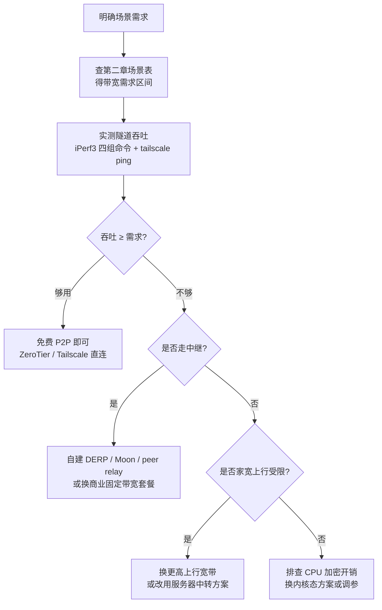

# 第四章：实战——用 iPerf3 测自家隧道带宽并选型

前几章建立了"带宽从哪来"的心智模型，也讲了 ZeroTier / Tailscale 这类方案没有套餐带宽数字、**只能靠实测**。这一章把承诺兑现：用 iPerf3 把自家隧道真正跑一遍，再用 `tailscale ping` 判断走直连还是中继，最后对照第二章的场景表落到"我家这个情况该选哪个方案"。为什么必须亲自动手？因为结论取决于你的物理链路、CPU 加解密能力和 NAT 类型——这三样在任何人主页上都查不到，只有端到端跑一次才知道。

## 4.1 iPerf3 测速配方

### 4.1.1 四组命令：先复制，跑起来

先给整套配方。iPerf3 是端到端吞吐测试的事实标准：隧道（ZeroTier / Tailscale / frp 都一样）在你的系统里表现为一块虚拟网卡，iPerf3 只管在这块网卡上灌数据，所以**无论什么穿透方案都能用同一套命令测**[^c4-S01]。

场景假定：**家里的 NAS / 旧电脑是被穿透端（服务端），你外面的笔记本是客户端**。

```bash
# ① 服务端：在隧道内网主机（被穿透端，如家里 NAS）启动
iperf3 -s -p 5201

# ② 上行测速：外面笔记本 → 家里（客户端视角的"上传"）
iperf3 -c <隧道内网IP> -p 5201 -P 4 -t 30 -O 5

# ③ 下行测速：家里 → 外面笔记本（加 -R，客户端视角的"下载"）
iperf3 -c <隧道内网IP> -p 5201 -R -P 4 -t 30 -O 5

# ④ UDP 丢包/抖动测试：UDP 必须显式 -b，默认只有 1 Mbit/s
iperf3 -c <隧道内网IP> -u -b 20M -t 30
```

`<隧道内网IP>` 在哪看？Tailscale 用 `tailscale ip`（形如 `100.64.x.x`），ZeroTier 用 `zerotier-cli listnetworks`（形如 `10.147.x.x`）。开测前先确认两端能互相 ping 通（用 4.2 的 `tailscale ping`），否则测出来是网络不通而不是带宽。

> [!tip] 大白话
> 把 iPerf3 想成**给管道灌水测管径**：它往隧道里尽量塞满数据，看 30 秒能塞过去多少，就知道这条"管"实际能过多少——不是包装上写的理论值，是真实值。

### 4.1.2 关键参数：每个参数在干什么

| 参数 | 作用 | 什么时候用 |
|------|------|-----------|
| `-P 4` | 并发 4 条流 | 只在怀疑"CPU 加解密是瓶颈"时能提升吞吐；远程桌面改成 `-P 1` |
| `-R` | 反向：服务端 → 客户端 | 测"从家里拉数据"这个方向 |
| `-b 20M` | UDP 目标带宽 | 测 UDP 丢包/抖动**必须**显式给，否则默认仅 1 Mbit/s |
| `-O 5` | 跳过前 5 秒 | 跳过 TCP 慢启动，让测量进入稳态再读数 |
| `-t 30` | 测试时长（秒） | 建议 ≥30s，太短测不准 |
| `-p 5201` | 端口 | 默认 5201，两端要一致 |

> [!tip] 大白话
> `-P` 多流像**并排多根水管**：如果瓶颈是"水管太细"（带宽不够），并排多少根都没用；如果瓶颈是"水泵太慢"（CPU 加解密），多开几根才能把细管灌满。所以它只在 CPU 受限时有意义。

方向的坑必须单独说清楚，这是最容易测反的地方：

> [!warning] 易错点
> 这里的"上行/下行"是**以外面笔记本（客户端）为参照**：不带 `-R` 是笔记本在上传（数据从外面流向家里）；带 `-R` 是笔记本在下载（数据从家里流向外面）。穿透最常见的"在外面访问家里 NAS 拉文件"走的是带 `-R` 那一条——而这条恰恰吃**家里宽带的上行**，也就是第 1 章说的隐形瓶颈。注意"上行测速"那条命令测的是**笔记本的上行，不是家宽上行**；测家宽上行要用 4.3.1 的方法。测前想清楚要模拟哪个方向，别测反了。

跑完看结尾两行：

```
[SUM] 0.00-30.00 sec   112 MBytes   31.3 Mbits/sec   sender
[SUM] 0.00-30.00 sec   112 MBytes   31.3 Mbits/sec   receiver
```

`31.3 Mbits/sec` 就是这条隧道的端到端吞吐。`-P 4` 的结果是四条流**加总**的聚合值；如果想知道"远程桌面能跑多少"，得看单流（`-P 1`）——因为 RDP 基本是单条流，聚合值会高估它的实际体验[^c4-S02][^c4-S07]。

## 4.2 判断走直连还是中继

测出来的数字对不对，先要回答一个问题：**这条路是直连还是中继？** 两条路带宽来源完全不同（第 1 章），数字可能差一个量级——第 3 章的跨洋实测里，共享 DERP 只有 ~2.2Mbps，自建 peer relay 后到 27-35Mbps[^c4-S02]。判断走哪条路，Tailscale 一条命令：

```bash
tailscale ping <对端节点>
```

输出里带 `via DERP(...)` 就是中继，没有就是直连：

```
pong from raspberry-pi (100.64.0.3) via DERP(tok) in 84ms   # 中继：流量经过 DERP 转发
pong from raspberry-pi (100.64.0.3) in 24ms                  # 直连：两点直接打通
```

> [!tip] 大白话
> 把 `tailscale ping` 想成**查快递物流轨迹**：直连是"发货方直接送到你手上"（没有中转站），`via DERP` 是"中间绕了中转站"。中转站越远、越挤，你的货（数据）越慢。

> [!warning] 易错点
> `tailscale ping` 显示的是**当前这一刻**的路径。NAT 状态、对端是否在线都会让路径在直连/中继之间来回切换，多测几次、隔段时间再确认一次，别拿一次结果下结论。

ZeroTier 没有 `tailscale ping` 那样一行命令直接标出是否走 root 中继，官方对 root 只说明"只增加延迟、不保证可靠性"，也没有给限速量化数字[^c4-S06]。实用的间接判断：① 延迟比两地直连的物理 RTT 高出一大截；② 同一隧道测出的吞吐明显低于直连预期。如果经常被迫走中继，自建 Moon 或改走 Tailscale 自建 DERP 是两条常见出路（详见第 5 章）。

拿到吞吐数字后，对照第二章的场景表做"够不够"判断。**远程桌面这类交互场景，重点看 `-P 1` 单流结果**，别被 `-P 4` 的聚合数字骗了[^c4-S02][^c4-S07]：

```bash
# 远程桌面模拟：单流测一遍
iperf3 -c <隧道内网IP> -p 5201 -P 1 -t 30 -O 5
```

## 4.3 按自家场景选型

### 4.3.1 第一步永远是：先测家宽上行

穿透流量大量消耗**被穿透端的上行**。家里千兆下行不代表上行也快——家宽上行常只有 30-50Mbps，国内甚至有运营商限到 5Mbps 的报道[^c4-G07]。这一步决定了你所有方案的上限：

```bash
# 方法 A（最快）：任何测速网站或 speedtest-cli，看"上传"那一栏
# 方法 B（更精确）：把 iperf3 服务端放在外面一台机器上，从家里不加 -R 连它
#   家里是客户端、默认由客户端发送 → 数据从家里流出 → 测的就是家宽上行
#   外面机器：iperf3 -s -p 5201
#   家里机器：iperf3 -c <外面IP> -p 5201 -t 30
```

> [!warning] 易错点
> 如果家宽上行只有 5Mbps，那么"在外面从家里拉数据"这个方向**任何套餐都跑不过 5Mbps**——商业套餐限的是隧道出口带宽，不是你家的物理上行。先测上行，能省掉后面大量无效折腾。

### 4.3.2 决策流程：把需求、实测、判断、选型串起来



文字版同一条路：

1. **明确场景需求**：你主要干哪件事？远程桌面 / 文件传输 / 串流 / 会议 / 网页？从第二章场景表查出对应带宽区间（中度远程桌面 ≈3Mbps、1080p 会议 ≈3.8Mbps、4K 串流 ≥25Mbps）[^c4-S04][^c4-G03][^c4-G04]。
2. **实测隧道吞吐**：用 4.1 的 iPerf3 配方 + 4.2 的 `tailscale ping`，拿到"上行、下行、UDP 丢包、直连/中继"四样数据。
3. **判断够不够**：把实测数字和需求区间对照。
4. **够用** → 免费 P2P 方案（ZeroTier / Tailscale）直连即可，零成本。
5. **不够** → 追断点：走中继 → 自建 relay/DERP/Moon 或换商业套餐；家宽上行受限 → 换宽带或走服务器中转；CPU 加密开销 → 换内核态方案（第 3 章里 Tailscale 用户态直连 268Mbps vs Netmaker 内核态 852Mbps 就是差距）[^c4-S07]。

> [!example] 一个完整例子
> 你主要在外面用 RDP 连家里电脑办公。第一步查表：中度远程桌面 ≈3Mbps。第二步实测：`tailscale ping` 显示直连；`-P 1` 单流测出 25Mbps；`-R` 测出 8Mbps。第三步判断：25Mbps ≥ 3Mbps，够用 → 结论：免费 Tailscale 直连即可，不用买套餐。如果 `-P 1` 只有 1.5Mbps 且输出 `via DERP`，说明打洞失败走中继了 → 自建 DERP 或换商业套餐。

### 4.3.3 选型参考：三类方案怎么取舍

| 你的场景 | 需要带宽 | 首选方案 |
|----------|----------|----------|
| 轻量办公 / 网页 / API | ≈2Mbps | 免费 P2P 直连；或商业最低档（花生壳专业 2M）[^c4-G02] |
| 中度远程桌面 / 720p 会议 | ≈4Mbps | 免费 P2P 直连；或商业 3-5M |
| 重度远程桌面 1080p / 1080p 会议 | ≈8Mbps | 免费 P2P 直连优先；中继保底需自建 |
| 4K 串流 / NAS 大文件 | ≥15-25Mbps | 商业套餐基本覆盖不了 → P2P 直连或自建中转 |

- **免费 P2P（ZeroTier / Tailscale）**：直连够用时的首选，零成本、官方不限速。代价是打洞失败会静默回退中继、带宽断崖——这正是第 5 章要排查的头号坑。
- **商业固定带宽套餐（花生壳 2/3/5/7Mbps）**：带宽稳定可预期，适合打洞失败频繁、需要省心和保障的场景。但先确认家宽上行 ≥ 套餐带宽，否则买多少都跑不满[^c4-G07]。
- **自建中转（frp / nps / 自建 DERP）**：需要大带宽（NAS 大文件、4K 串流）或在意可控性时选它——用云服务器上行容量换稳定带宽，代价是要自己调优（frp 的 TCP 窗口/缓冲、共享带宽 QoS 都会拉低实际吞吐）[^c4-G02]。

## 本章小结

- iPerf3 四组命令覆盖"上行、下行（`-R`）、UDP 丢包（`-u` 必须带 `-b`）"三个维度；`-O 5` 跳过慢启动、`-t` 至少 30s 才读稳态数字。
- 远程桌面看单流（`-P 1`）结果，别被 `-P 4` 聚合值误导；`tailscale ping` 带 `via DERP` 就是走中继。
- 穿透流量吃被穿透端的上行，选型前先测家宽上行，否则套餐买再高也跑不满。
- 选型决策：明确场景需求 → 实测隧道吞吐 → 够用就用免费 P2P，不够再按"中继 / 上行 / CPU 加密"三根断点逐项追。
- 阈值速记：2Mbps 轻量办公、4Mbps 中度远程桌面/720p、8Mbps 重度远程桌面/1080p；4K 串流和 NAS 大文件要 ≥15-25Mbps，只能走直连或自建。

下一章进入排错与 FAQ：为什么买的 8Mbps 跑不到 8Mbps？ZeroTier 和 Tailscale 谁更快？打洞失败带宽骤降怎么办？遇到问题随时回查第 5 章。

---

[^c4-S01]: iperf3 官方手册（ESnet）— [invoking iperf3](https://software.es.net/iperf/invoking.html)
[^c4-S02]: Tailscale 官方博客 — [Using Tailscale's Peer Relays to fix a homelab connection from across the globe](https://tailscale.com/blog/peer-relays-international-networks)
[^c4-S04]: Microsoft — [RDP Network Guidelines](https://learn.microsoft.com/en-us/windows-server/remote/remote-desktop-services/network-guidance)
[^c4-S06]: ZeroTier 官方文档 — [Bandwidth Considerations](https://docs.zerotier.com/faq/bandwidth/)
[^c4-S07]: TechOverflow — [iPerf3 基准测试：ZeroTier vs Netmaker vs Tailscale vs 直连](https://techoverflow.net/zh/2022/08/19/iperf3-jizhun-ceshi-zerotier-vs-netmaker-vs-tailscale-vs-zhijie-jiaohuan-lianjie/)
[^c4-G02]: frp/nps 自建中转瓶颈（多篇社区汇总）— https://github.com/fatedier/frp/issues/4758
[^c4-G03]: Zoom 官方带宽用量表 — Calculating bandwidth usage for Zoom meetings, https://library.zoom.com/.../calculating-bandwidth-usage-for-zoom-meetings-and-phone
[^c4-G04]: Synology KB — [Does my Synology NAS support streaming 4K videos](https://kb.synology.com/zh-tw/DSM/tutorial/Does_my_Synology_NAS_support_streaming_4k_videos)
[^c4-G07]: 川观新闻 — 运营商上行限速报道 https://cbgc.scol.com.cn/news/5907145
