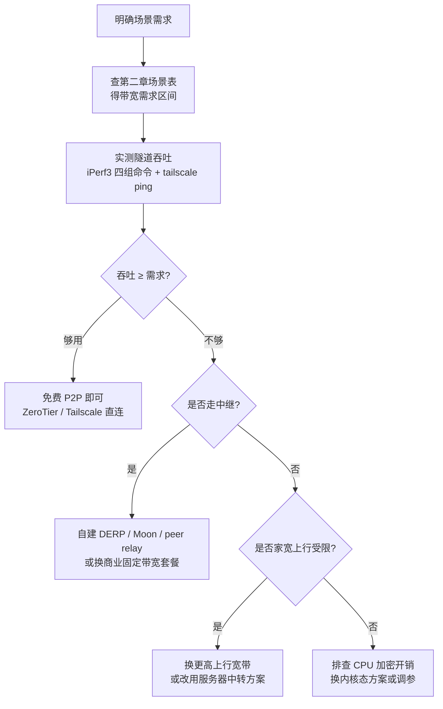

# 内网穿透带宽性能分析

> [!summary] 笔记简介
> 内网穿透配好后，"我到底能跑多快"取决于架构而非套餐页。本篇先从带宽来源（P2P 直连 vs 服务器中转）建立心智模型；再用一张场景总表把 2/4/8（及 2/3/5/7）Mbps 各能跑什么讲清；接着看 ZeroTier / Tailscale 这类没有套餐带宽的方案如何评估；然后动手用 iPerf3 实测自家隧道并给出选型决策流程；最后沉淀五个常见坑、FAQ 与进阶方向。适合对内网穿透已有概念、想搞清带宽评估的读者。

## 目录

1. [[#第一章：内网穿透的带宽从哪来——P2P 直连 vs 服务器中转|第一章：内网穿透的带宽从哪来——P2P 直连 vs 服务器中转]]
2. [[#第二章：固定带宽套餐能干什么——2/4/8（及 2/3/5/7）Mbps 场景对照|第二章：固定带宽套餐能干什么——2/4/8（及 2/3/5/7）Mbps 场景对照]]
3. [[#第三章：ZeroTier / Tailscale 的带宽怎么看——直连、中继与实测|第三章：ZeroTier / Tailscale 的带宽怎么看——直连、中继与实测]]
4. [[#第四章：实战——用 iPerf3 测自家隧道带宽并选型|第四章：实战——用 iPerf3 测自家隧道带宽并选型]]
5. [[#第五章：常见坑、FAQ 与进阶方向|第五章：常见坑、FAQ 与进阶方向]]

---

# 第一章：内网穿透的带宽从哪来——P2P 直连 vs 服务器中转

配置好内网穿透后，第一个让人困惑的问题通常是："我到底能跑多快？" 答案不在套餐页，而在穿透的**架构**。这一章先回答"带宽从哪来"，建立 [[P2P]] 直连 vs 服务器[[中继]]两类架构的心智模型；再讲清 [[Mbps]]、[[带宽]]、[[吞吐量]]与[[上行带宽|上行/下行]]的概念；最后看商业套餐为什么按固定 Mbps 卖。

## 1.1 两类架构决定带宽来源

内网穿透按流量路径分两类，带宽来源完全不同。

**P2P（[[NAT 打洞]]）直连**：节点间建立直连通道，流量**不经过厂商服务器**。带宽上限 = 两端物理链路 + 两端 CPU/加解密能力。ZeroTier 官方说得直白：直连时"传输速度取决于你的 CPU 与网络能多快压缩、加密、发送数据包，以及对端能多快接收"；厂商不限速，也读不了加密包内容[^c1-S06]。

> [!tip] 大白话
> 把 P2P 直连想成**直接去朋友家串门**——你们之间的路有多宽，搬东西就有多快，中间没有快递中转站替你们限速。所以带宽上限约等于"路宽"（物理链路）加上双方"手速"（CPU 加解密）。

**服务器中继（Relay）**：打洞失败时，流量经厂商或自建服务器转发。带宽上限 = 中转服务器带宽/线路 + 限速策略 + 两端物理链路。中继服务器是共享资源：Tailscale 的 DERP 本质是 TCP 中继（TLS/443），官方明确"不为高性能优化"，会对吞吐执行速率限制与 fair usage（公平使用）限速[^c1-S03]；自建 frp/nps 中转时，云服务器带宽往往成为第一瓶颈[^c1-G02]。

> [!tip] 大白话
> 中继就像**把东西先送到快递中转站再转发**——中转站的吞吐能力、分拣速度决定了你能搬多快，而且这是和一堆人共用的，高峰期更要排队限速。

量化差距有多大？RustDesk 实测 P2P 直连可达 **850Mbps**，而走服务器中继时受限于家宽上行（典型 30Mbps）；打洞失败会自动回退中继[^c1-A5]。Tailscale 一个跨洋实测同样惊人：经共享 DERP 中继仅约 **2.2Mbps**，自建 peer relay 后提升到 **27-35Mbps**，约 12.5 倍[^c1-S02]（详见第 3 章）。这也是第 5 章要重点排查的"带宽断崖"来源。

## 1.2 理解 Mbps：带宽、吞吐量、上行与下行

商业套餐用固定 Mbps 标注（如花生壳"2Mbps/映射"），但 Mbps 只是起点，要分清三个概念：

- **[[带宽]]**：链路的"理论容量"，如 100Mbps 宽带。类比高速公路的设计车道数。
- **[[吞吐量]]**：实际通过的数据速率，通常低于带宽——协议开销、加密、共享争抢、丢包重传都会把它拉低（自建中转里"共享带宽 + QoS + 单线程限制"尤其常见）[^c1-G02]。
- **上行 vs 下行**：下行是你"下载/接收"，上行是你"上传/发送"。家宽通常是"下多上少"。

**穿透流量大量消耗"被穿透那一端"的上行**：你在外网访问家里 NAS 拉文件时，数据从家里流向外网，跑的是家里宽带的上行。而家庭宽带下行 100-1000Mbps 很常见，上行却常只有 30-50Mbps[^c1-S02]；国内甚至有运营商把上行限速到 5Mbps 的报道[^c1-G07]。

> [!tip] 大白话
> 把下行想成**收货口**，上行想成**发货口**。运营商给你开了很宽的收货口（100Mbps 下行），发货口却只有窄窄一条（30Mbps 上行）。你从家里往外拿文件走的是发货口——所以穿透带宽的隐形瓶颈常常在**上行**。

为什么商业套餐按固定 Mbps 卖？以花生壳为例，定价参数是"每映射固定带宽 + 映射数 + 并发数"：专业版 **2Mbps/映射**、商业版 **3Mbps**、旗舰 **5Mbps**、铂金 **7Mbps**，端口映射 2-4 条、并发 150-1500[^c1-S05]。带宽不是无上限的云资源，而是按"每路映射给多少容量"切分来收费。

## 1.3 商业套餐的两种计费模型

商业穿透套餐大致分两种模型，先分清，才知道"这个带宽能干什么"该怎么判断：

| 模型 | 计费方式 | 代表 | 适合场景 |
|------|----------|------|----------|
| **带宽包** | 稳定低速、不限流量 | 花生壳 2/3/5/7 Mbps（流量不限）[^c1-S05] | 持续在线场景：远程桌面、内网网站 |
| **流量包** | 不限速、按量计费 | ngrok 免费 1GB/月，超额 $0.10/GB[^c1-G01] | 低流量/突发场景：偶尔远程、API 调用 |

> [!tip] 大白话
> 带宽包像**包月不限次数的健身房年卡**——每天能用多久都行，但教练一次只带你练一小段（限速）。流量包像**按次计费的健身房**——练多累多猛都行（不限速），但按次（GB）掏钱，天天去就贵了。

两种模型的判断逻辑不同：

- **带宽包**看的是"某档速度够不够跑我的场景"——这是第 2 章的重点（2/3/5/7 与 2/4/8 Mbps 分别能跑什么）。
- **流量包**看的是"我每月跑多少 GB、单价累不累"——低流量 + 突发用流量包划算；重流量 + 持续在线用带宽包更可控，否则超额费用会快速累计。

## 本章小结

- 内网穿透带宽来自两类架构：P2P 直连看两端链路与 CPU/加密，服务器中继看中转服务器带宽与限速策略。
- 打洞失败自动回退中继，是"带宽断崖"的最大来源（RustDesk 直连 850Mbps vs 中继约 30Mbps 就是量级差）。
- 穿透流量大量消耗**被穿透端的上行**；家宽下行再高，上行受限也是隐形瓶颈。
- 商业套餐两种模型：带宽包（不限流量、限速）与流量包（不限速、按量计费），决定"够不够用"的判断角度完全不同。

下一章我们把固定的 Mbps 数字落到具体场景：2/4/8 Mbps 到底能跑远程桌面、视频会议、NAS 文件传输中的哪些事，缺多少、够多少。

---

[^c1-S06]: ZeroTier 官方文档 — [Bandwidth Considerations](https://docs.zerotier.com/faq/bandwidth/)
[^c1-S02]: Tailscale 官方博客 — [Using Tailscale's Peer Relays to fix a homelab connection from across the globe](https://tailscale.com/blog/peer-relays-international-networks)
[^c1-S03]: Tailscale 官方博客 — [Improving NAT traversal, pt. 3](https://tailscale.com/blog/nat-traversal-improvements-pt3-looking-ahead)
[^c1-S05]: 花生壳 Oray 套餐页 — https://www.myoray.com/vir_goods/shells.html
[^c1-G01]: ngrok Pricing — https://ngrok.com/pricing
[^c1-G02]: frp/nps 自建中转瓶颈（多篇社区汇总） — https://github.com/fatedier/frp/issues/4758
[^c1-G07]: 川观新闻 — 运营商上行限速报道 https://cbgc.scol.com.cn/news/5907145
[^c1-A5]: RustDesk 直连/中继实测分析 — https://www.cnblogs.com/32bin/p/21641255

# 第二章：固定带宽套餐能干什么——2/4/8（及 2/3/5/7）Mbps 场景对照

上一章讲清了带宽从哪来，这一章落到你最初的问题上：2Mbps、4Mbps、8Mbps 各能干什么？答案要先换个问法——先别盯数字，先看**场景**。远程桌面、视频会议、NAS 文件传输、媒体串流对[[带宽]]的需求能差一个数量级；同一档带宽跑轻量远程桌面绰绰有余，跑 4K 串流却寸步难行。这一章先用一张总表把场景与带宽对上号，再逐档拆解 2/4/8 的边界，最后解释国内 2/3/5/7 档位怎么对应，以及为什么"带宽够"不等于"体验好"。

## 2.1 各场景带宽需求总表

下表是"场景带宽需求对照表"，改编自深度收集 §3.4。左边是**场景**与**推荐带宽**，右边三列是你分别买 2 / 4 / 8 Mbps 时，每个场景"跑不跑得动"的体验分档。

| 场景 | 推荐带宽 | 来源 | 2Mbps | 4Mbps | 8Mbps |
|------|----------|------|-------|-------|-------|
| [[远程桌面]] 轻量（文字/办公） | 1.5 Mbps | S04 | ✅ 可用 | ✅ 流畅 | ✅ 富余 |
| 远程桌面 中度（日常操作） | 3 Mbps | S04 | ⚠️ 勉强 | ✅ 可用 | ✅ 流畅 |
| 远程桌面 重度（图形/1080p） | 5 Mbps | S04 | ❌ | ⚠️ 勉强 | ✅ 可用 |
| 远程桌面 4K | 15 Mbps | S04 | ❌ | ❌ | ⚠️ 不够 |
| 视频会议 720p | 1.2–2.6 Mbps | G03 | ⚠️ | ✅ | ✅ |
| 视频会议 1080p（1:1） | 3.8 Mbps | G03 | ❌ | ⚠️ | ✅ |
| 视频会议 1080p60 | 12.8 Mbps | G03 | ❌ | ❌ | ⚠️ |
| 网页浏览/API | <1 Mbps | 推断 | ✅ | ✅ | ✅ |
| NAS 文件传输（同步/备份） | ≥5 Mbps（越大越好） | G02 | ❌ 慢 | ⚠️ 慢 | ⚠️ 可用 |
| 媒体串流 1080p | ≥码率×1.5（≈6-15） | G04 | ❌ | ⚠️ | ⚠️ |
| 媒体串流 4K | ≥25 Mbps 上行 | G04 | ❌ | ❌ | ❌ |
| 纯语音通话 | 60–100 kbps | G03 | ✅ | ✅ | ✅ |

读表之前有三个前提要记住：

- **"推荐带宽"不是"最低带宽"**。推荐值通常留了余量；低于推荐值不是不能用，而是更卡、画质更低或耗时更长。
- **数字是理想前提下的估算**：RDP 与会议数据以 30fps、丢包率 <0.1% 为前提（S04）；媒体串流 1080p 的 6-15Mbps 是"码率 ×1.5"的估算（G04），具体取决于你片源的[[码率]]。
- **✅ / ⚠️ / ❌ 是体验分档**：✅ 流畅，⚠️ 勉强（有可见卡顿或压缩感），❌ 基本不可用或慢到失去意义。

> [!warning] 数字前提
> 表内 RDP 与视频会议数字都是理想前提下的估算：以 **30fps、丢包率 <0.1%** 为准（S04）。如果你的链路丢包多、延迟高，或者会议要 60fps，实际所需带宽会明显上浮。

> [!tip] 大白话
> 把带宽想成**水管粗细**，场景想成**用水方式**。同样一根水管：刷牙（纯文字远程桌面）很省水，冲澡（中度远程桌面）够用，泡澡放水（1080p 会议）就慢了，给消防车供水（4K 串流）完全不够。买套餐就是选水管——先想清楚你要做什么，再决定买多粗的管子。

## 2.2 2 Mbps 能干什么

2Mbps 是"保底档"：画面密集的场景跑不动，但文字、语音、轻交互类的活都够。

- **✅ 轻量远程桌面（1.5Mbps）**：写文档、敲代码、看报表、改配置这类以文本为主的办公，RDP 推荐 1.5Mbps（S04），2Mbps 够用且有余量。这也是"应急远程"最常见的用法。
- **✅ 网页浏览 / API（<1Mbps）**：普通网页、调用内网 API 没问题。这一项更接近经验推断而非权威数字——网页体积小、突发性强，2Mbps 的持续带宽足够。
- **✅ 纯语音通话（60-100kbps）**：Zoom 语音通话仅需 60-100kbps（G03），在 2Mbps 面前只是零头。
- **⚠️ 中度远程桌面（3Mbps）勉强**：带图形界面的日常操作（拖动窗口、滚动页面、GUI 程序）RDP 推荐 3Mbps（S04），2Mbps 会明显感到画面刷新变慢、有压缩糊感，能用但不流畅。
- **❌ 跑不动**：重度远程桌面（5Mbps）、1080p 视频会议（3.8Mbps）、NAS 大文件传输、任何媒体串流——不是"卡"，是"没法用"。

> [!note] 为什么远程桌面比视频会议更省带宽？
> 远程桌面传输的是"变化了的屏幕画面"，RDP 会压缩并只发送变化的区域（S04），静态办公时数据量很小；视频会议则要持续传输完整画面与声音，码率固定更高（G03）。所以"看屏幕"和"传视频"对带宽的需求差了一个量级。

> [!tip] 大白话
> 2Mbps 像**一根吸管**：喝饮料（文字、语音、网页）很合适，想用它给浴缸放水（重度远程桌面、视频会议、传大文件）就等到天荒地老。所以 2Mbps 套餐的正确用法是"轻量办公 + 应急"，别指望它跑重活。

## 2.3 4 Mbps 能干什么

4Mbps 是"实用档"：覆盖日常远程办公的大部分场景，但还没到"什么都行"。

- **✅ 中度远程桌面（3Mbps）**：日常操作带图形界面的远程桌面，RDP 推荐 3Mbps（S04），4Mbps 跑得流畅。这是 4Mbps 最典型的使用场景。
- **✅ 720p 视频会议（1.2-2.6Mbps）**：Zoom 720p 单路视频推荐 1.2-2.6Mbps（G03），4Mbps 余量充足，1:1 会议流畅。
- **⚠️ 重度远程桌面（5Mbps）勉强**：图形/1080p 级别的重度远程桌面推荐 5Mbps（S04），4Mbps 略低于推荐值，画面复杂时会有卡顿或压缩感。
- **⚠️ 1080p 会议（3.8Mbps）勉强**：1080p 1:1 会议推荐 3.8Mbps（G03），刚好卡在 4Mbps 边缘——静态画面尚可，画面一动就可能模糊。
- **⚠️ NAS 文件传输（≥5Mbps）慢**：文件传输类推荐 ≥5Mbps（G02），4Mbps 传小文件可以接受，传大文件明显偏慢。
- **❌ 跑不动**：4K 远程桌面（15Mbps）、1080p60 会议（12.8Mbps）、4K 媒体串流（≥25Mbps）。

> [!tip] 大白话
> 4Mbps 像**一根中号水管**：日常冲澡（中度远程桌面、720p 会议）很舒服，想泡澡（1080p 会议、重度桌面）水就有点小，给消防车供水（4K 串流）没戏。它是多数个人远程办公的"性价比之选"。

## 2.4 8 Mbps 能干什么

8Mbps 是"舒适档"：覆盖绝大多数单人远程办公与轻度文件需求，是固定带宽套餐里最"不憋屈"的选择。

- **✅ 重度远程桌面（5Mbps）**：图形/1080p 级别的重度远程桌面，RDP 推荐 5Mbps（S04），8Mbps 跑得很从容。
- **✅ 1080p 视频会议（3.8Mbps）**：1080p 1:1 会议推荐 3.8Mbps（G03），8Mbps 余量近一倍，画面稳定。
- **✅ 轻度文件传输**：[[NAS]] 文件传输推荐 ≥5Mbps（G02），8Mbps 传文档、图片、小体积备份没问题，属于"可用"档。
- **⚠️ 1080p60 会议（12.8Mbps）**：60fps 的 1080p 会议需要 12.8Mbps（G03），8Mbps 跑不满，会降帧或降画质。
- **⚠️ 4K 远程桌面（15Mbps）**：4K 分辨率远程桌面推荐 15Mbps（S04），8Mbps 只能以更低分辨率或更高压缩运行。
- **⚠️ NAS 大文件仍偏慢**：同步/备份这类"越大越好"的场景，带宽永远是越高越好（G02）——不是不能传，是"慢"。
- **❌ 跑不动**：4K 媒体串流（≥25Mbps 上行）。

> [!example] 8Mbps 每秒能传多少？
> 8Mbps ÷ 8 = **1MB/s**。每秒 1MB：打开网页、传文档绰绰有余；但传一个 4GB 的电影约需 **68 分钟**。这就是为什么文件传输场景从不说"够用"，只说"越大越好"（G02）。

## 2.5 国内 2/3/5/7 Mbps 档位怎么对应

看到这里你可能发现一个尴尬：**2/4/8 并不是国内主流档位**。以花生壳（Oray）为例，它的固定带宽档位是 2/3/5/7 Mbps，且价格与带宽非线性：

| 花生壳档位 | 固定带宽 | 落在 2/4/8 标尺的哪段 |
|------|------|------|
| 测试号 | 3 Mbps（仅 TCP/HTTP） | 2 与 4 之间 |
| 专业版 | 2 Mbps | 2 档 |
| 商业版 | 3 Mbps | 2 与 4 之间 |
| 旗舰版 | 5 Mbps | 4 与 8 之间 |
| 铂金版 | 7 Mbps | 接近 8 档 |

（S05，流量均不限）

注意测试号 3Mbps 反而比专业版 2Mbps 带宽高——差异不在带宽，而在集群、并发连接数与协议支持（S05）。**带宽只是定价参数之一**。

那"4/8"从哪来？它更像一个**便于理解的通用标尺**，用于把"某档带宽能跑什么"讲清楚。关键结论是：**档位数字因厂商而异，但评估方法完全一致**——查出自家的场景需求（2.1 总表），与套餐档位一比，就知道够不够。

> [!tip] 大白话
> 2/4/8 和 2/3/5/7 就像**不同超市卖鸡蛋的包装**：A 超市一盒 4 个，B 超市一盒 3 个，但判断"够不够吃"的永远是"一共几个蛋"（实际带宽），而不是盒子上的标签。买套餐前先对照场景表，别被档位数字绕晕。

## 2.6 别忘了延迟：带宽够 ≠ 体验好

把带宽讲清楚后，还要泼一盆冷水：**带宽是必要条件，不是充分条件**。对远程桌面、串流这类交互型场景，[[延迟]]（RTT）与丢包往往比带宽更能决定体验。

- **远程桌面对 RTT 尤其敏感**：微软 RDP 网络指南把 RTT ≤20ms 列为交互辅助技术的体验目标（S04）。你远程操作家里电脑，每次点击、按键都要"发出去-处理-画面传回来"一个来回；RTT 越高，这个来回越慢，鼠标漂移、输入迟滞越明显。
- **带宽再大也救不了高延迟**：8Mbps 跑重度远程桌面（5Mbps 需求）绰绰有余，但如果 RTT 高达 200ms，每点一下要等近半秒才有反馈，体验依然很差。第 1 章的 Tailscale 跨洋案例就是如此：共享 DERP 带宽仅 2.2Mbps、延迟 452ms，自建 peer relay 后延迟降到 298ms——改善的不只是速度（S02）。
- **丢包是隐形杀手**：会议/串流场景丢包会直接花屏、声音断续、触发重传，实际所需带宽随之上升——这也是数字前提强调"丢包 <0.1%"的原因（S04）。

> [!tip] 大白话
> 带宽是**马路有多宽**（一次能并排开几辆车），延迟是**路上有多少红绿灯**（开一个来回要等多久）。远程桌面像开车：马路再宽（8Mbps），一路全是红灯（高 RTT），你也开不快。买套餐只能买到"路宽"，路况（延迟）得靠选好线路、少绕中继来解决。

> [!warning] 判断体验别只看带宽
> 用 2/4/8 选套餐时记住：带宽决定"能不能跑"，延迟与丢包决定"跑得顺不顺"。如果远程桌面卡顿，先用工具查延迟与丢包（第 4 章的 iPerf3 可以测），别急着加钱升带宽。

## 本章小结

- 各场景带宽需求相差一个数量级：轻量 RDP 1.5Mbps 到 4K 串流 ≥25Mbps；数字以 **30fps、丢包 <0.1%** 为前提（S04）。
- **2Mbps**：轻量远程桌面/网页/语音够用；中度远程桌面勉强；视频会议与 NAS 大文件跑不动。
- **4Mbps**：中度远程桌面与 720p 会议流畅；重度远程桌面与 1080p 会议勉强；4K 与 1080p60 无解。
- **8Mbps**：重度远程桌面（5Mbps）与 1080p 会议（3.8Mbps）从容；轻度文件传输可用；4K 串流（≥25Mbps）仍不行。
- 国内固定带宽主流档位是 **2/3/5/7**（花生壳）而非 2/4/8；档位因厂商而异，**评估方法一致**。
- 带宽够 ≠ 体验好：远程桌面对 RTT 敏感（≤20ms 目标），延迟与丢包对体验的影响常大于带宽。

下一章跳出"套餐数字"，看 ZeroTier / Tailscale 这类**没有套餐带宽**的方案：为什么它们不标固定 Mbps？直连和中继（DERP/root）的带宽来源差在哪？以及怎么用 `tailscale ping` 判断自家走的是直连还是中继。

---

[^c2-S04]: Microsoft 官方文档 — [Remote Desktop Services Network Guidance](https://learn.microsoft.com/en-us/windows-server/remote/remote-desktop-services/network-guidance)
[^c2-G03]: Zoom 官方文档 — Calculating bandwidth usage for Zoom meetings and Phone（https://library.zoom.com/.../calculating-bandwidth-usage-for-zoom-meetings-and-phone）
[^c2-G02]: frp/nps 自建中转瓶颈（多篇社区汇总） — https://github.com/fatedier/frp/issues/4758
[^c2-G04]: Synology 知识库 — [Does my Synology NAS support streaming 4K videos](https://kb.synology.com/zh-tw/DSM/tutorial/Does_my_Synology_NAS_support_streaming_4k_videos)
[^c2-S05]: 花生壳 Oray 套餐页 — https://www.myoray.com/vir_goods/shells.html

# 第三章：ZeroTier / Tailscale 的带宽怎么看——直连、中继与实测

上一章讲的"买套餐"方案，套餐页会白纸黑字写 2Mbps、5Mbps。但打开 ZeroTier 或 Tailscale 的定价页，你会发现找不到任何带宽数字——不是厂商漏写，而是这类方案的带宽逻辑完全不同。这一章回答：为什么这类方案没有套餐带宽、直连与中继的带宽来源差异在哪、用户态与内核态实现会造成多大实测差距，以及怎么"看"自家带宽。

## 3.1 为什么这类方案没有套餐带宽数字

ZeroTier 官方 FAQ 说得很直接：**直连时流量不经过 ZeroTier 服务器**，传输速度取决于两端设备的 CPU 与网络加解密收发能力；厂商不限速，也读不了加密包内容[^c3-S06]。

订阅限制落在"设备数 / 用户数"而不是带宽：

- Tailscale Personal 免费 **6 用户 / 不限设备**[^c3-G05]；
- ZeroTier 免费 **10 设备 / 1 网络**（老账号 25 设备）[^c3-G06]。

付费档买的是更多设备、更多网络、集中策略与团队管理，**不卖"更高带宽"**。ZeroTier 还特别强调：中继场景的性能与订阅等级无关[^c3-S06]。

所以结论是：这类方案的带宽不是套餐参数，而是**实测结果**——套餐页根本没有数字可看。

> [!tip] 大白话
> 把 ZeroTier/Tailscale 想成**给你和远方的朋友之间修一条专属小路**——小路多宽，取决于你们各自家门口的路（两端带宽）和搬东西的手速（CPU 加解密）；修路的人（厂商）不替你们限速，也看不到你们搬了什么。所以套餐页只能写"最多几个设备入网"，写不出"能跑多快"。

## 3.2 直连与中继：带宽来源完全不同

没有套餐带宽数字，不代表没有限制——限制藏在**走直连还是走中继**上。

**直连（[[P2P]]）**：两端直接通信，带宽上限 = 两端物理链路 + 两端 CPU/加密能力（第一章已讲过）。**中继**：打洞失败时流量经过厂商中继服务器，带宽上限变成"中继服务器 + 限速策略 + 两端链路"。

两类工具的官方说法就有差异：

- Tailscale 的 [[DERP]] 是**共享 TCP 中继**（走 TLS/443），官方明确"不为高性能优化"，会对吞吐执行速率限制与 fair usage（公平使用）限速；并且因为它是 TCP，丢包时重传带来的延迟惩罚比纯 UDP 更糟[^c3-S03]。
- ZeroTier 的 root 中继策略不同：官方声明只增加延迟、不主动限速；但没有量化限速数据，实际体验仍需实测[^c3-S06]。

跨洋实测最能说明差距。Tailscale 官方博客记录了一次印度→美国的实测：经共享 DERP 中继，iPerf3 只有约 **2.2Mbps**；启用自建 peer relay 后提升到 **27-35Mbps**（约 12.5 倍），延迟也从 452ms 降到 298ms[^c3-S02]。

> [!warning] 注意
> 中继本质是"打洞失败后的回退路径"，而且是共享资源。对称 NAT 或运营商 [[CGNAT]]（大内网）环境下，UDP 打洞常会失败，流量自动回退到 DERP/root 中继——这就是很多人"带宽突然断崖"的根本原因（第 5 章会展开）。

> [!tip] 大白话
> 直连像**飞机直飞**，中继像**先飞到中转机场再转机**。中转机场吞吐有限、时刻要和所有人共享，遇上天气（丢包）还得排队重飞。所以"有没有经过中转"比"套餐写了多少 Mbps"重要得多。

## 3.3 用户态 vs 内核态：实测吞吐差距

即使同为"直连"，不同实现的实测吞吐也能差出好几倍。一个典型的同链路基准测试（同一台千兆交换机直连两台机器）[^c3-S07]：

| 方案 | 实测吞吐 | 说明 |
|------|----------|------|
| 裸直连（无隧道） | 754 Mbps | 基线 |
| Netmaker（内核态 WireGuard） | 852 Mbps | 内核态加密 |
| ZeroTier | 546 Mbps | 用户态加密 |
| Tailscale | 268 Mbps | 用户态加密 + 重传 |

Tailscale 最低，**并不是因为中继限速**（测试都在同一条链路直连），而是它的实现偏重用户态加密（userspace），加解密在应用程序进程里完成，并伴随重传开销；Netmaker 走内核态 WireGuard，加密在操作系统内核里完成，开销更小[^c3-S07]。

> [!tip] 大白话
> 把加密想成**安检**。内核态像**流水线自动安检**——行李在传送带上边过边检，几乎不停顿；用户态像**每件行李都搬到人工安检台检查**——更灵活，但每件都要折腾一下。隧道数据量越大，"人工安检"的时间占比越明显，实测吞吐就越低。

> [!note] 这说明什么
> 对带宽评估而言：直连时你该看的不是厂商套餐，而是**两端设备的 CPU 和网络实现**。老旧的 NAS、树莓派跑用户态实现，实测吞吐可能远低于桌面机。

## 3.4 怎么"看"自家带宽

三步走，全部靠实测而不是看套餐页。

**第一步：判断走直连还是中继。** Tailscale 用 `tailscale ping`：

```bash
# 用节点名或 Tailscale 内网 IP ping 另一台设备
tailscale ping nas

# 走中继时，输出会带 via DERP：
pong from nas (100.101.102.103) via DERP(ord) in 80ms

# 直连时，输出直接显示对端 IP:端口，没有 DERP：
pong from nas (100.101.102.103) via 203.0.113.9:41641 in 12ms
```

看到 `via DERP(...)` 就是走了中继；显示对端 `IP:端口` 就是直连[^c3-S02]。ZeroTier 没有完全等价的单条命令，但可以用 `zerotier-cli peers` 查看对端路径是否经由 relay（root）中继[^c3-S06]。

**第二步：实测端到端吞吐。** 用 iPerf3 在隧道两端测，不要只用 Speedtest 测本机公网——那测不到隧道自身。完整的四组命令配方放在第四章。

**第三步：把实测结果对照场景需求。** 拿到的数字（比如"直连 500Mbps"或"中继 3Mbps"）去对照第二章的场景需求表，就知道够不够用、差多少。

> [!warning] 别忘了上行
> 隧道里"对外提供服务的那台设备"在大量消耗**它自己的上行**。判断直连吞吐前，先确认两端（尤其是服务端）的上行带宽——家宽上行常只有 30-50Mbps，隧道再快也会被它卡住[^c3-S02]。

## 本章小结

- ZeroTier/Tailscale 没有套餐带宽数字：带宽由两端链路 + CPU/加解密决定，付费档只限设备数/用户数、不限带宽；带宽评估 = 实测。
- 直连与中继的带宽来源完全不同：DERP 是共享 TCP 中继、有 fair usage 限速；跨洋实测共享 DERP ~2.2Mbps，自建 peer relay 后 27-35Mbps。
- 同样的链路，实现方式也影响吞吐：实测裸直连 754 / Netmaker 852 / ZeroTier 546 / Tailscale 268 Mbps；Tailscale 低来自用户态加密 + 重传，不是中继限速。
- "看"带宽三步：`tailscale ping` 判断是否 `via DERP`（直连/中继）→ iPerf3 端到端实测 → 对照场景需求表。

下一章进入动手环节：用 iPerf3 完整测一遍自家隧道，把"直连还是中继""上行有没有被卡"都量化出来，并据此做选型决策。

---

[^c3-S06]: ZeroTier 官方文档 — [Bandwidth Considerations](https://docs.zerotier.com/faq/bandwidth/)
[^c3-S03]: Tailscale 官方博客 — [Improving NAT traversal, pt. 3](https://tailscale.com/blog/nat-traversal-improvements-pt3-looking-ahead)
[^c3-S02]: Tailscale 官方博客 — [Using Tailscale's Peer Relays to fix a homelab connection from across the globe](https://tailscale.com/blog/peer-relays-international-networks)
[^c3-S07]: TechOverflow — [iPerf3 基准：ZeroTier vs Netmaker vs Tailscale vs 直连](https://techoverflow.net/zh/2022/08/19/iperf3-jizhun-ceshi-zerotier-vs-netmaker-vs-tailscale-vs-zhijie-jiaohuan-lianjie/)
[^c3-G05]: Tailscale 官方定价 — https://tailscale.com/pricing
[^c3-G06]: ZeroTier 官方定价 — https://www.zerotier.com/pricing/

# 第四章：实战——用 iPerf3 测自家隧道带宽并选型

前几章建立了"带宽从哪来"的心智模型，也讲了 ZeroTier / Tailscale 这类方案没有套餐带宽数字、**只能靠实测**。这一章把承诺兑现：用 iPerf3 把自家隧道真正跑一遍，再用 `tailscale ping` 判断走直连还是中继，最后对照第二章的场景表落到"我家这个情况该选哪个方案"。为什么必须亲自动手？因为结论取决于你的物理链路、CPU 加解密能力和 NAT 类型——这三样在任何人主页上都查不到，只有端到端跑一次才知道。

## 4.1 iPerf3 测速配方

### 4.1.1 四组命令：先复制，跑起来

先给整套配方。iPerf3 是端到端吞吐测试的事实标准：隧道（ZeroTier / Tailscale / frp 都一样）在你的系统里表现为一块虚拟网卡，iPerf3 只管在这块网卡上灌数据，所以**无论什么穿透方案都能用同一套命令测**[^c4-S01]。

场景假定：**家里的 NAS / 旧电脑是被穿透端（服务端），你外面的笔记本是客户端**。

```bash
# ① 服务端：在隧道内网主机（被穿透端，如家里 NAS）启动
iperf3 -s -p 5201

# ② 上行测速：外面笔记本 → 家里（客户端视角的"上传"）
iperf3 -c <隧道内网IP> -p 5201 -P 4 -t 30 -O 5

# ③ 下行测速：家里 → 外面笔记本（加 -R，客户端视角的"下载"）
iperf3 -c <隧道内网IP> -p 5201 -R -P 4 -t 30 -O 5

# ④ UDP 丢包/抖动测试：UDP 必须显式 -b，默认只有 1 Mbit/s
iperf3 -c <隧道内网IP> -u -b 20M -t 30
```

`<隧道内网IP>` 在哪看？Tailscale 用 `tailscale ip`（形如 `100.64.x.x`），ZeroTier 用 `zerotier-cli listnetworks`（形如 `10.147.x.x`）。开测前先确认两端能互相 ping 通（用 4.2 的 `tailscale ping`），否则测出来是网络不通而不是带宽。

> [!tip] 大白话
> 把 iPerf3 想成**给管道灌水测管径**：它往隧道里尽量塞满数据，看 30 秒能塞过去多少，就知道这条"管"实际能过多少——不是包装上写的理论值，是真实值。

### 4.1.2 关键参数：每个参数在干什么

| 参数 | 作用 | 什么时候用 |
|------|------|-----------|
| `-P 4` | 并发 4 条流 | 只在怀疑"CPU 加解密是瓶颈"时能提升吞吐；远程桌面改成 `-P 1` |
| `-R` | 反向：服务端 → 客户端 | 测"从家里拉数据"这个方向 |
| `-b 20M` | UDP 目标带宽 | 测 UDP 丢包/抖动**必须**显式给，否则默认仅 1 Mbit/s |
| `-O 5` | 跳过前 5 秒 | 跳过 TCP 慢启动，让测量进入稳态再读数 |
| `-t 30` | 测试时长（秒） | 建议 ≥30s，太短测不准 |
| `-p 5201` | 端口 | 默认 5201，两端要一致 |

> [!tip] 大白话
> `-P` 多流像**并排多根水管**：如果瓶颈是"水管太细"（带宽不够），并排多少根都没用；如果瓶颈是"水泵太慢"（CPU 加解密），多开几根才能把细管灌满。所以它只在 CPU 受限时有意义。

方向的坑必须单独说清楚，这是最容易测反的地方：

> [!warning] 易错点
> 这里的"上行/下行"是**以外面笔记本（客户端）为参照**：不带 `-R` 是笔记本在上传（数据从外面流向家里）；带 `-R` 是笔记本在下载（数据从家里流向外面）。穿透最常见的"在外面访问家里 NAS 拉文件"走的是带 `-R` 那一条——而这条恰恰吃**家里宽带的上行**，也就是第 1 章说的隐形瓶颈。注意"上行测速"那条命令测的是**笔记本的上行，不是家宽上行**；测家宽上行要用 4.3.1 的方法。测前想清楚要模拟哪个方向，别测反了。

跑完看结尾两行：

```
[SUM] 0.00-30.00 sec   112 MBytes   31.3 Mbits/sec   sender
[SUM] 0.00-30.00 sec   112 MBytes   31.3 Mbits/sec   receiver
```

`31.3 Mbits/sec` 就是这条隧道的端到端吞吐。`-P 4` 的结果是四条流**加总**的聚合值；如果想知道"远程桌面能跑多少"，得看单流（`-P 1`）——因为 RDP 基本是单条流，聚合值会高估它的实际体验[^c4-S02][^c4-S07]。

## 4.2 判断走直连还是中继

测出来的数字对不对，先要回答一个问题：**这条路是直连还是中继？** 两条路带宽来源完全不同（第 1 章），数字可能差一个量级——第 3 章的跨洋实测里，共享 DERP 只有 ~2.2Mbps，自建 peer relay 后到 27-35Mbps[^c4-S02]。判断走哪条路，Tailscale 一条命令：

```bash
tailscale ping <对端节点>
```

输出里带 `via DERP(...)` 就是中继，没有就是直连：

```
pong from raspberry-pi (100.64.0.3) via DERP(tok) in 84ms   # 中继：流量经过 DERP 转发
pong from raspberry-pi (100.64.0.3) in 24ms                  # 直连：两点直接打通
```

> [!tip] 大白话
> 把 `tailscale ping` 想成**查快递物流轨迹**：直连是"发货方直接送到你手上"（没有中转站），`via DERP` 是"中间绕了中转站"。中转站越远、越挤，你的货（数据）越慢。

> [!warning] 易错点
> `tailscale ping` 显示的是**当前这一刻**的路径。NAT 状态、对端是否在线都会让路径在直连/中继之间来回切换，多测几次、隔段时间再确认一次，别拿一次结果下结论。

ZeroTier 没有 `tailscale ping` 那样一行命令直接标出是否走 root 中继，官方对 root 只说明"只增加延迟、不保证可靠性"，也没有给限速量化数字[^c4-S06]。实用的间接判断：① 延迟比两地直连的物理 RTT 高出一大截；② 同一隧道测出的吞吐明显低于直连预期。如果经常被迫走中继，自建 Moon 或改走 Tailscale 自建 DERP 是两条常见出路（详见第 5 章）。

拿到吞吐数字后，对照第二章的场景表做"够不够"判断。**远程桌面这类交互场景，重点看 `-P 1` 单流结果**，别被 `-P 4` 的聚合数字骗了[^c4-S02][^c4-S07]：

```bash
# 远程桌面模拟：单流测一遍
iperf3 -c <隧道内网IP> -p 5201 -P 1 -t 30 -O 5
```

## 4.3 按自家场景选型

### 4.3.1 第一步永远是：先测家宽上行

穿透流量大量消耗**被穿透端的上行**。家里千兆下行不代表上行也快——家宽上行常只有 30-50Mbps，国内甚至有运营商限到 5Mbps 的报道[^c4-G07]。这一步决定了你所有方案的上限：

```bash
# 方法 A（最快）：任何测速网站或 speedtest-cli，看"上传"那一栏
# 方法 B（更精确）：把 iperf3 服务端放在外面一台机器上，从家里不加 -R 连它
#   家里是客户端、默认由客户端发送 → 数据从家里流出 → 测的就是家宽上行
#   外面机器：iperf3 -s -p 5201
#   家里机器：iperf3 -c <外面IP> -p 5201 -t 30
```

> [!warning] 易错点
> 如果家宽上行只有 5Mbps，那么"在外面从家里拉数据"这个方向**任何套餐都跑不过 5Mbps**——商业套餐限的是隧道出口带宽，不是你家的物理上行。先测上行，能省掉后面大量无效折腾。

### 4.3.2 决策流程：把需求、实测、判断、选型串起来



文字版同一条路：

1. **明确场景需求**：你主要干哪件事？远程桌面 / 文件传输 / 串流 / 会议 / 网页？从第二章场景表查出对应带宽区间（中度远程桌面 ≈3Mbps、1080p 会议 ≈3.8Mbps、4K 串流 ≥25Mbps）[^c4-S04][^c4-G03][^c4-G04]。
2. **实测隧道吞吐**：用 4.1 的 iPerf3 配方 + 4.2 的 `tailscale ping`，拿到"上行、下行、UDP 丢包、直连/中继"四样数据。
3. **判断够不够**：把实测数字和需求区间对照。
4. **够用** → 免费 P2P 方案（ZeroTier / Tailscale）直连即可，零成本。
5. **不够** → 追断点：走中继 → 自建 relay/DERP/Moon 或换商业套餐；家宽上行受限 → 换宽带或走服务器中转；CPU 加密开销 → 换内核态方案（第 3 章里 Tailscale 用户态直连 268Mbps vs Netmaker 内核态 852Mbps 就是差距）[^c4-S07]。

> [!example] 一个完整例子
> 你主要在外面用 RDP 连家里电脑办公。第一步查表：中度远程桌面 ≈3Mbps。第二步实测：`tailscale ping` 显示直连；`-P 1` 单流测出 25Mbps；`-R` 测出 8Mbps。第三步判断：25Mbps ≥ 3Mbps，够用 → 结论：免费 Tailscale 直连即可，不用买套餐。如果 `-P 1` 只有 1.5Mbps 且输出 `via DERP`，说明打洞失败走中继了 → 自建 DERP 或换商业套餐。

### 4.3.3 选型参考：三类方案怎么取舍

| 你的场景 | 需要带宽 | 首选方案 |
|----------|----------|----------|
| 轻量办公 / 网页 / API | ≈2Mbps | 免费 P2P 直连；或商业最低档（花生壳专业 2M）[^c4-G02] |
| 中度远程桌面 / 720p 会议 | ≈4Mbps | 免费 P2P 直连；或商业 3-5M |
| 重度远程桌面 1080p / 1080p 会议 | ≈8Mbps | 免费 P2P 直连优先；中继保底需自建 |
| 4K 串流 / NAS 大文件 | ≥15-25Mbps | 商业套餐基本覆盖不了 → P2P 直连或自建中转 |

- **免费 P2P（ZeroTier / Tailscale）**：直连够用时的首选，零成本、官方不限速。代价是打洞失败会静默回退中继、带宽断崖——这正是第 5 章要排查的头号坑。
- **商业固定带宽套餐（花生壳 2/3/5/7Mbps）**：带宽稳定可预期，适合打洞失败频繁、需要省心和保障的场景。但先确认家宽上行 ≥ 套餐带宽，否则买多少都跑不满[^c4-G07]。
- **自建中转（frp / nps / 自建 DERP）**：需要大带宽（NAS 大文件、4K 串流）或在意可控性时选它——用云服务器上行容量换稳定带宽，代价是要自己调优（frp 的 TCP 窗口/缓冲、共享带宽 QoS 都会拉低实际吞吐）[^c4-G02]。

## 本章小结

- iPerf3 四组命令覆盖"上行、下行（`-R`）、UDP 丢包（`-u` 必须带 `-b`）"三个维度；`-O 5` 跳过慢启动、`-t` 至少 30s 才读稳态数字。
- 远程桌面看单流（`-P 1`）结果，别被 `-P 4` 聚合值误导；`tailscale ping` 带 `via DERP` 就是走中继。
- 穿透流量吃被穿透端的上行，选型前先测家宽上行，否则套餐买再高也跑不满。
- 选型决策：明确场景需求 → 实测隧道吞吐 → 够用就用免费 P2P，不够再按"中继 / 上行 / CPU 加密"三根断点逐项追。
- 阈值速记：2Mbps 轻量办公、4Mbps 中度远程桌面/720p、8Mbps 重度远程桌面/1080p；4K 串流和 NAS 大文件要 ≥15-25Mbps，只能走直连或自建。

下一章进入排错与 FAQ：为什么买的 8Mbps 跑不到 8Mbps？ZeroTier 和 Tailscale 谁更快？打洞失败带宽骤降怎么办？遇到问题随时回查第 5 章。

---

[^c4-S01]: iperf3 官方手册（ESnet）— [invoking iperf3](https://software.es.net/iperf/invoking.html)
[^c4-S02]: Tailscale 官方博客 — [Using Tailscale's Peer Relays to fix a homelab connection from across the globe](https://tailscale.com/blog/peer-relays-international-networks)
[^c4-S04]: Microsoft — [RDP Network Guidelines](https://learn.microsoft.com/en-us/windows-server/remote/remote-desktop-services/network-guidance)
[^c4-S06]: ZeroTier 官方文档 — [Bandwidth Considerations](https://docs.zerotier.com/faq/bandwidth/)
[^c4-S07]: TechOverflow — [iPerf3 基准测试：ZeroTier vs Netmaker vs Tailscale vs 直连](https://techoverflow.net/zh/2022/08/19/iperf3-jizhun-ceshi-zerotier-vs-netmaker-vs-tailscale-vs-zhijie-jiaohuan-lianjie/)
[^c4-G02]: frp/nps 自建中转瓶颈（多篇社区汇总）— https://github.com/fatedier/frp/issues/4758
[^c4-G03]: Zoom 官方带宽用量表 — Calculating bandwidth usage for Zoom meetings, https://library.zoom.com/.../calculating-bandwidth-usage-for-zoom-meetings-and-phone
[^c4-G04]: Synology KB — [Does my Synology NAS support streaming 4K videos](https://kb.synology.com/zh-tw/DSM/tutorial/Does_my_Synology_NAS_support_streaming_4k_videos)
[^c4-G07]: 川观新闻 — 运营商上行限速报道 https://cbgc.scol.com.cn/news/5907145

# 第五章：常见坑、FAQ 与进阶方向

前面四章把"带宽从哪来、某个档位能干什么、怎么实测"都讲完了。可真到用起来，你会发现跑不动的原因往往不是"套餐不够"，而是藏在架构、运营商和实现细节里的几个坑。这一章把最常见的五个坑、四个高频 FAQ 和三条进阶路线一次讲清，当作以后排错的速查表。

## 5.1 常见坑：为什么"跑不到理论值"

### 坑 1：打洞失败自动回退中继，带宽断崖

[[P2P]] 的[[NAT 打洞]]依赖双方 NAT 行为可预测。遇到[[对称 NAT]]或[[CGNAT]]（运营商大内网）时，UDP 打洞会失败，ZeroTier / Tailscale 自动回退到 DERP/root 中继——带宽立刻从"两端链路"降级为"共享中继"，断崖式下跌。Tailscale 官方跨洋实测就是典型：共享 DERP 仅 **2.2Mbps**，启用自建 peer relay 后提升到 **27-35Mbps**（约 12.5 倍）[^c5-S02]。

> [!warning] 易错点
> 打洞失败通常**不报错，而是静默走中继**。远程桌面突然从"流畅"变"卡成幻灯片"，先查是不是走了 DERP/root，而不是急着换套餐。

> [!tip] 大白话
> 把[[CGNAT]]想成**小区大门统一收发快递**——运营商大内网让每户没有独立门牌（公网 IP），想"敲门直连"（UDP 打洞）找不到门，只能全部送到楼管（中继服务器）转交。所以明明是邻居间的小快递，也要绕一大圈还限速。

### 坑 2：家庭宽带上行被限，穿透流量全堵在上行

穿透流量大量消耗**被穿透端的上行**。家宽下行 100-1000Mbps 很常见，上行却常只有 30-50Mbps[^c5-S02]，国内甚至有运营商把上行限速到 **5Mbps** 的报道[^c5-G07]。

> [!warning] 易错点
> 千兆宽带 ≠ 千兆上行。买套餐前先 `speedtest` 或 iPerf3 测自家[[上行带宽]]，否则 NAS 外网传文件慢得离谱还找不到原因。

### 坑 3：用户态加密开销吃掉吞吐

同一条千兆交换链路上，内核态 WireGuard（Netmaker）能到 **852Mbps**，而用户态实现的 Tailscale 直连只有 **268Mbps**——差异主要来自加密在用户态 vs 内核态的损耗 + 重传，不是中继限速[^c5-S07]。

> [!tip] 大白话
> 把加密想成**打包行李**。内核态像流水线自动打包机（快），用户态像人手打包（稳但慢）。链路再宽，CPU 打包速度跟不上，吞吐照样上不去。

### 坑 4：商业套餐的"带宽"≠实际吞吐

套餐标注的 Mbps 是**上限**，不是保证值。[[共享带宽]]、运营商 [[QoS]]、单线程限制都会把它拉低。frp 社区有个典型例子：自建中转跑起来只有 **500KB/s**，把服务端端口从高端口改到 **80/443** 后直接跑满——是运营商对高端口限速，与套餐无关[^c5-G02]。

> [!example] 示例
> "1Gbps 端口"的便宜云服务器，往往写着共享带宽——一台机器几十人分。测出来只有几十 Mbps，不是配置错，是共享的。

### 坑 5：TCP 中继拥塞，丢包时雪上加霜

Tailscale 的 [[DERP]] 本质是 TCP 中继（TLS/443）。TCP 一旦丢包就要重传，高延迟下重传惩罚比纯 UDP 更糟[^c5-S03]；共享中继还会做 fair usage 限速，跨洋实测只有 **2.2Mbps**[^c5-S02]。自建 frp 中继同理，默认 TCP 窗口偏小，跨网大文件传输需要调大窗口与缓冲[^c5-G02]。

## 5.2 FAQ

**Q：为什么我买的 8Mbps 套餐跑不到 8Mbps？**

按顺序排查四件事：①本端上行是否够（上行被限，套餐再高也白搭）；②是否走了[[中继]]而非直连；③是否撞上共享带宽 / QoS / 单线程限制；④两端设备 CPU 是否扛得住加密。商业套餐的 Mbps 是上限，不是保底。

**Q：ZeroTier 和 Tailscale 谁更快？**

看实测：同一链路 ZeroTier 直连 **546Mbps**、Tailscale **268Mbps**（用户态拖累）[^c5-S07]。但"谁更快"取决于三件事：是否走直连、两端 CPU 性能、网络延迟；走中继时两者都受限（Tailscale DERP 有 fair usage 限速）。结论是**别问谁更快，问自家链路走没走直连**。

**Q：4K 串流 / NAS 大文件要多少带宽？**

4K 媒体串流公网推荐 **≥25Mbps** 上行[^c5-G04]；NAS 大文件传输建议 **≥5Mbps**，越大越好[^c5-G02]。对照第二章场景表，4K 串流是少数几个"商业 8Mbps 套餐也跑不动"的场景，只能靠自建直连或 peer relay。

**Q：打洞失败、带宽骤降怎么办？**

先用 `tailscale ping <节点>` 看是否 `via DERP`，确认走了中继；再考虑三条路：①自建 peer relay / DERP / [[Moon]] 缓解共享中继；②换有公网 IP 的线路（避开 CGNAT）；③改用商业固定带宽方案。打洞失败是最大变数，先诊断再动手[^c5-S02]。

## 5.3 进阶方向

- **自建 Moon / DERP / peer relay**：把共享中继换成自己的节点，实测跨洋从 2.2Mbps 提到 27-35Mbps[^c5-S02]。适合长期跨国使用、对带宽敏感的用户。
- **MTU 调优**：隧道内 [[MTU]] 过大时会被分片拖慢；把 WireGuard / Tailscale 接口的 MTU 调到合适值（如 1280-1420），常能明显改善吞吐[^c5-G02]。
- **frp TCP 窗口/缓冲调优**：自建 frp 中继跨网传输慢时，调大 TCP 窗口、收发缓冲，并避开被运营商 QoS 的高端口；配合多线程传输（iPerf3 的 `-P`）进一步榨干带宽[^c5-G02]。

## 本章小结

- 五个坑里，"打洞失败回退中继"和"家宽上行被限"最隐蔽、影响最大，排查优先级最高。
- 用户态加密、共享带宽 / QoS、TCP 中继拥塞，都会让实际吞吐低于理论值——Mbps 是上限不是保底。
- FAQ 的通用思路：先确认直连/中继，再测本端上行，最后对照场景表判断够不够。
- 进阶方向集中在"把中继换成自己的、把参数调到合适"两件事，投入小、收益明显。

到这里五章闭环：从"带宽从哪来"到"某个数字能干什么"，再到"怎么实测、怎么排错"。下一步把五章组装成一篇完整笔记，或先对照第四章在自家设备上跑一遍 iPerf3——你就能对自己的穿透方案做出靠谱判断了。

---

[^c5-S02]: Tailscale 官方博客 — Using Tailscale's Peer Relays to fix a homelab connection from across the globe, https://tailscale.com/blog/peer-relays-international-networks
[^c5-S03]: Tailscale 官方博客 — Improving NAT traversal, pt. 3, https://tailscale.com/blog/nat-traversal-improvements-pt3-looking-ahead
[^c5-S07]: TechOverflow — iPerf3 基准测试：ZeroTier vs Netmaker vs Tailscale vs 直连, https://techoverflow.net/zh/2022/08/19/iperf3-jizhun-ceshi-zerotier-vs-netmaker-vs-tailscale-vs-zhijie-jiaohuan-lianjie/
[^c5-G02]: frp/nps 自建中转瓶颈（多篇社区汇总）, https://github.com/fatedier/frp/issues/4758 · https://github.com/fatedier/frp/issues/4879
[^c5-G04]: Synology KB — Does my Synology NAS support streaming 4K videos, https://kb.synology.com/zh-tw/DSM/tutorial/Does_my_Synology_NAS_support_streaming_4k_videos
[^c5-G07]: 川观新闻 — 运营商上行限速报道, https://cbgc.scol.com.cn/news/5907145
