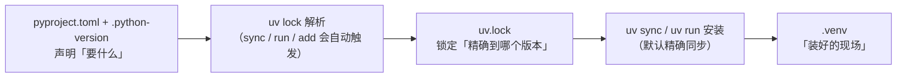

## 第 2 章 项目命令族：init / add / remove / run / sync / lock / tree / export

本章是全手册命令密度最高的一章：`uv init` / `uv add` / `uv remove` / `uv run` / `uv sync` / `uv lock` / `uv tree` / `uv export` 这 8 条命令串起了「建项目 → 增删依赖 → 锁版本 → 落地运行 → 查看/导出」的完整项目内闭环，覆盖日常 80% 的 uv 使用场景。命令细节对应抓取日（2026-09-05）版本文档，版本升级后个别参数可能变化，请以 `uv --version` 对应的官方 CLI 参考为准。

> [!note] 阅读提示
> 本章是速查骨架：每条命令按「用途一句话 → 最小示例 → 常用参数 / 注意点」组织，是后续第 7 章场景速查的参数详述地。想在 30 秒内先跑通整体流程，回看 §1.3；本章默认你已在项目目录内。

### §2.1 先修：四个文件的职责与自动同步心智模型

在逐条命令之前，先建立一个「项目里有哪四个文件、谁管谁」的框架。所有项目命令的怪异行为——为什么 `uv init` 完没有 `.venv`、为什么改完 `pyproject.toml` 直接 `uv run` 也能跑、为什么 `uv.lock` 不能手改——都能从这张表推出来。

| 文件 | 角色 | 谁写它 | 是否提交 Git |
|------|------|--------|:---:|
| `pyproject.toml` | **声明层**：项目元数据 + 直接依赖 + 版本区间 + dev 依赖组 + `[tool.uv]` 配置 | 你手写，或 `uv add`/`uv remove` | 是 |
| `.python-version` | **解释器**：记录项目默认 Python 版本（minor），uv 按它建 `.venv` | `uv init` 生成，`uv python pin` 改写 | 是 |
| `uv.lock` | **锁定层**：解析后的**全量精确版本**（含间接依赖、来源、哈希），跨平台可复现 | 只由 uv 维护（lock/sync/add/run 自动触发），**勿手改** | 是 |
| `.venv/` | **安装现场**：依赖实际落地的虚拟环境（site-packages） | `uv sync`/`uv run` 自动创建与更新 | 否（已进 `.gitignore`） |

文件之间的驱动关系：



两个容易踩的推论，先记住：

1. **`uv init` 之后并没有 `.venv` 和 `uv.lock`**。它们是在第一次跑 `uv run` / `uv sync` / `uv lock` 这类项目命令时才惰性创建 [^c2-01][^c2-03]。所以你新建项目后看到目录里"缺东西"是正常的，不是安装失败。
2. **`uv.lock` 提交 Git、别手改**。它是人类可读的 TOML，但字段由 uv 生成；手工编辑会在下次解析时被覆盖，或造成 `--locked` 一致性校验失败（坑 3）[^c2-02][^c2-10]。

> [!tip] 大白话
> 把 `pyproject.toml` 想成**购物清单**（想买什么、品牌范围自己定），`uv.lock` 想成下单后**快递公司给的精确物流单**（每个包裹的批次号都写死），`.venv` 想成**已经到货堆进仓库的货**。你只维护清单，uv 负责下单、给你物流单、并把货搬进仓库。

### §2.2 `uv init` —— 新建项目

**用途**：按 `pyproject.toml` 规范生成一个标准项目骨架，作为一切项目命令的起点；发现父目录有项目时默认把自己挂成 workspace 成员 [^c2-03]。

```bash
# 新建 myapp 目录并初始化（默认 app 型项目 + 自动 git init）
uv init myapp
cd myapp

# 目录里已有内容时，就地初始化
cd /path/to/existing-dir && uv init
```

`uv init myapp` 默认生成物（此刻**没有** `.venv` 和 `uv.lock`）：

```text
myapp/
├── .gitignore          # 已含 .venv/ 等条目
├── .python-version     # 写入发现的解释器 minor 版本
├── pyproject.toml      # 声明 + hello-world 入口 + build-system
├── README.md
└── src/
    └── myapp/
        └── __init__.py
```

**常用参数 / 注意点**：

- `--vcs none`：不想让 uv 自动 `git init` 时用（默认值是 `git`）。
- `--lib`（`--library`）：建**库型**项目；默认是 app 型（可执行入口 `hello-world = myapp:main`）。仅写脚本的话可再配 `--no-package` 不设包结构 [^c2-03]。
- `uv init` 就地初始化：不带路径参数即在当前目录生成（上面第二个示例）。
- **坑 4：目标位置已有 `pyproject.toml` 时 `uv init` 直接报错退出**。想把旧目录接进 uv，先把旧 `pyproject.toml` 移走/改名再 init，或改用 `uv add` 等命令在既有项目上操作 [^c2-10][^c2-03]。

### §2.3 `uv add` / `uv remove` —— 增删依赖

**用途**：`uv add` 把依赖写进 `pyproject.toml` 的 `dependencies`（或 `[dependency-groups]`），并**顺带更新 `uv.lock` 与 `.venv`**；`uv remove` 反向删除这三处 [^c2-04]。

```bash
uv add requests       # 解析到最新兼容版，写下限约束并立即安装
uv remove requests    # 从 pyproject/lock/.venv 三处一起移除
```

带约束与来源的常用变体：

```bash
uv add 'requests==2.31.0'                        # 钉死精确版本（其他同版本约束写法见 PEP 440）
uv add 'git+https://github.com/psf/requests'     # git 源，可加 --branch / --tag / --rev
uv add -r requirements.txt                       # 从 requirements.txt 批量迁移（常配 -c constraints.txt）
uv add --dev pytest                              # 进 dev 依赖组（= --group dev，不随包发布）
uv add --editable ../mylib                       # 本地库以可编辑（editable）模式安装
uv add --upgrade requests                        # 把已存在的依赖升到最新兼容版
```

`uv add requests` 之后，`pyproject.toml` 里的落点长这样（先睹为快）：

```toml
# pyproject.toml（节选）
[project]
dependencies = [
    "requests>=2.32.3",
]

[dependency-groups]
dev = [
    "pytest>=8.3.2",
]
```

**常用参数 / 注意点**：

- **自动三连**：add 会「写 `pyproject.toml` → 更新 `uv.lock` → 同步 `.venv`」。`uv remove` 同理。所以加完依赖立刻就能 `uv run` [^c2-04]。
- **默认约束宽度**：不给显式版本时，默认按最新兼容版写下限约束（如 `requests>=2.32.3`），不是 `==` 精确钉死；想要不同宽度可用 `--bounds {lower|major|minor|exact}` [^c2-04]。
- **旁路开关**：`--no-sync` 跳过同步 `.venv`；`--frozen` 跳过 re-lock（按现 lock 原样写声明，不校验存在性/兼容性）。适合"先批量改声明、最后统一一次 sync"。
- 同一依赖已存在时，再次 `uv add` 会把约束更新到新规格；带不同 marker 的同名依赖会另起一条 [^c2-04]。
- `uv remove` 删不存在的包会报错；用 `uv pip install` 手动装进环境的包，`uv remove` **不会**删它（因为它不在声明里）。
- **坑 1：项目里加依赖别用 `uv pip install`**。那只是 pip 兼容层，不同步 `pyproject.toml` / `uv.lock`，等于绕过购物清单直接往仓库塞货——下次 `uv sync` 会把货清掉（详见 §6.3）[^c2-10]。

> [!tip] 大白话
> `uv add` 是「在购物清单上加一行，并**当场**下单、按精确物流单把货运进仓库」。所以 add 完马上能用。而 `uv.lock` 是那份**上了锁的账本**——uv 让你看、让你提交到 Git，但不许你拿笔改；手改等于篡改账本，uv 对不上账时就报错给你看。

### §2.4 `uv run` —— 统一执行入口

**用途**：在项目环境里跑脚本或命令；**免 activate**，且每次调用前自动校验「`pyproject.toml` ↔ `uv.lock` ↔ `.venv`」三者一致、不一致就自动补齐，保证命令跑在锁定版本的环境里 [^c2-02][^c2-05]。

```bash
uv run main.py               # 跑 .py = uv run python main.py（.py/URL/stdin 均按脚本处理）
uv run flask run -p 3000     # 跑任意命令（含 pyproject 里声明的 [project.scripts] 入口）
```

**选项必须放在命令（或脚本）之前**——命令之后的所有参数都原样交给被跑程序：

```bash
uv run --no-sync main.py            # 本次跑前不同步环境（UV_NO_SYNC=1）
uv run --python 3.12 -- python -V   # 指定解释器跑；-- 分隔 uv 选项与命令
uv run --with requests script.py    # 临时给脚本垫一层依赖（详见 §4.2，项目内临时用）
```

PEP 723 内联依赖脚本：脚本头自带 `requires-python` 与 `dependencies`，`uv run` 会为它建一个**临时隔离环境**执行，不污染项目环境 [^c2-05]：

```python
# script.py
# /// script
# requires-python = ">=3.11"
# dependencies = ["requests"]
# ///
import requests
print(requests.get("https://api.github.com").status_code)
```

```bash
uv run script.py        # 自动为脚本头声明的依赖建临时环境
```

**常用参数 / 注意点**：

- **免 activate 的秘密**：uv 自动发现项目根目录的 `.venv`（沿目录向上找 `pyproject.toml`）。出了项目目录、找不到项目时，才回退到当前 shell 的虚拟环境或系统解释器 [^c2-05]。
- **自动同步 ≠ 精确清理**：`uv run` 默认只做**最小必要修改**来满足依赖（不会主动删多余包）；要"装完顺手清掉多余包"，加 `--exact`，或干脆用 `uv sync`（§2.5）[^c2-05]。
- 想彻底跳过本次运行前的同步检查：`--no-sync`（隐含 `--frozen`）；想用现有 lock 而不 re-lock：`--frozen` [^c2-05]。
- 其它常用：`--env-file .env` 加载环境变量（可多次，后者覆盖前者）、`--with` / `--with-editable` 临时加依赖、`--all-extras` / `--group dev` 决定装哪些可选与组依赖。
- **抉择提示**：只跑一次性命令/脚本 → 用 `uv run`（省去手动 sync）；要 activate 后长时间手跑，或在 CI 里搭环境 → 见 §2.5 用 `uv sync`。

> [!tip] 大白话
> `uv run` 像**进教室前自动点名**的辅导员：每次开讲（跑命令）前先核对花名册（lock）和到场人数（.venv），缺谁补谁，然后才开始上课。你不需要自己喊一句"activate"来证明身份——uv 认项目目录里的门禁卡。

### §2.5 `uv sync` —— 同步 .venv

**用途**：手动把 `.venv` 同步到与 `uv.lock` 完全一致——环境不存在就创建，缺的补装、多的删掉；是"我要一个干净、和 lock 一致的现场"时的显式命令 [^c2-06]。

```bash
uv sync                # 需要时先 re-lock，再精确同步：补缺 + 删多余
uv sync --inexact      # 保留多余包：只做最小必要修改
uv sync --locked       # 先断言 uv.lock 未过时，再过时即报错（CI 校验语义）
uv sync --frozen       # 完全不 re-lock/不校验，直接照 uv.lock 同步（只读，最快）
```

**常用参数 / 注意点**：

- **默认是 exact 同步**：会把「不在项目声明里的包」从 `.venv` 删掉。`--inexact`（`--no-exact`）改为保留多余包；但若多余包与项目依赖冲突，仍会被删 [^c2-06]。
- **`--locked` vs `--frozen`（坑 5）**：两者都跳过 re-lock，但语义相反——`--locked` 会**校验** `uv.lock` 是否与 `pyproject.toml` 一致，不一致就报错退出，所以 CI 里用它当"防呆断言"；`--frozen` **不校验**，直接把现有 lock 当真相（lock 缺失时报错），本地只想照 lock 装时用它 [^c2-06][^c2-10]。附录 B 会给 CI 片段。
- `.venv` 不存在时 `uv sync` 会自动创建（这是"惰性创建"被触发的主入口之一）。
- 常用组合参数：`--all-extras`（装全部可选）、`--group dev` 或 `--no-dev`、`--reinstall`（忽略已装强制重装）、`--check`（只检查不同步就报错，不改动）[^c2-06]。
- **坑 2：`.venv` 可丢可重建**。它只是安装现场，删了 `uv sync`（或下次 `uv run`）会按 `uv.lock` 全新重建，不用心疼（§2.8 组合②）[^c2-10]。

**`uv run` vs `uv sync` 分工**（两命令本族对照）[^c2-01]：

| 场景 | 用哪个 | 原因 |
|------|--------|------|
| 跑一个脚本/命令，跑完就走 | `uv run` | 自动同步，最小必要修改，免 activate |
| 要 activate 后长时间手跑多条命令 | `uv sync` + activate | 环境一次建好，后续命令不再带 uv 前缀 |
| CI / 复现：建一个与 lock 完全一致的环境 | `uv sync --locked` | exact 清理 + 防呆断言 |
| 本地想严格照 lock 重装、不清多余也行 | `uv sync --frozen` / `uv sync` | 默认 exact 会删多余包，注意预期 |

> [!tip] 大白话
> `uv sync` 默认像**大扫除**：手上一份最新精确货单（lock），仓库（.venv）里货单上没有的杂物一律清走，缺的补齐——要的是"和货单完全一致"；`--inexact` 则是只补缺、不清杂物。而 `uv run` 只是"开课前临时点名"，不太较真角落里的杂物。

---

