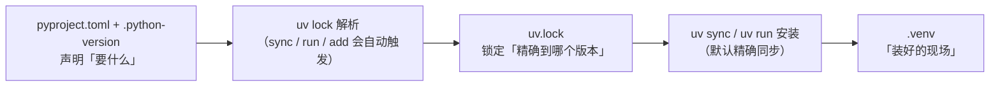

# uv 常用命令速查手册

> 面向已有 uv 基础的读者（已了解 uv 与 pip/venv 的关系）。本文是命令速查/参考手册：正文第 1–6 章按命令族展开，第 7 章是 14 条「我要…」跨族检索入口，附录 A/B 提供迁移对照与 CI 片段。素材抓取于 2026-09-05，命令细节以你本机 `uv --version` 对应的官方文档为准。阅读约定见 §1.1。

## 目录

1. [[#第 1 章 快速上手：5 条命令跑通日常]]
2. [[#第 2 章 项目命令族：init / add / remove / run / sync / lock / tree / export]]
3. [[#第 3 章 Python 版本与虚拟环境：uv python / uv venv]]
4. [[#第 4 章 临时与全局工具：uvx / uv tool / uv run --with]]
5. [[#第 5 章 缓存与索引/镜像：uv cache / 索引配置]]
6. [[#第 6 章 构建发布与 pip 兼容层：uv build / uv publish / uv pip]]
7. [[#第 7 章 场景速查：14 条「我要…」（跨族检索入口）]]
8. [[#附录 A：pip / venv / conda / poetry → uv 迁移对照]]
9. [[#附录 B GitHub Actions CI 片段]]

---

## 第 1 章 快速上手：5 条命令跑通日常

uv 的命令面比 pip/venv 大一圈，第一眼容易劝退。但日常 80% 的动作其实只被 5 条命令覆盖。本章先用一张总览表 + 一段 60 秒端到端流程，帮你建立「原来就这么简单」的整体心智；具体参数与坑留给第 2–3 章展开。

### §1.1 阅读约定

**本手册怎么读**：这是一份速查手册（参考/工具型），不是顺序教程，每章自洽、可独立查阅。正文第 2–6 章按命令族组织——每条命令的参数、选项与坑只在对应章节详细写一遍；第 7 章是 14 条「我要…」跨族检索入口，只给「场景 → 命令 → 锚点」，参数一律跳回命令族章；附录 A/B 给迁移对照与 CI 片段。检索优先路径：先到第 7 章按场景定位，再沿锚点进正文看细节。

**版本提示**：uv 迭代很快（本手册素材抓取于 2026-09-05），命令细节以你本机版本为准。先跑 `uv --version` 确认版本，再对照官方 CLI 参考（docs.astral.sh/uv/reference/cli/）。[^c1-01]

**§ 锚点约定**：正文用 `§x.y` 指代「第 x 章 y 节」（如 `§2.4` = 第 2 章第 4 节）。素材出处用「02 素材 §x.y + research-cache 编号」两级标注，方便回溯原始资料。[^c1-02]

**与既有笔记的关系**：虚拟环境「怎么建、要不要 activate、Python 解释器怎么选」的原理性展开见 [[如何用uv配置Python虚拟环境]]，本篇只给 `uv venv` 等命令面，不重复讲原理。

### §1.2 5 条核心命令总览

下表 5 条覆盖日常 80%：建项目、加依赖、跑脚本（免激活）、手动同步环境、建虚拟环境。后面所有命令族章都是在这 5 条上的扩展。[^c1-02]

| 命令 | 一句话用途 | 详见 |
|------|-----------|------|
| `uv init` | 新建项目骨架：生成 `pyproject.toml`、`.python-version` 等 | §2.2 |
| `uv add <包>` | 加依赖：写 `pyproject.toml` → 更新 `uv.lock` → 装进 `.venv` 一步到位 | §2.3 |
| `uv run <命令/脚本>` | 免 activate 在项目环境执行，跑前自动校验并同步 | §2.4 |
| `uv sync` | 手动把 `.venv` 与 `uv.lock` 同步到一致（默认精确同步） | §2.5 |
| `uv venv` | 创建虚拟环境（默认 `.venv`），不激活也能被 uv 自动发现 | §3.1 |

> [!tip] 大白话
> 把 `uv run` 想成公司前台：你说「跑 main.py」，它先自动核对门禁（依赖齐不齐），缺了当场补，再放你进去——所以你永远不用自己 `activate`。日常循环本质只有两步：`uv add` 声明要什么 + `uv run` 去执行；`uv venv` / `uv sync` 是你要手动精细控制时才出手的工具。

### §1.3 60 秒端到端最小流程

把下面一段从头跑到尾，就能直观感受「建项目 → 加依赖 → 写脚本 → 运行」的最小闭环（bash/macOS/Linux 粘贴版）：

```bash
# ① 新建项目 demo 并进入（生成 pyproject.toml、.python-version、README、src/demo/）
uv init demo && cd demo

# ② 加依赖 requests：写 pyproject → 解析 uv.lock → 装进 .venv，一步到位
uv add requests

# ③ 在项目根新建 4 行脚本 main.py
cat > main.py <<'EOF'
import requests

resp = requests.get("https://api.github.com")
print(resp.status_code)  # 期望输出：200
EOF

# ④ 免 activate 直接跑：uv 先自动同步环境，再在 .venv 里执行
uv run main.py
```

拆开看每步在干什么：

- **第①步后**，目录里还**没有** `.venv` 和 `uv.lock`——它们「懒创建」，直到第一次跑 sync 类命令（`uv run` / `uv sync` / `uv lock`）才出现。[^c1-03]
- **第②步** `uv add` 同时做三件事：写进 `pyproject.toml`、解析出精确的 `uv.lock`、安装进 `.venv`。这正是它和 `pip install` 最大的区别——不会只装包而不同步声明。[^c1-04]
- **第④步**的等价写法是 `uv run python main.py`；对以 `.py` 结尾的参数，uv 自动按脚本交给 Python 解释器执行。Windows 用户若不想用 heredoc，可先 `uv sync` 建好环境，再用编辑器新建 `main.py`，最后执行 `uv run main.py`。[^c1-05]

> [!tip] 大白话
> 把 `.venv` 想成随手能重建的工地。uv 手上有 `pyproject.toml` + `uv.lock` 两张「图纸」，`uv run` / `uv sync` 随时能照图重新搭环境，所以 `.venv` 删了不心疼；真正要提交进 Git 的是 `uv.lock`（详见 §2.1、§3.1）。

> [!summary] 本章小结
> - uv 命令面虽大，日常 80% 由 5 条命令驱动：`init` / `add` / `run` / `sync` / `venv`。
> - `uv run` 是统一入口：免 activate、跑前自动同步；以 `.py` 结尾的参数按脚本执行。
> - `uv add` 一步做三件事：写 `pyproject.toml`、解析 `uv.lock`、安装进 `.venv`。
> - `.venv` 与 `uv.lock` 首次 sync 类命令才懒创建；`.venv` 可随时删除，uv 会照锁文件重建。
> - 本手册定位速查：命令族详述（第 2–6 章）→ 场景检索（第 7 章）→ 附录 A/B。

**下一章预告**：进入第一块主体——项目命令族。先理清 `pyproject.toml` / `.python-version` / `uv.lock` / `.venv` 四个文件谁管什么，再逐条拆 `init` / `add` / `run` / `sync` 的常用参数。

---

## 第 2 章 项目命令族：init / add / remove / run / sync / lock / tree / export

本章是全手册命令密度最高的一章：`uv init` / `uv add` / `uv remove` / `uv run` / `uv sync` / `uv lock` / `uv tree` / `uv export` 这 8 条命令串起了「建项目 → 增删依赖 → 锁版本 → 落地运行 → 查看/导出」的完整项目内闭环，覆盖日常 80% 的 uv 使用场景。命令细节对应抓取日（2026-09-05）版本文档，版本升级后个别参数可能变化，请以 `uv --version` 对应的官方 CLI 参考为准。

> [!note] 阅读提示
> 本章是速查骨架：每条命令按「用途一句话 → 最小示例 → 常用参数 / 注意点」组织，是后续第 7 章场景速查的参数详述地。想在 30 秒内先跑通整体流程，回看 §1.3；本章默认你已在项目目录内。

### §2.1 先修：四个文件的职责与自动同步心智模型

在逐条命令之前，先建立一个「项目里有哪四个文件、谁管谁」的框架。所有项目命令的怪异行为——为什么 `uv init` 完没有 `.venv`、为什么改完 `pyproject.toml` 直接 `uv run` 也能跑、为什么 `uv.lock` 不能手改——都能从这张表推出来。

| 文件 | 角色 | 谁写它 | 是否提交 Git |
|------|------|--------|:---:|
| `pyproject.toml` | **声明层**：项目元数据 + 直接依赖 + 版本区间 + dev 依赖组 + `[tool.uv]` 配置 | 你手写，或 `uv add`/`uv remove` | 是 |
| `.python-version` | **解释器**：记录项目默认 Python 版本（minor），uv 按它建 `.venv` | `uv init` 生成，`uv python pin` 改写 | 是 |
| `uv.lock` | **锁定层**：解析后的**全量精确版本**（含间接依赖、来源、哈希），跨平台可复现 | 只由 uv 维护（lock/sync/add/run 自动触发），**勿手改** | 是 |
| `.venv/` | **安装现场**：依赖实际落地的虚拟环境（site-packages） | `uv sync`/`uv run` 自动创建与更新 | 否（已进 `.gitignore`） |

文件之间的驱动关系：



两个容易踩的推论，先记住：

1. **`uv init` 之后并没有 `.venv` 和 `uv.lock`**。它们是在第一次跑 `uv run` / `uv sync` / `uv lock` 这类项目命令时才惰性创建 [^c2-01][^c2-03]。所以你新建项目后看到目录里"缺东西"是正常的，不是安装失败。
2. **`uv.lock` 提交 Git、别手改**。它是人类可读的 TOML，但字段由 uv 生成；手工编辑会在下次解析时被覆盖，或造成 `--locked` 一致性校验失败（坑 3）[^c2-02][^c2-10]。

> [!tip] 大白话
> 把 `pyproject.toml` 想成**购物清单**（想买什么、品牌范围自己定），`uv.lock` 想成下单后**快递公司给的精确物流单**（每个包裹的批次号都写死），`.venv` 想成**已经到货堆进仓库的货**。你只维护清单，uv 负责下单、给你物流单、并把货搬进仓库。

### §2.2 `uv init` —— 新建项目

**用途**：按 `pyproject.toml` 规范生成一个标准项目骨架，作为一切项目命令的起点；发现父目录有项目时默认把自己挂成 workspace 成员 [^c2-03]。

```bash
# 新建 myapp 目录并初始化（默认 app 型项目 + 自动 git init）
uv init myapp
cd myapp

# 目录里已有内容时，就地初始化
cd /path/to/existing-dir && uv init
```

`uv init myapp` 默认生成物（此刻**没有** `.venv` 和 `uv.lock`）：

```text
myapp/
├── .gitignore          # 已含 .venv/ 等条目
├── .python-version     # 写入发现的解释器 minor 版本
├── pyproject.toml      # 声明 + hello-world 入口 + build-system
├── README.md
└── src/
    └── myapp/
        └── __init__.py
```

**常用参数 / 注意点**：

- `--vcs none`：不想让 uv 自动 `git init` 时用（默认值是 `git`）。
- `--lib`（`--library`）：建**库型**项目；默认是 app 型（可执行入口 `hello-world = myapp:main`）。仅写脚本的话可再配 `--no-package` 不设包结构 [^c2-03]。
- `uv init` 就地初始化：不带路径参数即在当前目录生成（上面第二个示例）。
- **坑 4：目标位置已有 `pyproject.toml` 时 `uv init` 直接报错退出**。想把旧目录接进 uv，先把旧 `pyproject.toml` 移走/改名再 init，或改用 `uv add` 等命令在既有项目上操作 [^c2-10][^c2-03]。

### §2.3 `uv add` / `uv remove` —— 增删依赖

**用途**：`uv add` 把依赖写进 `pyproject.toml` 的 `dependencies`（或 `[dependency-groups]`），并**顺带更新 `uv.lock` 与 `.venv`**；`uv remove` 反向删除这三处 [^c2-04]。

```bash
uv add requests       # 解析到最新兼容版，写下限约束并立即安装
uv remove requests    # 从 pyproject/lock/.venv 三处一起移除
```

带约束与来源的常用变体：

```bash
uv add 'requests==2.31.0'                        # 钉死精确版本（其他同版本约束写法见 PEP 440）
uv add 'git+https://github.com/psf/requests'     # git 源，可加 --branch / --tag / --rev
uv add -r requirements.txt                       # 从 requirements.txt 批量迁移（常配 -c constraints.txt）
uv add --dev pytest                              # 进 dev 依赖组（= --group dev，不随包发布）
uv add --editable ../mylib                       # 本地库以可编辑（editable）模式安装
uv add --upgrade requests                        # 把已存在的依赖升到最新兼容版
```

`uv add requests` 之后，`pyproject.toml` 里的落点长这样（先睹为快）：

```toml
# pyproject.toml（节选）
[project]
dependencies = [
    "requests>=2.32.3",
]

[dependency-groups]
dev = [
    "pytest>=8.3.2",
]
```

**常用参数 / 注意点**：

- **自动三连**：add 会「写 `pyproject.toml` → 更新 `uv.lock` → 同步 `.venv`」。`uv remove` 同理。所以加完依赖立刻就能 `uv run` [^c2-04]。
- **默认约束宽度**：不给显式版本时，默认按最新兼容版写下限约束（如 `requests>=2.32.3`），不是 `==` 精确钉死；想要不同宽度可用 `--bounds {lower|major|minor|exact}` [^c2-04]。
- **旁路开关**：`--no-sync` 跳过同步 `.venv`；`--frozen` 跳过 re-lock（按现 lock 原样写声明，不校验存在性/兼容性）。适合"先批量改声明、最后统一一次 sync"。
- 同一依赖已存在时，再次 `uv add` 会把约束更新到新规格；带不同 marker 的同名依赖会另起一条 [^c2-04]。
- `uv remove` 删不存在的包会报错；用 `uv pip install` 手动装进环境的包，`uv remove` **不会**删它（因为它不在声明里）。
- **坑 1：项目里加依赖别用 `uv pip install`**。那只是 pip 兼容层，不同步 `pyproject.toml` / `uv.lock`，等于绕过购物清单直接往仓库塞货——下次 `uv sync` 会把货清掉（详见 §6.3）[^c2-10]。

> [!tip] 大白话
> `uv add` 是「在购物清单上加一行，并**当场**下单、按精确物流单把货运进仓库」。所以 add 完马上能用。而 `uv.lock` 是那份**上了锁的账本**——uv 让你看、让你提交到 Git，但不许你拿笔改；手改等于篡改账本，uv 对不上账时就报错给你看。

### §2.4 `uv run` —— 统一执行入口

**用途**：在项目环境里跑脚本或命令；**免 activate**，且每次调用前自动校验「`pyproject.toml` ↔ `uv.lock` ↔ `.venv`」三者一致、不一致就自动补齐，保证命令跑在锁定版本的环境里 [^c2-02][^c2-05]。

```bash
uv run main.py               # 跑 .py = uv run python main.py（.py/URL/stdin 均按脚本处理）
uv run flask run -p 3000     # 跑任意命令（含 pyproject 里声明的 [project.scripts] 入口）
```

**选项必须放在命令（或脚本）之前**——命令之后的所有参数都原样交给被跑程序：

```bash
uv run --no-sync main.py            # 本次跑前不同步环境（UV_NO_SYNC=1）
uv run --python 3.12 -- python -V   # 指定解释器跑；-- 分隔 uv 选项与命令
uv run --with requests script.py    # 临时给脚本垫一层依赖（详见 §4.2，项目内临时用）
```

PEP 723 内联依赖脚本：脚本头自带 `requires-python` 与 `dependencies`，`uv run` 会为它建一个**临时隔离环境**执行，不污染项目环境 [^c2-05]：

```python
# script.py
# /// script
# requires-python = ">=3.11"
# dependencies = ["requests"]
# ///
import requests
print(requests.get("https://api.github.com").status_code)
```

```bash
uv run script.py        # 自动为脚本头声明的依赖建临时环境
```

**常用参数 / 注意点**：

- **免 activate 的秘密**：uv 自动发现项目根目录的 `.venv`（沿目录向上找 `pyproject.toml`）。出了项目目录、找不到项目时，才回退到当前 shell 的虚拟环境或系统解释器 [^c2-05]。
- **自动同步 ≠ 精确清理**：`uv run` 默认只做**最小必要修改**来满足依赖（不会主动删多余包）；要"装完顺手清掉多余包"，加 `--exact`，或干脆用 `uv sync`（§2.5）[^c2-05]。
- 想彻底跳过本次运行前的同步检查：`--no-sync`（隐含 `--frozen`）；想用现有 lock 而不 re-lock：`--frozen` [^c2-05]。
- 其它常用：`--env-file .env` 加载环境变量（可多次，后者覆盖前者）、`--with` / `--with-editable` 临时加依赖、`--all-extras` / `--group dev` 决定装哪些可选与组依赖。
- **抉择提示**：只跑一次性命令/脚本 → 用 `uv run`（省去手动 sync）；要 activate 后长时间手跑，或在 CI 里搭环境 → 见 §2.5 用 `uv sync`。

> [!tip] 大白话
> `uv run` 像**进教室前自动点名**的辅导员：每次开讲（跑命令）前先核对花名册（lock）和到场人数（.venv），缺谁补谁，然后才开始上课。你不需要自己喊一句"activate"来证明身份——uv 认项目目录里的门禁卡。

### §2.5 `uv sync` —— 同步 .venv

**用途**：手动把 `.venv` 同步到与 `uv.lock` 完全一致——环境不存在就创建，缺的补装、多的删掉；是"我要一个干净、和 lock 一致的现场"时的显式命令 [^c2-06]。

```bash
uv sync                # 需要时先 re-lock，再精确同步：补缺 + 删多余
uv sync --inexact      # 保留多余包：只做最小必要修改
uv sync --locked       # 先断言 uv.lock 未过时，再过时即报错（CI 校验语义）
uv sync --frozen       # 完全不 re-lock/不校验，直接照 uv.lock 同步（只读，最快）
```

**常用参数 / 注意点**：

- **默认是 exact 同步**：会把「不在项目声明里的包」从 `.venv` 删掉。`--inexact`（`--no-exact`）改为保留多余包；但若多余包与项目依赖冲突，仍会被删 [^c2-06]。
- **`--locked` vs `--frozen`（坑 5）**：两者都跳过 re-lock，但语义相反——`--locked` 会**校验** `uv.lock` 是否与 `pyproject.toml` 一致，不一致就报错退出，所以 CI 里用它当"防呆断言"；`--frozen` **不校验**，直接把现有 lock 当真相（lock 缺失时报错），本地只想照 lock 装时用它 [^c2-06][^c2-10]。附录 B 会给 CI 片段。
- `.venv` 不存在时 `uv sync` 会自动创建（这是"惰性创建"被触发的主入口之一）。
- 常用组合参数：`--all-extras`（装全部可选）、`--group dev` 或 `--no-dev`、`--reinstall`（忽略已装强制重装）、`--check`（只检查不同步就报错，不改动）[^c2-06]。
- **坑 2：`.venv` 可丢可重建**。它只是安装现场，删了 `uv sync`（或下次 `uv run`）会按 `uv.lock` 全新重建，不用心疼（§2.8 组合②）[^c2-10]。

**`uv run` vs `uv sync` 分工**（两命令本族对照）[^c2-01]：

| 场景 | 用哪个 | 原因 |
|------|--------|------|
| 跑一个脚本/命令，跑完就走 | `uv run` | 自动同步，最小必要修改，免 activate |
| 要 activate 后长时间手跑多条命令 | `uv sync` + activate | 环境一次建好，后续命令不再带 uv 前缀 |
| CI / 复现：建一个与 lock 完全一致的环境 | `uv sync --locked` | exact 清理 + 防呆断言 |
| 本地想严格照 lock 重装、不清多余也行 | `uv sync --frozen` / `uv sync` | 默认 exact 会删多余包，注意预期 |

> [!tip] 大白话
> `uv sync` 默认像**大扫除**：手上一份最新精确货单（lock），仓库（.venv）里货单上没有的杂物一律清走，缺的补齐——要的是"和货单完全一致"；`--inexact` 则是只补缺、不清杂物。而 `uv run` 只是"开课前临时点名"，不太较真角落里的杂物。

### §2.6 `uv lock` —— 只解析、不安装

**用途**：只做依赖解析并更新 `uv.lock`，**不碰 `.venv`**（不安装）；用于「升级某包 / 预先锁定版本」而不想立刻动环境的时候 [^c2-07]。

```bash
uv lock                               # 首次生成 uv.lock；依赖没变则空跑
uv lock --upgrade-package requests    # 只把 requests 升到最新兼容版，其余锁不变
uv lock --upgrade                     # 全部依赖一起升到最新兼容
```

**常用参数 / 注意点**：

- 解析时把现有 `uv.lock` 内容当作**偏好**：所以依赖没变时 `uv lock` 是无操作的，除非给 `--upgrade` / `--upgrade-package` [^c2-07]。
- **升级单包用 `--upgrade-package requests`**（`-P requests`），它只动这一个包，保持 lock 其余部分不动——这是"我想升 requests 又不想连带升别的"的正解 [^c2-02][^c2-07]。
- **日常不必手跑**：`uv add` / `uv sync` / `uv run` 在需要时都会自动 re-lock。手跑 `uv lock` 的典型时机是：单独升级、或在 CI 前预生成/预检 lock。
- 参数上的 `--locked`（`--check`）断言 lock 已最新、不一致即报错；`--frozen` 只断言存在、不查是否最新 [^c2-07]。
- **坑 3 回顾：`uv.lock` 提交 Git、勿手改**（详见 §2.1）。它属于"生成物 + 复现依据"双重身份，是项目里唯一要提交的"产物文件"。

> [!tip] 大白话
> `uv lock` 只负责**给购物清单算账出物流单**，不负责搬货。平时 `uv add`/`uv sync` 顺手就把账算了，所以你不常单独喊它；只有当你想"只把某一个快递升级到最新、其他都不动"时，才专门找它。

### §2.7 `uv tree` / `uv export` —— 查看与导出

**`uv tree`：查看依赖树**——回答"我到底装了什么、谁依赖谁"。

```bash
uv tree                    # 全量树（重复出现的包默认折叠为 *）
uv tree -d 2               # 只看两层（--depth N）
uv tree --invert requests  # 反查：谁依赖了 requests（--reverse 同义）
uv tree --package requests # 只看某包的子树
```

- 深度默认 255（即全展开）；`-d` 控制层数，树大了先限深 [^c2-08]。
- `--invert` 用来做「依赖归因」：想知道升级某包会影响谁、或排查谁悄悄拖进了某个传递依赖时很好用 [^c2-08]。
- `--format json` 可输出机器可读的树（默认 `text`）[^c2-08]。

**`uv export`：导出 lock 为其他格式**——把 `uv.lock` 转成 `requirements.txt` / `pylock.toml`(PEP 751) / CycloneDX v1.5 JSON [^c2-09]。

```bash
uv export -o requirements.txt              # 默认格式 requirements.txt
uv export --frozen -o requirements.txt     # 跳过 re-lock，照现有 lock 导出
```

- **默认先 re-lock**：export 与 sync 一样，默认会先重新解析一遍项目；加 `--locked` 或 `--frozen` 可跳过。只读/快速导出用 `--frozen`（lock 缺失会报错）[^c2-09]。
- `-o` / `--output-file` 指定输出文件；不写 `-o` 则打到 stdout（方便管道）[^c2-09]。
- 产物典型用途：把 requirements.txt 交给不用 uv 的同事/旧部署（`pip install -r requirements.txt`），或用 `--format cyclonedx-json` 做依赖清单审计。
- workspace 里默认导出根项目，可用 `--package` 指定成员 [^c2-09]。

> [!tip] 大白话
> `uv tree` 是**看仓库货架图**：谁压在谁上面一目了然；`uv export` 则是把 uv 的"精确物流单"翻译成外面 pip 世界也认得的旧式单据——给还没用 uv 的人看。

### §2.8 本族常用场景组合

三个高频组合，覆盖「日常循环 / 彻底重建 / 复现拉取」三类需求（完整的 14 条"我要…"清单在第 7 章，那里只给跳转锚点、不重复参数）。

**① 日常循环：`uv add` + `uv run`（自动同步，最省事）**

```bash
uv add flask
uv run flask run -p 3000    # 加完即用：免 activate、免手动 uv sync
```

改 `pyproject.toml` 里的依赖后直接 `uv run` 也一样——run 前会自动补齐 sync。

**② 彻底重建环境：`rm -rf .venv && uv sync`（坑 2 的正解）**

```bash
rm -rf .venv                # Windows PowerShell: Remove-Item -Recurse -Force .venv
uv sync                     # 按 uv.lock 全新安装，环境"脏了/坏了"就这招
```

`.venv` 不是宝贝，只是安装现场；依赖全在 `uv.lock` 里，删了重建几乎无损。

**③ 复现拉取 / CI：`uv sync --locked`**

```bash
git clone <repo> && cd <repo>
uv sync --locked    # 断言 lock 最新后精确同步（CI 用；详见附录 B）
uv run pytest
```

`uv.lock` 已提交 Git，clone 下来就能用 `--locked` 得到与开发机一致的环境；lock 与 `pyproject.toml` 不同步时它会立刻报错——这正是 CI 想要的防呆。只想"照 lock 装、别啰嗦校验"时用 `uv sync --frozen`。

**小结一句口诀**：日常 `add` + `run`；弄脏了 `rm -rf .venv && uv sync`；要复现 `sync --locked`。

---

**本章小结**

- 四个文件一条链：`pyproject.toml` + `.python-version`（声明）→ `uv.lock`（锁定）→ `.venv`（安装现场）；`uv.lock` 提交 Git、勿手改，`.venv` 可删可重建。
- `uv init` 只搭骨架，`.venv` 与 `uv.lock` 在首次 `run`/`sync`/`lock` 时惰性创建；目标已有 `pyproject.toml` 会报错。
- `uv add`/`uv remove` 是"改声明三连"（pyproject + lock + 环境）；支持版本约束、git 源、`-r`、`--dev`、`--editable`、`--upgrade`。
- `uv run` 免 activate、跑前自动同步，但默认不清多余包；`uv sync` 默认 exact 会删多余包，`--locked`（防呆断言）与 `--frozen`（只读照 lock）语义相反。
- `uv lock` 只解析不安装，升级单包用 `--upgrade-package`；`uv tree` 看依赖树，`uv export` 转 requirements.txt/CycloneDX。

下一章进入本手册第二个命令族：`uv python` / `uv venv`（第 3 章）——`.python-version` 从哪来、怎么装指定版本的解释器、`.venv` 怎样手动创建与激活，正好补上本章留的"解释器"缺口。

## 第 3 章 Python 版本与虚拟环境：uv python / uv venv

上一章把 `pyproject.toml` / `.python-version` / `uv.lock` / `.venv` 四个文件的关系串了起来（→ 见 §2.1），但没有回答一个关键问题：**`.venv` 里的解释器到底从哪来，项目的 Python 版本怎么固定**。本章补上这两块地基——`uv venv`（建环境）与 `uv python`（管解释器）。读完你会明白两件事：日常在项目里几乎不用手动 `activate`；换机器、换同事环境时，Python 版本靠一个 `.python-version` 文件就能复现。

### §3.1 `uv venv` —— 创建虚拟环境

`uv venv` 对应旧工具链的 `python -m venv`，但 uv 本身不依赖 Python，所以「没有装任何 Python 也能建出环境」。默认在当前目录生成 `.venv`，主要用法如下：[^c3-01]

```bash
# 项目根生成 .venv；若 .venv 已存在（且是虚拟环境），uv 会先删后建一个全新的空环境
uv venv

# 指定名字/路径建到别处（不再叫 .venv）
uv venv my-name          # 生成 ./my-name/ 目录，activate 后的提示符也叫 my-name
uv venv /tmp/demo-venv   # 建到绝对路径
```

注意「先删后建」的边界：目标路径**已经是一个虚拟环境**时 uv 会直接覆盖重建；但目标路径**非空却不是虚拟环境**时默认会报错，需要 `--clear` 清空重建，或 `--allow-existing` 不清空直接往里写（后者一般不建议）。[^c3-04]

解释器版本由 `--python` 决定，本机没有对应版本时 **uv 会自动下载**（详见 §3.2 的 managed Python），不用你先去装：[^c3-02]

```bash
uv venv --python 3.11            # 要 3.11：没有就自动下载，再用它建 .venv
uv venv -p 3.11                  # -p 是 --python 的短写
uv venv --python 3.11.9          # 钉到精确补丁版
uv venv --python '>=3.10,<3.13'  # 给一个范围，取首个满足的解释器
```

`--python` 没给时，uv 会按项目里的 `pyproject.toml`（`requires-python`）与 `.python-version` 决定版本；这两者的优先级关系见 §3.3。

**用不用 activate？** 这是 uv 与传统工作流最大的体验差异：uv 会在当前目录及上级目录自动发现 `.venv` 并用它执行命令（`uv run` / `uv sync` / `uv pip install`），所以**不激活也能用**。[^c3-03] 手动激活只在你想要裸命令 `python` / `pip` 也指向这个环境、或 IDE 终端需要时才有意义：

```bash
# macOS / Linux（bash、zsh）
source .venv/bin/activate
deactivate
```

```powershell
# Windows PowerShell
.venv\Scripts\activate
deactivate
```

关于激活脚本具体改了什么 PATH、`.venv` 目录结构长什么样，原理性展开见 [[如何用uv配置Python虚拟环境]]，本篇只给命令面。

> [!tip] 大白话
> 把 `.venv` 想成项目自带的一套工具箱，uv 每次开工自己就知道去 `.venv` 里拿工具，不用你先「登记」（activate）。手动 `activate` 只是让系统里的裸 `python` / `pip` 也指向这套工具箱，方便你在终端直接敲。所以日常用 `uv run` 时，不激活完全没关系。

> [!warning] 坑：`uv venv` 只建空环境
> 在项目里跑 `uv venv` 只会得到一个**没装依赖**的空环境，它不会读 `pyproject.toml` / `uv.lock`。要「建好 + 装齐依赖」应走第 2 章的重建组合 `rm -rf .venv && uv sync`（→ 见 §2.5、§3.4），或干脆用 `uv run` 让 uv 自动同步（→ 见 §2.4）。[^c3-13]

### §3.2 `uv python` —— 安装 / 列出 / 查找解释器

先补一对概念：uv 自己下载并管理的 Python 叫 **managed**（装在 uv 的数据目录里）；机器上其它来源的 Python（系统自带、pyenv、conda 装的）对 uv 一律算 **system**。uv 默认偏好 managed，但已有 system 也好过联网重新下载（详见 §3.3 发现顺序）。[^c3-05]

**安装 `uv python install`**：往 uv 数据目录装 managed Python，并把 `python3.x` 这类命令放进 PATH 目录：[^c3-06]

```bash
uv python install 3.12            # 装 3.12 的最新补丁（managed）
uv python install 3.9 3.11        # 一次装多个
uv python install 3.12 --default  # 额外生成 python3 / python 命令（默认只生成 python3.12）
```

几个要点：[^c3-06]

- 默认只提供带次版本后缀的 `python3.12`；想要 `python3` 和 `python` 这类通用名，必须加 `--default`（若一次请求多个版本会报错）。
- 可执行命令所在目录用 `uv python dir --bin` 查看；若它不在 PATH 里，`uv python update-shell` 可帮你补上。
- uv 绑定的可下载版本列表随每次 uv 发布固定，遇到「想装的新版本找不到」通常是 uv 版本太旧，升级 uv 即可。
- **多数时候不必手动 install**：任何命令请求一个没装的版本，uv 都会自动下载。`install` 的实际价值是：预先装好供离线/慢网使用、把 `python3.x` 命令暴露给其它工具、用 `--default` 接管 `python`。

**列出 `uv python list`**：默认同时显示「已安装」和「本平台可下载」：[^c3-07]

```bash
uv python list                    # 已安装 + 可下载
uv python list --only-installed   # 只看已装
uv python list 3.13               # 按请求过滤
```

**查找 `uv python find`**：输出 uv「当前会优先使用」的解释器绝对路径，等价于帮你回答「我这条命令会落在哪个 Python 上」：[^c3-08]

```bash
uv python find
# macOS/Linux 示例：~/.local/share/uv/python/cpython-3.12.5-macos-aarch64-none/bin/python3.12
# Windows 示例：C:\Users\<你>\AppData\Local\uv\python\cpython-3.12.5-x86_64-pc-windows-msvc\python.exe
# （具体路径以你本机 uv python find 输出为准）

uv python find '>=3.11'   # 找满足范围的一个
uv python find --system   # 跳过虚拟环境，只看系统解释器
```

`uv python` 各子命令接受统一的**版本请求格式**，常用的几种：[^c3-09]

| 写法 | 含义 |
|------|------|
| `3` | 3.x 里最新的一个（uv 已收录的大版本） |
| `3.12` | 3.12 的最新补丁 |
| `3.12.9` | 精确到补丁 |
| `>=3.10,<3.13` | 满足范围即可（install 时也会用） |
| `pypy` | PyPy 实现（CPython 之外的实现） |

> [!tip] 大白话
> 把 managed Python 想成 uv 自带的「货源仓库」：`uv python install` 是进货，`uv venv --python 3.12` 和 `uv python find` 是取货。取货时发现仓库没有、网络又通，uv 会顺手先进货再用——所以多数时候你根本不用记得先 `install`。

### §3.3 `uv python pin` —— 固定版本 + 解释器发现顺序

`uv python pin` 把一个版本写进项目根目录的 `.python-version` 文件（内容就一行），它是第 2 章「四文件关系」里解释器声明的落点（→ 见 §2.1）。[^c3-10]

```bash
uv python pin 3.12            # 当前目录写入 .python-version（内容一行：3.12）
uv python pin                 # 不带参数 = 查看当前 pin（没有 .python-version 会报错）
uv python pin 3.12 --global   # 写入用户级配置目录，作为全局兜底版本
```

写入后的 `.python-version` 就是一行纯文本：

```
3.12
```

行为要点：[^c3-10][^c3-11]

- pin 时 uv 会拿请求与项目的 `requires-python` 校验，冲突会报错。
- 建议写**纯版本号**（如 `3.12`）而不是复杂请求：uv 支持的请求格式比 pyenv 等工具更宽，写成纯版本号才能让其它读 `.python-version` 的工具（pyenv、CI）也认。
- `.python-version` 的查找是「从工作目录逐级向上找」，都没有再落到用户配置目录的全局 pin；查找不越过项目/工作区边界。
- 全局 pin（`--global`）写入目录：Linux/macOS 为 `XDG_CONFIG_HOME/uv`，Windows 为 `%APPDATA%/uv`。

那么「一次命令到底用哪个版本」由两个层次决定：**先定版本请求，再按发现顺序找解释器**。

版本请求来源优先级：

| 优先级 | 来源 | 说明 |
|--------|------|------|
| 高 | 命令行 `--python` / 环境变量 `UV_PYTHON` | 单次覆盖，最明确 |
| 中 | `.python-version`（`pin` 写） | 项目根 → 上级目录 → 用户级全局 pin |
| 低 | `pyproject.toml` 的 `requires-python` | 只声明下限，取第一个兼容版本 |

解释器发现顺序（`uv python find` 即按此返回第一个命中者）：[^c3-12]

| 顺序 | 查找对象 | 说明 |
|------|----------|------|
| 1 | 虚拟环境：激活的 `VIRTUAL_ENV`，或当前/上级目录的 `.venv` | 允许用 venv 的命令先检查它是否满足请求 |
| 2 | uv managed Python（`uv python dir` 目录） | 默认偏好 managed（`python-preference=managed`） |
| 3 | PATH 上的系统 Python：`python` / `python3` / `python3.x` | pyenv、conda 装的也算 system |
| 4 | Windows 注册表 / Microsoft Store（`py --list-paths`） | 仅 Windows，按 PEP 514 注册 |

两点补充理解这个表：system 搜索取「第一个兼容」而不是最新；managed 与 system 都没有满足的版本时，uv 才会联网下载。想强制只用 managed 加 `--managed-python`，只想用系统解释器加 `--no-managed-python` / `--system`（→ 也见 `uv python find --system`）。[^c3-12]

> [!tip] 大白话
> 把 `.python-version` 想成贴在项目门口的一张便签，上面写着「本项目用 3.12」。便签跟着 Git 走，团队其他人或 CI 拉下代码，uv 一进门看到便签就照 3.12 执行——这就避免了「在我机器上能跑、在你机器上就炸」的版本漂移。

### §3.4 常用场景组合（本族）

**① 给项目装一个指定 Python 并固定下来**（三步，前两步可互换顺序）：

```bash
uv python install 3.12   # 可选：预装 managed 3.12（不装也行，下一步会自动下载）
uv venv --python 3.12    # 用 3.12 建 .venv
uv python pin 3.12       # 写 .python-version，把版本锁给整个团队
```

**② 项目里彻底重建环境**（比 `uv venv` 更常用）：因为 `uv venv` 只建空环境、不装依赖，项目里的「推倒重来」应让 uv 照 `uv.lock` 一次装齐：[^c3-13]

```bash
rm -rf .venv && uv sync   # 删掉旧环境，按锁文件重建并装齐（→ 见 §2.5）
```

**③ 什么时候才手动 `uv venv`？** 在正式项目里其实很少手敲——`uv run` / `uv sync` 会自动创建 `.venv`（→ 见 §2.4）。`uv venv` 的价值在：非项目目录想隔离、想要自定义名字/位置的裸环境、或建好一个空环境后给 `uv pip` 兼容层用（→ 见 §6.3）。

> [!summary] 本章小结
> - `uv venv` 建空环境：默认 `.venv`；目标路径已是虚拟环境会先删后建，非空非 venv 才需 `--clear`。
> - uv 自动发现 `.venv`，无需 activate；手动激活写法：bash `source .venv/bin/activate`、PowerShell `.venv\Scripts\activate`，退出用 `deactivate`。
> - `uv python install` 装 managed Python，默认只生成 `python3.x`，`--default` 才给 `python3` / `python`；`list` / `find` 分别负责列出与定位解释器。
> - `uv python pin` 写 `.python-version`（`--global` 落用户级）；版本请求优先级：`--python` > `.python-version` > `requires-python`。
> - 解释器发现顺序：`VIRTUAL_ENV`/`.venv` → managed 目录 → PATH → Windows 注册表；默认偏好 managed、其次 system、最后才联网下载。
> - 项目里「重建且装齐」用 `rm -rf .venv && uv sync`，而不是 `uv venv`。

**下一章预告**：环境与解释器都搞定了，接下来看怎么「用完即走」——`uvx` 临时跑工具、`uv run --with` 给脚本临时加依赖、`uv tool` 常驻装全局工具，三者怎么分工。

## 第 4 章 临时与全局工具：uvx / uv tool / uv run --with

前两章的 `uv run` / `uv sync` 都围绕「项目」展开：先声明依赖，再在 `.venv` 里跑。但日常还有两类命令工具不走项目流程：一是只想**临时**跑一下别人写好的 CLI（比如 ruff），又不想弄脏当前项目；二是想把某个高频工具**长久**装进系统、随时敲命令就能用。本章讲 uv 的三件套 —— `uvx`（临时）、`uv tool`（常驻）、`uv run --with`（项目内临时加依赖）—— 以及它们之间的选用边界。

> 版本说明：本章命令与输出对应 2026-09-05 抓取的官方文档；uv 迭代快，细节以 `uv --version` 对应的文档为准（阅读约定见第 1 章）。

### §4.1 `uvx` —— 临时跑工具

`uvx` 是 `uv tool run` 的别名，两者行为完全一致[^c4-1]。它的作用一句话概括：**把某个包提供的命令行工具装进一个临时、隔离的环境里运行，跑完不留下任何东西**，不写 `pyproject.toml`、不碰你的 `.venv`、不进当前项目。

最简单的用法，命令名与包名一致时直接写：

```bash
# 临时拉一个隔离环境装 ruff，并对当前目录做 lint 检查
$ uvx ruff check .
```

> [!tip] 大白话
> 把 `uvx` 想成「叫外援在门外的临时工位干活」：需要 ruff 时，uv 在项目**外面**搭一个一次性的小隔间，把 ruff 请进去干活；活干完隔间拆掉。你项目里的大工位（`.venv`、`pyproject.toml`）一根头发都没动。所以工具不会进项目，项目也 `import` 不到它——这是设计使然，不是装坏了。

#### 命令名 ≠ 包名：用 `--from`

多数时候包名和命令名相同（`ruff` 包提供 `ruff` 命令），但有时不同：`http` 命令由 `httpie` 包提供。这时要 `--from` 指明「从哪个包里找命令」[^c4-1]：

```bash
# http 命令来自 httpie 这个包，用 --from 指明
$ uvx --from httpie http https://example.org

# 指定版本：命令名后跟 @ 只能写精确版本
$ uvx ruff@0.3.0 check .

# 需要版本范围（或带 extras、git 源）时，一律改用 --from + PEP 440 写法
$ uvx --from 'ruff>0.2,<0.4' ruff check .
```

要点：`uvx ruff@0.3.0` 的 `@` 语法**只能表达精确版本**；要表达范围、extra 或 git 源，用 `--from`[^c4-1]。`--from` 和 `@` 后面的命令参数跟在命令名之后，uvx 原样透传给工具，不会误解析。

> [!tip] 大白话
> 命令名是「菜名」，包名是「店名」。多数时候菜名和店名相同，直接喊 `uvx 菜名`；当这道菜在别家店（`http` 命令由 `httpie` 包提供），就用 `--from 店名 菜名` 告诉 uv 去哪家点。想点某个具体批次（精确版本 `ruff@0.3.0`）就写批号，想限定一个区间只能走 `--from`。

#### 给工具附加依赖：用 `--with`

有些工具的能力要靠额外依赖才完整。例如 `mkdocs` 默认不含 material 主题，临时跑文档站时用 `--with` 把主题一起装进这次隔离环境[^c4-1]：

```bash
# mkdocs-material 只对这一次运行生效，mkdocs 默认自带里没有它
$ uvx --with mkdocs-material mkdocs build
```

#### 与常驻安装的关系

如果你已经用 `uv tool install ruff`（见 §4.3）装过 ruff，直接敲 `uvx ruff` 会**复用已装版本**，而不是再拉一个临时环境；想强制走临时环境用 `--isolated`[^c4-2]。另外注意：`uvx` 只是 `uv tool run` 的缩写，其余工具操作（install / list / upgrade…）都必须写完整的 `uv tool` 前缀[^c4-1]。

### §4.2 `uv run --with` —— 项目内的一次性额外依赖

`uv run` 在第 2 章是「项目统一执行入口」：用项目 `.venv` 跑命令，跑前自动同步（见 §2.4）。给它加 `--with <pkg>`，语义变成：**在项目环境之上，临时叠一层额外依赖**去跑这条命令/脚本。这层依赖不进 `pyproject.toml`、不进 `uv.lock`，且允许与项目既有依赖冲突（uv 把它放在一个独立的临时层里解析）[^c4-2]。

典型场景：你的项目依赖里没有 `requests`，但某个一次性脚本想用它抓个数据，你又不想为这一次把 `requests` 永久加进项目：

```python
# demo.py —— 一次性脚本：想用 requests，但不想改动项目依赖
import requests

r = requests.get("https://httpbin.org/json")
print("status:", r.status_code)
```

```bash
# 在项目目录内执行：requests 只对这次运行可见
$ uv run --with requests demo.py
status: 200
```

`uv run --with` 与 PEP 723 的关系：§2.4 提到脚本顶部可以用 `# /// script` 内联声明依赖，让脚本自带依赖随文件走。`--with` 是它的**另一种做法**——依赖不写进文件、只在命令行临时给。取舍：脚本要分享/提交就优先 PEP 723 头（依赖跟着文件走）；只是自己临时跑一次，用 `--with` 更省事、文件保持干净。

> [!tip] 大白话
> 项目环境是你布置好的常驻工位（依赖都摆在桌面上）。`--with requests` 等于「临时从隔壁借一台 `requests` 计算器用一下」，用完还回去，工位布置不变——`pyproject.toml` 和 `uv.lock` 一行都不会多。

> [!note] 与 uvx 的区别
> `uvx` 跑的是「别人的命令行工具」，与项目完全隔离；`uv run --with` 跑的是**在项目语境里的脚本/命令**，底层复用项目环境，只是临时多给几个包。若脚本/命令需要能 `import` 你项目自己的代码（典型如 `pytest`），必须用 `uv run`，不能用 `uvx`——这正是 §4.4 的核心分界。

### §4.3 `uv tool` —— 常驻全局工具

`uvx` 每次都现装，高频工具这么用就浪费了。`uv tool install` 把工具**持久**安装到一个独立虚拟环境里，并把可执行文件链接到「工具 bin 目录」（该目录在 PATH 上），之后脱离 uv 直接敲命令即可[^c4-1]。

```bash
# 常驻安装 ruff：装进独立环境，可执行链到 PATH
$ uv tool install ruff

# 装完直接可用（不再需要 uvx 前缀）
$ ruff --version

# 升级 / 卸载
$ uv tool upgrade ruff
$ uv tool uninstall ruff
```

与 `uvx` 的一个关键差别：`uv tool install` 操作的是**包**，会把该包提供的**所有**可执行一起装（如 `httpie` 会同时提供 `http`、`https`、`httpie` 三个命令）；而 `uvx` 只跑你点名的那一个命令[^c4-1]。

想知道工具装在哪，用这两个查询命令（输出因机器而异，直接跑即可看到自己机器上的值）：

```bash
# 工具独立环境所在目录（Windows 默认在 %APPDATA%\uv\data\tools 一带）
$ uv tool dir

# 可执行文件（被链到 PATH 的 bin 目录）位置
$ uv tool dir --bin
```

> [!warning] 坑 8：工具不进项目，`import` 失败是预期
> `uv tool install ruff` 之后，`ruff` 命令可用，但在**项目里** `python -c "import ruff"` 会报 `ModuleNotFoundError`。这是隔离设计：工具住在自己的独立环境里，模块不会注入当前项目，从而避免不同工具的依赖互相打架[^c4-1]。同理 `uvx` 临时跑的工具也不会影响当前项目。想给项目加真正可 import 的依赖，走 `uv add`（见 §2.3）。

> [!tip] 大白话
> `uv tool install` = 给工具一个**常驻工位 + 门口名牌**：工具本身住进自己的独立小房间（`uv tool dir`），但把「ruff」这块名牌挂到大楼门禁（PATH 上的 bin 目录），你随时喊名字它就应。它只在自己的房间上班，不会搬进你项目的办公室——所以项目里 `import ruff` 找不到，很正常。

#### 命令不在 PATH：`uv tool update-shell`

装完后如果直接敲 `ruff` 报 `command not found`，通常是**工具 bin 目录没在 PATH 上**。安装时 uv 会显示警告，此时用 `uv tool update-shell` 把该目录写进 shell 配置文件（如 `~/.bashrc`）[^c4-1][^c4-2]：

```bash
# 装完发现敲命令找不到 → bin 目录不在 PATH
$ ruff --version
command not found: ruff

# 修复：把工具可执行目录登记进 shell 配置
$ uv tool update-shell

# 之后新开一个终端即可直接使用
```

> [!warning] 坑 9：`update-shell` 之后仍找不到，多半是没开新终端
> `update-shell` 是修改配置文件，不会给**当前已打开**的终端立刻生效。若配置文件里已有登记段落但 PATH 仍没有，`update-shell` 会直接报错——这时重开终端（或 `source` 配置文件）即可。工具可执行目录的准确位置随时用 `uv tool dir --bin` 查询[^c4-2]。

### §4.4 三者分工决策 + 常用场景组合

| 需求 | 用哪个 | 装到哪 | 是否持久 | 会不会影响项目 |
|---|---|---|---|---|
| 一次性临时跑个工具，不碰项目 | `uvx ruff` | 临时隔离环境 | 否（跑完即弃，缓存可复用） | 否 |
| 工具需要能 import 项目自身 / 要钉进项目（pytest、mypy） | `uv run pytest`（pytest 先用 `uv add --dev pytest` 钉进 dev 依赖） | 项目 `.venv` | 依赖随项目声明 | 是（这正是目的） |
| 项目里临时多一个包跑一次性脚本，不想改声明 | `uv run --with requests demo.py` | 项目 `.venv` 之上的临时层 | 否（不写 `pyproject`/`uv.lock`） | 临时可见 |
| 常驻、跨项目的高频命令行工具（ruff、httpie、mkdocs） | `uv tool install ruff` | `uv tool dir` 独立环境 + bin 链到 PATH | 是 | 否（import 不到） |

判断顺序很简单：**临时工具 → `uvx`**；**要复用项目代码、或要把测试工具钉进项目 → `uv run`**；**天天用的全局 CLI → `uv tool install`**[^c4-1]。分界线一句话：`uvx` 把工具和你的项目隔离开，所以凡是「工具必须看见你的项目代码」（pytest 要 import 被测模块）就**不能**用 `uvx`，要用 `uv run`。

本族常用场景组合：

1. **先试后装**：拿不准某个工具好不好用，先用 `uvx` 试用；确认高频后再 `uv tool install` 转正。
2. **临时 lint / 格式化**：不想给项目加 dev 依赖时，`uvx ruff check .`、`uvx ruff format .` 随用随走。
3. **项目内测试链**：`uv add --dev pytest` → `uv run pytest`（pytest 能 import 项目自身；CI 里配合 `uv sync --locked`，见附录 B）。
4. **一次性数据处理脚本**：项目里临时缺包又不值得改声明，`uv run --with pandas demo.py`。

> [!summary] 本章小结
> - `uvx` 是 `uv tool run` 的别名：临时、隔离、不留痕；命令名≠包名用 `--from`，附加依赖用 `--with`。
> - `uv run --with <pkg>` 在项目环境之上临时叠依赖跑脚本，不写 `pyproject`/`uv.lock`，是 PEP 723 脚本头的 CLI 替代做法。
> - `uv tool install` 持久装全局工具：独立环境 + 可执行链到 bin；`uv tool dir --bin` 可查位置。
> - 两个「预期内」的坑：工具模块不会进项目（`import` 失败正常）；命令不在 PATH 时用 `uv tool update-shell` 并重开终端。
> - 分工口诀：临时→`uvx`；要 import 项目/钉进项目（pytest）→`uv run`；常驻 CLI→`uv tool install`。

下一章进入「缓存与索引/镜像」：装包时 uv 从哪拉、装过的包去哪缓存、缓存怎么清——`uv cache` 与索引配置。

## 第 5 章 缓存与索引/镜像：uv cache / 索引配置

本章回答两个日常问题：**下载过的包都存到了哪里、怎么清理**，以及 **uv 默认从 PyPI 装包，想换成国内镜像或私有源该怎么配**。前者讲 `uv cache` 三条命令与三个「旁路开关」（`--refresh` / `--reinstall` / `--no-cache`）各自的语义；后者讲索引的四种写法、`default` 索引的坑、凭据存放与国内镜像配置指引。uv 迭代快，涉及精确参数时请以 `uv --version` 对应官方文档为准。

### §5.1 uv cache：定位 / 清理 / 剪枝

uv 不会把下载的包直接堆在每个 `.venv` 里，而是把 wheel / sdist **统一放进一个全局缓存目录**，装环境时用硬链接把内容链进去。这样建 100 个虚拟环境，同一个包只在第一次真下载，之后都是本地链接，秒级完成。缓存位置可以用 `uv cache dir` 查：

```bash
# 定位缓存目录（Windows 输出形如 C:\Users\<你>\AppData\Local\uv\cache）
uv cache dir

# 全清：移除缓存目录全部条目（默认硬链接模式不影响已建 .venv）
uv cache clean

# 按包清：只移除某个/某几个包的缓存条目
uv cache clean ruff

# 剪枝：只删「未使用」条目与集中式项目环境，仍可能复用的保留
uv cache prune

# CI 专用剪枝：删预构建 wheel 与未解压 sdist，保留源码编译出的 wheel
uv cache prune --ci
```

三者的差别一句话说清：[^c5-1][^c5-2]

| 命令 | 清理范围 | 典型场景 |
| --- | --- | --- |
| `uv cache clean` | 清空整个缓存目录 | 磁盘告急或想彻底重置；代价是之后首次安装全部重下载 |
| `uv cache clean <pkg>` | 只清单个包的条目 | 怀疑某包缓存损坏，想让该包下次强制重取 |
| `uv cache prune` | 未使用的条目 + 集中式项目环境 | 周期性维护，安全、可常跑 |
| `uv cache prune --ci` | 预构建 wheel + 未解压 sdist，**保留源码编译的 wheel** | CI job 末尾（见下） |

`--ci` 的取舍逻辑：CI 里把「下载即得的预构建 wheel」塞进持久缓存，恢复缓存往往比从索引 CDN 重新下载还慢，所以干脆删掉；而**源码编译出的 wheel**（尤其含扩展模块的包）编译一次很贵，值得留缓存跨 job 复用。因此官方建议在 CI job 末尾跑 `uv cache prune --ci` 保缓存最高效。[^c5-1]

> [!warning] 别手删缓存目录
> 缓存设计为并发安全、只追加写入，**永远不要直接进目录删文件**。`uv cache clean` 会等其它 uv 进程结束（默认 5 分钟超时，`UV_LOCK_TIMEOUT` 可调）。另注意：默认硬链接模式下清缓存不影响已装 `.venv`；若你把 link 模式改成了 `symlink`，`uv cache clean` 会连已装环境的源文件一起破坏（官方有专门警告）。[^c5-2]

> [!tip] 大白话
> 把全局缓存想成「小区共用的工具房」：每个新 `.venv` 需要扳手时去工具房领一把（硬链接复制），不用每次网购。所以「清空工具房」（`clean`）不会弄坏你已经领走、放在自家工位（`.venv`）的工具；但 CI 里给每台机器快递整套工具反而慢，`prune --ci` 的意思是「把外面买来的成品工具退掉，只留自己花大力气改装过的那几把」。

### §5.2 缓存旁路开关：--refresh / --reinstall / --no-cache

`uv sync`、`uv run`、`uv add` 等安装类命令共享三个「绕过缓存/已装状态」的开关，语义容易混：[^c5-1]

```bash
# 忽略缓存元数据、重新到索引校验/取最新，但结果仍写回缓存供下次加速
uv sync --refresh

# 连 .venv 里已装好的包也强制重装一遍（隐含 --refresh）
uv sync --reinstall

# 本次完全不读缓存也不写缓存（改用临时目录），相当于模拟一次「全新网络安装」
uv sync --no-cache
```

| 开关 | 忽略缓存元数据 | 忽略 `.venv` 已装 | 本次仍写缓存 | 什么时候用 |
| --- | --- | --- | --- | --- |
| `--refresh` | 是（重新校验） | 否 | 是 | 想「这次确保拿到最新」，又不愿放弃后续缓存加速 |
| `--reinstall` | 是（隐含） | 是 | 是 | `.venv` 被搞乱、缺文件、想整体重装一遍 |
| `--no-cache` | 是（完全不读） | 否 | 否 | 一次性验证纯净网络安装是否成功 |

要点：**多数想用 `--no-cache` 的场景，其实用 `--refresh` 更优** —— 两者都能绕开陈旧缓存拿到最新，但 `--refresh` 会把新结果写回缓存，下次不再重新下载；`--no-cache` 则每次都是冷启动。三个开关还有按包细化的 `--refresh-package <pkg>` / `--reinstall-package <pkg>`，只对单个包生效。[^c5-4]

> [!tip] 大白话
> 把缓存想成冰箱、`.venv` 想成厨房操作台：`--refresh` 是「去超市核对一遍保质期，把新买的仍放进冰箱」；`--reinstall` 是「把操作台上已开封的全倒掉、重新拆一包」；`--no-cache` 是「这次不进货，全部现买现做，而且不往冰箱里存」。日常只是想确认没吃过期食品，用第一个就够了，别每次都断掉冰箱。

### §5.3 索引与国内镜像

默认 uv 从 PyPI 解析与安装。需要走国内镜像、内网私有源、或某包只存在于特定源时，就要配置「索引」。uv 支持四个层面的写法，从「写进项目固定」到「单次临时」：[^c5-3]

**① 项目级声明：`pyproject.toml` 的 `[[tool.uv.index]]`（最推荐，随项目走）**

```toml
# pyproject.toml —— 追加一个附加索引
[[tool.uv.index]]
name = "mirror"                                     # 可选；后面固定包、配凭据时要用名字
url  = "https://mirror.example.com/simple"          # 替换成镜像服务当前提供的 simple 地址

# 想让它顶替 PyPI 作「兜底默认索引」，就加一行：
# default = true
#（注意：一旦有任一索引 default = true，PyPI 即被排除，不再兜底）
```

**② 单次命令行：`--index` / `--default-index`（不写进任何文件）**

```bash
# --default-index 指把「默认索引」换成该地址（等价于上面 default = true）
uv add requests --default-index https://mirror.example.com/simple
```

**③ 环境变量：`UV_DEFAULT_INDEX` / `UV_INDEX`（会话级，等价于对应 CLI 参数）**

```bash
# 后续本 shell 所有 uv 命令都走该默认索引（换镜像验证最常用）
export UV_DEFAULT_INDEX=https://mirror.example.com/simple

# Windows PowerShell 写法：
# $env:UV_DEFAULT_INDEX = "https://mirror.example.com/simple"

# 撤消：unset UV_DEFAULT_INDEX
```

**④ 旧 pip 风格兼容：`--index-url` / `--extra-index-url`（已弃用，仅兼容）**

`--index-url` 等价于 `--default-index`，`--extra-index-url` 等价于 `--index`，官方标注 **Deprecated**；配套的 `UV_INDEX_URL` / `UV_EXTRA_INDEX_URL` 环境变量同样建议换成 `UV_DEFAULT_INDEX` / `UV_INDEX`。[^c5-3]

**default 语义与优先级**（最易踩坑的一条）：uv 默认把 PyPI 当作「default 索引」——即其它索引都找不到时兜底的源。default 索引**无论写在哪个位置都恒为最低优先级**；而各附加索引按**声明顺序**被优先咨询，越靠前越先被查。CLI / 环境变量提供的索引优先于配置文件里的索引。所以「设某索引 `default = true` = 明确把 PyPI 从兜底位挤掉」，而不是「加一个平行源」。[^c5-3]

> [!warning] 注意：社区写法不一致，以官方 indexes 文档为准
> 网上搜「uv 换清华源」会看到好几种互相打架的写法：有人写 `uv.toml`（独立配置文件，键在顶层），有人写 `pyproject.toml`（必须包在 `[tool.uv]` 段下），有人用已弃用的 `UV_INDEX_URL`，有人用 `UV_DEFAULT_INDEX`。这几处文件层级与变量新旧各不相同，**不能直接照搬**。本文统一采用官方推荐：项目级用 pyproject `[[tool.uv.index]]`，临时/会话级用 `UV_DEFAULT_INDEX` + `--default-index`。[^c5-3][^c5-5]

**私有索引凭据**：不要写进 pyproject（明文入库），用环境变量按「索引名大写、非字母数字换成下划线」命名——例如索引名 `internal-proxy` 对应 `UV_INDEX_INTERNAL_PROXY_USERNAME` / `UV_INDEX_INTERNAL_PROXY_PASSWORD`；也可临时内嵌在 URL 里。凭据**永远不会写进 `uv.lock`**，因此安装时必须能访问到带认证的 URL。[^c5-3]

**多索引解析策略**：默认 `first-index`——某个包在第一个命中它的索引上找到，就只用该索引的结果，不再到后面索引找。这层「找到即停」是为了防**依赖混淆攻击**（攻击者在 PyPI 抢注你内网包同名，诱导你装上恶意包）。想改成 pip 那种跨索引挑版本，需显式 `--index-strategy unsafe-best-match`，但会暴露依赖混淆风险，非必要别开。[^c5-3]

**国内镜像配置指引**：官方文档不维护镜像清单，具体可用镜像与其 simple 地址以**各镜像服务官方说明为准**（上例 URL 均为占位符）。拿到地址后按上述写法①写进项目、或写法③做会话级临时切换即可，无需给每个命令加参数。

### §5.4 常用场景组合（本族）

| 我要… | 组合 | 锚点 |
| --- | --- | --- |
| CI 末尾保住缓存效率 | `uv cache prune --ci`（配合 setup-uv `enable-cache` + 缓存 key 用 `uv.lock`） | → 见 §5.1、附录 B |
| 换镜像后先单次验证再固化 | `uv add requests --default-index <url>` 验证 OK → 再写进 pyproject `[[tool.uv.index]]` | → 见 §5.3 |
| 本地磁盘告急 | 先 `uv cache prune`（安全增量）→ 还不够再 `uv cache clean` | → 见 §5.1 |
| 确认这次装到最新版且保留缓存 | `uv sync --refresh`（慎用 `--no-cache`） | → 见 §5.2 |

组合逻辑：**日常不需要主动清缓存**，磁盘告急按「`prune` → `clean`」两级来；**索引配置优先「项目级写 pyproject」**，镜像这类换源场景先用 `UV_DEFAULT_INDEX` / `--default-index` 临时验证，避免一上来就改动项目文件。

---

**本章小结**
- 缓存是全局共享目录，`uv cache dir` 定位、`uv cache clean [pkg]` 全清/按包清、`uv cache prune` 安全剪枝、`uv cache prune --ci` 专为 CI 删预构建 wheel 留源码编译 wheel。
- 三个旁路开关：`--refresh` 重校验仍写缓存（多数场景首选）、`--reinstall` 忽略已装强装、`--no-cache` 本次不读不写缓存。
- 索引四种写法：pyproject `[[tool.uv.index]]` / CLI `--index`·`--default-index` / 环境变量 `UV_INDEX`·`UV_DEFAULT_INDEX` / 已弃用的 `--index-url`·`--extra-index-url`；CLI/环境变量优先于配置文件。
- default 索引恒最低优先级；给某索引加 `default = true` 即排除 PyPI；`first-index` 默认策略防依赖混淆，别轻易改成 `unsafe-best-match`。
- 国内镜像没有官方清单，只给官方写法 + 「以镜像服务说明为准」；粘贴社区写法前先分辨是 `uv.toml` 还是 pyproject、是旧 `UV_INDEX_URL` 还是新 `UV_DEFAULT_INDEX`。

下一章进入「构建发布与 pip 兼容层」：`uv build` / `uv publish` 把项目做成发行包传上索引，以及 `uv pip` 这层 pip 兼容命令的适用边界（→ 见第 6 章）。

## 第 6 章 构建发布与 pip 兼容层：uv build / uv publish / uv pip

前几章解决的是「把依赖装进 `.venv`、把脚本跑起来」——那是**消费包**的视角。当你的项目是一个库、或想作为包分发给别人 `uv add` / `pip install` 时，还需要站到**生产包**的视角：把源码打成可发布的发行包，上传到索引，并处理发布前后的一连串校验。本章三条命令族正好覆盖这条链路：`uv build`（本地打包）、`uv publish`（上传索引）、`uv pip`（给仍在用 `requirements.txt` 工作流的场景一个 pip 风格入口）。前两者做的是「把包交出去」，`uv pip` 则是 uv 里与项目工作流平行的一套兼容接口。

> 版本说明：本章命令与输出对应 2026-09-05 抓取的官方文档；uv 迭代快，细节以 `uv --version` 对应的文档为准（阅读约定见第 1 章）。

### §6.1 `uv build` —— 构建发行包

一句话定位：`uv build` 按 PEP 517 构建规范，把项目源码在本地打成**发行包**（distribution）。发行包分两种，先看构建后多出来的 `dist/` 目录，就能直观区分[^c6-01][^c6-02]：

```text
demo-pkg/                          # 构建前：项目源码 + 元数据
├── pyproject.toml
└── src/demo_pkg/__init__.py

demo-pkg/                          # uv build 之后：多了 dist/
├── pyproject.toml
├── dist/
│   ├── demo_pkg-0.1.0.tar.gz            # sdist：源码包
│   └── demo_pkg-0.1.0-py3-none-any.whl  # wheel：预构建分发
└── src/demo_pkg/__init__.py
```

- **sdist**（source distribution，`.tar.gz`）：装的是**源码**。用户拿到后要现场编译，所以任何平台通用，但装起来慢。
- **wheel**（`.whl`）：装的是**已构建产物**，即装即用；但产物可能绑定平台/解释器（名字里的 `py3-none-any` 表示纯 Python、平台无关）。跨平台分发时通常要为各平台各构建一个 wheel。

默认执行一次 `uv build`，会**同时**产出 sdist 和 wheel：先由源码目录构建 sdist，再基于这个 sdist 构建 wheel[^c6-01]：

```bash
# 在项目根目录执行；SRC 省略时默认为当前目录
$ uv build
Building source distribution...
Successfully built dist/demo_pkg-0.1.0.tar.gz
Successfully built dist/demo_pkg-0.1.0-py3-none-any.whl
```

想只构建其中一种，用 `--sdist` / `--wheel` 控制；两者可组合为 `uv build --sdist --wheel`（都从源码构建，默认就是这一种）[^c6-01]：

```bash
# 只出源码包（例如只想让别人替你做平台相关编译）
$ uv build --sdist

# 只出 wheel（例如只在自己要用的平台上分发）
$ uv build --wheel
```

构建的前提是 pyproject 里有 `[build-system]` 和可分发元数据。`uv init` 近版本默认会把项目设为可打包（自动带 `[build-system]`）；专为「要分发成库」设计的是 `uv init --lib`（生成 `src/` 布局 + 构建骨架）；而当初用 `--no-package` 建的纯应用没有 `[build-system]`，直接 `uv build` 会报缺构建后端[^c6-03]。拿不准时跑一次 `uv build` 即可，报错信息会指出缺什么。

> [!tip] 大白话
> 打包 = 给源码「装箱发货」。sdist 是「原料 + 菜谱」——把生的寄过去，对方拿到在自己厨房（目标机器）开火做；wheel 是「预制菜」——做好密封，对方微波炉一热（即装即用）就能吃。`uv build` 默认两样都给你打包好：既照顾想自己下厨的（sdist），也照顾图省事的（wheel）。

### §6.2 `uv publish` —— 发布到索引（含 TestPyPI 坑）

`uv build` 打好的包还躺在本地 `dist/`，`uv publish` 负责把它们**上传到包索引**（默认 PyPI），上传后别人就能 `uv add` / `pip install` 到你的包。它替代了传统 `pip` 时代的 `twine` 角色，一条命令完成上传[^c6-04]。

```bash
# 默认上传 dist/ 下所有 sdist 与 wheel 到 PyPI
$ uv publish
```

> [!note] 上传地址 ≠ 下载地址
> 包索引有两个不同 URL：下载走 simple API（如 `https://pypi.org/simple/`），上传走独立的 legacy 端点（如 `https://upload.pypi.org/legacy/`）。`uv publish` 的 `--publish-url` 指上传端点，默认就是 PyPI 的 legacy URL；`--check-url` 用于在上传前查重、跳过已存在的同名文件[^c6-04]。

裸跑 `uv publish` 前需要凭据。本地最常用 **API token**，用 `--token` 传入（等价于把用户名写成 `__token__`、密码写成 token）；token 也可通过环境变量 `UV_PUBLISH_TOKEN` 提供，避免写进 shell 历史或 CI 日志[^c6-06]：

```bash
# token 走命令行（本地一次试传方便）
$ uv publish --token pypi-xxxxxxxx

# token 走环境变量（CI 里更安全，secret 注入）
$ export UV_PUBLISH_TOKEN=pypi-xxxxxxxx
$ uv publish
```

正式发布前先发到 **TestPyPI**（试运行的演练场）验收是标准做法。先在 `pyproject.toml` 声明一个名为 `testpypi` 的上传目标[^c6-08]：

```toml
[[tool.uv.index]]
name = "testpypi"
url = "https://test.pypi.org/simple/"          # 下载用（查重）
publish-url = "https://test.pypi.org/legacy/"  # 上传用
explicit = true                                # 不显式点名就不参与解析
```

`uv publish` 的 `--index <名字>` 会去配置里找这个名字的索引，用它的 `publish-url` 上传[^c6-05]：

```bash
# --index 指向 §6.2 配置里的 testpypi；需先在 TestPyPI 注册账号并生成 API token
$ uv publish --index testpypi --token pypi-xxxxxxxx
```

两点注意：TestPyPI 上**包名必须唯一**，已存在的名字上传会失败，验收用的包名常需起得特别些；`explicit = true` 让 `testpypi` 只在被点名时参与解析，默认解析仍走 PyPI——这正好避开下面的坑[^c6-08]。

> [!warning] 坑 10：从 TestPyPI 安装自己的包，常因「那里的依赖太旧」解析失败
> TestPyPI 不是 PyPI 的镜像，而是独立的演练场，上面很多第三方包没有或停留在远古版本。假设你的包声明 `requests>=2.32.3`，但 TestPyPI 上最新的 `requests` 只有 `2.5.4.1`——当你用 TestPyPI 当唯一索引去 `uv pip install` 自己的包时，解析器找不到满足要求的 `requests`，直接报 `No solution found when resolving dependencies`[^c6-09]。
> 绕法：先把新版本的依赖从**默认 PyPI** 装好，让它在环境里已满足，再仅用 TestPyPI 装你自己的包：
> ```bash
> # ① 先从 PyPI 装好满足版本要求的依赖
> $ uv pip install requests
> # ② 再用 TestPyPI 当默认索引装自己的包（requests 已满足，无需再去 TestPyPI 找）
> $ uv pip install --default-index https://test.pypi.org/simple/ demo-pkg
> ```
> 根因是 uv 默认的 `first-index` 防依赖混淆策略：一个包只认第一个命中它的索引，TestPyPI 先命中了旧的 `requests` 就不会再回 PyPI 找[^c6-09]。

> [!tip] 大白话
> `uv publish` = 把打好的包**上架到商店**。PyPI 是正式营业的大超市，TestPyPI 是「试营业的演练场」——先摆上去看看包装有没有问题，但它货架上别人的货（第三方依赖）不全、也旧。token 是商店给你的**门禁卡**（用户名固定刷 `__token__`，卡号就是 token）；在 CI 里还有「可信发布」这种不掏卡、由 GitHub/GitLab 替你刷脸的进门方式。

CI 里发布一般不开明文 token，而是用**可信发布（trusted publishing）**：由 GitHub Actions / GitLab CI/CD 环境自动换取短期上传凭据，`uv publish --trusted-publishing` 默认 `automatic`，检测到受支持环境就自动尝试[^c6-07]。官方示例把 `build` 与 `publish` 拆成两个 job，让持有 `id-token: write` 的发布 job 不与构建 job 共享权限，缩小供应链攻击面；PyPI 项目设置里需按 GitHub 配置添加对应的 Trusted Publisher[^c6-07]。CI 片段见附录 B。

### §6.3 `uv pip` —— pip 兼容层

第 2–3 章的项目工作流（`uv add` + `uv sync` + `uv.lock`）是 uv 的推荐用法，但并非唯一。uv 还内置一套 **pip 兼容接口**——`uv pip install` / `uninstall` / `list` / `freeze` / `compile` / `sync`……让老 pip 用户照旧习惯、用上 uv 的解析速度；它也面向「没有项目、只有环境」的场景：临时 `.venv`、只靠 `requirements.txt` 的旧式布局、以及 CI 裸机上的系统 Python[^c6-10]。

和 pip 最大的区别是**目标环境意识**：`uv pip` 面向「某个已存在的 Python 环境」，**不面向项目**——它不会读 `pyproject.toml` 帮你维护依赖声明，也不会写 `uv.lock`。默认它把包装进「当前目录或任一父目录里找到的虚拟环境」（`.venv` / `VIRTUAL_ENV`）；**若找不到任何虚拟环境，会报错**——它不像 `uv run` 那样帮你自动建环境。没有环境时先 `uv venv`（见 §3.1），或在 CI/系统环境用 `--system` 显式指定[^c6-10]：

```bash
# 场景 A：项目/目录下已有 .venv（或已 activate），默认装进它，无需任何开关
$ uv pip install -r requirements.txt

# 场景 B：没有 venv，就是要装进系统 Python（CI 裸机常用）
$ uv pip install --system -r requirements.txt

# 等价写法：设一次环境变量，之后所有 uv pip 调用都按系统 Python 处理
$ export UV_SYSTEM_PYTHON=1
```

`--system` 让 uv 改用系统 `PATH` 上找到的第一个 Python；官方标注它**面向 CI**，会改动系统 Python 安装，需谨慎[^c6-10]。GitHub Actions 里用 `uv pip` 时，官方就是建议所有调用都加 `--system` 或设 `UV_SYSTEM_PYTHON=1`[^c6-10]。

> [!tip] 大白话
> `uv pip` 是给 pip 老司机的**同款驾驶位、换了 uv 引擎**：方向盘和踏板（命令与参数）沿用 pip 习惯，踩下去提速的是 uv 的解析和缓存。但要记住它只负责「把某个包装进某个环境」，**不负责记购物清单**（项目依赖声明/锁文件）。记清单是 `uv add` 的活儿，两个岗位别串。

`uv pip` 还替 pip-tools 用户提供了对应的两个命令（迁移对照见附录 A）：`compile` 把松散的输入钉成精确清单，`sync` 让环境精确等于清单[^c6-11]：

```bash
# 等价 pip-compile：把直接依赖 requirements.in 编译成钉死的 requirements.txt（含全部间接依赖）
$ uv pip compile requirements.in -o requirements.txt

# 等价 pip-sync：让环境与 requirements.txt 完全一致（清单外多装的会被删掉）
$ uv pip sync requirements.txt

# 查看/导出环境（对应 pip list / pip freeze）
$ uv pip list
$ uv pip freeze
```

> [!note] 与项目工作流怎么接
> 在 uv 项目里想要一份 `requirements.txt`，正规走 `uv export -o requirements.txt`（见 §2.7，默认先重新解析锁文件）；拿这份产物去喂 `uv pip sync` 就是「项目锁定结果 → 别的环境」的搬运路径。`uv pip compile` 更多服务「没有项目、纯 requirements.in 工作流」的老式布局。

### §6.4 常用场景组合（本族）+ 一条告诫

本族一条主线是**发布链**，从打包到验收再到正式上架：

```bash
# ① 本地打包 → dist/（见 §6.1）
$ uv build

# ② 先发 TestPyPI 验收（见 §6.2；包名需唯一、注意依赖旧坑）
$ uv publish --index testpypi --token pypi-xxxxxxxx

# ③ 确认无误后正式发 PyPI（CI 里可用可信发布免 token，见附录 B）
$ uv publish
```

> [!warning] 坑 1：在 uv 项目里加依赖，别用 `uv pip install`，走 `uv add`
> 这是最常见的误用。`uv pip install requests` 会把包**只装进当前环境**，但不写 `pyproject.toml`、不更新 `uv.lock`；下次 `uv sync` 按锁文件把环境同步回精确状态时，这个「没登记」的包会被当成多余包**删掉**（`uv sync` 默认 exact 会清多余包，见 §2.5）。加依赖请用 `uv add requests`（写声明 + 解析锁 + 安装一条龙，见 §2.3）。`uv pip` 接口适合非项目环境、临时验收、CI 里按 `requirements.txt` 装依赖，唯独不适合给 uv 项目加依赖[^c6-12]。

| 对比维度 | `uv add`（项目工作流） | `uv pip install`（兼容层） |
|---|---|---|
| 作用对象 | 项目（`pyproject.toml` + `uv.lock` + `.venv`） | 某个已存在的 Python 环境 |
| 写 `pyproject.toml` | 是 | 否 |
| 更新 `uv.lock` | 是 | 否 |
| 之后 `uv sync` 的结局 | 保留 | 被当多余包删除（默认 exact） |
| 适用场景 | 在 uv 项目里加依赖 | 非项目环境 / 临时验收 / CI 装 `requirements.txt` |

> [!summary] 本章小结
> - `uv build` 一次默认同建 sdist + wheel 到 `dist/`；`--sdist` / `--wheel` 可只出其一；前提是 pyproject 里有 `[build-system]`。
> - `uv publish` 上传 `dist/` 到索引（默认 PyPI）；`--token` 或 `UV_PUBLISH_TOKEN` 提供凭据，CI 里用可信发布免明文 token。
> - 先用 `pyproject.toml` 配 `testpypi` 索引（`name`/`url`/`publish-url`/`explicit`），再 `uv publish --index testpypi --token ...` 试发；TestPyPI 上依赖旧会导致安装你的包时解析失败，先装好新依赖即可绕过。
> - `uv pip` 是面向「已存在环境」的兼容层：默认装进找到的 `.venv`，系统环境要 `--system` 或 `UV_SYSTEM_PYTHON=1`；`compile` / `sync` 对应 pip-tools 的 `pip-compile` / `pip-sync`。
> - 一条红线：uv 项目里加依赖走 `uv add`，别用 `uv pip install`（不写声明、不更新锁，还会被下次 `uv sync` 清掉）。

下一章进入场景速查：14 条「我要…」把第 2–6 章所有命令族串成一个前门索引——先按场景查到这里，再跳回对应小节看参数细节。

## 第 7 章 场景速查：14 条「我要…」（跨族检索入口）

第 2–6 章按「命令族」讲参数，但日常你多半不是按命令族找命令的——你是带着一个具体任务来的：「我要加个依赖」「我要清下缓存」。这一章就是为此设的**前门检索索引**：14 条高频「我要…」，每条只给「场景一句话 → 命令 → 跳转锚点」。命令的每个参数、每种坑都**只**在锚点对应的命令族正文里展开，本部分一律不重复；想不起某个选项、或踩了坑，就按锚点翻回去看。

> [!tip] 大白话：把第 7 章想成图书馆的检索台
> 你不需要背出参数细节（书在第几排第几架），只要说清「我要找什么」，检索台就告诉你去哪个区（→ 见 §x.y）。所以每条故意压到最短——场景 + 命令 + 锚点；把「为什么」「怎么调参」留给第 2–6 章各节。这样同一份说明在手册里只出现一次，命令族正文才是参数的唯一详述地。

每条的统一读法：**场景**（什么时候用这条）→ **snippet**（可直接复制的最小命令）→ **锚点**（要调参、看坑、看组合时回哪一节）。命令族分布速记：项目命令（init/add/remove/run/sync/lock/tree/export）在第 2 章，Python 版本与 venv 在第 3 章，临时/常驻工具在第 4 章，缓存与镜像在第 5 章，构建发布与 pip 兼容层在第 6 章[^c7-1]。

### §7.1 我要新建项目 → `uv init`（→ 见 §2.2）

场景：从零开一个新 Python 项目，自动生成 `pyproject.toml`、`.python-version`、`.gitignore` 骨架。

```bash
uv init demo        # 新建 demo/ 项目（.venv 与 uv.lock 首次 sync/run 时才生成）
cd demo
```

已有代码目录就地初始化：`cd mydir && uv init`；目录里已有 `pyproject.toml` 会报错，先把旧文件移走再 `uv init`。

> 展开：默认生成物、`--vcs none` 免生成 git 文件 → §2.2。

### §7.2 我要加/删依赖 → `uv add requests` / `uv remove requests`（→ 见 §2.3）

场景：给当前项目声明/移除依赖。uv 会自动把 `pyproject.toml + uv.lock` 与 `.venv` 同步到一致，不需要你先激活环境。

```bash
uv add requests          # 加正式依赖（写声明并更新锁与 .venv）
uv add --dev pytest      # 加开发依赖（写入 dev 组）
uv remove requests       # 移除依赖
```

> 展开：版本约束 `requests==2.31.0`、git 源、`-r requirements.txt` 批量导入、`--editable ../lib`、`--no-sync`/`--frozen` 旁路 → §2.3。项目内加依赖别用 `uv pip install`（不会更新声明与锁，见 §2.3/§6.3 告诫）。

### §7.3 我要免激活跑脚本/命令 → `uv run main.py`（→ 见 §2.4）

场景：不手动 `activate`，直接在项目环境里跑脚本或已声明的命令；`uv run` 调用前会自动校验/同步 pyproject ↔ uv.lock ↔ .venv。

```bash
uv run main.py        # 跑项目内脚本
uv run pytest         # 跑项目里已声明的工具（同步后即可用）
```

> 展开：选项须放在命令前、PEP 723 内联依赖脚本、`--with`/`--env-file` → §2.4；`--with` 的替代写法见 §4.2。

### §7.4 我要进/重建虚拟环境 → `uv venv`；`rm -rf .venv && uv sync`（→ 见 §3.1、§2.5）

场景：IDE 需要指向一个解释器路径时显式建 `.venv`；或环境装乱、想换解释器版本时干脆推倒重建。

```bash
uv venv --python 3.12     # 显式建 .venv（也可 uv venv my-name 命名；缺的 Python 自动下载）
rm -rf .venv && uv sync   # 彻底重建：删掉安装现场，按 pyproject+uv.lock 重装
```

> 展开：手动 activate/deactivate 写法、`.python-version` 决定解释器、命名环境 → §3.1；sync 默认 exact 删多余包与 `--inexact` → §2.5。

### §7.5 我要安装/固定指定 Python → `uv python install 3.12` / `uv python pin 3.12`（→ 见 §3.2、§3.3）

场景：机器上没有某个 Python 版本，让 uv 下载它托管的解释器；再把项目或用户级默认解释器钉到指定版本。

```bash
uv python install 3.12    # 下载 uv 托管 Python（加 --default 才提供 python/python3 命令）
uv python pin 3.12        # 写 .python-version，之后 uv sync/run 都按它选解释器
```

> 展开：`uv python list`/`find` 查看与定位、解释器发现顺序 → §3.2；`pin --global` 用户级默认 → §3.3。

### §7.6 我要临时跑一个工具 → `uvx ruff`；`uv run --with requests script.py`（→ 见 §4.1、§4.2）

场景：工具只偶尔用一次、不想装进项目依赖也不想常驻全局——用 `uvx` 拉一个临时隔离环境跑完即弃；若脚本需要在**当前项目环境**里临时多带一个依赖跑，用 `uv run --with`。

```bash
uvx ruff check .                    # 临时跑工具（uvx = uv tool run 的别名）
uv run --with requests script.py    # 项目环境内一次性附加依赖跑脚本
```

> 展开：`uvx --from <包>` 指定来源与版本、`uvx --with` 附加依赖 → §4.1；PEP 723 脚本头是 `--with` 的另一种写法 → §4.2。临时（uvx）/钉进项目（uv run）/常驻（uv tool）三选一的分工 → §4.4。

### §7.7 我要常驻安装全局工具 → `uv tool install ruff`（→ 见 §4.3）

场景：ruff、httpie 这类跨项目都要用的 CLI，装进用户级隔离环境并链入 PATH，长期可用。

```bash
uv tool install ruff    # 常驻安装
uv tool list            # 查看已装工具
```

> 展开：升级/卸载 `uv tool upgrade|uninstall`、`uv tool dir --bin` 查看可执行目录 → §4.3。装完命令不在 PATH → `uv tool update-shell`；工具装好后不会出现在当前项目的 import 命名空间（这是预期，不是装坏了）。

### §7.8 我要升级某包/更新锁 → `uv lock --upgrade-package requests`；`uv add --upgrade`（→ 见 §2.6、§2.3）

场景：项目里某个依赖出了新版本想升上来，或想把整个锁文件刷新一遍。两条命令的区别只在「改到什么层面」：前者只重解析锁文件，后者把声明 + 锁 + `.venv` 一次同步到位[^c7-2]。

```bash
uv lock --upgrade-package requests    # 只重解析锁：该包升到声明允许的最新，其余不动
uv add --upgrade requests             # 升级依赖并同步 pyproject + uv.lock + .venv
```

整体刷新所有包用 `uv lock --upgrade`；两条命令都受你在 `pyproject.toml` 里写的版本区间约束，想跨大版本要先放宽声明。

> [!tip] 大白话：一条「只改最终清单」，一条「声明 + 清单 + 现场」一起改
> 用第 2 章的模型：`pyproject.toml` = 「我要什么」（购物需求），`uv.lock` = 「精确到每个包版本的最终清单」，`.venv` = 「按清单装好的现场」。`uv lock --upgrade-package` 只把最终清单里那个包换成更新版本（现场还得另跑 `uv sync` 才更新）；`uv add --upgrade` 是确认需求、更新清单、现场直接装好一步到位。日常「升级某个包」用后者更省事。

> 展开：`--upgrade-package` 与 `--package`/`--dev` 的组合、`uv add --upgrade` 的语义 → §2.6、§2.3。

### §7.9 我要可复现拉取环境 → `uv sync --locked`（只读用 `--frozen`）（→ 见 §2.5）

场景：clone 了别人项目 / 换机器 / CI 里，要把 `.venv` 装得和 `uv.lock` 完全一致。怎么选：想顺带**校验**声明与锁一致（防止有人改了 pyproject 却忘了更新 lock）用 `--locked`；只想照现有 lock 快速装、不做任何解析与校验用 `--frozen`。

```bash
uv sync --locked     # 校验 pyproject↔uv.lock 一致后同步（CI/复现首选）
uv sync --frozen     # 不重新解析，直接照 lock 装（只读、更快）
```

> 展开：exact 同步语义与 `--inexact` → §2.5；CI 中两种语义对比与完整 workflow → 附录 B。

### §7.10 我要导出 requirements.txt → `uv export -o requirements.txt`（→ 见 §2.7）

场景：外部工具/旧部署流程只要一份 `requirements.txt`（从 `uv.lock` 导出锁定到精确版本的清单）。

```bash
uv export -o requirements.txt
```

> 展开：默认会先 re-lock（不想重解析加 `--frozen`）、排除 dev 组 `--no-dev`、`--format` 其它格式 → §2.7。

### §7.11 我要清理缓存 → `uv cache clean` / `uv cache prune --ci`（→ 见 §5.1）

场景：本地缓存占用过大想清出空间；或在 CI job 末尾清掉不会复用的预构建产物、为下次跑省缓存恢复成本。

```bash
uv cache clean          # 全清（也可按包清：uv cache clean <pkg>）
uv cache prune --ci     # CI 末尾用：清预构建 wheel、保留源码编译产物
```

> 展开：`uv cache dir` 定位缓存目录、`prune` 与 `--ci` 语义 → §5.1；`--refresh`/`--reinstall`/`--no-cache` 旁路开关何时用 → §5.2。

### §7.12 我要构建并发布包 → `uv build` → `uv publish`（→ 见 §6.1、§6.2）

场景：把自己写的包打成发行包（sdist + wheel）并上传到 PyPI 或私有索引。

```bash
uv build        # 默认同建 sdist + wheel 到 dist/
uv publish      # 上传 dist/ 到默认索引
```

> 展开：只构建其一用 `--sdist`/`--wheel` → §6.1；发到 TestPyPI 用 `uv publish --index testpypi`、`--token`/可信发布及 TestPyPI 依赖解析坑 → §6.2。

### §7.13 我要配国内镜像 → `export UV_DEFAULT_INDEX=...`（→ 见 §5.3）

场景：默认源下载慢/不稳，想临时对后续命令或全局切换到国内镜像源。

```bash
# 示例：临时对当前 shell 之后的 uv 命令生效；<镜像地址> 以你所用镜像服务的官方说明为准
export UV_DEFAULT_INDEX=https://<镜像源>/simple
```

> 展开：pyproject / CLI / 环境变量 / 兼容旧变量四种写法与优先级、`default=true` 即排除 PyPI、持久化到配置文件与凭据 → §5.3。镜像 URL 易随服务调整变动，别照抄网上过时写法。

### §7.14 我要在 CI 里一键装 uv 并同步 → setup-uv + `uv sync --locked`（→ 见附录 B）

场景：GitHub Actions 中先用官方 action `astral-sh/setup-uv` 装好 uv，再把环境按 lock 拉齐后跑测试[^c7-3]。

```bash
uv sync --locked && uv run pytest    # CI 核心两步（完整 workflow 片段 → 附录 B）
```

> 展开：`astral-sh/setup-uv` 的 version/`enable-cache`/`python-version` 输入、缓存 key 与末尾 `uv cache prune --ci`、`actions/setup-python` 备选写法 → 附录 B。

---

### 小结

- 第 7 章是**检索入口**而非参数手册：一切参数、坑与组合都通过 `→ 见 §x.y` 跳回命令族正文，本部分刻意不展开，防重复的核心机制就在这里。
- 14 条覆盖日常 80%：项目增删改跑（§7.1–§7.3）、环境与解释器（§7.4–§7.5）、临时/常驻工具（§7.6–§7.7）、升级与复现（§7.8–§7.10）、缓存与镜像（§7.11、§7.13）、构建发布（§7.12）、CI（§7.14）。
- 只需记住三条默认姿势：项目日常 `uv init → uv add → uv run`；环境坏了 `rm -rf .venv && uv sync`；工具按需选 `uvx`（临时）/ `uv run`（钉进项目）/ `uv tool install`（常驻）。

下一部分不再是命令正文：附录 A 给 pip / venv / conda / poetry 老用户一张迁移对照表，附录 B 给一份可直接粘贴的 GitHub Actions CI 片段——两类读者各取所需，无需通读。

## 附录 A：pip / venv / conda / poetry → uv 迁移对照

本附录给两类读者：**老工具用户想换到 uv**（venv/pip/pip-tools/pipx 在 A.1，conda 在 A.2，poetry 在 A.3），以及**迁移前想规划怎么切**（A.4 小结）。用法很简单——找到你正在用的旧命令，照表换成右边 uv 写法；每个 uv 命令的参数、坑和组合都在正文锚点里，本附录只做「旧 → 新」映射，不再展开。

> [!note] 来源与时效声明
> 官方目前**没有**集中发布的「pip/venv/conda/poetry → uv」逐命令对照表。下面 A.1–A.3 的命令映射，主体整理自社区迁移指南（cpython666.github.io，2026-07），属**操作经验**而非官方承诺；uv「一个工具整合 venv + pip + pip-tools + pipx + poetry 类能力」的定位有 Real Python 佐证[^ca-1][^ca-2]。命令细节一律以 `uv --version` 对应的官方文档为准（项目指南 docs.astral.sh/uv/guides/projects/、CLI 参考 docs.astral.sh/uv/reference/cli/）。

读表前先记住两个心智模型，它们能解释表里 80% 的「为什么要这么换」：

- **旧工具各管一段，uv 一段管到底**：搭环境（venv/conda）、装包（pip）、锁清单（pip-tools）、全局工具（pipx）、解释器版本（pyenv/conda），在 uv 里收敛成一个工具 + 三个文件（pyproject 声明 / uv.lock 锁 / .venv 现场，关系见 §2.1）。
- **分清「项目级」与「环境级」**：`uv add` 是项目级——写声明、更新锁、装现场三件事一起做；`uv pip install` 是低层兼容层——只动当前环境，**不**更新 pyproject/lock。迁移旧项目时最常犯的错，就是把后者当 `pip install` 用。

> [!tip] 大白话：旧工具链是四个各管一段的部门，uv 是认「项目目录」的跟班
> 把 venv、pip、pip-tools、pipx 想成四个各管一段的人：一个搭环境、一个装包、一个整理精确清单、一个管全局工具；uv 一个人把四份工全包了。它认的不是「你激活了哪个环境」，而是「你在哪个项目目录里」——目录里声明（pyproject）和锁（uv.lock）齐全，就自动把环境配好。所以老习惯里「先激活再操作」那一步，在 uv 里大多变成直接 `uv run`。

### A.1 venv / pip / pip-tools / pipx 用户对照

这组用户迁移成本最低：命令几乎一一对应，差异只在「要不要先 activate」和「项目级 vs 环境级」这两点。

| 旧习惯 | 换成 uv | 说明（锚点） |
| --- | --- | --- |
| venv：`python -m venv .venv` | `uv venv` | 默认就建 `.venv`；可用 `--python 3.12` 指定解释器、缺则自动下载 → §3.1 |
| venv：`source .venv/bin/activate`（PowerShell 为 `Activate.ps1`） | 免激活，直接 `uv run ...` | uv 自动发现项目 `.venv`；只有 IDE 需指解释器路径时才手动激活 → §2.4、§3.1 |
| pip：`pip install X` | 项目级 `uv add X`；环境级 `uv pip install X` | 项目内加依赖走 `uv add`（写 pyproject + 锁）；`uv pip install` 只改环境不动声明，勿用它加项目依赖 → §2.3、§6.3 |
| pip：`pip install -r requirements.txt` | 项目级 `uv add -r requirements.txt`；环境级 `uv pip install -r` | 迁移旧 requirements 首选 `uv add -r`，一次性转为声明 → §2.3、§6.3 |
| pip-tools：`pip-compile` + `pip-sync` | `uv pip compile` + `uv pip sync` | uv 的 pip 兼容层保留这组低层命令；项目内更推荐 pyproject + `uv sync`（一条命令替代两步）→ §6.3、§2.5 |
| pipx：`pipx install X` | `uv tool install X` | 常驻全局工具；装完命令不在 PATH 先 `uv tool update-shell` → §4.3 |
| pipx：`pipx run X` | `uvx X`（= `uv tool run`） | 临时跑一次、不落盘、不污染项目 → §4.1 |

### A.2 conda 用户对照

conda 迁移的**心智差异最大**：conda 维护的是「带名字的全局环境」（`conda activate app`），uv 维护的是「项目目录里的 `.venv`」。所以迁移的本质是把你原来写在 `environment.yml` 里的一坨东西，拆到三个文件里：

- **Python 版本** → `.python-version`（用 `uv python pin` 写，见 §3.3）；
- **纯 Python / PyPI 包** → `pyproject.toml`（用 `uv add` 声明，见 §2.3）；
- **二进制 / 系统依赖**（`cudatoolkit`、编译器、GDAL/FFmpeg 库等）→ 留在 conda 或交给系统包管理器 / Docker[^ca-3]。

| conda 习惯 | 换成 uv | 说明（锚点） |
| --- | --- | --- |
| `conda create -n app python=3.12` | `uv init app && cd app` + `uv python pin 3.12` | 命名环境 → 项目目录；`python=` 版本号写进 `.python-version` → §2.2、§3.3 |
| `conda activate app` | 免激活，直接 `uv run ...` | 在项目目录内 uv 自动用 `.venv`，不需要「激活名」→ §2.4 |
| `conda install X` | `uv add X` | 写声明 + 更新锁 + 装环境 → §2.3 |
| `conda remove X` | `uv remove X` | → §2.3 |
| `conda env update -f environment.yml` | `uv sync` | 依赖来源从 yml 换成 pyproject + uv.lock → §2.5 |
| `conda env export` | 提交 `pyproject.toml` + `uv.lock` | `uv.lock` 是精确跨平台锁；clone 后用 `uv sync --locked` 复现 → §2.1、§7.9 |
| `conda list` | `uv pip list`（已装包）或 `uv tree`（依赖树） | → §6.3、§2.7 |
| `conda run -n app python x.py` | `uv run python x.py` | → §2.4 |
| `conda env remove -n app` | 删除 `.venv` | 下次 `uv sync` 自动重建，环境本就是一次性现场 → §3.1 |

conda 老用户迁第一个小项目时，通常就是下面三步（`uv add` 会自动同步 `.venv` 并生成 `uv.lock`，等价你原来分开跑的 `conda env update`）：

```bash
uv init app && cd app     # 1. 项目目录替代命名环境
uv python pin 3.12        # 2. python=3.12 → 写入 .python-version
uv add requests pandas    # 3. 只加直接依赖；间接依赖交给 uv 解析
```

迁完先验证解释器没指错（应指向项目 `.venv`，而不是残留的 conda 环境）：
`uv run python -c "import sys; print(sys.executable)"`[^ca-3]

**conda 迁移注意**（都来自社区实战踩坑，见深度素材坑 6、7）[^ca-4]：

- **勿照抄全部间接依赖**：`conda list` 里包含大量间接依赖和 conda 自己的底层包。只添加代码里**直接 import 或直接依赖**的包，间接依赖交给 `uv lock` 解析；照单全抄会让迁移第一步就带上垃圾依赖。
- **先 `conda deactivate` 再迁移**：若终端默认显示 `(base)`，先退出，避免 conda 的激活态串进 uv 项目、让 uv 把依赖装进 conda 环境。可选 `conda config --set auto_activate_base false`。
- **勿混用安装器管同一环境**：不要在同一环境里既 `pip install`/`conda install` 又用 uv——uv 管理的 `.venv` 只能由 uv 维护，混用会导致「实际装了 X，但 pyproject/lock 没记录 X」的分叉。
- **勿为「迁移干净」强行卸载 conda**：两个工具先共存、逐项目迁移；二进制依赖暂时继续用 conda 管完全没问题。

> [!tip] 大白话：迁移只点你要的菜，配菜交给后厨
> 把 `conda list` 想成前一桌客人留下的完整账单——上面既有你点的菜（requests、pandas），也有后厨配好的调料和半成品（一大堆底层依赖）。照单全抄既不卫生也易错。迁移时只点你真正要的菜（代码里直接 import 的包），间接依赖让 uv 的后厨按 `uv.lock` 现配。

### A.3 poetry 用户对照

poetry 用户迁移成本最低，因为**模型本来就一致**：pyproject 声明 + 锁文件 + `run` 执行。多数命令只是换个名字。注意：poetry 的逐命令官方对照同样没有集中发布，下表为按命令面整理的近似表，**以官方为准**[^ca-6]。

| poetry 习惯 | 换成 uv | 说明（锚点） |
| --- | --- | --- |
| `poetry add X` | `uv add X` | 同样写声明 + 更新锁 + 装环境 → §2.3 |
| `poetry remove X` | `uv remove X` | → §2.3 |
| `poetry lock` | `uv lock` | 只重解析锁文件、不安装；日常不必手跑 → §2.6 |
| `poetry install` | `uv sync` | 按锁文件同步 `.venv` → §2.5 |
| `poetry shell` | `uv run ...` | uv 没有「常驻子 shell」：每次 `uv run` 起一个子进程跑完即退，免激活 → §2.4 |
| `poetry run X` | `uv run X` | `run` 的执行入口在 uv 里收敛为统一的 `uv run` → §2.4 |

两点差异提醒：一是 poetry 的 `shell` 会给你一个已激活的交互终端，uv 刻意不做这件事（要长驻终端就显式激活 `.venv`，写法见 §3.1）；二是 poetry 锁文件与 uv.lock 不通用，迁移后以 `uv.lock` 为准，老锁文件别提交。

### A.4 迁移建议小结

> [!tip] 大白话：.venv 是租来的临时工位，pyproject + uv.lock 才是你的档案
> 把 `.venv` 想成临时工位：随时可退租重租，桌子怎么摆（装了哪些包）都看你档案里怎么写（pyproject + uv.lock），重新入职（`uv sync`）就自动恢复原样。所以团队协作、换机器、上 CI 都只认「档案」，不认任何人的「现场」。这也正是 conda 时代「维护一个带名字的环境」要改掉的惯性。

1. **从「直接依赖」起步**：只收集代码直接 import / 直接依赖的包，间接依赖全部交给 `uv lock`。手头有质量较好的 `requirements.txt` 可直接 `uv add -r requirements.txt`；conda 用户可用 `conda env export --from-history` 看历史直接依赖[^ca-3][^ca-4]。
2. **二进制与系统依赖单独放**：CUDA、编译器、GDAL/FFmpeg 这类不是 PyPI 包，继续留给 conda / 系统包管理器 / Docker，uv 只管 Python 依赖[^ca-3]。
3. **别混用安装器管同一环境**：同一 `.venv` 里不要既 pip/conda 又 uv；conda 用户先 `conda deactivate` 再跑 uv，避免激活态串环境[^ca-4][^ca-5]。
4. **现场可丢、档案要提交**：`.venv` 随时 `rm -rf .venv && uv sync` 重建（见 §7.4）；提交 `pyproject.toml` + `uv.lock` 才是团队可复现的依据。
5. **conda 不必急着卸载**：先共存、逐项目迁移，等确认无碍再逐步离开。
6. **迁完先验证**：`uv run pytest` 跑通测试；`uv run python -c "import sys; print(sys.executable)"` 确认解释器指向项目 `.venv`，而不是 conda 残留。

迁移完成、日常命令上手后，下一步多半是把项目放进 CI——附录 B 给了一份可直接粘贴的 GitHub Actions 片段（setup-uv + `uv sync --locked` + 缓存清理），照抄即可。

## 附录 B GitHub Actions CI 片段

CI 里最容易出问题的往往不是测试本身，而是环境不一致：本地能过、一上 CI 就挂。uv 的思路是把环境声明（`pyproject.toml`）和锁定结果（`uv.lock`）都提交进仓库，让 CI 每次还原出和本地一致的依赖。本附录直接给出可粘贴的最小 workflow，并解释几个在 CI 语境下才显关键的参数（`--locked`、缓存 key、`prune --ci`）。对应速查条目见第 7 章 §7.14。

### B.1 最小 workflow（astral-sh/setup-uv 版）

官方推荐的集成方式是 [`astral-sh/setup-uv`](https://docs.astral.sh/uv/guides/integration/github/) action，它负责安装 uv、加入 PATH、按需安装 Python，并可持久化 uv 缓存[^cb-1]。把下面内容存为 `.github/workflows/ci.yml`：

```yaml
# .github/workflows/ci.yml
name: CI

on:
  push:
    branches: [main]
  pull_request:

jobs:
  test:
    runs-on: ubuntu-latest
    steps:
      - name: Checkout
        uses: actions/checkout@3d3c42e5aac5ba805825da76410c181273ba90b1 # v7.0.1

      - name: Install uv
        uses: astral-sh/setup-uv@c771a70e6277c0a99b617c7a806ffedaca235ff9 # v9.0.0
        with:
          version: "0.12.10"      # 可选：固定 uv 版本，避免上游更新影响 CI
          enable-cache: true       # 持久化 uv 缓存，缓存 key 默认包含 uv.lock 的哈希
          python-version: "3.12"   # 安装并启用该 Python（会覆盖仓库内 .python-version 的指定）

      - name: Sync locked dependencies
        # 按 uv.lock 精确安装；若 pyproject 声明与 lock 不一致则报错（详见 B.2）
        run: uv sync --locked --all-extras --dev

      - name: Run tests
        # pytest 装在项目 .venv 里，uv run 免激活直接调用
        run: uv run pytest

      - name: Trim uv cache
        # 在 job 结束、缓存回存之前执行，缩小上传体积
        run: uv cache prune --ci
```

要点速读：

- `python-version`：`setup-uv` 会在 runner 上安装该 Python 供本次 job 使用；不加则遵循仓库 `.python-version` / `pyproject.toml` 的 `requires-python`。
- `uv sync --locked --all-extras --dev`：一次装齐普通依赖 + 所有可选 extras + 开发依赖组（pytest 等测试工具一般放在 `dev` 组）[^cb-1][^cb-2]。
- `uv run pytest`：在刚同步出的 `.venv` 里执行测试，不需要手动 `source .venv/bin/activate`。
- `version` 与各 action 的引用都建议固定（见 B.2）。

### B.2 关键点说明

**`--locked` vs `--frozen`（CI 语义）**。`uv sync` 默认会先重新解析（re-lock）再安装；`--locked` 与 `--frozen` 都会跳过 re-lock，但态度不同[^cb-2]：

| 参数 | 行为 | 适合场景 |
| --- | --- | --- |
| `--locked` | 断言 `uv.lock` 与 `pyproject.toml` 声明一致；不一致（漏锁/过期）立即报错 | CI 校验：谁改了依赖却忘了更新 lock，立刻红掉 |
| `--frozen` | 直接把 lock 当唯一事实，只读使用、不核对声明 | 本地想最快复用现成 lock、或明确知道 lock 最新时 |

CI 里优先 `--locked`，因为它把「lock 已同步」变成构建门禁——这正是可复现的根基[^cb-4]。`--frozen` 不检查，跑得快但发现不了漂移。正文参数详解见第 2 章 §2.5、速查见第 7 章 §7.9。

> [!tip] 大白话：把 `--locked` 想成「上菜前对账单」——配方单（pyproject）和锁定的成品清单（uv.lock）对不上就拒绝上菜并报错；CI 要的就是它当场喊停。`--frozen` 则是「信清单、不核对」，直接用现有清单做，快，但漏锁不会被发现。

**缓存 key 与 `prune --ci` 的配合**。`setup-uv` 的 `enable-cache: true` 会自动在 job 结束后把 uv 缓存存回 GitHub、下次恢复，缓存 key 默认基于依赖锁定文件生成；若改用 `actions/cache` 手动管理，等价写法是 `key: uv-${{ runner.os }}-${{ hashFiles('uv.lock') }}`[^cb-1][^cb-3]。意思是：`uv.lock` 没变 → key 命中 → 直接复用缓存的 wheel，省去重新下载/解析。正因如此，**修改依赖后务必重新生成并提交 `uv.lock`**，否则 CI 会一直命中旧缓存（参见坑 3）。

> [!tip] 大白话：把 uv 缓存想成「中央食材仓库」，`uv.lock` 的哈希是仓库分柜编号——配方没变，编号就不变，同一柜的食材直接搬来用；配方一变，编号就变，自动开新柜进货，绝不会拿错料。

job 末尾的 `uv cache prune --ci` 则负责「瘦身回存」：它会清掉随时能从网上下回来的预编译 wheel 与解压的 sdist，只保留本地源码编译出的产物（重编最贵）[^cb-3]。放在最后一个 step、趁缓存尚未回存时执行，能让每次写回 GitHub 的缓存体积更小、下次恢复更快。缓存机制详解见第 5 章 §5.1、§5.4。

> [!tip] 大白话：`prune --ci` 就像收摊前理仓库——把「网上随时能再下载的半成品」扔掉，只留「本地现做、重做最贵」的东西，让带走（回存）的行李又轻又管用。

**版本固定提示**。示例里 `setup-uv` 的 `version` 与 `uses: owner/repo@<SHA> # vX.Y.Z` 的完整 SHA 都来自官方文档当日快照，属「钉死版本」的推荐做法：action 或 uv 升级不通知你，CI 不会突然被上游改动打破。日常图省事也可把 SHA 换成大版本标签（如 `astral-sh/setup-uv@v9`），代价是失去可复现性，按需取舍。

### B.3 备选：actions/setup-python + python-version-file

若不想让 uv 管理 Python，可改用 GitHub 官方的 `setup-python`——它在 runner 上直接缓存 CPython，冷启动有时更快[^cb-1]。用 `python-version-file` 指向仓库里已固定的 `.python-version`（或 `pyproject.toml`），让两处指定同源、不重复维护：

```yaml
# .github/workflows/ci.yml（仅截取 steps 部分）
jobs:
  test:
    runs-on: ubuntu-latest
    steps:
      - name: Set up Python
        uses: actions/setup-python@5fda3b95a4ea91299a34e894583c3862153e4b97 # v7.0.0
        with:
          python-version-file: ".python-version"   # 与 uv python pin 共用同一份指定

      - name: Install uv
        uses: astral-sh/setup-uv@c771a70e6277c0a99b617c7a806ffedaca235ff9 # v9.0.0
        with:
          version: "0.12.10"
          enable-cache: true

      - name: Sync locked dependencies
        run: uv sync --locked --all-extras --dev

      - name: Run tests
        run: uv run pytest

      - name: Trim uv cache
        run: uv cache prune --ci
```

两种写法的取舍：**一条龙（B.1）** 由 `setup-uv` 同时管 uv 与 Python，配置最集中，适合「信任 uv 全托管」的项目；**拆分（B.3）** 用 GitHub 官方缓存 Python，适合在意冷启动速度、或已有 `setup-python` 历史的仓库。无论哪种，后续的 `uv sync --locked` + `uv run pytest` 与缓存收尾都完全一致，切换成本很低。

---

**本章小结**

- 最小 CI 骨架 = `setup-uv`（可选 `python-version`）→ `uv sync --locked --all-extras --dev` → `uv run pytest` → `uv cache prune --ci`。
- `--locked` 把「lock 与声明一致」变成 CI 门禁；`--frozen` 只读信任现有 lock，不核对。
- `setup-uv` 的 `enable-cache: true` 自动按依赖锁定文件做缓存 key；`prune --ci` 在回存前瘦身，二者配合让缓存又准又轻。
- 版本（action SHA、uv `version`、Python）都建议固定，换取 CI 可复现。

## 参考来源

> 各章脚注出处按章汇总于此；编号沿用正文（前缀 c1–c7、ca/cb 分别对应第 1–7 章与附录 A/B），与正文中的脚注引用一一对应。正文展开顺序：第 1 章快速上手、第 2 章项目命令族、第 3 章 Python 版本与虚拟环境、第 4 章临时与全局工具、第 5 章缓存与索引/镜像、第 6 章构建发布与 pip 兼容层、第 7 章场景速查、附录 A 迁移对照、附录 B CI 片段。

### 第 1 章

[^c1-01]: 02 素材 §7（uv 版本迭代快，以抓取日对应文档为准）；官方 CLI 参考 research-cache `09_docs_astral_sh.md`（docs.astral.sh/uv/reference/cli/）。
[^c1-02]: 5 条命令用途浓缩自 02 素材 §3.1（uv init/add/run/sync）与 §3.2（uv venv）；精确首句描述见 research-cache `09_docs_astral_sh.md` 各命令 Usage（init≈947、add≈1127、run≈474、sync≈2222、venv≈10071）。素材两级标注约定见 03 大纲「组织结构与防重复约定」。
[^c1-03]: 02 素材 §3.1「uv init」；research-cache `05_docs_astral_sh.md`（Creating a new project）、`09_docs_astral_sh.md`（uv init≈947，`.venv` 与 `uv.lock` 首次 sync 类命令时惰性创建）。
[^c1-04]: 02 素材 §3.1「uv add」；research-cache `09_docs_astral_sh.md`（uv add≈1127：lockfile 与项目环境会随声明同步更新）。
[^c1-05]: 02 素材 §3.1「uv run」；research-cache `09_docs_astral_sh.md`（uv run≈474：项目环境先创建/更新再执行，`.py` 等价 `uv run python file.py`）、`05_docs_astral_sh.md`（Running commands）。

### 第 2 章

[^c2-01]: 02 素材 §3.1「project 命令族」——四文件关系、惰性创建、`uv run` vs `uv sync`。
[^c2-02]: 05_docs_astral_sh.md「Working on projects」（docs.astral.sh/uv/guides/projects/）——项目结构、`uv.lock` 说明、`uv run` 自动同步。
[^c2-03]: 09_docs_astral_sh.md CLI 参考 `uv init` 段（行 ≈947）——默认生成物、惰性创建、已有 pyproject 报错、`--vcs`/`--lib`。
[^c2-04]: 09_docs_astral_sh.md CLI 参考 `uv add` 段（≈1127）与 `uv remove` 段（≈1541）——约束宽度、`-r`/git/`--editable`/`--dev`/`--no-sync`/`--frozen`、remove 不删 pip 手动装包。
[^c2-05]: 09_docs_astral_sh.md CLI 参考 `uv run` 段（≈474）——选项前置、`--no-sync`、`--exact`、PEP 723、`--env-file`/`--with`。
[^c2-06]: 09_docs_astral_sh.md CLI 参考 `uv sync` 段（≈2222）——默认 exact、`--inexact`、`--locked`/`--frozen`、`.venv` 自动创建、`--check`。
[^c2-07]: 09_docs_astral_sh.md CLI 参考 `uv lock` 段（≈2704）——只解析不安装、lock 作偏好、`--upgrade-package`、`--locked`/`--check`/`--frozen`。
[^c2-08]: 09_docs_astral_sh.md CLI 参考 `uv tree` 段（≈3417）——`-d/--depth`、`--invert/--reverse`、`--package`、`--format json`。
[^c2-09]: 09_docs_astral_sh.md CLI 参考 `uv export` 段（≈3007）——默认 re-lock、`--frozen`、`-o/--output-file`、三种导出格式、`--package`。
[^c2-10]: 02 素材 §6「常见坑与最佳实践」坑 1–5——uv pip install 加依赖、.venv 可重建、uv.lock 勿手改、uv init 遇已有 pyproject、CI 用 `--locked`。

### 第 3 章

[^c3-01]: 02 素材 §3.2（uv venv：默认 `.venv`、命名路径、已存在先删重建）；research-cache `06_docs_astral_sh.md`（Creating a virtual environment：`uv venv` / `uv venv my-name`）、`09_docs_astral_sh.md`（uv venv≈10071：默认创建 `.venv`，目标路径已是虚拟环境则先移除再建新空环境）。
[^c3-02]: 02 素材 §3.2（`--python` 缺则自动下载）；research-cache `04_docs_astral_sh.md`（Requesting a version：uv 会确保版本可用，必要时下载再建环境；支持 `3.11.9`、`>=3.10,<3.13` 等请求格式）、`06_docs_astral_sh.md`（uv venv --python 3.11）。
[^c3-03]: 02 素材 §3.2（激活写法 source/.venv\Scripts 与 deactivate、免激活自动发现）；research-cache `06_docs_astral_sh.md`（Using a virtual environment：uv 自动发现并使用 `.venv`，激活脚本 bash `source .venv/bin/activate`、Windows `PS> .venv\Scripts\activate`，退出 `deactivate`）。
[^c3-04]: research-cache `09_docs_astral_sh.md`（uv venv≈10071：目标路径非空默认报错，`--clear` 清空非空路径后重建，`--allow-existing` 不清空直接写入并带警告）。
[^c3-05]: 02 素材 §3.2（managed Python）；research-cache `04_docs_astral_sh.md`（Managed and system Python installations：uv 安装的称 managed，其余含 pyenv 管理的都算 system）。
[^c3-06]: 02 素材 §3.2（uv python install：`--default` 才装 `python`/`python3`）；research-cache `09_docs_astral_sh.md`（uv python install≈6783：默认只装 `python{major}.{minor}` 后缀可执行，`--default` 才额外装 `python`/`python3`；Python 装入 `uv python dir`）、`04_docs_astral_sh.md`（Installing Python executables：可执行放入 PATH 目录如 `~/.local/bin`，`uv python update-shell` 可补 PATH；可下载版本随 uv release 冻结）。
[^c3-07]: research-cache `04_docs_astral_sh.md`（Viewing available Python versions：`uv python list` 默认含已安装与可下载，`--only-installed`、按请求过滤）。
[^c3-08]: 02 素材 §3.2（uv python find 输出解释器路径）；research-cache `09_docs_astral_sh.md`（uv python find≈7059：显示 Python 可执行文件路径；`--system` 跳过虚拟环境）、`04_docs_astral_sh.md`（Finding a Python executable：`.venv` 或 `VIRTUAL_ENV` 优先于 PATH）。
[^c3-09]: research-cache `04_docs_astral_sh.md`（Requesting a version：`3`、`3.12`、`3.12.3`、`>=3.12,<3.13`、`3.13t`、`pypy` 等请求格式）。
[^c3-10]: 02 素材 §3.2（pin 写 `.python-version`，`--global` 用户级）；research-cache `09_docs_astral_sh.md`（uv python pin≈7174：写入 `.python-version`，无参数查看当前 pin；`--global` 写入用户配置目录 `XDG_CONFIG_HOME/uv` 或 `%APPDATA%/uv`）、`04_docs_astral_sh.md`（Python version files：推荐纯版本号以便与 pyenv 等工具互操作）。
[^c3-11]: research-cache `04_docs_astral_sh.md`（Python version files：`.python-version` 从工作目录逐级向上查找，找不到再查用户级配置目录，不越过项目/工作区边界）。
[^c3-12]: 02 素材 §3.2（发现顺序 VIRTUAL_ENV/`.venv` → managed → PATH → Win 注册表；默认偏好 managed）；research-cache `04_docs_astral_sh.md`（Discovery of Python versions：managed 目录 → PATH → Windows 注册表；venv 解释器在允许时先于上述查找检查兼容；`python-preference` 默认 `managed`，system 优先于重新下载；`--managed-python` / `--no-managed-python`）。
[^c3-13]: 02 素材 §3.1、§6 坑 2（`.venv` 可丢弃，删后 `uv sync` / `uv run` 自动重建；`rm -rf .venv && uv sync` 是项目内彻底重建的标准组合）；research-cache `05_docs_astral_sh.md`（项目工作流：`.venv` 由 sync 类命令照 `uv.lock` 创建/更新）。

### 第 4 章

[^c4-1]: uv 官方文档 · Using tools（uv tool / uvx / uv run --with 的选用边界与示例）— https://docs.astral.sh/uv/guides/tools/
[^c4-2]: uv CLI 参考 · `uv tool run` / `uv tool install` / `uv tool update-shell`（uvx 为 `uv tool run` 别名；`--from` / `--with` / `--isolated` 参数语义）— https://docs.astral.sh/uv/reference/cli/

### 第 5 章

[^c5-1]: uv 官方文档 · Caching — https://docs.astral.sh/uv/concepts/cache/
[^c5-2]: uv CLI 参考 · `uv cache` 及其子命令 — https://docs.astral.sh/uv/reference/cli/#uv-cache
[^c5-3]: uv 官方文档 · Package indexes（定义、优先级、default 语义、凭据、兼容参数）— https://docs.astral.sh/uv/concepts/indexes/
[^c5-4]: uv CLI 参考 · `uv sync` / `uv add` 公共选项（`--refresh`、`--reinstall`、`--no-cache`、`--default-index`）— https://docs.astral.sh/uv/reference/cli/
[^c5-5]: 社区资料 · Python uv 速查（私有源与镜像源注意事项，写法供对照、以官方为准）— https://cpython666.github.io/python/libs/uv.html

### 第 6 章

[^c6-01]: 09_docs_astral_sh.md CLI 参考 `uv build` 段（≈10304）——默认从源码目录构建 sdist、再基于 sdist 构建 wheel；`--sdist` 只出源码包、`--wheel` 只出二进制包、`--sdist --wheel` 都从源码构建；`SRC` 缺省为当前目录。
[^c6-02]: 10_realpython_com.md「Building a Distribution」（≈560）——`uv build` 默认把发行包放进项目根 `dist/`，示例输出 `dist/rpcats-0.1.0.tar.gz` 与 `-py3-none-any.whl`。
[^c6-03]: 09_docs_astral_sh.md CLI 参考 `uv init` 段（≈947/1048/1073/1091）——`[build-system]` 表只在可打包项目生成；`--lib` 面向「要构建分发成包」的库；`--no-package` 的纯应用无 `[build-system]`。
[^c6-04]: 09_docs_astral_sh.md CLI 参考 `uv publish` 段（≈10652–10795）——`FILES` 缺省为 `dist/`，只选 sdist/wheel 与 attestation；`--publish-url` 默认 PyPI legacy 上传端点；`--check-url` 上传前查重。
[^c6-05]: 09_docs_astral_sh.md CLI 参考 `uv publish` 段（≈10712–10734）——`--index <名字>` 须指向配置中含 `publish-url` 的索引；`uv publish --index pypi` 等价于 `--publish-url … --check-url …`。
[^c6-06]: 09_docs_astral_sh.md CLI 参考 `uv publish` 段（≈10803）——`--token` 等价于用户名 `__token__` + token 作密码；可经 `UV_PUBLISH_TOKEN` 环境变量设置。
[^c6-07]: 09_docs_astral_sh.md CLI 参考 `uv publish` 段（≈10809–10818）——`--trusted-publishing` 默认 `automatic`，受支持环境为 GitHub Actions 与 GitLab CI/CD；03_docs_astral_sh.md「Publishing to PyPI」（≈304–382）——build/publish 拆两 job、`id-token: write`、PyPI 项目设置 Trusted Publisher。
[^c6-08]: 10_realpython_com.md「Publishing a Distribution」（≈584–627）——TestPyPI 账号与 API token、`[[tool.uv.index]] name="testpypi"` 的 `url`/`publish-url`/`explicit=true` 配置、包名需唯一、`uv publish --index testpypi --token …`。
[^c6-09]: 10_realpython_com.md（≈637–667）——TestPyPI 上 `requests` 仅 2.5.4.1 导致解析失败的报错实例与「先装 PyPI 依赖再装包」的绕法；02 素材 §6 坑 10；first-index 防依赖混淆策略见 §5.3 素材 02_docs_astral_sh.md。
[^c6-10]: 09_docs_astral_sh.md CLI 参考 `uv pip install` 段（≈9018–9021）——默认装进当前目录/任一父目录的虚拟环境；`--system` 用系统 PATH 首个 Python、面向 CI；`UV_SYSTEM_PYTHON` 环境变量等价。03_docs_astral_sh.md「Using uv pip」（≈253–288）——`uv pip` 默认需虚拟环境，CI 加 `--system` 或设 `UV_SYSTEM_PYTHON=1`。
[^c6-11]: 09_docs_astral_sh.md CLI 参考 `uv pip compile`（≈7599）与 `uv pip sync`（≈8122）——compile 把输入编译为 `requirements.txt`/`pylock.toml`；sync 让环境与文件一致、删除清单外包；02 素材 §5 迁移对照表 pip-tools→`uv pip compile`/`uv pip sync`。
[^c6-12]: 02 素材 §6 坑 1（勿在 uv 项目里用 `uv pip install` 加依赖，不同步 pyproject/lock）；10_realpython_com.md（≈647 注释：pip 接口可用于非项目管理场景，但非项目管理用途）；`uv sync` 默认 exact 删多余包见 §2.5。

### 第 7 章

[^c7-1]: 14 条「我要…」条目与最小命令直接取自项目深度素材 `02_deep_research.md` §4「场景速查条目建议」（源自 Real Python 实战闭环与社区速查），命令面与官方 CLI 参考交叉核对（docs.astral.sh/uv/guides/projects/、docs.astral.sh/uv/reference/cli/，版本以 `uv --version` 对应的官方文档为准，素材抓取日 2026-09-05）。
[^c7-2]: 升级依赖的两种入口分别见 Real Python《Python's uv: The Best Python Package Manager?》（realpython.com/python-uv/，演示 `uv add --upgrade requests`）与官方项目指南 Projects（docs.astral.sh/uv/guides/projects/，演示 `uv lock --upgrade-package requests`）。
[^c7-3]: GitHub Actions 集成官方指南推荐 `astral-sh/setup-uv` action（docs.astral.sh/uv/guides/integration/github/；action 仓库 github.com/astral-sh/setup-uv），本手册附录 B 给出完整可粘贴片段。

### 附录 A

[^ca-1]: 本附录映射表并非官方文档产物：官方目前没有集中的「pip/venv/conda/poetry → uv」逐命令对照表，见项目深度素材 `02_deep_research.md` §5 迁移对照表注与 §7「官方文档无集中迁移对照表」。表的主体为社区迁移指南整理（星梦启航《uv 从基础到精通：给 Conda 用户的实战迁移指南》，cpython666.github.io/python/libs/uv.html，2026-07，检索于 2026-09-05）；属操作经验，使用时应以 `uv --version` 对应的官方文档为准（docs.astral.sh/uv/guides/projects/、docs.astral.sh/uv/reference/cli/）。
[^ca-2]: Real Python《Python's uv: The Best Python Package Manager?》（realpython.com/python-uv/，检索于 2026-09-05）佐证 uv 的定位：单工具整合 pip、pip-tools、pipx、poetry、pyenv、twine、virtualenv 等能力，因此「旧工具各管一段」可收敛成「uv 一段管到底」。
[^ca-3]: conda 对照表、依赖分类（Python/PyPI 包 vs 系统二进制包）与「conda env export --from-history」用法，见社区指南 §13「从 Conda 项目迁移到 uv」的对照表与迁移流程（cpython666.github.io/python/libs/uv.html#_13-4、#_13-5）。
[^ca-4]: 「勿照抄 conda list 全部间接依赖」「先 conda deactivate 再迁移」「勿混用 pip/conda install 与 uv 管理同一环境」，收录于项目深度素材 `02_deep_research.md` §6 坑 6、7，与社区指南 §13.5「避免 Conda 与 uv 环境串用」一致。
[^ca-5]: 「项目内加依赖走 uv add、勿用 uv pip install（不同步 pyproject/lock）」的告诫详见本手册 §2.3、§6.3，其来源为官方项目指南（docs.astral.sh/uv/guides/projects/）与深度素材坑 1。
[^ca-6]: poetry 逐命令对照在官方无集中发布（见 `02_deep_research.md` §8 覆盖缺口）；下表为按命令面整理的近似对照，依据是两工具「pyproject 声明 + 锁文件 + run 执行」的模型一致性，更精确的迁移语义以官方文档为准（docs.astral.sh/uv/guides/projects/）。

### 附录 B

[^cb-1]: astral-sh，*Using uv in GitHub Actions*（官方 GitHub Actions 集成指南）：https://docs.astral.sh/uv/guides/integration/github/
[^cb-2]: astral-sh，*uv CLI Reference —— `uv sync`*（`--locked` / `--frozen` / `--all-extras` / `--dev` 语义）：https://docs.astral.sh/uv/reference/cli/
[^cb-3]: astral-sh，*Caching —— uv cache*（`uv cache prune --ci` 行为）：https://docs.astral.sh/uv/concepts/cache/
[^cb-4]: Real Python，*Python and uv*（以 `--locked` 保证 CI 环境可复现的实战经验）：https://realpython.com/python-uv/

