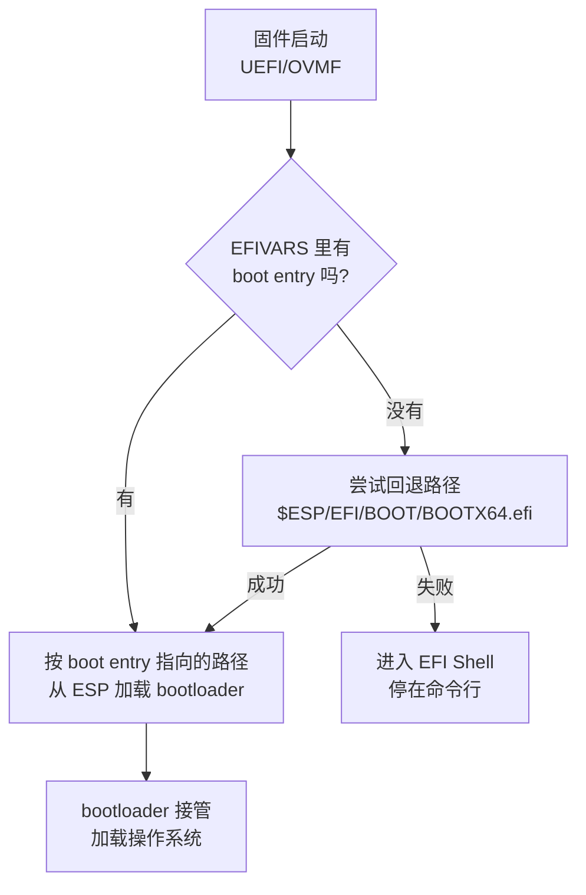

# 第一章：固件做什么、BIOS 与 UEFI 差在哪

你在 VMware 里新建虚拟机，翻到 Settings → Options → Advanced，看到一个 **Firmware type** 下拉框，两个选项：Legacy BIOS、UEFI。选哪个？随手选一个，装完系统，日子照过——直到某天你要装 Windows 11、要做 GPU 直通，或者手滑把固件改了一下，虚拟机从此起不来。

这一章不讲操作，先把「这个下拉框到底是什么」说清楚。因为你的两个痛点——「不知道用哪个」和「选 UEFI 总出问题」——根子在同一个地方：**固件不是一个孤立开关，它和客户机磁盘上的分区表、和固件自己记住的引导项，是一条链上的三节**。链上任何一节对不上，虚拟机就停在启动画面上。

---

## 1. 固件是虚拟机的第一段代码

虚拟机本质是一个进程。这个进程启动时，CPU 是「裸」的——内存里没有操作系统，磁盘上的系统也还没有被读。此时必须先跑一段程序，让这台「假电脑」看起来像真电脑：初始化基本硬件、准备好给操作系统用的接口，然后把控制权交给系统。

这段程序就是固件。Proxmox VE 官方手册把它讲得很直白：

> "In order to properly emulate a computer, QEMU needs to use a firmware. Which, on common PCs often known as BIOS or (U)EFI, is executed as one of the first steps when booting a VM. It is responsible for doing basic hardware initialization and for providing an interface to the firmware and hardware for the operating system."

——固件在启动的最早阶段执行，负责基本硬件初始化，并为操作系统提供访问固件与硬件的接口。[^c1-L2-1]

三个关键点从这句话里拆出来：

1. **它最早执行**：比操作系统早，比引导加载程序也早。所以它出问题，现象一定是「还没进系统就卡住」——黑屏、停在某个菜单、报找不到引导设备。这决定了第六章排错时的观察窗口。
2. **它做硬件初始化**：虚拟机里这块是模拟出来的，固件选择会连带影响「这台虚拟机对外呈现成什么机器」——包括后面会讲到的机型（q35 / i440fx）、显卡直通能力。
3. **它提供接口**：操作系统后续通过固件留下的接口读时间、读设备信息。Proxmox 手册在同一章举过一个具体例子：Windows 期望 BIOS 时钟用本地时间，Unix 系期望用 UTC，所以创建虚拟机时要选对 OS 类型，PVE 才能优化这些底层参数。[^c1-L2-1]

> [!tip] 大白话：把固件想成「开机自检员 + 前台」
> 你进一栋大楼，先有个人检查水电、把灯打开（硬件初始化），再告诉你去几楼找谁（提供接口）。这个人就是固件。
> 所以：**固件坏了或者配置不对，你连大厅都进不去**，后面「找哪个房间」的事根本无从谈起。你在排错时看到的所有「进不去系统」，都要先在「前台」这一层找原因。

### 固件在虚拟机里长什么样：三个看得见的落点

抽象地说「固件」容易飘。落到你实际能点、能看的界面，它其实是三个具体的产物：

| 产物 | 存在哪里 | 谁读它 | 换固件模式后会不会跟着变 |
| --- | --- | --- | --- |
| 固件程序本体 | 平台自己带（VMware 内置、PVE 的 pve-edk2-firmware 包等），你不直接接触 | 虚拟机启动时的第一个执行者 | 会换（换的就是它） |
| 分区表（MBR / GPT） | **客户机虚拟磁盘**的头部扇区 | 固件 | **不会变**——这是问题的根源 |
| 引导项 / 引导顺序记录 | UEFI 侧在 NVRAM（EFIVARS）；PVE 用一块单独的 EFI Disk 存 boot order | 固件 | 不会自动重建 |
| ESP（EFI 系统分区） | 客户机磁盘上的一个分区，里面放 `.efi` 引导程序 | UEFI 固件 | Legacy 模式下这个分区不被使用 |

这张表是本章的骨架。后面几节会逐格展开。

> [!tip] 大白话：把固件想成「换锁的门禁系统」
> 换了门禁系统（固件），但楼里的房间编号规则（分区表）没换、员工卡（引导项）也没重办。
> 所以：**换固件不会顺手帮你改造楼里的结构**，这正是「切完 UEFI 就起不来」的官方解释（第 3 节）。

---

## 2. 选项只有两个，但每个厂商叫法不同

VMware 官方文档把客户机固件类型限定为两项，没有第三个：

| 选项 | 官方原文描述 |
| --- | --- |
| UEFI | "UEFI is an interface between the operating system and the platform firmware. UEFI has architectural advantages over Basic Input/Output System (BIOS) firmware." |
| Legacy BIOS | "Standard BIOS firmware." |

[^c1-L1-1]

注意这里有个信息量很大的细节：**VMware 官方对「UEFI 比 BIOS 好在哪」的全部说明，就是「架构上有优势」这半句**。它没有给任何「什么场景该选哪个」的建议，只给了选择 UEFI 的前置条件（第 3 章会逐条列）。所以——

> **推理（非官方结论）**：本章和第二章里凡属「什么场景推荐选谁」的判断，都不是 VMware 官方说的，而是我们依据各来源条件归纳出来的。VMware 官方只给条件与警告。[^c1-L1-1]

再看 PVE 侧的措辞。同样是这两个选项，PVE 用的是不同的名字：

> "By default QEMU uses **SeaBIOS** for this, which is an open-source, x86 BIOS implementation. SeaBIOS is a good choice for most standard setups."

——PVE 默认使用 SeaBIOS，一个开源的 x86 BIOS 实现；官方称它适合大多数标准配置。[^c1-L2-1]

于是三套术语指的是同一件事，第一次见很容易以为是三种东西：

| 平台 | 「旧模式」叫什么 | 「新模式」叫什么 | 界面上在哪选 |
| --- | --- | --- | --- |
| VMware Workstation | Legacy BIOS | UEFI | Settings → Options → Advanced → Firmware type |
| Proxmox VE | SeaBIOS（`bios=seabios`） | OVMF（`bios=ovmf`） | 虚拟机硬件设置里的 BIOS 选项 |
| Hyper-V | 第 1 代虚拟机 | 第 2 代虚拟机 | 创建时就定，之后不可改 |
| VirtualBox | BIOS（默认） | EFI（手册章节名 Alternative Firmware，主干版已改称 UEFI） | 虚拟机 Settings 中启用 EFI，或命令行切换 |

> 说明：VMware 的字段名与其官方文档口径见 [^c1-L1-1]；PVE 的 `bios=seabios` / `bios=ovmf` 取值与默认值见 [^c1-L2-1]；Hyper-V 的代次绑定见 [^c1-GEN12]；VirtualBox 的默认值与「EFI/BIOS」两种叫法见 [^c1-L1-2]（6.0 手册，章节标题为 Alternative Firmware (EFI)）与 [^c1-L1-3]（主干手册，章节标题已改为 Alternative Firmware (UEFI)）。

一个必须记住的词：**SeaBIOS 是「BIOS 的一种实现」，OVMF 是「UEFI 的一种实现」**。你在 PVE 文档里看到 OVMF，在 VMware 文档里看到 UEFI，说的是同一类东西。

> [!tip] 大白话：把固件想成「同一份说明书的不同译本」
> Legacy BIOS = BIOS = SeaBIOS = Hyper-V 第 1 代，四个名字一个东西；UEFI = EFI = OVMF = Hyper-V 第 2 代，也是四个名字一个东西。
> 所以：**看到陌生名词先别慌，先归类到「旧」还是「新」**。真正要判断的从来只有这一个二选一。

---

## 3. 两种模式真正的分界线：固件与分区表是绑死的

这是本章最重要的一节，也是你「选 UEFI 总出问题」最可能的病根。

Broadcom 官方知识库有一篇专门讲这个故障的文章，标题就是《Virtual Machine fails to boot when changing the Firmware from BIOS to EFI》。它的 Cause 段落写道：

> "This is an expected behavior as changing the firmware is not supported since BIOS uses **MBR (Master Boot Record)** partitioning and EFI requires **GPT (GUID Partition Table)** partitioning on the VM disks. While changing the Firmware, a warning is also displayed that the installed guest operating system might become unbootable."

——改固件不受支持；BIOS 使用 MBR 分区，EFI 要求 GPT 分区；切换时界面会警告已安装的客户机系统可能变得无法启动。[^c1-L3-1]

请逐句读这句话，它有三个层次：

1. **绑定关系**：BIOS ↔ MBR，EFI ↔ GPT。不是「推荐搭配」，是要求。
2. **官方定性**：切完起不来是 **expected behavior**（预期行为），不是 bug，所以别指望厂商修复或给补丁。
3. **切换不会转换分区表**：文章给的解法是「重建虚拟机后挂原盘」或「切 EFI **前**先把磁盘转成 GPT」——两个解法都指向同一个事实：**切换动作本身不会动你的分区表**。[^c1-L3-1]

把这条绑定的后果做成表格：

| 你的操作 | 磁盘现状 | 结果 |
| --- | --- | --- |
| 一直是 Legacy BIOS 从没改过 | MBR | 正常 |
| 一直是 UEFI 从没改过 | GPT | 正常 |
| Legacy → UEFI，装完系统后改 | 仍是 MBR | **预期无法启动**（固件要 GPT，但盘上还是 MBR）[^c1-L3-1] |
| UEFI → Legacy，装完系统后改 | 仍是 GPT | 同样失败（原文覆盖双向："from BIOS to EFI or from EFI to BIOS"）[^c1-L3-1] |

> [!tip] 大白话：把分区表想成「楼里的房间编号规则」
> 老楼按「房间号 + 一条走廊索引」排（MBR），新楼要求按「全局唯一编号 + 一份完整目录」排（GPT）。
> 换了新的楼管（固件），可是楼的编号规则没动——新楼管拿着新规则去查号码，一个都对不上，于是直接宣布「这楼我管不了」。
> 所以：**固件模式和分区表是同一个决定的两半，必须在新建虚拟机时一次定好**。这也是为什么第二章会把「创建时就定死，别装完再改」单独拎出来讲。

### Legacy 侧的分区表细节：本轮素材没有覆盖

上面这条官方原文只说了「BIOS 使用 MBR」，**没有**逐步描述 Legacy 从 MBR 到引导扇区的完整链路。所以：

> **推理**：Legacy 模式下固件读 MBR 分区表、再跳到活动分区的引导扇区去执行引导代码——这个机制属于通用常识补齐，本轮 16 个来源中没有明文覆盖。
> **缺口**：MBR 分区表的结构细节（主分区上限、扩展分区等）本章不展开，本轮素材只在 MBR→GPT 转换那个场景里提到过「MBR 分区表最多三个主分区」这一条限制，且那属于转换工具的约束，不是分区表本身的完整描述。[^c1-MBR2GPT]

---

## 4. UEFI 的启动链路：它到底在找什么

理解了「UEFI 要 GPT」，还要理解「UEFI 要的是一块**特定分区**」。这是第二条最容易踩空的地方。

Proxmox VE 的官方 wiki 有一页专门讲 OVMF 引导项，开头三句话就把整条链路说完了：

> "If a VM boots via OVMF (UEFI), the firmware has to know which bootloader it has to start from the ESP. When no boot entries exist in the EFIVARS store, it tries to load the fallback `$ESP/EFI/BOOT/BOOTX64.efi` loader. Should that also fail, the VM gets booted into the EFI Shell"

——如果虚拟机通过 OVMF (UEFI) 启动，固件必须知道该从 ESP 里启动哪个引导加载程序；当 EFIVARS 存储里没有引导项时，它会尝试加载回退路径 `$ESP/EFI/BOOT/BOOTX64.efi`；如果这也失败，虚拟机会被引导进入 EFI Shell。[^c1-L2-3]

> 层级说明：这一页是 Proxmox VE 的**官方 wiki**，不是参考手册（reference documentation）。它描述的是操作手法与机制说明，正式程度低于 `pve-docs` 手册，引用时请按此对待。[^c1-L2-3]

把这句话画成链路图：



同一件事用纯文本再写一遍，方便你复制到别处：

```text
UEFI 启动查表顺序
  1. 查 EFIVARS 里的 boot entry  →  有则按它指的路走
  2. 无 boot entry  →  试回退路径 $ESP/EFI/BOOT/BOOTX64.efi  →  成功则继续
  3. 回退也失败  →  落到 EFI Shell（一个停在命令行的界面）
```

这条链路上有三个名词需要落实：

| 名词 | 是什么 | 在链路上的角色 | 来源 |
| --- | --- | --- | --- |
| **ESP**（EFI System Partition） | 客户机磁盘上的一个分区，存放 `.efi` 引导程序 | 所有 UEFI 引导程序的存放地 | [^c1-L2-3] [^c1-L3-3] |
| **boot entry** | 固件记在 EFIVARS 里的一条「去哪个分区的哪个路径找哪个程序」的记录 | 首选路径；缺失就退回第 2 步 | [^c1-L2-3] |
| **EFI Shell** | 回退也失败时落到的命令行环境 | 失败终点，也是人工修复入口 | [^c1-L2-3] |

这里有一个反直觉但极其重要的推论：**UEFI 不靠「磁盘第一个扇区」找系统，它靠「一条记录 + 那个记录指向的文件在不在」**。所以当你在第六章看到「找不到引导程序」，根因几乎总是这两件事之一——记录丢了，或者 ESP（记录指向的分区）没了。Microsoft 的排错文档把第二件事说得很直接：

> "If the EFI System Partition (ESP) has been deleted or is missing, the VM cannot locate the UEFI boot loader and startup will fail."

——如果 EFI 系统分区被删除或缺失，虚拟机无法定位 UEFI 引导加载程序，启动将失败。[^c1-L3-3]

> [!tip] 大白话：把 boot entry 想成「前台桌上的访客预约本」
> 你（固件）去前台找一位访客（引导程序）。前台先翻预约本（EFIVARS 里的 boot entry）：有，就按上面写的房间号去找。
> 预约本上没有，前台按备用规则去一个固定房间碰运气（`$ESP/EFI/BOOT/BOOTX64.efi`）。
> 还是没人，前台就把你晾在一个空房间里站着——**这个空房间就是 EFI Shell**。
> 所以：**停在 EFI Shell 不代表系统坏了，只代表「预约本上没有、备用房间也是空的」**。对应到实操，就是去补一条预约记录（第六章的 Add Boot Option）。

### Legacy 与 UEFI 的链路对照

| | Legacy BIOS | UEFI |
| --- | --- | --- |
| 分区表要求 | MBR | GPT [^c1-L3-1] |
| 引导程序放在哪 | MBR 的引导扇区（**推理**，本轮无明文） | ESP 分区里的 `.efi` 文件 [^c1-L2-3] |
| 固件怎么找到它 | 读磁盘固定位置（**推理**） | 读 EFIVARS 记录 → 回退固定路径 [^c1-L2-3] |
| 找不到时的表现 | 本轮素材未覆盖（**缺口**） | 进入 EFI Shell [^c1-L2-3] |
| 有无 Secure Boot | 无此机制 | 有（见下节） |

表格中标「推理」与「缺口」的两行，本轮来源确实没有给出，请不要在需要精确引用的场合（比如给别人解释、写工单）把这两行当作官方说法。

---

## 5. Secure Boot：UEFI 独有的一道额外检查

这是 UEFI 一侧独有的机制，也是「选 UEFI 后出问题」的高频来源：启动时多了一道签名检查。

> "Secure Boot verifies the boot loader is signed by a trusted authority in the UEFI database."

即验证引导加载程序是否由 UEFI 数据库中的受信机构签名。[^c1-GEN12] 被检查的还包括 UEFI 驱动（option ROM）：官方称它阻止未经授权的固件、操作系统或 UEFI 驱动在启动时运行，并在第 2 代虚拟机中默认启用。[^c1-GEN2SEC] VMware 侧口径一致，措辞是拒绝加载未使用「可接受数字签名」的驱动与系统加载器。[^c1-L1-1]

| 问题 | 答案 |
| --- | --- |
| 谁被检查 | 引导加载程序、UEFI 驱动、option ROM [^c1-GEN2SEC] |
| 不通过怎么办 | 官方明确：签名不正确时须为该虚拟机**关闭 Secure Boot** [^c1-GEN12] |
| 默认开还是关 | Hyper-V 第 2 代默认启用 [^c1-GEN2SEC]；PVE 加 `pre-enrolled-keys=1` 也默认启用，仍可在虚拟机内关闭 [^c1-L2-1] |
| Legacy 一侧 | 没有对应机制 |

> **推理**：自签名驱动、第三方 option ROM、非主流发行版引导程序是高风险对象——由「只放行名单内对象」推出；本轮素材无官方针对性结论。

> [!tip] 大白话：把 Secure Boot 想成「安检名单」
> 名单上有你名字才放行（受信签名），没有就一律拦下。
> 所以：**开 Secure Boot 后起不来，先怀疑「引导程序在不在名单上」**，而不是「系统坏了」。不在名单上，官方给的处置就是关掉它——这是官方许可的做法，不是「绕过安全」。

---

## 6. Hyper-V 最短对照：代次就是固件

按范围界定，Hyper-V 只作简短对照。它值得记的机关是：**固件选择被包装成「虚拟机代次」，而代次创建后不可更改**。[^c1-GEN12]

官方用设备替换表表达这层等价关系，其中一行是：

| Generation 1 Device | Generation 2 Replacement | Generation 2 Enhancements |
| --- | --- | --- |
| Legacy BIOS | UEFI firmware | Secure Boot |

即「第 1 代 = Legacy BIOS，第 2 代 = UEFI firmware」是官方用对照表给出的等价关系，而非一句否定式声明。[^c1-GEN12]

另有一条容易误解的说明：第 2 代虚拟机的虚拟固件**独立于宿主机上装的是什么**。[^c1-GEN12] 这解释了为什么在宿主机 BIOS 里折腾 Secure Boot 对客户机固件模式毫无影响。宿主侧开启虚拟化（如 VT-x）属既有笔记 [[虚拟机/虚拟机的概念和使用.md]] 的范围。

> [!tip] 大白话：把 Hyper-V 代次想成「买车时选油车还是电车」
> 不是「买回来再改」，是下单那一刻就定了（官方明文：代次创建后不可更改）。
> 所以：**Hyper-V 没有「装完再切固件」这个选项**，这最直观地印证了本章的核心结论——固件模式是新建虚拟机时的决定。

---

## 7. 一个容易读错的词：「MBR」的两种含义

这一节是术语提醒，属于**推理归纳**，不是任何来源的明文。

同一个词 `MBR`，在本轮的两份来源里指的是不同的东西：

- **来源 L3-1（Broadcom KB）** 用 MBR 指**纯 MBR 分区方案**——即 "BIOS uses MBR (Master Boot Record) partitioning"，是与 GPT 并列的另一种分区方式。[^c1-L3-1]
- **来源 L3-3（Microsoft 排错文档）** 里的 `gdisk` 输出，在一块**GPT 磁盘**上打印出 `MBR: protective`：

```text
Partition table scan:
  MBR: protective
  BSD: not present
  APM: not present
  GPT: present

Found valid GPT with protective MBR; using GPT.
```

[^c1-L3-3]

也就是说，GPT 磁盘上**也存在**一个 MBR——它是保护性 MBR（protective MBR），一个防止老工具误判的兼容外壳。

> **推理**：既然 GPT 磁盘也带 MBR 外壳，那么把 L3-1 那句读成「GPT 磁盘上没有 MBR」就是误读。两处说法不冲突，冲突的是「MBR」这个缩写在两种语境下的所指。本轮来源都未对此做术语声明，这条归纳由我们完成。

> [!tip] 大白话：把 `MBR: protective` 想成「新楼门口挂的一块旧牌子」
> 新楼用的是全新的门牌系统（GPT），但门口仍挂了一块老牌子（保护性 MBR），上面写着「这栋楼不要再按老方法查了」。
> 所以：**看到老字样不等于用的是老方案**。判断一块盘到底是 MBR 还是 GPT，要看 `GPT: present` 这类实质信息，不能看见 "MBR" 三个字母就下结论。

---

## 8. 本章明确的缺口：CSM

有一件事本章**刻意不写**，需要你知道原因，以免日后发现笔记里没提而以为漏了：

> **缺口**：CSM（Compatibility Support Module，兼容性支持模块，通常被描述为「让 UEFI 能引导 Legacy 系统的兼容层」）在**本轮 16 个来源中零命中**——没有任何一份来源提到它。因此本笔记**不给 CSM 的任何定义、行为或配置结论**。
> 如果你在某个平台的界面上看到 CSM 相关的选项，本笔记目前无法就该选项的含义或该不该开提供引用支持。补齐需要回到资料收集阶段补充来源。

---

## 本章小结

- **固件是虚拟机启动时执行的第一段代码**，负责基本硬件初始化并为操作系统提供接口；它出问题的现象必然是「进系统之前就卡住」。它只有两个模式，但有多套名字：Legacy BIOS = BIOS = SeaBIOS = Hyper-V 第 1 代；UEFI = EFI = OVMF = Hyper-V 第 2 代。[^c1-L2-1] [^c1-L1-1] [^c1-GEN12]
- **固件与分区表绑死**：BIOS 用 MBR、EFI 要 GPT；改固件不受支持，切完无法启动被官方定性为**预期行为**，且切换**不会**转换分区表。[^c1-L3-1]
- **UEFI 的查找顺序**：EFIVARS 里的 boot entry → 回退 `$ESP/EFI/BOOT/BOOTX64.efi` → 都不行就落到 EFI Shell。ESP 被删或缺失，就会「找不到 UEFI 引导加载程序」。[^c1-L2-3] [^c1-L3-3]
- **Secure Boot 是 UEFI 独有的签名检查**，拦的是引导加载程序、UEFI 驱动与 option ROM；签名不被接受时，官方许可的处置是关闭 Secure Boot。[^c1-GEN12] [^c1-GEN2SEC] [^c1-L1-1]
- **本章的推理与缺口**（引用时勿当官方结论）：「什么时候推荐选谁」的场景判断（推理）、Legacy 侧的引导链路细节（推理）、`MBR` 一词的两种含义归纳（推理）、CSM（零命中缺口）。

既然固件模式在创建虚拟机时就定死了，而且它牵连着分区表、ESP 和引导项——那下一个问题自然就是：**什么情况下必须选 UEFI，什么情况下用默认的 Legacy 反而更省事？** 下一章给出一张可以照着查的决策表，每条判断都标明依据与来源层级。

---

[^c1-L1-1]: **L1-1** · VMware Workstation Pro — Configure a Firmware Type（官方文档）· https://techdocs.broadcom.com/us/en/vmware-cis/desktop-hypervisors/workstation-pro/25H2/using-vmware-workstation-pro/using-virtual-machines-in-workstation-pro-user-guide/starting-virtual-machines/configure-a-firmware-type.html
[^c1-L1-2]: **L1-2** · Oracle VirtualBox 用户手册 6.0 — 3.14 Alternative Firmware (EFI)（官方文档）· https://docs.oracle.com/en/virtualization/virtualbox/6.0/user/efi.html
[^c1-L1-3]: **L1-3** · VirtualBox 手册主干源文件 — Alternative Firmware (UEFI)（官方文档，master 分支）· https://raw.githubusercontent.com/VirtualBox/virtualbox/refs/heads/main/doc/manual/en_US/dita/topics/efi.dita
[^c1-L2-1]: **L2-1** · Proxmox VE Administration Guide — QEMU/KVM Virtual Machines（官方参考手册，v9.2.11）· https://pve.proxmox.com/pve-docs/chapter-qm.html
[^c1-L2-3]: **L2-3** · Proxmox VE Wiki — OVMF/UEFI Boot Entries（官方 wiki 层级，oldid=12527）· https://pve.proxmox.com/wiki/OVMF/UEFI_Boot_Entries
[^c1-L3-1]: **L3-1** · Broadcom KB 384912 — Virtual Machine fails to boot when changing the Firmware from BIOS to EFI（官方知识库）· https://knowledge.broadcom.com/external/article/384912/
[^c1-L3-3]: **L3-3** · Microsoft Learn — Troubleshoot UEFI boot failures with Azure Linux images（官方排错文档）· https://learn.microsoft.com/en-us/troubleshoot/azure/virtual-machines/linux/azure-linux-vm-uefi-boot-failures
[^c1-GEN12]: **GEN12** · Microsoft Learn — Should I create a generation 1 or 2 virtual machine in Hyper-V?（官方文档）· https://learn.microsoft.com/en-us/windows-server/virtualization/hyper-v/plan/should-i-create-a-generation-1-or-2-virtual-machine-in-hyper-v
[^c1-GEN2SEC]: **GEN2SEC** · Microsoft Learn — Hyper-V Generation 2 Virtual Machine Security Features（官方文档）· https://learn.microsoft.com/en-us/windows-server/virtualization/hyper-v/learn-more/Generation-2-virtual-machine-security-settings-for-Hyper-V
[^c1-MBR2GPT]: **MBR2GPT** · Microsoft Learn — MBR2GPT.EXE（官方文档）· https://learn.microsoft.com/en-us/windows/deployment/mbr-to-gpt
