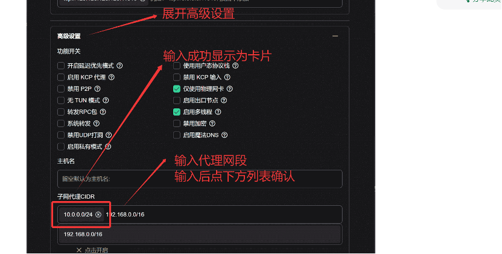

# 为什么内网能直接连，而外网要账号密码？

Clash/OpenClash 的默认安全策略

OpenClash 默认在配置文件中有这样一段（或者在 LuCI 网页中设置的）：

```
allow-lan: true
external-controller: 0.0.0.0:9090
authentication:
  - "user:pass"
```

还有：

```
mixed-port: 7890
```

👉 当你 在**内网中访问** 时，**OpenClash** 识别你是 **局域网设备（LAN
IP，如192.168.x.x），**

此时即使 **authentication** 有启用，也 **默认放行局域网访问。**

而当你 **从公网访问（通过端口映射）** 时，

OpenClash 会认为这是一个 **非受信任的来源（WAN访问）**。

为了防止你的**代理端口**被别人随便用**（代理劫持或滥用），**

**Clash** 核心自动**要求用户名密码验证（Basic Auth）。**

# 账号密码是什么？

这个账号密码其实就在 OpenClash 的配置文件中：

路径通常是：

```
/etc/openclash/config.yaml
```

或

```
/etc/openclash/clash.yaml
```

或你导入的配置文件里（比如订阅的Clash配置）。

你可以搜索：

```
authentication:

  - "user:pass"
```

例如：
```
authentication:

  - "admin:123456"
```

外网访问时，如果 Clash 检测到这个字段存在，就必须用这个认证信息。

## 如果你没有设置过账号密码

那说明两种可能：

🔸 **订阅配置文件**（如机场提供的）自带认证。

它可能**自动启用了 authentication** 字段，**所以公网访问要登录。**

🔸 **Clash** 在 **WAN** 访问时默认**触发安全认证机制，**

即使你没手动设置，也会要求账号密码来防止暴露代理端口。

## 如何查看账号密码？

### 方案一：查看当前的认证信息

SSH 到软路由上：

```
cat /etc/openclash/config.yaml \| grep authentication -A 2
```

或 

```
cat /etc/openclash/clash.yaml \| grep authentication -A 2
```

会看到类似：

authentication:

\- \"user:pass\"

这个就是你公网访问要填的账号密码。

### 方案二：关闭认证（不推荐暴露公网时）

如果只是测试用，可暂时在配置中注释掉：

```
# authentication:

#   - "user:pass"
```

或者在 LuCI → OpenClash → 配置文件 → 编辑

把 "启用身份验证" 关掉。

然后重启 OpenClash。

⚠️
**强烈不建议关闭**，因为你的代理端口暴露在公网，一旦无密码，任何人都能用你的代理流量。

### 方案三：安全推荐

更推荐这样做👇：

1.  不直接暴露 7890/7891 等代理端口

2.  使用 VPN（如 WireGuard / Zerotier / EasyTier）连接进内网

3.  然后在 VPN 内使用 192.168.x.x:7890 的代理端口

这样安全、稳定、不用密码。

# 用easytier进行子网组网

假设家中的设备在子网 192.168.1.0/24
网段中，想在公司访问家中的任意设备，则可在家中启动一个 EasyTier
节点，新增子网代理
192.168.1.0/24。公司的设备中无需任何额外配置，只需与家中节点成功组网，即可访问家中任意设备。

这一我在我的飞牛上用docker-compose安装了easytier。
```
services:
  watchtower: # 用于自动更新easytier镜像，若不需要请删除这部分

    image: containrrr/watchtower

    container_name: watchtower

    restart: unless-stopped

    environment:

      - TZ=Asia/Shanghai

      - WATCHTOWER_NO_STARTUP_MESSAGE

    volumes:

      - /var/run/docker.sock:/var/run/docker.sock

    command: --interval 3600 --cleanup --label-enable

  easytier:

    image: easytier/easytier:latest # 国内用户可以使用 m.daocloud.io/docker.io/easytier/easytier:latest

    hostname: easytier

    container_name: easytier

    labels:

      com.centurylinklabs.watchtower.enable: 'true'

    restart: unless-stopped

    network_mode: host

    cap_add:

      - NET_ADMIN

      - NET_RAW

    environment:

      - TZ=Asia/Shanghai

    devices:

      - /dev/net/tun:/dev/net/tun

    volumes:

      - /etc/easytier:/root

      - /etc/machine-id:/etc/machine-id:ro # 映射宿主机机器码

    command: -d --network-name <用户> --network-secret <密码> -p tcp://public.easytier.cn:11010
```

我们一般是修改这里的最后一行（但是我这里由于始终无法用命令行连接，所以我直接使用easytier官方的web控制台进行管理）。

```
Command :-w \<你的用户名\>
```

最后一行该成你的用户名即可。

加入到**网络**后，在**高级设置**中的子网代理中填写你的的那个**网段。**

比如你的飞牛是192.1658.1.119,那你就填192.168.1.0/24即可。


