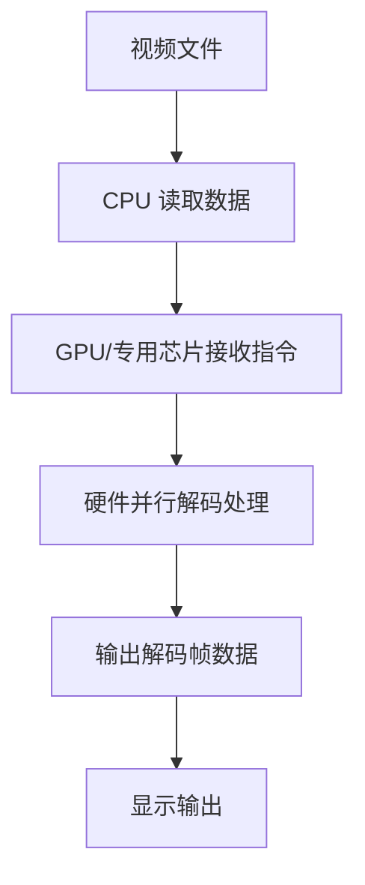
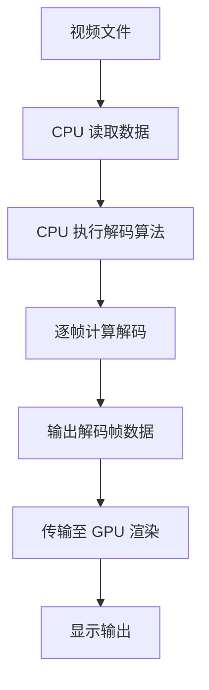

# 硬件解码 vs 软件解码

## 1. 基本概念定义

> [!info] 解码的基本含义
> 解码是指将编码压缩后的视频数据还原为原始画面数据的过程。视频文件经过压缩后体积更小，但需要解码才能播放。

### 硬件解码

**硬件解码**（Hardware Decoding）是指利用计算机或移动设备中专门的硬件加速单元来进行视频解码。这些硬件单元包括：
- **GPU**（图形处理器）的专用解码电路
- **Intel Quick Sync Video** 集成显卡解码功能
- **NVIDIA NVDEC**（前身为 PureVideo）解码引擎
- **AMD VCE** 视频编码解码引擎
- **移动设备 SoC** 中的专用视频解码模块（如 Apple VideoToolbox）

### 软件解码

**软件解码**（Software Decoding）是指完全依赖 CPU 执行解码算法来进行视频解码。常见的软件解码库包括：
- **FFmpeg** 开源多媒体框架
- **VLC Media Player** 内置解码器
- **libavcodec** 编解码库

---

## 2. 工作原理对比

### 硬件解码工作流程



**工作特点**：
1. CPU 只负责读取数据和管理指令
2. 实际解码工作由专用硬件完成
3. 硬件可以并行处理多个数据块
4. 解码后数据直接送入显存用于渲染

### 软件解码工作流程



**工作特点**：
1. CPU 承担所有解码计算任务
2. 需要 CPU 有足够的计算能力
3. 通常为串行处理，效率较低
4. 解码后数据需从内存传输到显存

---

## 3. 性能差异

| 比较维度 | 硬件解码 | 软件解码 |
|---------|---------|---------|
| **CPU 占用率** | 极低（通常 < 10%） | 高（30%-90%+） |
| **解码速度** | 快，支持高帧率 | 取决于 CPU 性能 |
| **功耗** | 低，专用硬件效率高 | 高，CPU 负载大 |
| **发热** | 较低 | 较高 |
| **内存占用** | 较低 | 较高 |
| **续航影响** | 对电池友好 | 消耗大量电量 |

> [!tip] 性能实测参考
> 以 4K H.265 视频为例：
> - 硬件解码：CPU 占用约 5-15%，可以流畅播放
> - 软件解码：CPU 占用约 80-100%，可能导致卡顿

---

## 4. 兼容性对比

### 支持的编码格式

> [!important] 格式支持因硬件而异
> 不同硬件平台支持的视频编码格式不同，取决于硬件厂商的实现。

| 编码格式 | 硬件解码支持 | 软件解码支持 | 说明 |
|---------|-------------|-------------|------|
| **H.264 / AVC** | ✅ 广泛支持 | ✅ 完全支持 | 主流格式，几乎所有硬件都支持 |
| **H.265 / HEVC** | ⚠️ 部分支持 | ✅ 完全支持 | 需较新硬件（近 5 年） |
| **AV1** | ⚠️ 有限支持 | ✅ 完全支持 | 最新格式，仅高端硬件支持 |
| **VP9** | ⚠️ 部分支持 | ✅ 完全支持 | 主流硬件逐渐支持 |
| **VP8 / Theora** | ❌ 几乎不支持 | ✅ 完全支持 | 较旧格式，硬件不再支持 |
| **MPEG-2** | ✅ 部分支持 | ✅ 完全支持 | DVD 视频，部分硬件支持 |
| **MPEG-4 ASP** | ❌ 几乎不支持 | ✅ 完全支持 | XviD/DivX 格式 |

### 解码能力限制

#### 硬件解码限制
- **分辨率上限**：取决于显卡型号（如 4K、8K）
- **色深支持**：8bit、10bit、12bit 支持情况不一
- **位深精度**：可能存在精度损失
- **滤镜支持**：通常不支持后处理滤镜

#### 软件解码优势
- **无分辨率限制**：只受 CPU 性能和内存限制
- **完整精度**：按规范精确解码
- **滤镜支持**：可应用各种后处理滤镜
- **调试能力**：便于开发调试

---

## 5. 使用场景分析

### 硬件解码适合的场景

> [!success] 硬件解码适用情况

- 📱 **移动设备播放**：手机、平板播放视频，节省电量
- 🔋 **笔记本续航需求**：长时间观看视频时延长电池寿命
- 🖥️ **低配置电脑**：CPU 性能不足但有独立显卡
- 🎬 **高分辨率视频**：4K、8K 视频播放
- ⚡ **多任务场景**：同时运行其他程序，CPU 资源紧张
- 🎮 **游戏 + 视频同屏**：边玩游戏边看视频
- 🏢 **批量处理**：媒体服务器同时解码多个视频流

### 软件解码适合的场景

> [!failure] 软件解码适用情况

- 🔧 **开发调试**：需要精确控制解码过程
- 🧪 **格式兼容性测试**：测试新格式或特殊编码
- ❌ **硬件不支持**：老旧硬件或特殊格式
- ⚙️ **应用滤镜效果**：需要后处理效果时
- 🖼️ **截图需求**：精确获取原始帧数据
- 🐛 **解决解码问题**：硬件解码出现画面异常时
- 🏗️ **服务器端转码**：批量转码任务

---

## 6. 优缺点总结

### 硬件解码

| 优点 | 缺点 |
|-----|------|
| ✅ CPU 占用极低 | ❌ 支持格式受硬件限制 |
| ✅ 解码速度快 | ❌ 不同硬件表现不一致 |
| ✅ 功耗低，续航好 | ❌ 可能存在精度损失 |
| ✅ 发热小 | ❌ 出错时难以调试 |
| ✅ 适合高分辨率 | ❌ 不支持后处理滤镜 |

### 软件解码

| 优点 | 缺点 |
|-----|------|
| ✅ 支持格式广泛 | ❌ CPU 占用极高 |
| ✅ 解码结果精确 | ❌ 功耗高，影响续航 |
| ✅ 硬件无关性 | ❌ 发热严重 |
| ✅ 支持滤镜后处理 | ❌ 高分辨率可能卡顿 |
| ✅ 便于调试和定制 | ❌ 多任务时性能下降 |

---

## 7. 选择建议

### 根据设备类型选择

#### 💻 台式机（中高端）
```
优先硬件解码 → 遇到问题切换软件解码
```
有独立显卡的台式机应优先使用硬件解码，遇到兼容性问题再切换软件解码。

#### 💻 笔记本电脑
```
优先硬件解码 → 电池模式必须硬件解码
```
笔记本应始终使用硬件解码以节省电量，电池续航至关重要。

#### 📱 移动设备（手机/平板）
```
始终使用硬件解码
```
移动设备基本强制硬件解码，软件解码会严重耗电并导致发热。

#### 🖥️ 低配旧电脑
```
优先硬件解码 → 如无硬件则降低分辨率使用软件
```
如果硬件不支持，考虑降低视频分辨率或使用软件解码。

### 根据视频格式选择

| 格式 | 推荐方式 | 理由 |
|------|---------|------|
| H.264 1080p 及以下 | 硬件解码 | 广泛支持，性能无压力 |
| H.265 4K | 硬件解码 | CPU 难以胜任 |
| AV1 | 硬件解码（如支持） | 否则需高端 CPU |
| 老旧格式（MPEG-4 等） | 软件解码 | 硬件通常不支持 |

### 根据播放需求选择

> [!tip] 实用建议

1. **常规观影**：硬件解码优先
2. **截图录屏**：软件解码可确保画面精确
3. **转码处理**：软件解码或专用硬件转码
4. **卡顿问题**：先尝试切换解码方式
5. **画面异常**：切换软件解码验证是否为硬件 bug

---

## 8. 常见问题

### Q1：为什么硬件解码时画面有马赛克？
> 这可能是显卡驱动问题或硬件解码器 bug。尝试：
> - 更新显卡驱动
> - 切换到软件解码验证
> - 检查视频是否使用了不支持的特性

### Q2：软件解码播放 4K 视频卡顿怎么办？
> 建议措施：
> - 使用硬件解码
> - 降低播放分辨率
> - 关闭后台程序释放 CPU
> - 升级硬件

### Q3：如何判断当前使用的是哪种解码方式？
> 检查方法：
> - 播放器信息面板查看
> - CPU 占用率（高=软件，低=硬件）
> - 任务管理器 GPU 使用情况

### Q4：硬件解码效果不如软件解码？
> 可能原因：
> - 硬件解码器精度不足
> - 驱动版本问题
> - 色彩空间设置不当
> - 视频使用了特殊编码特性

---

## 参考资源

- [FFmpeg 官方文档](https://ffmpeg.org/documentation.html)
- [NVIDIA NVDEC 技术文档](https://developer.nvidia.com/nvidia-video-codec-sdk)
- [Intel Quick Sync Video](https://www.intel.com/content/www/us/en/developer/tools/oneapi/onevpl.html)
- [Khronos Video Standards](https://www.khronos.org/)

---

## 相关笔记

- [[Strm流文件与302播放详解]]
- [[系统架构]]
