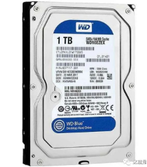
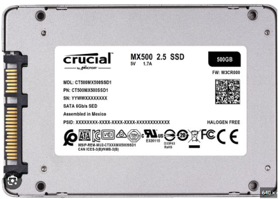
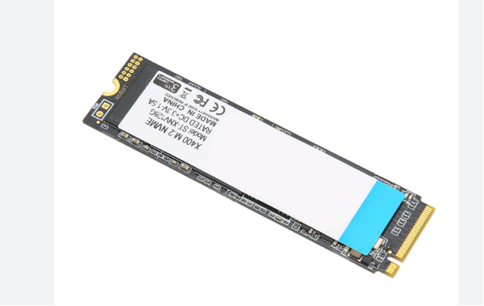
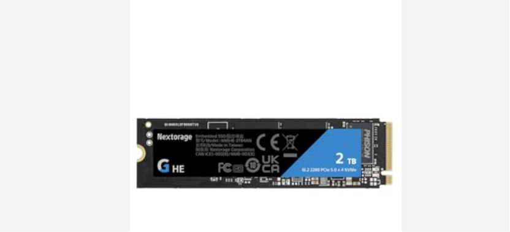

# 硬盘的基本概念

💡 什么是硬盘（Hard Disk / Storage）

硬盘（storage
device）是计算机用来**长期存储数据的**设备，区别于内存（RAM）的"易失性存储"，硬盘在断电后仍能保存数据。

常见用途：

1.  存放操作系统（Windows、Linux）

2.  存放应用程序、游戏、视频、文档等数据

3.  临时交换文件（Pagefile / Swap）

# 硬盘的类型

现代常见的硬盘主要分为两大类：

## 机械硬盘 HDD（Hard Disk Drive）

1.  利用**磁性碟片 + 磁头**读写数据。

2.  内部有马达驱动碟片旋转（常见 5400 RPM、7200 RPM）。

3.  优点：容量大、价格便宜。

4.  缺点：速度慢、容易震动损坏、功耗高。

🧠 原理简述：

数据以"磁性"的形式存储在旋转的金属盘片上，读写头通过磁感应改变或读取磁极方向。

📊 性能参考：

  -----------------------------------------------------------------------
  项目                                HDD
  ----------------------------------- -----------------------------------
  顺序读写                            100\~200 MB/s

  随机访问                            \~10ms（机械延迟）

  适合用途                            大容量存储、监控录像、冷备份
  -----------------------------------------------------------------------

## 固态硬盘 SSD（Solid State Drive）

1.  基于闪存芯片（NAND Flash）。

2.  无机械结构，靠电子方式读写。

3.  优点：速度快、抗震、功耗低。

4.  缺点：价格高、寿命受写入次数限制。

📊 性能参考：

  -----------------------------------------------------------------------
  类型                    接口                    顺序速度
  ----------------------- ----------------------- -----------------------
  SATA SSD                SATA III 6Gbps          \~500 MB/s

  NVMe SSD                PCIe 3.0/4.0            3000\~7000 MB/s

  PCIe 5.0 SSD            最新                    10000 MB/s+
  -----------------------------------------------------------------------

**SATA SSD、NVMe SSD、PCIe 5.0 SSD** ------
**都是固态硬盘（SSD）**，但它们之间的**接口、传输协议和速度差别非常大。**

### 从根本上看：区别在「接口」和「协议」

  ---------------------------------------------------------------------------------------
  项目             传输接口       通信协议    代表技术                     速度层级
  ---------------- -------------- ----------- ---------------------------- --------------
  SATA SSD         SATA           AHCI        传统接口（从机械硬盘继承）   🚗 普通车
                   III（6Gbps）                                            

  NVMe SSD（PCIe   PCIe x4        NVMe        新一代高速总线               🚅 高铁
  3.0/4.0）                                                                

  PCIe 5.0 SSD     PCIe 5.0 x4    NVMe        最新一代超高速接口           🚀 火箭
  ---------------------------------------------------------------------------------------

所以其实三者的核心区别是**通道带宽和协议效率。**

### SATA SSD

**🔹 接口：**

使用 **SATA III 接口（6 Gbps ≈ 600 MB/s）**

通常通过 **SATA 数据线 + 电源线连接到主**板

🔹 协议：

使用老的 **AHCI（Advanced Host Controller Interface） 协议**\
------ 这是**当年为机械硬盘（HDD）设计的，所以延迟较高。**

🔹 **优点：**

兼容性好（几乎所有主板都支持）

成本低

🔹 **缺点：**

速度上限 500\~550 MB/s（已被接口限制）

不能充分发挥 SSD 的并行读写优势

### NVMe SSD（PCIe 3.0 / PCIe 4.0）

**🔹 接口**：

使用 **M.2 接口（直接插在主板上）；**

走的是 **PCIe 通道（例如 PCIe 3.0 x4 或 PCIe 4.0 x4）。**

**🔹 协议：**

使用专为 SSD 设计的 **NVMe（Non-Volatile Memory Express）协议；**

支持并行队列（多达 64K 队列），延迟极低。

**🔹 性能：**

  -----------------------------------------------------------------------
  PCIe 代数               通道带宽                理论速度上限
  ----------------------- ----------------------- -----------------------
  PCIe 3.0 x4             4 GB/s                  约 3500 MB/s

  PCIe 4.0 x4             8 GB/s                  约 7000 MB/s
  -----------------------------------------------------------------------

**🔹 优点：**

1.  速度快（顺序读写 3000\~7000 MB/s）

2.  延迟低（访问时间 \< 0.05ms）

3.  无需额外线缆，直接插主板 M.2 槽

**🔹 缺点：**

1.  发热较高

2.  价格比 SATA SSD 贵一点

### PCIe 5.0 SSD（最新一代）

**🔹 接口：**

同样使用 **M.2 接口；**

但通道升级到 **PCIe 5.0 x4，每通道带宽翻倍。**

🔹 **性能：**

  -----------------------------------------------------------------------
  接口                    理论带宽                实测顺序速度
  ----------------------- ----------------------- -----------------------
  PCIe 4.0 x4             8 GB/s                  7000 MB/s

  PCIe 5.0 x4             16 GB/s                 10000\~14000 MB/s
  -----------------------------------------------------------------------

**🔹 优点：**

1.  性能极强，读取速度接近 14GB/s；

2.  适合 AI 训练、大型游戏、视频剪辑等场景。

🔹 缺点：

1.  **发热严重（**必须带散热片或风扇）；

2.  主板**必须支持 PCIe 5.0（如最新 AMD 700 系列、Intel 14代主板）**；

3.  价格较贵。

## 性能对比表

+----------+------------------+----------+--------------+----------+----------+
| 类型     | 接口带宽         | 协议     | 实测顺序速度 | 延迟     | 外观     |
+==========+==================+==========+==============+==========+==========+
| SATA SSD | 6                | AHCI     | 500 MB/s     | \~0.1 ms | 2.5 英寸 |
|          | Gbps（≈600MB/s） |          |              |          |          |
+----------+------------------+----------+--------------+----------+----------+
| NVMe SSD | 32               | NVMe     | 3000 MB/s    | \~0.05   | M.2      |
| (PCIe    | Gbps（≈4GB/s）   |          |              | ms       |          |
| 3.0)     |                  |          |              |          |          |
+----------+------------------+----------+--------------+----------+----------+
| NVMe SSD | 64               | NVMe     | 7000 MB/s    | \~0.03   | M.2      |
| (PCIe    | Gbps（≈8GB/s）   |          |              | ms       |          |
| 4.0)     |                  |          |              |          |          |
+----------+------------------+----------+--------------+----------+----------+
| NVMe SSD | 128              | N        | 10000\~14000 | \~0.02   | M.2      |
| (PCIe    | Gbps（≈16GB/s）  |          | MB/s         | ms       |          |
| 5.0)     |                  | VMe      |              |          |          |
+----------+------------------+----------+--------------+----------+----------+

# 文件系统类型：

  -----------------------------------------------------------------------
  文件系统                平台                    特点
  ----------------------- ----------------------- -----------------------
  NTFS                    Windows                 安全权限、支持大文件

  exFAT                   Win/mac通用             U盘常用

  FAT32                   通用                    单文件 ≤4GB

  EXT4                    Linux                   性能优异

  APFS                    macOS                   苹果系统专用
  -----------------------------------------------------------------------

# 硬盘接口与传输协议

  -----------------------------------------------------------------------
  接口              类型              带宽              常见设备
  ----------------- ----------------- ----------------- -----------------
  SATA III          串行接口          6 Gbps（≈600      HDD/SSD
                                      MB/s）            

  M.2 SATA          小型接口          6 Gbps            笔记本SSD

  M.2 NVMe          PCIe 3.0/4.0/5.0  3\~12 GB/s        NVMe SSD

  PCIe              高速总线          4x/8x 通道        NVMe SSD

  USB 3.2           外置硬盘          5\~20 Gbps        移动SSD

  SAS               企业级            稳定可靠          服务器用HDD
  -----------------------------------------------------------------------

🧠 补充：

NVMe（Non-Volatile Memory
Express）是一种专为SSD设计的高速协议，它比传统的SATA
AHCI延迟更低、效率更高。

# NAS常见文件啊系统

## NAS常见文件系统一览表

  ----------------------------------------------------------------------------------------------------------------------
  文件系统     常见平台/系统               支持特性                     典型用途           优势
  ------------ --------------------------- ---------------------------- ------------------ -----------------------------
  EXT4         Linux、Synology、QNAP等     日志系统（Journaling）       家庭/入门级NAS     稳定成熟、兼容性强

  Btrfs        Synology、OpenMediaVault    快照、校验、压缩、RAID支持   中高端NAS          数据保护强、支持快照

  ZFS          TrueNAS、FreeNAS、Proxmox   快照、校验、纠错、自修复     企业级NAS          数据可靠性最强

  XFS          Linux企业系统、NAS          大文件处理优化               视频/备份服务器    性能高，适合大文件

  NTFS / exFAT Windows系统、移动硬盘       日志系统、跨平台             外接盘、共享存储   兼容Windows，跨系统访问方便
  ----------------------------------------------------------------------------------------------------------------------

## 各文件系统的详细解析

### EXT4（第四代扩展文件系统）

**平台支持**：Linux 原生支持，绝大多数
NAS（Synology、QNAP、OMV）都支持。

**特点：**

1.  稳定成熟，十几年历史；

2.  支持 日志（Journaling），可防止掉电损坏；

3.  性能好，系统开销低；

4.  支持单文件最大 16TB、单分区最大 1EB。

**适合**：家庭NAS、入门级服务器。

**缺点：**

1.  不支持快照；

2.  没有内置校验机制（无法自动检测或修复文件损坏）。

✅ **优点总结**：快、稳、简单；

❌ **缺点：**数据安全防护机制一般。

### Btrfs（B-tree 文件系统）

**平台支持：**Synology、QNAP 高端机型、OpenMediaVault。

**核心特性：**

1.  快照（Snapshot）：可瞬时保存文件系统状态，便于恢复；

2.  数据校验（Checksum）：自动检测数据损坏；

3.  数据压缩：节省存储空间；

4.  RAID集成支持：支持RAID 0/1/10等；

5.  **在线扩展：**可在系统运行时扩展容量。

**适合：**中高端 NAS（如需要版本管理、文件恢复）。

**✅ 优点总结：**

1.  数据保护更强；

2.  支持快照与回滚；

3.  更现代化；

**❌ 缺点：**

1.  比 EXT4 稍慢；

2.  管理复杂；

3.  对硬件要求更高（内存 ≥ 2GB 更佳）。

### ZFS（Zettabyte File System）

**平台支持：**FreeNAS / TrueNAS、Proxmox、Linux。

**核心特性：**

1.  端到端校验（Checksumming）：确保数据完整性；

2.  自我修复（Self-healing）：自动修复损坏文件；

3.  快照与克隆（Snapshots & Clones）；

4.  压缩、重复数据删除（Deduplication）；

5.  存储池（Zpool）机制，灵活管理磁盘；

6.  支持企业级 RAID-Z。

**✅ 优点总结：**

1.  数据安全性最强；

2.  文件系统和RAID高度集成；

3.  适合长时间运行、关键数据；

**❌ 缺点：**

1.  内存占用高（建议至少 8GB）；

2.  **配置复杂；**

3.  不建议频繁断电环境。

适合：高可靠性 NAS（如 TrueNAS DIY 方案）。

### XFS（扩展文件系统）

**平台支持：**Linux（RedHat/CentOS）、一些NAS系统。

**特点：**

1.  对大文件读写性能极高；

2.  文件系统扩展灵活；

3.  日志系统保护；

**✅ 优点总结：**

1.  性能高；

2.  适合视频编辑、大文件存储；

**❌ 缺点：**

1.  不支持快照；

2.  出错恢复不如 ZFS/Btrfs。

**适合：**需要高吞吐的NAS，比如存视频、备份影像的场景。

### NTFS / exFAT

**平台支持：**Windows、macOS、Linux；

**用途**：通常用于外接硬盘、共享盘；

**✅ 优点：**

1.  跨系统兼容；

2.  **不受操作系统限制；**

**❌ 缺点：**

1.  在NAS上性能和可靠性不如Linux文件系统；

2.  缺乏高级数据保护功能；

3.  适合：外接存储、U盘、跨平台文件共享。

## 对比总结

  -----------------------------------------------------------------------------------------
  场景                                    推荐文件系统   原因
  --------------------------------------- -------------- ----------------------------------
  家用入门NAS（如群晖DS223、树莓派NAS）   EXT4           稳定、易用、资源占用低

  智能家居/项目数据NAS（需快照与恢复）    Btrfs          支持快照与自检，适合多版本管理

  高可靠数据中心NAS                       ZFS            完整数据校验、自修复、快照、压缩

  大文件存储/视频服务器                   XFS            处理大文件性能强

  外接移动盘/多平台兼容                   exFAT / NTFS   跨平台支持好
  -----------------------------------------------------------------------------------------

# 机械硬盘的垂直盘和叠瓦盘

## 核心比喻：停车场与书架

想象两种数据存储方式：

1.  **垂直盘（CMR）**：像一个**独立车位的停车场**。

    a)  每个车位（磁道）之间有**固定的隔离墙（保护间距）**。

    b)  你要改写B车位的车，直接开进去就行，完全不影响旁边的A车位和C车位。

    c)  **写入简单直接，可随意覆盖。**

2.  **叠瓦盘（SMR）**：像一个**没有隔离墙的密集书架**。

    a)  为了放更多书（提高容量），书架每层（磁道）会**叠压一部分在下一层上**，像屋顶瓦片一样。

    b)  当你想改写中间某一层的书时，你必须先把它**上面一层的书挪开**，改写完这一层，再把上面一层的书搬回来。

    c)  这个"**挪来挪去**"的过程会导致**写入速度变慢**，并且增加读写头的工作负担。

## 技术原理与区别详解

### 垂直盘（传统磁记录，PMR/CMR）

1.  **全称**：垂直磁记录，但现在行业内通常用 **CMR**来特指"非叠瓦"的垂直盘。

2.  **关键**：**磁道水平排列，互不重叠**，磁道间有保护间距。

3.  **写入方式**：可以直接对目标磁道进行写入，不影响相邻磁道。

### 叠瓦盘（叠瓦式磁记录，SMR）

1.  **全称**：叠瓦式磁记录。

2.  **关键**：**磁道像瓦片一样部分重叠**，利用盘片更精密的轨道布局来提升存储密度。上层磁道（瓦片）会盖住下层磁道的一部分。

3.  **写入方式**：由于重叠，直接写入会破坏相邻磁道的数据。因此，写入数据时，必须借助硬盘中一个**较大的缓存区（DRAM
    Cache）**，先读取并暂存受影响的所有磁道数据，然后写入目标数据，最后再把其他数据写回去。这个过程被称为"**读取-修改-写入**"。

## 核心区别对比表

  ------------------------------------------------------------------------------------------------------------------------------------------------------------------------------------------------------
  **特性**        **垂直盘（CMR）**                                                                 **叠瓦盘（SMR）**
  --------------- --------------------------------------------------------------------------------- ----------------------------------------------------------------------------------------------------
  **磁道布局**    磁道并列，互不重叠                                                                磁道像瓦片一样部分重叠

  **写入性能**    **稳定且快速**，尤其是随机写入。可直接覆盖。                                      **不稳定，容易掉速**。大量连续写入尚可，但涉及小文件、随机写入或缓存用尽时，性能会**断崖式下降**。

  **读写寿命**    **更长**。无额外读写操作，磁头损耗正常。                                          **相对较短**。因"读取-修改-写入"过程，产生大量额外读写操作，增加磁头负担。

  **可靠性**      **更高**。技术成熟稳定，适合频繁写入。                                            **较低**。在数据几乎写满、断电或异常中断时，数据出错风险增加。

  **容量/成本**   同技术下容量较低，**单位容量成本更高**。                                          **同碟片数量下容量更高**（约提升25%），**单位容量成本更低**。

  **适用场景**    **系统盘、游戏盘、NAS、监控盘、频繁读写的数据库**等对性能和可靠性要求高的场合。   **冷数据存储**：归档备份、存电影、音乐、文档等**写入后很少修改**的数据。
  ------------------------------------------------------------------------------------------------------------------------------------------------------------------------------------------------------

## 如何选择与避坑指南

1.  **首选CMR（垂直盘）**：

    a)  只要你的使用场景涉及**频繁写入、随机读写**，无脑选择CMR。例如：安装操作系统、运行游戏、做视频剪辑素材盘、NAS组建RAID、服务器等。

    b)  **注意**：现在很多厂商在产品页面上**不再明确标注CMR/SMR**，而是统一写"垂直记录技术"。SMR也属于垂直记录的一种，这是营销话术的模糊地带。

2.  **谨慎选择或可以接受SMR（叠瓦盘）**：

    a)  仅用作**仓库盘**，一次性写入大量数据后，主要用于读取。

    b)  例如：备份你的照片、视频库，存储下载的电影剧集。

# 机械硬盘的性能指标

1.  **转速（RPM）**：

    a)  **这是什么**：盘片每分钟旋转的圈数。这是决定硬盘**基础性能**的最关键指标。

    b)  **如何看**：

        i.  **7200
            RPM**：**高性能之选**。适用于系统盘、游戏盘、软件盘、NAS。随机读写和持续读写速度都更快。

        ii. **5400
            RPM**：**静音节能之选**。常用于笔记本硬盘、移动硬盘、冷存储仓库盘。速度较慢，但发热和噪音低。

        iii. **5900
             RPM**：**中间平衡之选**。常见于大容量NAS硬盘（如希捷酷狼、西数红盘Plus），在速度、噪音、振动之间取得平衡。

**范围**：普通5400转盘约 100-150 MB/s；7200转CMR盘约 180-220
MB/s；高端7200转/企业级盘可达 250-280 MB/s。

2.  **缓存大小（Cache）**：

    a)  **这是什么**：硬盘上的高速缓冲内存，用于临时存放频繁读写的数据。

    b)  **如何看**：

        i.  **注意！这既是性能指标，也是"叠瓦盘警示灯"**。

        ii. **常规判断**：同系列中，缓存越大通常性能越好（尤其是应对小文件读写）。

        iii. **关键避坑**：对于**消费级**硬盘（非企业级），如果一块 **2TB-4TB的硬盘配备了256MB甚至512MB的超大缓存，而同类产品多是64/128MB，那它极大概率是"叠瓦盘"**。大缓存是SMR硬盘用来缓解写入性能暴跌的"创可贴"。

3.  **单碟容量与碟片数量**：

    a)  **这是什么**：硬盘由多张碟片叠加而成。单碟容量越大，数据密度越高，磁头移动相同距离能读到的数据就越多，**持续传输速度就越快**。

    b)  **如何看**：这个参数商品页通常不标，需要查评测。一个技巧是：**比较同容量不同型号的厚度和重量**。通常，更轻薄的型号使用了更少、更高密度的碟片，性能可能更好，功耗和发热也更低。

    c)  *例子：两个4TB硬盘，一个厚26.1mm（可能是3碟），一个厚20.2mm（可能是2碟），后者的持续读写速度通常会更高。*

4.  **记录技术（CMR vs SMR）**：

    a)  **这是什么**：直接影响**写入性能**和**长期可靠性**的核心技术。

    b)  **如何看**：**务必确认！** 方法：将具体型号（如"ST4000VX015"）加上"CMR
        SMR"关键词搜索。如果商品页明确写着"CMR技术"，则可放心。如果含糊写"垂直技术"，则需警惕（SMR也属于垂直技术的一种）。

# RAID（磁盘阵列）

RAID
决定了磁盘如何协同工作，它和文件系统一样重要，直接影响数据的**安全性、速度与可用性**。

## RAID 是什么？

RAID 的全称是：

**Redundant Array of Independent Disks ------ 独立磁盘冗余阵列。**

通俗来说：

✅ RAID
是一种把**多个硬盘组合在一起，让它们像一个大硬盘那样工作的技术。**

组合的方式不同，就会得到不同的效果：

1.  💾 有的方式提升速度；

2.  🔒 有的方式提高安全性；

3.  ⚖️ 有的方式在两者之间平衡。

## RAID 的核心原理

RAID 就像是「分工协作」：

假设你有 4 个硬盘：

\[Disk1\] \[Disk2\] \[Disk3\] \[Disk4\]

RAID 通过把文件拆分、复制或校验到不同磁盘，实现：

1.  读写并行（多个盘同时工作 → 提速）

2.  冗余备份（某个盘坏了还能恢复）

## 常见 RAID 等级与区别

  -------------------------------------------------------------------------------------------
  RAID级别    需要磁盘数量   容量利用率   性能        容错性     特点
  ----------- -------------- ------------ ----------- ---------- ----------------------------
  RAID 0      ≥2             100%         🚀 极高     ❌ 无      速度最快，但数据无备份

  RAID 1      ≥2             50%          ⚙️ 一般     ✅ 高      数据完全镜像，安全可靠

  RAID 5      ≥3             (N-1)/N      🚄 快       ✅         性能与安全兼顾
                                                      一盘容错   

  RAID 6      ≥4             (N-2)/N      🚆 中等     ✅         安全更强
                                                      两盘容错   

  RAID 10     ≥4             50%          🚀 很高     ✅ 高      RAID0+1组合，性能+安全兼得

  JBOD        ≥1             100%         一般        ❌ 无      简单拼盘，无冗余
  -------------------------------------------------------------------------------------------

## 各 RAID 模式详解

### RAID 0：条带化（Striping）

把数据分块写入多个硬盘。

📈 **性能提升明显**，但**如果一个盘坏了，所有数据都丢。**

示意图：

文件A → 分成A1 A2 A3

A1 写入 Disk1

A2 写入 Disk2

A3 写入 Disk3

**✅ 优点：**

读写速度最快（所有盘同时读写）

**❌ 缺点：**

无容错，一盘坏全部数据丢失

🎯 适合：临时缓存盘、大型游戏、非关键数据

### RAID 1：镜像（Mirroring）

所有数据被完整复制到另一块盘。

两块盘内容完全一致。

Disk1: A B C D

Disk2: A B C D

**✅ 优点：**

1.  数据安全性最高；

2.  读性能略高（可并行读取）。

**❌ 缺点：**

1.  存储利用率低（50%）。

🎯 适合：重要资料、个人NAS、照片文档存档。

### RAID 5：带校验的条带化

把数据拆分写入多盘，同时生成校验信息（Parity）。

Disk1: A1 A2 A3

Disk2: B1 B2 B3

Disk3: P1 P2 P3（校验信息）

如果任意一块盘坏，其他盘 + 校验信息可恢复数据。

**✅ 优点**：

2.  容量利用率高（N-1）；

3.  性能好；

4.  一盘损坏可恢复。

**❌ 缺点：**

1.  写入性能略慢（需计算校验）；

2.  同时坏两盘就完。

🎯 适合：中高端NAS、家庭备份系统。

### RAID 6：双校验

与 RAID 5 类似，但保存两份校验信息。

✅ 优点：

1.  可同时坏两块盘；

❌ 缺点：

1.  写入更慢；

2.  占用两块盘容量。

🎯 适合：关键数据存储、企业NAS。

### RAID 10（RAID 1 + RAID 0）

先镜像（RAID1），再条带化（RAID0）。

兼顾速度与安全。

**✅ 优点：**

快 + 安全；

**❌ 缺点：**

容量利用率 50%，至少需要4盘。

🎯 适合：高性能 + 高安全场景，如数据库服务器、AI NAS。

## RAID的好处总结

  -----------------------------------------------------------------------
  功能                     说明
  ------------------------ ----------------------------------------------
  🧠 数据安全性提高        某个盘损坏可自动恢复（RAID1/5/6/10）

  ⚡ 读写速度提升          RAID0/10等支持多盘并行读写

  📈 空间整合              多块磁盘整合为一个逻辑盘，易管理

  🧩 容错性增强            RAID5/6可自动修复数据损坏

  🔄 在线扩容方便          某些RAID支持热插拔、在线扩展（取决于控制器）
  -----------------------------------------------------------------------

## RAID ≠ 备份 ❗

很多人以为有RAID就不用备份，这其实是错误的。

RAID 只能保证：

1.  某块盘坏了，数据还能恢复。

但它无法防止：

2.  误删文件；

3.  病毒破坏；

4.  系统崩溃；

5.  电击、火灾等物理损坏。

✅ 正确做法：

RAID + 定期外部备份（如云盘、移动硬盘、远程NAS）

## NAS使用建议（结合你的情况）

  ---------------------------------------------------------------------------
  目标                       推荐 RAID               理由
  -------------------------- ----------------------- ------------------------
  家用/学生NAS（2盘）        RAID 1                  安全简单，最推荐

  3-4 盘家庭NAS              RAID 5                  性能+容量+安全平衡

  4盘以上、关键项目数据      RAID 6                  双冗余，防止同时坏两盘

  需要极高性能的AI或数据库   RAID 10                 速度与安全兼得

  临时缓存/下载区            RAID 0                  追求速度，无需安全性
  ---------------------------------------------------------------------------
