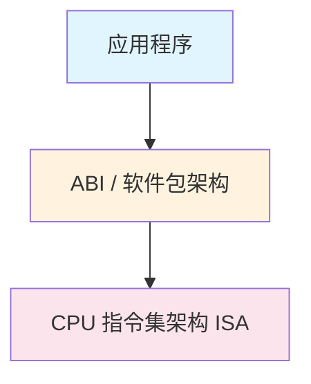
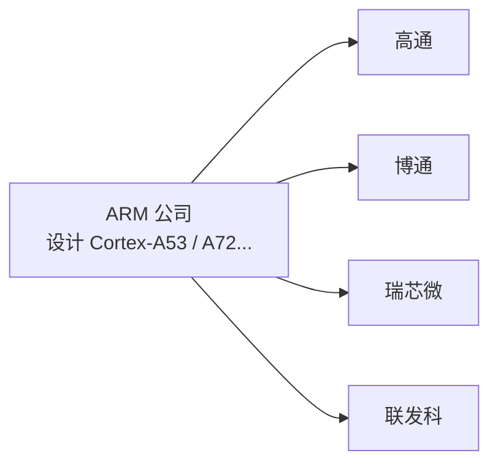

# 什么是系统架构（核心概念）

> **系统架构 = CPU 能理解的"指令语言 + 运行环境规则"**

可以把架构理解成：

**软件是"说话的人"，CPU 是"听话的人"，架构决定他们用哪种语言交流。**

如果语言不一致：

- ❌ 软件装不上
- ❌ 能装但一运行就崩
- ❌ 依赖怎么都解决不了

---

# 系统架构的 3 个层级

很多人只看"64 位 / ARM"，但其实**至少有 3 层**：



逐层往下讲。

---

## CPU 指令集架构（ISA）— CPU 的母语

这是**最底层、最根本的架构**。

### 主流只有两大阵营

#### x86 / x86_64

- Intel / AMD
- 台式机、笔记本、服务器
- 指令复杂（CISC）
- 性能强、功耗高

常见名字：
- `x86_64`
- `amd64`

#### ARM / AArch64

- 手机、路由器、树莓派、NAS
- 指令精简（RISC）
- 低功耗、高能效

常见名字：
- `armv7`（32 位）
- `aarch64` / `arm64`（64 位）

> [!warning] x86 程序 ≠ ARM 程序，不能互跑

---

## 架构位宽（32 位 vs 64 位）

| 位宽 | 特点 |
|------|------|
| 32 位 | 寄存器小，最大寻址 ≈ 4GB，已逐渐淘汰 |
| 64 位 | 寄存器更大，内存/性能/并发更强，现代系统主流 |

> [!info] 关键规则
> - 64 位 CPU 可以跑 32 位程序
> - 32 位 CPU **不能**跑 64 位程序

---

## ABI / 软件包架构（最常见到的）

这是 **"操作系统 + 编译器"视角的架构**，也是你下载软件时看到的名字。

在 OpenWrt / iStoreOS 中：

| 软件包架构 | 含义 |
|-----------|------|
| `aarch64_generic` | ARM64 通用 |
| `aarch64_cortex-a53` | ARM64 + A53 优化 |
| `aarch64_cortex-a72` | ARM64 + A72 优化 |
| `x86_64` | 64 位 PC |
| `all` | 架构无关（脚本/配置） |

---

# 为什么会有 a53 / a72 这种细分架构？

这是 **ARM 世界和 x86 最大的不同点**。

## x86 世界

- Intel / AMD 自己兼容所有老指令
- 新 CPU = 老 CPU + 新特性
- **几乎不用区分型号**

## ARM 世界（关键）

ARM **只卖设计，不卖 CPU**：



> [!NOTE] 不同 CPU 带来的差异
> - 支持的指令集不同
> - 性能差距极大

### 常见 ARM 核心定位

| 核心 | 定位 | 常见设备 |
|------|------|---------|
| A53 | 低功耗 | 路由器 / 盒子 |
| A72 | 高性能 | 树莓派 4 |
| A73 / A75 | 更强 | 高端 SoC |

### generic / a53 / a72 的本质区别（一句话）

> **generic = 最保守的公共语言**
> **a53 / a72 = 带"方言"的高性能版本**

---

# x86 的讲解

> **x86 ≠ Intel ≠ AMD**
> **x86 是一种 CPU 指令集架构**
> **Intel 和 AMD 都是 x86 阵营的厂商**

你问的"x86 和 AMD 有啥区别"，**严格来说这是个伪对比**，但你真正想问的是：

👉 **Intel 平台 vs AMD 平台有啥区别？**

## x86 是什么？

👉 **一种 CPU 指令集标准（架构）**

它定义了：
- CPU 能执行哪些指令
- 寄存器长啥样
- 内存怎么访问

只要 CPU **支持 x86-64**：

- Windows / Linux / PVE / Docker 都能跑
- 我们日常用的 PC、服务器几乎全是 x86

> [!important] x86 是"语言规则"，不是具体 CPU

## Intel / AMD 是什么？

👉 **生产 CPU 的厂商**

| 厂商 | 用的架构 |
|------|---------|
| Intel | x86 |
| AMD | x86 |

所以你电脑里的 Intel i5 / i7 或 AMD Ryzen / EPYC，**本质都在"说 x86 这门语言"**。

## Intel vs AMD

### Intel（传统强单核）

- 单核性能强
- 游戏 / 老软件友好
- 以前功耗偏高（近几年改善）

### AMD（核心数狂魔）

- 同价位 **核心 / 线程更多**
- 多任务 / 虚拟化 / 编译 / Docker 很强
- 能效比近几年非常猛

## 安装 Windows 一般是 amd64

> [!tip] 装 Windows 时，VirtIO 只选 `amd64`，不管你是 Intel 还是 AMD CPU
> - 不要选 `x86`
> - 选 `amd64` = 64 位 Windows

历史原因是：
- 最早的 64 位 x86 是 **AMD 先做出来的**
- 所以名字叫 **amd64**
- 后来 Intel 也完全兼容

所以现在：

| 名字 | 实际意思 |
|------|---------|
| `amd64` | 64 位 x86（主流） |
| `x86` | 32 位 x86（老古董） |

> [!warning] 和你的 CPU 厂商完全无关
> - 你是 **Intel CPU** → 用 amd64
> - 你是 **AMD CPU** → 用 amd64
> - 你是 **PVE / ESXi / KVM** → 用 amd64
> - **99.9% 的现代系统 = amd64**

## 什么时候才会用 x86（几乎不会）

只有这几种情况才选 x86（32 位）：
- 非常老的 CPU
- 老旧嵌入式
- 特殊旧软件只能跑 32 位

❌ Windows 10 / 11 · ❌ PVE · ❌ Docker · ❌ 现代 Linux

👉 **全都不用 x86（32 位）**

---

# 如何查看自己的系统架构？

## 普通 Linux（服务器 / NAS）

### `uname -m`

```bash
uname -m
```

它只返回**一行：机器硬件架构（machine hardware name）**。

| 返回值 | 含义 | 常见设备 |
|--------|------|---------|
| `x86_64` | 64 位 x86（Intel/AMD） | 服务器 / PC |
| `aarch64` | ARM 64 位 | ARM 服务器 / NAS |
| `armv7l` | ARM 32 位 | 老 NAS / 嵌入式 |
| `i686 / i386` | x86 32 位 | 很老的机器 |
| `ppc64le` | PowerPC 64 位 | IBM 服务器 |
| `riscv64` | RISC-V 64 位 | 新架构服务器 |

> [!info] 核心理解
> 它回答的问题只有一个：**"CPU 用的是什么指令集？"**
>
> 用于：
> - 判断下载 **ARM / x86**
> - 判断 **32 / 64 位**
>
> 不会告诉你 CPU 型号、核心数、频率

### `lscpu`

```bash
lscpu
```

返回**一整份 CPU 硬件报告**。

示例（典型 x86 服务器）：

```
Architecture:    x86_64
CPU op-mode(s):  32-bit, 64-bit
Byte Order:      Little Endian
CPU(s):          16
Vendor ID:       GenuineIntel
Model name:      Intel(R) Xeon(R) CPU E5-2678 v3
CPU MHz:         2500.000
L1d cache:       32K
L2 cache:        256K
L3 cache:        30M
Virtualization:  VT-x
```

ARM 服务器示例：

```
Architecture:    aarch64
CPU(s):          8
Model name:      ARM Neoverse-N1
```

#### `lscpu` 中最重要的几项（必看）

| 字段 | 意义 |
|------|------|
| Architecture | **指令集架构（最重要）** |
| CPU(s) | 逻辑核心数 |
| Model name | CPU 型号 |
| Vendor ID | 厂商 |
| CPU op-mode(s) | 支持 32/64 位 |
| Virtualization | 是否支持虚拟化 |

#### `uname -m` vs `lscpu` 的本质区别

| 命令 | 看什么 | 用途 |
|------|--------|------|
| `uname -m` | 指令集 | 选软件架构 |
| `lscpu` | 硬件细节 | 性能 / 虚拟化 / 调优 |

> [!tip] 选择建议
> - **选软件时**：看 `uname -m` 就够了
> - **做服务器 / 虚拟化 / NAS**：必看 `lscpu`

---

## macOS

```bash
uname -m
```

- `arm64` → Apple 芯片
- `x86_64` → Intel
