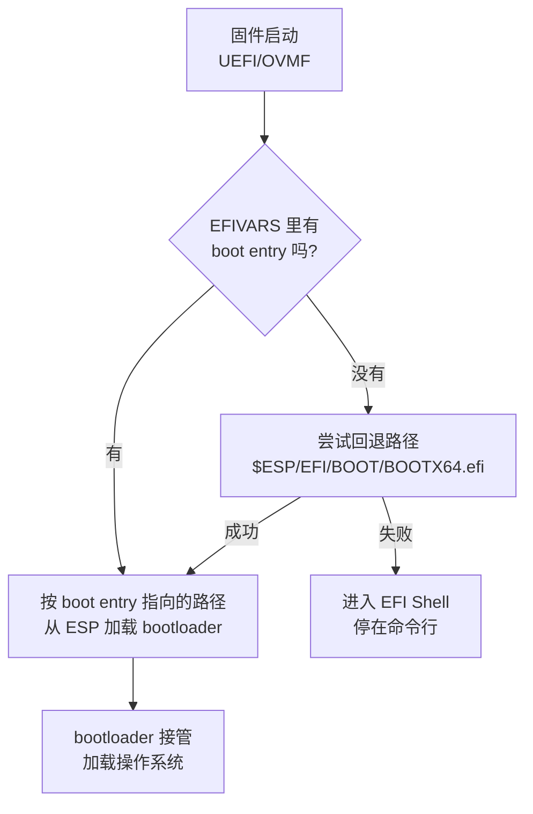

# 虚拟机固件选择 —— BIOS(Legacy/SeaBIOS) vs UEFI(OVMF/EFI)

> [!summary] 内容概览
> 笔记类型：对比 + 实战（混合）｜ 覆盖平台：VMware Workstation · VirtualBox · Proxmox VE（Hyper-V 仅作对照）｜ 规模：6 章

虚拟机创建界面上那个 **Firmware type** 下拉框只有两个选项，但它决定了客户机磁盘该用 MBR 还是 GPT、引导项记在哪里、以及系统装完之后还能不能改。用户最常见的两个问题——「不知道用哪个」和「选了 UEFI 总出问题」——根子在同一个地方：**固件不是一个孤立开关，它和客户机磁盘上的分区表、和固件自己记住的引导项，是一条链上的三节**。

本笔记按四段推进：第 1 章对齐概念，第 2 章给出选型决策表，第 3–5 章分别落到 VMware Workstation、VirtualBox、Proxmox VE 三个平台（三章之间无依赖，可以只读你实际在用的那一章），第 6 章把 UEFI 相关的失败现象收敛成一张「症状 → 根因 → 处置」表。

全篇的一条纪律：**每一条结论都标出来源层级**（官方口径 / 社区主张 / 本笔记推理 / 素材缺口）。写着「推理」或「缺口」的地方，请不要当作官方说法使用。

## 目录

- [[#第一章：固件做什么、BIOS 与 UEFI 差在哪]]
- [[#第二章：什么时候必须用 UEFI —— 选型决策]]
- [[#第三章：VMware Workstation 实操]]
- [[#第四章：VirtualBox 实操]]
- [[#第五章：PVE 实操（SeaBIOS vs OVMF）]]
- [[#第六章：UEFI 排错 —— 症状、根因、处置]]

---

## 第一章：固件做什么、BIOS 与 UEFI 差在哪

你在 VMware 里新建虚拟机，翻到 Settings → Options → Advanced，看到一个 **Firmware type** 下拉框，两个选项：Legacy BIOS、UEFI。选哪个？随手选一个，装完系统，日子照过——直到某天你要装 Windows 11、要做 GPU 直通，或者手滑把固件改了一下，虚拟机从此起不来。

这一章不讲操作，先把「这个下拉框到底是什么」说清楚。因为你的两个痛点——「不知道用哪个」和「选 UEFI 总出问题」——根子在同一个地方：**固件不是一个孤立开关，它和客户机磁盘上的分区表、和固件自己记住的引导项，是一条链上的三节**。链上任何一节对不上，虚拟机就停在启动画面上。

---

### 1. 固件是虚拟机的第一段代码

虚拟机本质是一个进程。这个进程启动时，CPU 是「裸」的——内存里没有操作系统，磁盘上的系统也还没有被读。此时必须先跑一段程序，让这台「假电脑」看起来像真电脑：初始化基本硬件、准备好给操作系统用的接口，然后把控制权交给系统。

这段程序就是固件。Proxmox VE 官方手册把它讲得很直白：

> "In order to properly emulate a computer, QEMU needs to use a firmware. Which, on common PCs often known as BIOS or (U)EFI, is executed as one of the first steps when booting a VM. It is responsible for doing basic hardware initialization and for providing an interface to the firmware and hardware for the operating system."

——固件在启动的最早阶段执行，负责基本硬件初始化，并为操作系统提供访问固件与硬件的接口。[^c1-L2-1]

三个关键点从这句话里拆出来：

1. **它最早执行**：比操作系统早，比引导加载程序也早。所以它出问题，现象一定是「还没进系统就卡住」——黑屏、停在某个菜单、报找不到引导设备。这决定了第六章排错时的观察窗口。
2. **它做硬件初始化**：虚拟机里这块是模拟出来的，固件选择会连带影响「这台虚拟机对外呈现成什么机器」——包括后面会讲到的机型（q35 / i440fx）、显卡直通能力。
3. **它提供接口**：操作系统后续通过固件留下的接口读时间、读设备信息。Proxmox 手册在同一章举过一个具体例子：Windows 期望 BIOS 时钟用本地时间，Unix 系期望用 UTC，所以创建虚拟机时要选对 OS 类型，PVE 才能优化这些底层参数。[^c1-L2-1]

> [!tip] 大白话：把固件想成「开机自检员 + 前台」
> 你进一栋大楼，先有个人检查水电、把灯打开（硬件初始化），再告诉你去几楼找谁（提供接口）。这个人就是固件。
> 所以：**固件坏了或者配置不对，你连大厅都进不去**，后面「找哪个房间」的事根本无从谈起。你在排错时看到的所有「进不去系统」，都要先在「前台」这一层找原因。

#### 固件在虚拟机里长什么样：三个看得见的落点

抽象地说「固件」容易飘。落到你实际能点、能看的界面，它其实是三个具体的产物：

| 产物 | 存在哪里 | 谁读它 | 换固件模式后会不会跟着变 |
| --- | --- | --- | --- |
| 固件程序本体 | 平台自己带（VMware 内置、PVE 的 pve-edk2-firmware 包等），你不直接接触 | 虚拟机启动时的第一个执行者 | 会换（换的就是它） |
| 分区表（MBR / GPT） | **客户机虚拟磁盘**的头部扇区 | 固件 | **不会变**——这是问题的根源 |
| 引导项 / 引导顺序记录 | UEFI 侧在 NVRAM（EFIVARS）；PVE 用一块单独的 EFI Disk 存 boot order | 固件 | 不会自动重建 |
| ESP（EFI 系统分区） | 客户机磁盘上的一个分区，里面放 `.efi` 引导程序 | UEFI 固件 | Legacy 模式下这个分区不被使用 |

这张表是本章的骨架。后面几节会逐格展开。

> [!tip] 大白话：把固件想成「换锁的门禁系统」
> 换了门禁系统（固件），但楼里的房间编号规则（分区表）没换、员工卡（引导项）也没重办。
> 所以：**换固件不会顺手帮你改造楼里的结构**，这正是「切完 UEFI 就起不来」的官方解释（第 3 节）。

---

### 2. 选项只有两个，但每个厂商叫法不同

VMware 官方文档把客户机固件类型限定为两项，没有第三个：

| 选项 | 官方原文描述 |
| --- | --- |
| UEFI | "UEFI is an interface between the operating system and the platform firmware. UEFI has architectural advantages over Basic Input/Output System (BIOS) firmware." |
| Legacy BIOS | "Standard BIOS firmware." |

[^c1-L1-1]

注意这里有个信息量很大的细节：**VMware 官方对「UEFI 比 BIOS 好在哪」的全部说明，就是「架构上有优势」这半句**。它没有给任何「什么场景该选哪个」的建议，只给了选择 UEFI 的前置条件（第 3 章会逐条列）。所以——

> **推理（非官方结论）**：本章和第二章里凡属「什么场景推荐选谁」的判断，都不是 VMware 官方说的，而是我们依据各来源条件归纳出来的。VMware 官方只给条件与警告。[^c1-L1-1]

再看 PVE 侧的措辞。同样是这两个选项，PVE 用的是不同的名字：

> "By default QEMU uses **SeaBIOS** for this, which is an open-source, x86 BIOS implementation. SeaBIOS is a good choice for most standard setups."

——PVE 默认使用 SeaBIOS，一个开源的 x86 BIOS 实现；官方称它适合大多数标准配置。[^c1-L2-1]

于是三套术语指的是同一件事，第一次见很容易以为是三种东西：

| 平台 | 「旧模式」叫什么 | 「新模式」叫什么 | 界面上在哪选 |
| --- | --- | --- | --- |
| VMware Workstation | Legacy BIOS | UEFI | Settings → Options → Advanced → Firmware type |
| Proxmox VE | SeaBIOS（`bios=seabios`） | OVMF（`bios=ovmf`） | 虚拟机硬件设置里的 BIOS 选项 |
| Hyper-V | 第 1 代虚拟机 | 第 2 代虚拟机 | 创建时就定，之后不可改 |
| VirtualBox | BIOS（默认） | EFI（手册章节名 Alternative Firmware，主干版已改称 UEFI） | 虚拟机 Settings 中启用 EFI，或命令行切换 |

> 说明：VMware 的字段名与其官方文档口径见 [^c1-L1-1]；PVE 的 `bios=seabios` / `bios=ovmf` 取值与默认值见 [^c1-L2-1]；Hyper-V 的代次绑定见 [^c1-GEN12]；VirtualBox 的默认值与「EFI/BIOS」两种叫法见 [^c1-L1-2]（6.0 手册，章节标题为 Alternative Firmware (EFI)）与 [^c1-L1-3]（主干手册，章节标题已改为 Alternative Firmware (UEFI)）。

一个必须记住的词：**SeaBIOS 是「BIOS 的一种实现」，OVMF 是「UEFI 的一种实现」**。你在 PVE 文档里看到 OVMF，在 VMware 文档里看到 UEFI，说的是同一类东西。

> [!tip] 大白话：把固件想成「同一份说明书的不同译本」
> Legacy BIOS = BIOS = SeaBIOS = Hyper-V 第 1 代，四个名字一个东西；UEFI = EFI = OVMF = Hyper-V 第 2 代，也是四个名字一个东西。
> 所以：**看到陌生名词先别慌，先归类到「旧」还是「新」**。真正要判断的从来只有这一个二选一。

---

### 3. 两种模式真正的分界线：固件与分区表是绑死的

这是本章最重要的一节，也是你「选 UEFI 总出问题」最可能的病根。

Broadcom 官方知识库有一篇专门讲这个故障的文章，标题就是《Virtual Machine fails to boot when changing the Firmware from BIOS to EFI》。它的 Cause 段落写道：

> "This is an expected behavior as changing the firmware is not supported since BIOS uses **MBR (Master Boot Record)** partitioning and EFI requires **GPT (GUID Partition Table)** partitioning on the VM disks. While changing the Firmware, a warning is also displayed that the installed guest operating system might become unbootable."

——改固件不受支持；BIOS 使用 MBR 分区，EFI 要求 GPT 分区；切换时界面会警告已安装的客户机系统可能变得无法启动。[^c1-L3-1]

请逐句读这句话，它有三个层次：

1. **绑定关系**：BIOS ↔ MBR，EFI ↔ GPT。不是「推荐搭配」，是要求。
2. **官方定性**：切完起不来是 **expected behavior**（预期行为），不是 bug，所以别指望厂商修复或给补丁。
3. **切换不会转换分区表**：文章给的解法是「重建虚拟机后挂原盘」或「切 EFI **前**先把磁盘转成 GPT」——两个解法都指向同一个事实：**切换动作本身不会动你的分区表**。[^c1-L3-1]

把这条绑定的后果做成表格：

| 你的操作 | 磁盘现状 | 结果 |
| --- | --- | --- |
| 一直是 Legacy BIOS 从没改过 | MBR | 正常 |
| 一直是 UEFI 从没改过 | GPT | 正常 |
| Legacy → UEFI，装完系统后改 | 仍是 MBR | **预期无法启动**（固件要 GPT，但盘上还是 MBR）[^c1-L3-1] |
| UEFI → Legacy，装完系统后改 | 仍是 GPT | 同样失败（原文覆盖双向："from BIOS to EFI or from EFI to BIOS"）[^c1-L3-1] |

> [!tip] 大白话：把分区表想成「楼里的房间编号规则」
> 老楼按「房间号 + 一条走廊索引」排（MBR），新楼要求按「全局唯一编号 + 一份完整目录」排（GPT）。
> 换了新的楼管（固件），可是楼的编号规则没动——新楼管拿着新规则去查号码，一个都对不上，于是直接宣布「这楼我管不了」。
> 所以：**固件模式和分区表是同一个决定的两半，必须在新建虚拟机时一次定好**。这也是为什么第二章会把「创建时就定死，别装完再改」单独拎出来讲。

#### Legacy 侧的分区表细节：本轮素材没有覆盖

上面这条官方原文只说了「BIOS 使用 MBR」，**没有**逐步描述 Legacy 从 MBR 到引导扇区的完整链路。所以：

> **推理**：Legacy 模式下固件读 MBR 分区表、再跳到活动分区的引导扇区去执行引导代码——这个机制属于通用常识补齐，本轮 16 个来源中没有明文覆盖。
> **缺口**：MBR 分区表的结构细节（主分区上限、扩展分区等）本章不展开，本轮素材只在 MBR→GPT 转换那个场景里提到过「MBR 分区表最多三个主分区」这一条限制，且那属于转换工具的约束，不是分区表本身的完整描述。[^c1-MBR2GPT]

---

### 4. UEFI 的启动链路：它到底在找什么

理解了「UEFI 要 GPT」，还要理解「UEFI 要的是一块**特定分区**」。这是第二条最容易踩空的地方。

Proxmox VE 的官方 wiki 有一页专门讲 OVMF 引导项，开头三句话就把整条链路说完了：

> "If a VM boots via OVMF (UEFI), the firmware has to know which bootloader it has to start from the ESP. When no boot entries exist in the EFIVARS store, it tries to load the fallback `$ESP/EFI/BOOT/BOOTX64.efi` loader. Should that also fail, the VM gets booted into the EFI Shell"

——如果虚拟机通过 OVMF (UEFI) 启动，固件必须知道该从 ESP 里启动哪个引导加载程序；当 EFIVARS 存储里没有引导项时，它会尝试加载回退路径 `$ESP/EFI/BOOT/BOOTX64.efi`；如果这也失败，虚拟机会被引导进入 EFI Shell。[^c1-L2-3]

> 层级说明：这一页是 Proxmox VE 的**官方 wiki**，不是参考手册（reference documentation）。它描述的是操作手法与机制说明，正式程度低于 `pve-docs` 手册，引用时请按此对待。[^c1-L2-3]

把这句话画成链路图：



同一件事用纯文本再写一遍，方便你复制到别处：

```text
UEFI 启动查表顺序
  1. 查 EFIVARS 里的 boot entry  →  有则按它指的路走
  2. 无 boot entry  →  试回退路径 $ESP/EFI/BOOT/BOOTX64.efi  →  成功则继续
  3. 回退也失败  →  落到 EFI Shell（一个停在命令行的界面）
```

这条链路上有三个名词需要落实：

| 名词 | 是什么 | 在链路上的角色 | 来源 |
| --- | --- | --- | --- |
| **ESP**（EFI System Partition） | 客户机磁盘上的一个分区，存放 `.efi` 引导程序 | 所有 UEFI 引导程序的存放地 | [^c1-L2-3] [^c1-L3-3] |
| **boot entry** | 固件记在 EFIVARS 里的一条「去哪个分区的哪个路径找哪个程序」的记录 | 首选路径；缺失就退回第 2 步 | [^c1-L2-3] |
| **EFI Shell** | 回退也失败时落到的命令行环境 | 失败终点，也是人工修复入口 | [^c1-L2-3] |

这里有一个反直觉但极其重要的推论：**UEFI 不靠「磁盘第一个扇区」找系统，它靠「一条记录 + 那个记录指向的文件在不在」**。所以当你在第六章看到「找不到引导程序」，根因几乎总是这两件事之一——记录丢了，或者 ESP（记录指向的分区）没了。Microsoft 的排错文档把第二件事说得很直接：

> "If the EFI System Partition (ESP) has been deleted or is missing, the VM cannot locate the UEFI boot loader and startup will fail."

——如果 EFI 系统分区被删除或缺失，虚拟机无法定位 UEFI 引导加载程序，启动将失败。[^c1-L3-3]

> [!tip] 大白话：把 boot entry 想成「前台桌上的访客预约本」
> 你（固件）去前台找一位访客（引导程序）。前台先翻预约本（EFIVARS 里的 boot entry）：有，就按上面写的房间号去找。
> 预约本上没有，前台按备用规则去一个固定房间碰运气（`$ESP/EFI/BOOT/BOOTX64.efi`）。
> 还是没人，前台就把你晾在一个空房间里站着——**这个空房间就是 EFI Shell**。
> 所以：**停在 EFI Shell 不代表系统坏了，只代表「预约本上没有、备用房间也是空的」**。对应到实操，就是去补一条预约记录（第六章的 Add Boot Option）。

#### Legacy 与 UEFI 的链路对照

| | Legacy BIOS | UEFI |
| --- | --- | --- |
| 分区表要求 | MBR | GPT [^c1-L3-1] |
| 引导程序放在哪 | MBR 的引导扇区（**推理**，本轮无明文） | ESP 分区里的 `.efi` 文件 [^c1-L2-3] |
| 固件怎么找到它 | 读磁盘固定位置（**推理**） | 读 EFIVARS 记录 → 回退固定路径 [^c1-L2-3] |
| 找不到时的表现 | 本轮素材未覆盖（**缺口**） | 进入 EFI Shell [^c1-L2-3] |
| 有无 Secure Boot | 无此机制 | 有（见下节） |

表格中标「推理」与「缺口」的两行，本轮来源确实没有给出，请不要在需要精确引用的场合（比如给别人解释、写工单）把这两行当作官方说法。

---

### 5. Secure Boot：UEFI 独有的一道额外检查

这是 UEFI 一侧独有的机制，也是「选 UEFI 后出问题」的高频来源：启动时多了一道签名检查。

> "Secure Boot verifies the boot loader is signed by a trusted authority in the UEFI database."

即验证引导加载程序是否由 UEFI 数据库中的受信机构签名。[^c1-GEN12] 被检查的还包括 UEFI 驱动（option ROM）：官方称它阻止未经授权的固件、操作系统或 UEFI 驱动在启动时运行，并在第 2 代虚拟机中默认启用。[^c1-GEN2SEC] VMware 侧口径一致，措辞是拒绝加载未使用「可接受数字签名」的驱动与系统加载器。[^c1-L1-1]

| 问题 | 答案 |
| --- | --- |
| 谁被检查 | 引导加载程序、UEFI 驱动、option ROM [^c1-GEN2SEC] |
| 不通过怎么办 | 官方明确：签名不正确时须为该虚拟机**关闭 Secure Boot** [^c1-GEN12] |
| 默认开还是关 | Hyper-V 第 2 代默认启用 [^c1-GEN2SEC]；PVE 加 `pre-enrolled-keys=1` 也默认启用，仍可在虚拟机内关闭 [^c1-L2-1] |
| Legacy 一侧 | 没有对应机制 |

> **推理**：自签名驱动、第三方 option ROM、非主流发行版引导程序是高风险对象——由「只放行名单内对象」推出；本轮素材无官方针对性结论。

> [!tip] 大白话：把 Secure Boot 想成「安检名单」
> 名单上有你名字才放行（受信签名），没有就一律拦下。
> 所以：**开 Secure Boot 后起不来，先怀疑「引导程序在不在名单上」**，而不是「系统坏了」。不在名单上，官方给的处置就是关掉它——这是官方许可的做法，不是「绕过安全」。

---

### 6. Hyper-V 最短对照：代次就是固件

按范围界定，Hyper-V 只作简短对照。它值得记的机关是：**固件选择被包装成「虚拟机代次」，而代次创建后不可更改**。[^c1-GEN12]

官方用设备替换表表达这层等价关系，其中一行是：

| Generation 1 Device | Generation 2 Replacement | Generation 2 Enhancements |
| --- | --- | --- |
| Legacy BIOS | UEFI firmware | Secure Boot |

即「第 1 代 = Legacy BIOS，第 2 代 = UEFI firmware」是官方用对照表给出的等价关系，而非一句否定式声明。[^c1-GEN12]

另有一条容易误解的说明：第 2 代虚拟机的虚拟固件**独立于宿主机上装的是什么**。[^c1-GEN12] 这解释了为什么在宿主机 BIOS 里折腾 Secure Boot 对客户机固件模式毫无影响。宿主侧开启虚拟化（如 VT-x）属既有笔记 [[虚拟机/虚拟机的概念和使用.md]] 的范围。

> [!tip] 大白话：把 Hyper-V 代次想成「买车时选油车还是电车」
> 不是「买回来再改」，是下单那一刻就定了（官方明文：代次创建后不可更改）。
> 所以：**Hyper-V 没有「装完再切固件」这个选项**，这最直观地印证了本章的核心结论——固件模式是新建虚拟机时的决定。

---

### 7. 一个容易读错的词：「MBR」的两种含义

这一节是术语提醒，属于**推理归纳**，不是任何来源的明文。

同一个词 `MBR`，在本轮的两份来源里指的是不同的东西：

- **来源 L3-1（Broadcom KB）** 用 MBR 指**纯 MBR 分区方案**——即 "BIOS uses MBR (Master Boot Record) partitioning"，是与 GPT 并列的另一种分区方式。[^c1-L3-1]
- **来源 L3-3（Microsoft 排错文档）** 里的 `gdisk` 输出，在一块**GPT 磁盘**上打印出 `MBR: protective`：

```text
Partition table scan:
  MBR: protective
  BSD: not present
  APM: not present
  GPT: present

Found valid GPT with protective MBR; using GPT.
```

[^c1-L3-3]

也就是说，GPT 磁盘上**也存在**一个 MBR——它是保护性 MBR（protective MBR），一个防止老工具误判的兼容外壳。

> **推理**：既然 GPT 磁盘也带 MBR 外壳，那么把 L3-1 那句读成「GPT 磁盘上没有 MBR」就是误读。两处说法不冲突，冲突的是「MBR」这个缩写在两种语境下的所指。本轮来源都未对此做术语声明，这条归纳由我们完成。

> [!tip] 大白话：把 `MBR: protective` 想成「新楼门口挂的一块旧牌子」
> 新楼用的是全新的门牌系统（GPT），但门口仍挂了一块老牌子（保护性 MBR），上面写着「这栋楼不要再按老方法查了」。
> 所以：**看到老字样不等于用的是老方案**。判断一块盘到底是 MBR 还是 GPT，要看 `GPT: present` 这类实质信息，不能看见 "MBR" 三个字母就下结论。

---

### 8. 本章明确的缺口：CSM

有一件事本章**刻意不写**，需要你知道原因，以免日后发现笔记里没提而以为漏了：

> **缺口**：CSM（Compatibility Support Module，兼容性支持模块，通常被描述为「让 UEFI 能引导 Legacy 系统的兼容层」）在**本轮 16 个来源中零命中**——没有任何一份来源提到它。因此本笔记**不给 CSM 的任何定义、行为或配置结论**。
> 如果你在某个平台的界面上看到 CSM 相关的选项，本笔记目前无法就该选项的含义或该不该开提供引用支持。补齐需要回到资料收集阶段补充来源。

---

### 第一章小结

- **固件是虚拟机启动时执行的第一段代码**，负责基本硬件初始化并为操作系统提供接口；它出问题的现象必然是「进系统之前就卡住」。它只有两个模式，但有多套名字：Legacy BIOS = BIOS = SeaBIOS = Hyper-V 第 1 代；UEFI = EFI = OVMF = Hyper-V 第 2 代。[^c1-L2-1] [^c1-L1-1] [^c1-GEN12]
- **固件与分区表绑死**：BIOS 用 MBR、EFI 要 GPT；改固件不受支持，切完无法启动被官方定性为**预期行为**，且切换**不会**转换分区表。[^c1-L3-1]
- **UEFI 的查找顺序**：EFIVARS 里的 boot entry → 回退 `$ESP/EFI/BOOT/BOOTX64.efi` → 都不行就落到 EFI Shell。ESP 被删或缺失，就会「找不到 UEFI 引导加载程序」。[^c1-L2-3] [^c1-L3-3]
- **Secure Boot 是 UEFI 独有的签名检查**，拦的是引导加载程序、UEFI 驱动与 option ROM；签名不被接受时，官方许可的处置是关闭 Secure Boot。[^c1-GEN12] [^c1-GEN2SEC] [^c1-L1-1]
- **本章的推理与缺口**（引用时勿当官方结论）：「什么时候推荐选谁」的场景判断（推理）、Legacy 侧的引导链路细节（推理）、`MBR` 一词的两种含义归纳（推理）、CSM（零命中缺口）。

既然固件模式在创建虚拟机时就定死了，而且它牵连着分区表、ESP 和引导项——那下一个问题自然就是：**什么情况下必须选 UEFI，什么情况下用默认的 Legacy 反而更省事？** 下一章给出一张可以照着查的决策表，每条判断都标明依据与来源层级。

---

[^c1-L1-1]: **L1-1** · VMware Workstation Pro — Configure a Firmware Type（官方文档）· https://techdocs.broadcom.com/us/en/vmware-cis/desktop-hypervisors/workstation-pro/25H2/using-vmware-workstation-pro/using-virtual-machines-in-workstation-pro-user-guide/starting-virtual-machines/configure-a-firmware-type.html
[^c1-L1-2]: **L1-2** · Oracle VirtualBox 用户手册 6.0 — 3.14 Alternative Firmware (EFI)（官方文档）· https://docs.oracle.com/en/virtualization/virtualbox/6.0/user/efi.html
[^c1-L1-3]: **L1-3** · VirtualBox 手册主干源文件 — Alternative Firmware (UEFI)（官方文档，master 分支）· https://raw.githubusercontent.com/VirtualBox/virtualbox/refs/heads/main/doc/manual/en_US/dita/topics/efi.dita
[^c1-L2-1]: **L2-1** · Proxmox VE Administration Guide — QEMU/KVM Virtual Machines（官方参考手册，v9.2.11）· https://pve.proxmox.com/pve-docs/chapter-qm.html
[^c1-L2-3]: **L2-3** · Proxmox VE Wiki — OVMF/UEFI Boot Entries（官方 wiki 层级，oldid=12527）· https://pve.proxmox.com/wiki/OVMF/UEFI_Boot_Entries
[^c1-L3-1]: **L3-1** · Broadcom KB 384912 — Virtual Machine fails to boot when changing the Firmware from BIOS to EFI（官方知识库）· https://knowledge.broadcom.com/external/article/384912/
[^c1-L3-3]: **L3-3** · Microsoft Learn — Troubleshoot UEFI boot failures with Azure Linux images（官方排错文档）· https://learn.microsoft.com/en-us/troubleshoot/azure/virtual-machines/linux/azure-linux-vm-uefi-boot-failures
[^c1-GEN12]: **GEN12** · Microsoft Learn — Should I create a generation 1 or 2 virtual machine in Hyper-V?（官方文档）· https://learn.microsoft.com/en-us/windows-server/virtualization/hyper-v/plan/should-i-create-a-generation-1-or-2-virtual-machine-in-hyper-v
[^c1-GEN2SEC]: **GEN2SEC** · Microsoft Learn — Hyper-V Generation 2 Virtual Machine Security Features（官方文档）· https://learn.microsoft.com/en-us/windows-server/virtualization/hyper-v/learn-more/Generation-2-virtual-machine-security-settings-for-Hyper-V
[^c1-MBR2GPT]: **MBR2GPT** · Microsoft Learn — MBR2GPT.EXE（官方文档）· https://learn.microsoft.com/en-us/windows/deployment/mbr-to-gpt

---

概念层到此结束：固件、分区表、引导项这三节链条已经对齐。下面进入决策层——把「选哪个」从技术细节变成一组可以照着查、并且标明来源层级的判断规则。

## 第二章：什么时候必须用 UEFI —— 选型决策

第一章的结论是：固件模式在创建虚拟机那一刻就定死了，而且它牵连着分区表、ESP 和引导项。那么问题就变成——**那一刻，怎么定？**

这一章只解决这一件事：给出一张可以照着查的决策表，每行都标明依据和来源层级。同时也会明确标出哪些说法**没有**来源支持——因为选型上最常见的错误不是选错，而是把某篇博客的推荐当成了官方要求。

---

### 1. 先看出厂默认值：三家平台的取向并不一致

在你做任何判断之前，先知道平台自己默认选了什么，因为这反映了厂商认为的「大多数情况」。

| 平台 | 默认固件 | 官方对默认值的表述 | 来源层级 |
| --- | --- | --- | --- |
| Proxmox VE | SeaBIOS | "By default QEMU uses **SeaBIOS**… SeaBIOS is a good choice for most standard setups." | 官方参考手册 [^c2-L2-1] |
| VirtualBox | BIOS | "By default, … uses the BIOS firmware for virtual machines."（用 EFI 需在 Settings 里启用） | 官方手册 [^c2-L1-3] |
| VMware Workstation | — | 官方**未声明**默认值，也未给任何场景建议 | 官方文档（缺口）[^c2-L1-1] |
| Hyper-V | 不适用（由代次决定） | "We recommend you create a generation 2 virtual machines to take advantage of features like Secure Boot unless one of the following statements is true" | 官方文档 [^c2-GEN12] |

两个值得注意的点：

1. **Proxmox VE 与 VirtualBox 的出厂默认都是旧模式**，且两家都用「适合大多数情况」这类措辞为默认值背书。
2. **Hyper-V 是反向的**：官方直接推荐第 2 代（即 UEFI），只在三种例外下才建议第 1 代——使用已存在的、与 UEFI 不兼容的预构建虚拟硬盘；第 2 代不支持你要跑的系统；第 2 代不支持你要用的引导方式。[^c2-GEN12]

这不是谁对谁错，而是三种不同的产品取向。你只需要记住一点：**「平台默认是 Legacy」这件事本身就是一条选型信号**——它意味着若你没有特殊需求，默认值大概率是对的。

> [!tip] 大白话：把默认值想成「餐馆的招牌菜」
> 厨师把这道菜放在菜单第一行，说明点它的人最多、翻车概率最低。
> 所以：**没有特殊忌口就点招牌菜**。想吃辣的（Windows 11、Secure Boot、直通）再换——下面第 3 节就是那张「忌口清单」。

---

### 2. 本轮最有价值的一条官方判据

如果你只记一句话，记这句。Proxmox VE 官方手册在系统设置一节给出了本轮唯一一句直接回答「何时该换 UEFI」的官方判据：

> "In most cases you want to switch from the default SeaBIOS to OVMF only if you plan to use PCIe passthrough."

——多数情况下，只有当计划使用 PCIe 直通时，才需要从默认的 SeaBIOS 换到 OVMF。[^c2-L2-1]

这句话的价值有三层：

1. **它是官方给的「换」的条件**，不是社区经验、不是博客建议；
2. **它用的是 "in most cases … only if"，把范围收得很窄**——不是「有好处就换」，而是「没直通就别换」；
3. **它反过来确认了默认值是正确的**。

直通场景的完整成套条件，官方在 PCI 直通文档里给全了：

| 项目 | 官方结论（原文片段） | 来源 |
| --- | --- | --- |
| 机型 | GPU 直通最佳兼容组合使用 `q35`（"best compatibility is reached when using 'q35'"） | [^c2-L2-4] |
| 固件 | 同上组合使用 OVMF（"OVMF" ("UEFI" for VMs)）而非 SeaBIOS | [^c2-L2-4] |
| 接口 | 同上组合使用 PCIe（"instead of PCI"）；且 "PCIe passthrough is only available on q35 machines" | [^c2-L2-4] |
| 显卡自身 | 若用 OVMF 直通 GPU，GPU 必须有 UEFI-capable ROM，**否则官方要求 "otherwise use SeaBIOS instead"** | [^c2-L2-4] |
| 普通 PCI 直通 | PCI 直通在 i440fx 与 q35 上都可用 | [^c2-L2-4] |

最后两行是这套条件里最容易被忽略的反转：**直通并不自动等于「换 UEFI」**。如果你的显卡没有 UEFI-capable 的 ROM，官方给的动作是改用 SeaBIOS——等于回到默认值。所以「我要做直通」不足以推出「我要换 UEFI」，还要看显卡。

> [!tip] 大白话：把这条判据想成「医生开的检查单」
> 医生不会让你把全身检查都做一遍，只会为某一个具体症状开单子（有直通需求 → 换 OVMF）。
> 所以：**换固件要有具体理由，而这个理由是「某项功能必须要它」**，不是「新的应该更好」。

---

### 3. 六条硬性触发条件

把散落在各来源里的条件集中起来，只有下面六条是**能逐条回源**的。命中任意一条，固件模式就不再是可选项，而是被客户机系统倒逼的硬性要求。

| # | 触发条件 | 官方依据 | 来源 | 层级 |
| --- | --- | --- | --- | --- |
| ① | 客户机是 **Windows 11** | 系统固件要求 "**UEFI, Secure Boot capable**"；另需 "TPM … version 2.0" | [^c2-L1-4] | official |
| ② | 需要 **Secure Boot** | Secure Boot 只存在于 UEFI 固件类型下（VMware 侧前置即「虚拟机使用 UEFI 固件类型」） | [^c2-L1-1] [^c2-L2-1] | official |
| ③ | 需要 **PCIe / GPU 直通** | PVE "only if you plan to use PCIe passthrough"；直通组合要求 q35 + OVMF + PCIe | [^c2-L2-1] [^c2-L2-4] | official |
| ④ | 客户机是 **Arm** | VirtualBox "**All Arm VMs require UEFI.**"；PVE arm64 主机上 "bios=ovmf is the only supported setting"，因 SeaBIOS 仅支持 x86 | [^c2-L1-3] [^c2-L2-1] | official |
| ⑤ | 需要 **Hyper-V 第 2 代语义** | 第 2 代 = UEFI firmware + Secure Boot；代次创建后不可更改 | [^c2-GEN12] | official |
| ⑥ | **客户机系统自身宣告只支持 UEFI 启动** | PVE：部分系统（如 Windows 11）可能需要 UEFI 实现，此时 "**you must use OVMF instead**" | [^c2-L1-4] [^c2-L2-1] | official |

几条使用说明：

- **① 与 ⑥ 是同一件事的两种表述**：① 是把 Windows 11 这个具体系统写死进表，⑥ 是把它抽象成「以客户机系统的要求为准」。实践中按 ⑥ 理解更稳——因为将来会有别的系统提出同样要求。
- **④ 是最「无条件」的一条**：Arm 客户机上不存在选择余地，`bios=ovmf` 是唯一受支持设置。[^c2-L2-1]
- **② 的成本最低、也最容易误触发**：很多人为了「更安全」打开 Secure Boot，却没先确认引导程序是否在受信签名之内（第一章第 5 节）。它不是免费的。

> [!tip] 大白话：把这六条想成「必须走人工窗口的情形」
> 平时自助机就能办（默认 Legacy），只有六种特殊情况才必须去人工窗口（UEFI）。
> 所以：**先对照这六条，一条都不沾就别换**；沾了就别犹豫——因为这时候「选不选」已经不由你决定了。

---

### 4. 决策表（本章主产物）

下面这张表是本章的成品。用法：从你的场景出发，找到对应行；「依据」列告诉你为什么，「层级」列告诉你这条有多硬。

| 场景 | 选谁 | 依据 | 来源与层级 |
| --- | --- | --- | --- |
| 没想好、也没有特殊需求 | **Legacy / SeaBIOS** | 平台默认值，官方称适合大多数标准配置 | official [^c2-L2-1] [^c2-L1-3] |
| 客户机是 Windows 11 | **UEFI + Secure Boot capable + TPM 2.0**，PVE 侧 "you must use OVMF instead" | 系统硬性要求 | official [^c2-L1-4] [^c2-L2-1] |
| 需要 Secure Boot | **UEFI** | Secure Boot 的前置条件就是固件类型为 UEFI | official [^c2-L1-1] |
| 需要 PCIe / GPU 直通 | **UEFI（OVMF）**，机型 q35；但显卡无 UEFI-capable ROM 时改用 SeaBIOS | 官方直通判据与组合要求 | official [^c2-L2-1] [^c2-L2-4] |
| 客户机是 Arm | **UEFI**，唯一可选 | 平台限制，无选择余地 | official [^c2-L1-3] [^c2-L2-1] |
| 新建 Hyper-V 虚拟机 | **第 2 代** | 官方推荐，三种例外除外 | official [^c2-GEN12] |
| PVE 上要加 vTPM / TPM 2.0 | 社区实践写作「机型 q35 + BIOS OVMF」 | 社区来源明确列为前提；**官方未声明该前提** | **community，勿当官方口径** [^c2-L2-5] |
| 新虚拟机一律上 UEFI、SeaBIOS 只留给 legacy 系统 | （社区主张） | 社区实践取向 | **community，取向与官方默认不同** [^c2-L2-5] |
| 客户机磁盘是已存在的、不兼容 UEFI 的预构建虚拟硬盘 | **Legacy（第 1 代）** | Hyper-V 官方列出的例外之一 | official [^c2-GEN12] |
| 想「反正新的更好」就先换了 | **别换** | 官方对所有场景建议**保持沉默**；超出上述触发条件的推荐无来源支持 | **推理，非官方结论** [^c2-L1-1] |

**关于最后一行的说明（重要的推理标注）**：VMware 官方文档对「UEFI 比 Legacy BIOS 好在哪」的全部说明只有一句「UEFI 在架构上有优势」，**没有给出任何选型场景建议**。因此凡属超出上文六条触发条件的场景推荐，都是我们的归纳，不是官方口径。[^c2-L1-1]

> [!tip] 大白话：把这张表想成「体检指标参考范围」
> 化验单上每项都有「参考范围」和「异常提示」，医生不会因为数值「更新」就给你开药。
> 所以：**照着列查，命中就用，没命中就守默认**。「来源与层级」那一列就是这张表可信度的标尺——写着 community 或推理的行，别拿去当规矩压人。

---

### 5. 口径并列：社区主张 vs 官方默认

决策表里有两行来源是社区。这里把它们的原话摆出来，让你看清分歧的性质。

社区来源在《Proxmox VE 上的虚拟机最佳实践配置》里写道：

> "For new VMs, we use **OVMF (UEFI)** provided that the guest operating system supports it. SeaBIOS should only be used for legacy systems or older operating system versions, but it is not strictly necessary."

——对新虚拟机，只要客户机系统支持，他们就使用 OVMF (UEFI)；SeaBIOS 只应用于 legacy 系统或较老的操作系统版本，**但并非严格必须**。[^c2-L2-5]

> **层级说明**：这条来自 community 层级来源（第三方技术文章），不是 Proxmox 官方文档。引用时必须让读者看出这一层级差别。

对照一下官方口径：PVE 官方说默认 SeaBIOS、多数情况只有做 PCIe 直通才需要换。[^c2-L2-1]

两者的关系需要精确描述：

- **不是直接互斥**：官方说「默认 SeaBIOS」，社区说「我们用 OVMF」——两边都没有禁止对方的选择。社区那句甚至还自带 "but it is not strictly necessary"（并非严格必须），等于承认这不是硬性要求。
- **是取向不同**：官方站在「默认值要照顾大多数、减少复杂度」的位置；社区站在「提前按现代标准配置、避免将来迁移」的位置。
- **落到你身上怎么用**：这条社区观点可以作为「如果你已经决定要用 UEFI，不必有心理负担」的支撑，但**不能**作为「所以新虚拟机都该上 UEFI」的官方依据。

---

### 6. 大容量引导盘：必须分层写，不能合并成一条通用结论

「系统盘超过 2TB 就必须用 UEFI」是流传很广的一条说法。本轮素材要求把它拆成两层写，因为两层证据强度完全不同。

**第一层：跨平台的通用结论——没有。**

> **缺口**：本轮 16 个来源中，没有任何一份给出「跨平台通用的、系统盘大于某个容量就必须用 UEFI」的官方结论。因此本笔记**不给出**这样的通用口径。

**第二层：Hyper-V 侧有可直接引用的官方硬数据。**

Hyper-V 官方在「使用第 2 代虚拟机的优势」下，以 **Larger boot volume** 为标题列出了明确数字：

| 代次 | 固件 | 最大引导卷 |
| --- | --- | --- |
| 第 2 代 | UEFI firmware | **64 TB**（`.VHDX` 支持的最大磁盘大小） |
| 第 1 代 | Legacy BIOS | **2 TB**（`.VHDX`）/ **2040 GB**（`.VHD`） |

[^c2-GEN12]

引用这一条时必须连带说明：**这是 Hyper-V 的引导卷上限，不是通用结论**。它说明的是 Hyper-V 产品在这一项上的能力边界，不能被外推成「所有平台的 UEFI 都能突破 2TB」或「所有平台的 Legacy 都限于 2TB」。

> [!tip] 大白话：把这两层想成「厂家说明书」和「坊间经验」
> 说明书上写着某型号最大载重 64 吨（Hyper-V 的 64 TB），这是可查的；坊间说「所有卡车都能拉 64 吨」，那是没依据的。
> 所以：**引用容量数字时，一定要连厂家和型号一起说**。只说「UEFI 支持 64TB」，等于把 Hyper-V 的规格安到了别的平台上。

---

### 7. 创建时就定死，别装完再改

这一节把第一章的结论转成一条可执行纪律。两家官方各给了一半依据：

| 依据 | 原文 | 来源 |
| --- | --- | --- |
| 装完之后改，可能把虚拟机改坏 | "Once a guest operating system is installed, changing the firmware type might cause the virtual machine boot process to fail." | [^c2-L1-1] |
| 根因是分区表不匹配，且切换不会转换分区表 | "changing the firmware is not supported since BIOS uses MBR … and EFI requires GPT … partitioning on the VM disks"；官方定性为 expected behavior | [^c2-L3-1] |

三平台在这一点的可控性并不相同：

| 平台 | 创建后能否改固件 | 官方说法 |
| --- | --- | --- |
| VMware Workstation | 界面上**可以**改（要求客户机已关机），但官方警告可能导致启动失败 | [^c2-L1-1] |
| Hyper-V | **不可改** | 代次创建后不可更改 [^c2-GEN12] |
| Proxmox VE | **无明文** | 本轮素材既无支持证据也无反驳证据（**缺口**，见下） |

> **缺口**：PVE 的 `bios` 项创建后能否修改，本轮官方来源没有明文。这一点在第 5 章会再说明一次：社区「只能创建时设定」的说法**未被证实**，本笔记不写成结论。

所以纪律只有一句：**把它当作创建时的一次性决定来对待**。即使界面上那个下拉框是亮着可点的，也不代表点了没事。

> [!tip] 大白话：把改固件想成「装修到一半换承重结构」
> 房子盖好、家具进场之后（系统已安装），再去换承重墙的做法（分区表），施工队会直接叫停。
> 所以：**要改就趁没装系统时改；已经装好了，走「重建虚拟机 + 挂原盘」这条路**（处置细节见第六章）。

---

### 第二章小结

- **默认值就是选型基线**：PVE 与 VirtualBox 出厂默认都是旧模式，官方称其适合大多数标准配置；Hyper-V 反向，官方推荐第 2 代。[^c2-L2-1] [^c2-L1-3] [^c2-GEN12]
- **本轮唯一的官方「何时该换」判据**：PVE 的 "only if you plan to use PCIe passthrough"。直通不等于必须换 UEFI——显卡没有 UEFI-capable ROM 时，官方要求改回 SeaBIOS。[^c2-L2-1] [^c2-L2-4]
- **六条硬性触发条件**：Windows 11、需要 Secure Boot、需要 PCIe/GPU 直通、客户机是 Arm、需要 Hyper-V 第 2 代语义、客户机系统自身宣告只支持 UEFI。命中就用，未命中就守默认。[^c2-L1-4] [^c2-L1-1] [^c2-L2-1] [^c2-L2-4] [^c2-L1-3] [^c2-GEN12]
- **社区取向要标层级**：社区主张新虚拟机用 OVMF、SeaBIOS 只留给 legacy 系统，属 community 层级，与官方默认口径取向不同而非互斥，且其原文自带「并非严格必须」。[^c2-L2-5]
- **大容量引导盘分两层**：跨平台的通用结论本轮素材没有（缺口）；Hyper-V 侧有官方硬数据（第 2 代 64 TB、第 1 代 2 TB/2040 GB），引用时必须注明这是 Hyper-V 的引导卷上限。[^c2-GEN12]
- **创建时就定死**：官方明文装后改可能导致启动失败，根因是分区表不匹配且切换不转换分区表。[^c2-L1-1] [^c2-L3-1]

选型结束了，下一步是把它落到具体界面上。三个平台的落地方式差别不小：VMware Workstation 是一页设置加两条前置条件，VirtualBox 有一个版本演进的坑，PVE 则多出一块必须额外创建的磁盘。接下来的三章按平台各讲一章，你可以只读自己实际在用的那个。

---
[^c2-L1-1]: **L1-1** · VMware Workstation Pro — Configure a Firmware Type（官方文档）· https://techdocs.broadcom.com/us/en/vmware-cis/desktop-hypervisors/workstation-pro/25H2/using-vmware-workstation-pro/using-virtual-machines-in-workstation-pro-user-guide/starting-virtual-machines/configure-a-firmware-type.html
[^c2-L1-3]: **L1-3** · VirtualBox 手册主干源文件 — Alternative Firmware (UEFI)（官方文档，master 分支）· https://raw.githubusercontent.com/VirtualBox/virtualbox/refs/heads/main/doc/manual/en_US/dita/topics/efi.dita
[^c2-L1-4]: **L1-4** · Microsoft Learn — Windows 11 requirements（官方文档）· https://learn.microsoft.com/en-us/windows/whats-new/windows-11-requirements
[^c2-L2-1]: **L2-1** · Proxmox VE Administration Guide — QEMU/KVM Virtual Machines（官方参考手册，v9.2.11）· https://pve.proxmox.com/pve-docs/chapter-qm.html
[^c2-L2-4]: **L2-4** · pve-docs 源文件 — PCI(e) Passthrough（官方文档，master 快照）· https://raw.githubusercontent.com/proxmox/pve-docs/master/qm-pci-passthrough.adoc
[^c2-L2-5]: **L2-5** · Starline — Best Practice Configurations for Virtual Machines on Proxmox VE（**community 层级**，第三方文章）· https://www.starline.de/en/magazine/technical-articles/best-practice-configurations-for-virtual-machines-on-proxmox-ve
[^c2-L3-1]: **L3-1** · Broadcom KB 384912 — Virtual Machine fails to boot when changing the Firmware from BIOS to EFI（官方知识库）· https://knowledge.broadcom.com/external/article/384912/
[^c2-GEN12]: **GEN12** · Microsoft Learn — Should I create a generation 1 or 2 virtual machine in Hyper-V?（官方文档）· https://learn.microsoft.com/en-us/windows-server/virtualization/hyper-v/plan/should-i-create-a-generation-1-or-2-virtual-machine-in-hyper-v


---

选型规则到这里就定完了，剩下的问题只剩「在哪个界面点哪里」。接下来的三章按平台分头落地——桌面端两个（VMware Workstation、VirtualBox）在前，服务器端（PVE）在后；三章之间没有依赖，可以只读你实际在用的那一章。

## 第三章：VMware Workstation 实操

第二章给出了决策表，但那张表是在纸上的。这一章把它落到 VMware Workstation 的界面上：入口在哪、选 UEFI 要满足哪些条件、选 Secure Boot 又要在那个条件之上再加什么、以及哪一步会让你后悔。

需要先交代一句：**本章没有命令**。VMware 官方关于固件类型的素材只有 GUI 入口、前置条件和警告，没有任何可写进笔记的命令行操作。所以本章全程是「点哪里、看什么、什么情况下点不动」——不虚构任何命令输出。

---

### 1. 入口：三个点击，一个下拉框

官方给出的操作路径是三步：

1. 在 Workstation Pro 界面中打开 **Settings**；
2. 点 **Options** 标签，再点 **Advanced**；
3. 在 **Firmware type** 区域进行选择。[^c3-L1-1]

对应的界面路径就是 **Settings → Options → Advanced → Firmware type**。这个区域里只有第一章讲过的两个选项：**UEFI** 与 **Legacy BIOS**，没有第三个。[^c3-L1-1]

操作前有两条官方前提，都写在文档开头：

| 官方前提 | 原文 | 含义 |
| --- | --- | --- |
| 客户机必须关机 | "To change the firmware type of an existing virtual machine, the guest operating system is powered off." | 不能热改，必须断电后再进设置 [^c3-L1-1] |
| 选项可见性有条件 | "If the guest operating system is supported and the prerequisites are met, the following firmware types are selectable." | **条件不满足时选项可能根本不可选**，不是灰掉了事 [^c3-L1-1] |

第二条是本章后半段的主线：为什么有的人打开这个界面只有一项、或者 UEFI 选不动——因为**下拉框的可选性由前置条件决定**。下面逐层拆。

> [!tip] 大白话：把这个下拉框想成「药店的处方药柜台」
> 柜台里摆着两种药（UEFI / Legacy BIOS），但其中一种要凭处方（前置条件）才卖。
> 所以：**选项点不动不是软件坏了，是你的「处方」没齐**。别急着重装 Workstation，先对照下一节的条件。

---

### 2. 想选 UEFI：四项前置条件，缺一不可

官方明确列出了选 UEFI 必须满足的四项条件：

| # | 前置条件（官方原文） | 通俗理解 |
| --- | --- | --- |
| ① | "The guest operating system to be installed on the virtual machine supports UEFI firmware." | 你要装的系统本身得支持 UEFI |
| ② | "The virtual machine does not have virtualization-based security (VBS) enabled." | 虚拟机未启用 VBS（基于虚拟化的安全） |
| ③ | "The virtual machine uses hardware version 8 or later." | 硬件版本 ≥ 8 |
| ④ | "The virtual machine has a Windows 8, Windows 10, Windows 2012, or Windows 2016 guest operating system." | 客户机系统是 Windows 8 / 10 / 2012 / 2016 |

[^c3-L1-1]

逐条说明，尤其是落地时容易卡住的地方：

- **① 是「系统层」条件**：由你打算装的操作系统决定，不是 Workstation 能帮你补的。
- **② 是「配置层」条件**：VBS 是 Windows 侧的一项安全功能。注意它与下一节的机制有关联，先记住「启用 VBS 会改变这个下拉框的行为」。
- **③ 是「虚拟机版本号」条件**：每台虚拟机有一个 hardware version（硬件版本），新建时选定。这是四项里最容易在旧虚拟机上卡住的一项。
- **④ 是四项里最值得注意的一项**：官方把 UEFI 的客户机系统范围**写死在这四个 Windows 版本上**。这个范围明显偏窄——它没有提 Linux、没有提更新的 Windows、也没有提 macOS。

关于 ③ 和 ② 具体在界面的哪里看，以及 ④ 之外的系统是否可行：

> **缺口**：本轮 Workstation 官方来源只列出这四个条件，**未给出**查看 hardware version 的具体界面路径，也**未说明**条件 ④ 之外的操作系统（如 Linux、macOS）在 Workstation 上选 UEFI 会怎样。本笔记不补写这两处。

关于 ④ 的偏窄范围，还有一处需要留意的口径差异：

> **口径差异（非冲突）**：Workstation 官方把 UEFI 客户机范围限定在上述四个 Windows 版本 [^c3-L1-1]；而 VirtualBox 官方手册的表述是「多数现代 macOS 与 Windows 版本需要 UEFI」。这是两家厂商各自的范围声明，宽窄不一，不构成对同一事实的对立结论。VirtualBox 侧的具体表述见第四章。

> [!tip] 大白话：把这四项想成「优惠券的使用门槛」
> 满减券要满足起送价、指定门店、指定时段、指定商品——少一条就用不了。
> 所以：**四项条件是 AND 关系，不是 OR**。别看到自己满足了三条就以为能选。

---

### 3. 想选 Secure Boot：在 UEFI 之上再加两项

Secure Boot 不是与 UEFI 并列的第三个选项，而是 **UEFI 的下级选项**。官方的表述是「如果你想选择 UEFI Secure Boot，验证以下条件满足」，共两项：

| # | 前置条件（官方原文） |
| --- | --- |
| ① | "The virtual machine uses the UEFI firmware type." |
| ② | "The virtual machine uses hardware version 14 or later." |

[^c3-L1-1]

把这套层级关系画出来会更直观：

```text
Legacy BIOS ────────────────► 到此为止，没有下级选项

UEFI ──┬── 需要四项前置（系统支持 / 未启用 VBS / 硬件版本 ≥ 8 / 指定的 Windows 版本）
       │
       └── UEFI Secure Boot ──┬── 需要 UEFI 固件类型（上位条件，必须先满足）
                              └── 需要硬件版本 ≥ 14
```

这里有一个落地时最容易踩的数字陷阱：

| 你的硬件版本 | 能选 UEFI 吗 | 能选 Secure Boot 吗 |
| --- | --- | --- |
| 8 ≤ 版本 < 14 | 能（满足 ③） | **不能**——Secure Boot 要 ≥ 14 [^c3-L1-1] |
| ≥ 14 | 能 | 能 |

也就是说，「我明明能选 UEFI，为什么 Secure Boot 是灰的」这个常见疑问，答案通常就是硬件版本卡在 8 到 13 之间。

> **推理**：上述用「灰掉」描述界面表现，是按前置条件不满足时的常规交互推断的；官方原文只写「验证条件是否满足」与「可选性由条件决定」，没有逐项描述具体控件的禁用样式。本节表格的结论（版本区间与可选性的对应关系）由官方两条版本下限直接得出，不属推理；仅「灰掉」这一界面描述属推理。

> [!tip] 大白话：把 Secure Boot 想成「大楼里的内部门禁」
> 你得先进大楼（选上 UEFI），才能走到那扇内门（Secure Boot）；而进内门还要更高一级的权限（硬件版本 ≥ 14）。
> 所以：**Secure Boot 报错时先回头看固件类型选上了没**——上位条件没满足，内门根本不会开。

---

### 4. 启用 VBS 时：两个选项都被锁死

这一节讲第 2 节条件 ② 的另一面。官方在注意事项里写了两句：

> "If VBS is enabled, the firmware type is set to UEFI and the UEFI Secure Boot option is selected."
> "You cannot edit the firmware type or the UEFI Secure Boot setting when VBS is enabled."

——若启用 VBS，固件类型会被设为 UEFI 并勾选 UEFI Secure Boot；且在启用 VBS 期间，**这两项都无法编辑**。[^c3-L1-1]

这里有两点值得琢磨：

1. **VBS 是「强制升级」而非「禁止升级」**：一旦启用 VBS，固件会被自动顶到 UEFI + Secure Boot，而不是被拦住。
2. **顶上去之后你失去控制权**：两项都不可编辑，说明你既改不回 Legacy BIOS，也关不掉 Secure Boot。

这和上一节的条件 ②（「选择 UEFI 时要求虚拟机未启用 VBS」）读起来像矛盾，需要说清楚：

> **推理**：同一页文档里，一处把「未启用 VBS」列为**手动选择 UEFI 的前置条件**，另一处又写明**启用 VBS 时固件类型会被自动设为 UEFI**。这两句可以这样理解——前者约束的是「你手动去选」这个动作，后者描述的是「VBS 强制配置」这条路径；两者作用对象不同，因此不必然冲突。但**官方未对此做任何解释**，本笔记不把它当作已解决的结论。落到实操上有一条无争议的推论：如果你的虚拟机启用了 VBS，那它的固件模式已经不由你决定了。

> [!tip] 大白话：把 VBS 想成「装修队接手后收回钥匙」
> 装修队（VBS）进场后会自动把房子改成它要的样子（固件设为 UEFI + Secure Boot），改完把钥匙收走，你进不去操作面板了。
> 所以：**动固件设置之前先确认 VBS 的状态**——它开着的话，你在那一页的改动可能根本无效，或者那条路径压根轮不到你手选。

---

### 5. 后果反例：装完系统再改，可能直接把虚拟机改废

官方在这一页给了一句很重的警告：

> "Once a guest operating system is installed, changing the firmware type might cause the virtual machine boot process to fail."

——一旦客户机操作系统已安装，更改固件类型**可能导致虚拟机启动过程失败**。[^c3-L1-1]

这句话要和第一章的机制连起来读，才能理解为什么它用 "might" 而不是绝对语气：

| 层次 | 说明 | 来源 |
| --- | --- | --- |
| 界面层面 | 下拉框是可点的（客户机已关机即可改） | [^c3-L1-1] |
| 官方警告 | 装完系统再改，**可能**导致启动过程失败 | [^c3-L1-1] |
| 机制层面 | 因为 BIOS 用 MBR、EFI 要 GPT，而切换**不会**转换分区表 | [^c3-L3-1] |
| 官方定性 | 切换固件后无法启动属 **expected behavior**（预期行为），不受支持 | [^c3-L3-1] |

「可点」和「该点」是两件事。官方之所以用 "might"，是因为如果客户机磁盘恰好是匹配的分区表，改完可能没事；但一旦不匹配，就落进那条「预期行为」里——不受支持、没有补丁、只能走重建或转 GPT 两条路。

具体处置（重建虚拟机后挂原盘、或切 EFI 前先把磁盘转 GPT 且需客户机系统厂商支持）见第六章。[^c3-L3-1]

> [!tip] 大白话：把这句警告想成「开车时换挡」
> 挡杆是能推动的（下拉框可点），但车速不对时推它，变速箱就打坏了。
> 所以：**能改 ≠ 该改**。官方都写「可能导致启动失败」了，就把它当成创建时的一次性决定来对待。

---

### 6. 附：Windows 11 在 ESXi 上的落地清单

> [!warning] 适用范围先看清：这一节讲的是 **ESXi 7.x / 8.x**，不是 Workstation
> 这一节的来源是一篇 Broadcom 知识库文章，其标题即《Windows 11 Installation Fails on ESXi 7.0U3》，Environment 一栏标注 **ESXi 7.x**，处置段落也明确写的是 "when deploying a Windows 11 VM on **ESXi 7.0U3**"。[^c3-L1-5]
> 也就是说，下面的清单**不能直接照搬到 VMware Workstation**。把它放在本章的理由是：它是本轮素材里唯一一份把「Windows 11 客户机需要什么固件相关配置」讲完整的官方清单；而 Workstation 侧的 Windows 11 要求，本轮 Workstation 官方来源（L1-1）**没有覆盖**。

该文给出的完整清单如下（原文为编号列表）：

| # | 项目 | 官方要求（原文要点） |
| --- | --- | --- |
| 1 | VM Hardware Compatibility | 使用 "hardware version 14 or later" |
| 2 | Firmware Type | "Set to **EFI**"——原文特别加注 "this is VMware's term for UEFI" |
| 3 | Secure Boot | "**Must be enabled** in VM settings" |
| 4 | vTPM（虚拟 TPM） | Windows 11 必需；"This needs VM encryption, which in turn requires a Key Management Server (KMS)" |
| 5 | RAM | 最低 4 GB（推荐 8 GB 以上） |
| 6 | Storage | 最低 64 GB 虚拟磁盘 |
| 7 | ISO | 使用微软官方 Windows 11 ISO |

[^c3-L1-5]

三点解读：

- **第 2 条解释了一个术语困惑**：VMware 界面上写的是 **EFI**，而本文档正文里说 UEFI——两者是同一个东西，官方自己在这篇里做了注释。[^c3-L1-5]
- **第 4 条是这条链上最容易被低估的一环**：Windows 11 要 vTPM，vTPM 要虚拟机加密，加密要 KMS。三者是串联的，缺一环整条链就断。原文的 Additional Information 还给出了补救路径：若因缺少加密支持而无法添加 vTPM，需在 vCenter 中配置 KMS 以启用虚拟机加密。[^c3-L1-5]
- **第 1 / 3 条与本章前几节可以对应上**：硬件版本 ≥ 14 正是 Secure Boot 的门槛（第 3 节），而 Secure Boot 必须以 UEFI 为上位条件。

客户机系统侧还有两条平行的官方要求，来自微软自己的 Windows 11 要求页：物理设备要求是 "System firmware: **UEFI, Secure Boot capable**" 与 "TPM … **version 2.0**"；虚拟机场景下则写 "Generation: **2**"，并要求 Hyper-V 场景下 "Secure boot capable, virtual TPM enabled"，并附注 "**In-place upgrade of existing generation 1 VMs to Windows 11 isn't possible.**"（已存在的第 1 代虚拟机无法就地升级到 Windows 11）。[^c3-L1-4]

> **缺口**：本轮来源**没有**给出 VMware Workstation 上安装 Windows 11 的固件相关要求清单。Workstation 侧可直接引用的，只有「选 UEFI 的四项前置」与「选 Secure Boot 的两项前置」（本章第 2、3 节）。如果你要在 Workstation 上装 Windows 11，本笔记目前只能给到这些，无法给出该平台专属的 vTPM / 加密路径说明。

> [!tip] 大白话：把这份清单想成「办签证的材料清单」
> 护照、照片、流水、机票，缺一样就退回重办；而且不同国家的清单不能混用。
> 所以：**这份清单是「ESXi 国」的，别拿去「Workstation 国」递签**。但清单的骨架（固件要 EFI、Secure Boot 必开、vTPM 要加密）是通用的参照。

---

### 7. 已经装好系统了怎么办：迁移参考

如果虚拟机已经装好系统、而你现在必须用 UEFI，官方给的不是「改一下设置」，而是两条路：

| 路径 | 官方原文要点 | 来源 |
| --- | --- | --- |
| 重建虚拟机 | "Rebuild the VM by choosing EFI/BIOS as firmware and attach the same hard disks to it to make it bootable."（重建虚拟机、选定固件后挂原有硬盘） | [^c3-L3-1] |
| 先转分区表再切 | "Convert the VM's disks to GPT **before** switching to EFI"，可用 Windows 侧工具完成，且 "needs to be supported by Guest OS vendor"（需客户机系统厂商支持） | [^c3-L3-1] |

关键在先后的顺序：**转 GPT 必须在切 EFI 之前**，反过来做没有意义（切完就已经启动不了了）。第二条路的工具约束、可转与不可转的磁盘范围、以及不受支持的系统版本，属于第六章的迁移路径专节，本章不展开。

---

### 第三章小结

- **入口是三步**：Settings → Options → Advanced → **Firmware type**，只有 Legacy BIOS 与 UEFI 两项；改之前客户机必须已关机，且选项可见性本身由前置条件决定。[^c3-L1-1]
- **选 UEFI 要四项条件同时满足**：客户机系统支持 UEFI、未启用 VBS、硬件版本 ≥ 8、客户机为 Windows 8/10/2012/2016。[^c3-L1-1]
- **选 Secure Boot 要在 UEFI 之上再加两项**：固件类型已是 UEFI（上位条件）、硬件版本 ≥ 14。硬件版本落在 8–13 时会出现「UEFI 能选、Secure Boot 不能选」。[^c3-L1-1]
- **启用 VBS 会锁死这两项**：固件被自动顶为 UEFI 并勾选 Secure Boot，且两项均不可编辑；这与「选 UEFI 要求未启用 VBS」的表述关系，官方未作解释（本章标为推理）。[^c3-L1-1]
- **装完系统再改固件可能导致启动过程失败**，官方定性为预期行为、不受支持；处置只有「重建虚拟机挂原盘」或「先转 GPT 再切 EFI」两条路。[^c3-L1-1] [^c3-L3-1]
- **Windows 11 落地清单的来源是 ESXi 7.x/8.x，不是 Workstation**，照搬前务必留意适用范围；Workstation 侧的 Windows 11 专属要求本轮素材未覆盖（缺口）。[^c3-L1-5]

VMware 侧的操作面比较干净：一页设置、两组条件、一句警告。VirtualBox 侧则不同——它有一处随版本演进的「定位变化」，还有一个具体的、有 ticket 记录的失败模式。下一章讲 VirtualBox 时，你会看到「同一份手册的不同版本说法不一样」这个问题该怎么读。

---
[^c3-L1-1]: **L1-1** · VMware Workstation Pro — Configure a Firmware Type（官方文档）· https://techdocs.broadcom.com/us/en/vmware-cis/desktop-hypervisors/workstation-pro/25H2/using-vmware-workstation-pro/using-virtual-machines-in-workstation-pro-user-guide/starting-virtual-machines/configure-a-firmware-type.html
[^c3-L1-4]: **L1-4** · Microsoft Learn — Windows 11 requirements（官方文档）· https://learn.microsoft.com/en-us/windows/whats-new/windows-11-requirements
[^c3-L1-5]: **L1-5** · Broadcom KB 408976 — Windows 11 Installation Fails on ESXi 7.0U3（官方知识库，**适用 ESXi 7.x/8.x，非 Workstation**）· https://knowledge.broadcom.com/external/article/408976/windows-11-installation-fails-on-esxi-70.html
[^c3-L3-1]: **L3-1** · Broadcom KB 384912 — Virtual Machine fails to boot when changing the Firmware from BIOS to EFI（官方知识库）· https://knowledge.broadcom.com/external/article/384912/

---

VMware Workstation 是一页设置加两组前置条件，讲完就到另一款桌面虚拟化产品 VirtualBox——它在固件这件事上多了一层「同一份手册，不同版本说法不同」的读法，还有一个「勾了 EFI 却什么都不发生」的真实缺陷记录。

## 第四章：VirtualBox 实操

在 VirtualBox 里新建一台虚拟机，跟固件有关的开关只有一行；勾了之后，有时系统装到一半就卡住，有时干脆一片黑，连安装界面都不给。这一章要回答的就是三个具体问题：这个开关在哪、命令行怎么写、以及「勾了 EFI 反而起不来」到底是版本问题还是用法问题。

本章只讲 VirtualBox。术语沿用第 1 章术语表里的那一行：**BIOS = 默认固件 / UEFI = efi 固件**。在 VirtualBox 的语境里这不是泛称，而是同一个参数 `--firmware` 的两个合法取值。

---

### 4.1 默认是 BIOS，切 UEFI 有两条路

两个版本的官方手册都以同一句话开头：默认使用 BIOS 固件。

- 6.0 手册原文：`"By default, Oracle VM VirtualBox uses the BIOS firmware for virtual machines."` [^c4-L1-2]
- 主干手册原文：`"By default, ... uses the BIOS firmware for virtual machines."` [^c4-L1-3]

也就是说 VirtualBox 出厂就站在 Legacy 一侧，这与第 2 章决策表里「不命中硬性触发条件就用平台默认固件」的取向一致 —— 你不需要为了「跟上时代」而先去勾 UEFI。

> [!tip] 大白话
> 把默认固件想成新电脑出厂预装的那套系统：开机就能用，不动它是最省事的路线。VirtualBox 的出厂预装就是 BIOS，UEFI 属于「要用的时候才去换」的那一档。

切换到 UEFI 有两条路，效果等价。

#### 路线 A：GUI 勾选

6.0 手册把入口指向 Settings 对话框的 Motherboard 标签页（原文指向 `Section 3.5.1, "Motherboard Tab"`）[^c4-L1-2]；主干手册的措辞相同，也是「enable EFI in the machine's Settings」[^c4-L1-3]。

> **缺口**：两版手册的缓存正文都只给到「Settings → Motherboard 页」这一层，没有给出复选框的原文文案。所以本章不写界面上的具体字样，请你以本机版本实际勾选项为准（位置就在 Motherboard 页的扩展特性区域一带）。

#### 路线 B：命令行

两条命令的形式在 6.0 与主干手册中完全一致 [^c4-L1-2][^c4-L1-3]：

```bash
# 切换为 EFI 固件；"win11" 是虚拟机名，换成 VBoxManage list vms 里列出的那个名字
VBoxManage modifyvm "win11" --firmware efi

# 切回默认的 BIOS 固件
VBoxManage modifyvm "win11" --firmware bios
```

- `"VM name"` 这个占位符在手册原文里就是 `"VM name"` [^c4-L1-2]，指的是你在 VirtualBox 管理器左侧列表里看到的名称（带引号是因为名称里可能有空格）。
- 取值只有 `efi` 与 `bios` 两个，分别对应 GUI 里的勾选与不勾选。

| 你要的结果 | 命令行取值 | GUI 对应动作 | 出处 |
| --- | --- | --- | --- |
| 用 UEFI 固件 | `--firmware efi` | Motherboard 页启用 EFI | 6.0 手册 / 主干手册 [^c4-L1-2][^c4-L1-3] |
| 用默认 BIOS 固件 | `--firmware bios` | Motherboard 页不启用 EFI | 同上 |

**为什么值得学命令行这条路**（推理）：GUI 的勾选状态藏在多层设置面板里，事后要确认「这台到底是哪种固件」得一层层点进去；`--firmware` 这一项可读可写，脚本化建机、批量核对、把配置写进你自己的建机记录时都不依赖界面。这一条是本章的归纳，不是手册原话。

> **缺口**：本轮素材没有给出「读取当前固件设置」的命令（例如 `showvminfo` 那一类），所以本章不写读取侧的命令，核对时请回 GUI 的 Motherboard 页看勾选状态。
>
> **另需注意**：`VBoxManage modifyvm` 是否要求虚拟机关机执行，6.0 与主干手册本节均未写明。按 `modifyvm` 的一般惯例应当先关机，但这属于（推理），操作前请自行确认。

---

### 4.2 定位随版本变过：6.0 说「实验性」，主干已不提

这是本章最需要小心的一节。同一份官方手册，两个版本的措辞不一样，引用时**必须带版本号**。

| 对比项 | 6.0 手册 [^c4-L1-2] | 主干手册 [^c4-L1-3] |
| --- | --- | --- |
| 小节标题 | Alternative Firmware (**EFI**) | Alternative Firmware (**UEFI**) |
| 定位措辞 | `"includes experimental support for the Extensible Firmware Interface (EFI)"` | `"includes support for the Unified Extensible Firmware Interface (UEFI)"` |
| 是否出现 experimental | 出现 | 全节不再出现 |
| 默认固件 | BIOS | BIOS（未变） |
| 切换命令 | `--firmware efi` / `--firmware bios` | 完全相同 |
| 客户机范围表述 | 「Mac OS X、Linux 和较新的 Windows 已知可用」；Windows 7 例外 | 新增 `"Most modern macOS and Windows releases require UEFI. All Arm VMs require UEFI."` |
| 另一用途 | 开发测试 EFI 应用 | 开发测试 UEFI 应用 |

两条引用纪律，请跟着记：

1. **不要说「7.x 手册说 EFI 是实验性的」。** `experimental` 这个词只出现在 6.0 手册。本轮素材能支持的表述只有：「6.0 手册标注为实验性支持，主干同节已不再出现该措辞」。
2. **不要把主干说成某个具体版本号。** 主干是开发分支的源文件快照，不代表某个已发布版本的行为；引用时写「主干手册」，不要折算成版本号。

> [!tip] 大白话
> 「experimental」就像厂家在功能旁边写的那行小字「试用中，可能还会改」。新版文档把这三个字擦掉了，说明它现在按正式功能对待了 —— 但这不等于它当年不是试用功能，也不等于某个具体版本号那天恰好擦了字。所以引用哪一版都得说清是哪一版。

**这三条主干表述值得单独记住**（都能回源到同一节 [^c4-L1-3]）：

- 多数现代 macOS 与 Windows 发行版需要 UEFI（`"Most modern macOS and Windows releases require UEFI"`）；
- **所有 Arm 虚拟机都需要 UEFI**（`"All Arm VMs require UEFI"`）—— 这条与第 2 章决策表里的 Arm 触发条件互为印证，只是这里是 VirtualBox 侧的口径；
- 除装系统外，UEFI 还能用于「不启动操作系统的 UEFI 应用开发与测试」。

---

### 4.3 6.0 手册记载的限制清单

下面四条**全部出自 6.0 手册的 3.14 节** [^c4-L1-2]。请把它们当作「6.0 时代的已知限制」读，不要当成当前版本的性能清单（原因见本节末尾）。

**① Windows 7 客户机无法在 EFI 下启动**

6.0 手册原文：`"Windows 7 guests are unable to boot with the Oracle VM VirtualBox EFI implementation."` 同一段还写明 Mac OS X、Linux 与较新的 Windows 已知可用。

**② 运行中的客户机内部无法操作 EFI 变量，替代做法是用 `setextradata`**

6.0 手册原文：`"It is currently not possible to manipulate EFI variables from within a running guest."` 手册举的例子是：在 Mac 客户机里用 `nvram` 工具设置 `boot-args` 不会生效。

替代路径是从宿主机侧写入：

```bash
# 从宿主机把 boot-args 的值塞进虚拟机配置；<value> 的具体取值语义由客户机系统决定
VBoxManage setextradata "win11" VBoxInternal2/EfiBootArgs <value>
```

- 命令形式与手册一致，手册原话是「`VBoxInternal2/EfiBootArgs` extradata can be passed to a VM in order to set the `boot-args` variable」[^c4-L1-2]。
- `<value>` 填什么由客户机系统决定 —— 手册给的场景是 macOS 的 `boot-args` [^c4-L1-2]，换了别的客户机系统，取值含义也随之不同。
- **机制解释（推理）**：既然客户机内部改不动这个变量，就把宿主机侧当作唯一的写入口，在虚拟机启动前把值写进它的配置里，固件启动时读这个值。手册只说明了「怎么做」，没有解释「为什么这样做能生效」，上面这句是本章的归纳。

> [!tip] 大白话
> 把 EFI 变量想成房间里的门禁设置：这间屋子有规定，人在屋里时改不了门禁，只能由机房在外面先把新设置贴上去。`setextradata` 就是那张从外面贴进去的纸条 —— 你人（客户机系统）还没进屋，纸条已经在那儿等着了。

**③ EFI 默认分辨率 1024x768，且只能在关机状态下改**

6.0 手册原文：`"The default resolution is 1024x768."` 以及 `"The EFI default video resolution settings can only be changed when the VM is powered off."` [^c4-L1-2]

修改用的也是 `setextradata`，形式同样出自 6.0 手册 3.14.1 节 [^c4-L1-2]：

```bash
# HxV 形式；下面给几个手册分辨率表里列的取值
VBoxManage setextradata "win11" VBoxInternal2/EfiGraphicsResolution 1280x1024
```

手册列出的可选值包括 `640x480`、`800x600`、`1024x768`（默认）、`1280x720`、`1280x1024`、`1600x900`、`1920x1080`、`2560x1440`、`3840x2160` 等 [^c4-L1-2]。手册还说：自定义分辨率需要显式指定色深，接受 8 / 16 / 24 / 32，EFI 默认按 32 位色深处理。

**④ EFI 提供 GOP 与 UGA 两种视频接口**

6.0 手册原文说明 EFI 有两个不同的视频接口 —— GOP（Graphics Output Protocol）与 UGA（Universal Graphics Adapter）：现代系统（如 Mac OS X）一般用 GOP，一些较老系统仍用 UGA；VirtualBox 给两者各提供一个分辨率配置项，因此对用户来说这个差别基本可以忽略 [^c4-L1-2]。

#### 为什么要把「6.0」标这么重

主干手册的同一节**一项限制都不列** [^c4-L1-3]，上面四条在主干里全部找不到。这是版本演进，不是同版本内的两处冲突（素材把这类情况归为「口径差异 · 版本差异」）。

⚠️ 所以看到别人贴「VirtualBox 的 UEFI 限制」清单时，第一个问题应该是：**哪一版手册的？** 本章给的这四条，请一律带「6.0」两个字引用。

---

### 4.4 一个真实的「勾了 EFI 却什么都不发生」：ticket #18282

这是一个**社区层级**（community）的缺陷报告，不是官方文档；下面的时间线请连着读，否则很容易误当成当前版本的问题。

**现象**（报告者原文）：`"If the Graphics Controller is not set as a VBoxVGA, and a bootable medium is not provided, then the EFI shell never comes up."` —— 图形控制器不是 VBoxVGA、且没有提供可引导介质时，EFI Shell 始终不出现。报告者随后补充实际比「看不到 Shell」更糟：`"no booting happens"`、`"No booting, no go"`。同一报告还记录：选了 VMSVGA 时，`VBoxInternal2/EfiGopMode`、`VBoxInternal2/EfiGraphicsResolution`、`VBoxInternal2/EfiHorizontalResolution`、`VBoxInternal2/EfiVerticalResolution` 这些 ExtraData **全部被忽略**，分辨率退回 `640x480` [^c4-L3-5]。

**根因**（开发者 Klaus Espenlaub 的解释，原文）：`"as of today there's no graphics driver in the EFI firmware which handles VMSVGA or VBoxSVGA."` —— 当时的 EFI 固件里**没有**能驱动 VMSVGA 或 VBoxSVGA 的图形驱动；VBoxSVGA 因为与 VBoxVGA 大体兼容，做起来工作量有限，VMSVGA 则更费事 [^c4-L3-5]。

**时间线** [^c4-L3-5]：

| 时间 | 事件 |
| --- | --- |
| 2019-01-04 | 报告提交；同日补充「完全不启动」、并把标题改为「No installation is possible.」 |
| 2019-01-07 | 开发者给出上述根因解释 |
| 2019-02-15 | 开发者称最新 6.0 testbuild 应已修复（VBoxSVGA 与 VMSVGA 两条路径都修） |
| 2019-02-15 | 报告者确认：`"Confirmed as fixed with version 6.0.5 r128870"`，测试环境为 Win10-64 客户机配 VBoxSVGA、Ubuntu 18.10 客户机配 VMSVGA |
| 2019-04-17 | ticket 关闭，Resolution 记为 `fixed` |

⚠️ **别误读**：这是 **2019 年、6.0.5 之前**的缺陷，早已修复。今天用较新版本不会遇到这一条。它值得留在笔记里的原因是**机制**（推理）：EFI Shell 是固件自己画出来的界面，图形控制器没有对应驱动时固件画不出来，你看到的就是一片黑 —— 这类「黑屏但没有任何报错」的现象，根因往往在图形路径而不是引导路径，排查方向完全不同。

**规避建议（推理，非官方结论）**：用 6.0.5（`r128870`）及以上版本；若因故必须留在更老的版本，避开「图形控制器不是 VBoxVGA + 没有可引导介质」这个组合 —— 例如先挂好安装 ISO 再开机，或临时把图形控制器换回 VBoxVGA。

> [!tip] 大白话
> 这就像投影仪没装驱动：电脑本身跑得好好的，墙上却什么都投不出来。EFI Shell 是「投在墙上」的画面，图形控制器是那台投影仪 —— 投影仪没驱动，你只会看到黑墙，不会看到任何错误提示。所以「黑屏不报错」要往图形那一侧找，而不是以为虚拟机没启动。

---

### 4.5 本章明确不写的内容（缺口）

按本章素材覆盖情况，以下几处**本轮无法取证**，所以不写结论，也请不要用别处看到的说法自行补齐：

1. **VirtualBox 7.2 的 `VBoxManage modifynvram` 与 Secure Boot 密钥管理**：本轮 4 个 VirtualBox 来源（6.0 手册、主干手册、ticket #18282 及来源表其余项）全部零命中，官方页面是否存在也未确认。本章因此完全不涉及这两项。
2. **GUI 复选框的原文文案**：两版手册缓存都只到 Motherboard 页这一层（见 4.1）。
3. **「读取当前固件设置」的命令**：本轮素材未提供（见 4.1）。
4. **`modifyvm --firmware` 是否要求关机执行**：本节两版手册均未写明（见 4.1）。
5. **6.0.5 修复之后，该限制在新版手册中的现状**：6.0 手册的限制清单在主干里整段不存在，因此无法从手册侧确认 ticket 那条缺陷的当前表述，只能依据 ticket 自身的 `fixed` 标记 [^c4-L3-5]。这是素材覆盖的边界，不是「问题仍存在」的意思。

---

### 第四章小结

- **VirtualBox 默认固件是 BIOS**，6.0 与主干手册口径一致；切换到 UEFI 用 GUI 的 Motherboard 页，或 `VBoxManage modifyvm "VM name" --firmware efi`，切回用 `--firmware bios`。
- **引用 VirtualBox 手册的结论必须带版本**：`experimental` 只在 6.0 手册出现，主干同节标题已改为 Alternative Firmware (UEFI) 且不再提这个词；主干不是一个版本号。
- **6.0 手册的四条限制**（Windows 7 无法在 EFI 下启动、运行中客户机无法操作 EFI 变量、默认分辨率 1024x768 且仅关机可改、GOP/UGA 两种视频接口）在主干手册中一条都没有，属于版本演进。
- **EFI 变量改不动时，用宿主机侧的 `setextradata "VM name" VBoxInternal2/EfiBootArgs <value>`** 写入；分辨率用 `VBoxInternal2/EfiGraphicsResolution HxV`，两者都出自 6.0 手册。
- **ticket #18282 是 2019 年、6.0.5 已修复的社区报告**，不要当作当前版本的问题；它留下的有效知识是「黑屏无报错要先怀疑图形路径」。

下一章进入 PVE：同样是从默认固件切到 UEFI，但 PVE 侧多了一个 VirtualBox 没有的强制配套动作 —— UEFI 必须配一块 EFI Disk（`efidisk0`），磁盘的 `efitype` 与 `pre-enrolled-keys` 还会直接决定 Secure Boot 能不能用；机型（q35 / i440fx）与固件的耦合也是 PVE 独有的一层。

---

[^c4-L1-2]: **L1-2** · Oracle VM VirtualBox User Manual for Release 6.0 — 3.14. Alternative Firmware (EFI) · https://docs.oracle.com/en/virtualization/virtualbox/6.0/user/efi.html
[^c4-L1-3]: **L1-3** · VirtualBox 手册主干源文件（master 分支）— Alternative Firmware (UEFI) · https://raw.githubusercontent.com/VirtualBox/virtualbox/refs/heads/main/doc/manual/en_US/dita/topics/efi.dita
[^c4-L3-5]: **L3-5（community 层级）** · VirtualBox ticket #18282 — EFI shell not shown when VMSVGA or VBoxSVGA is chosen. No installation is possible. => fixed in svn · https://www.virtualbox.org/ticket/18282


---

两个桌面平台都过了一遍，下一章转向服务器侧的 PVE。它是三个平台里唯一必须额外创建一块磁盘（EFI Disk）才能启用 UEFI 的，而且机型（q35 / i440fx）与固件之间还有一层耦合——这两点在前面两章都没有出现过。

## 第五章：PVE 实操（SeaBIOS vs OVMF）

在 PVE 里创建虚拟机，固件不是一个孤零零的下拉框：它旁边还有机型（Machine Type），底下还会牵出一块专门的小磁盘（EFI Disk），而这块磁盘的类型又决定了 Secure Boot 能不能开。这一章按「默认值 → 切换判据 → 必须补的配套 → 选项逐项语义 → 与机型和直通的牵制 → 进 OVMF 菜单」的顺序讲清楚，让你建机时一次就选对，而不是装完系统再回来返工。

本章出现的来源有四种层级，读的时候请留意：`L2-1`（PVE 管理指南）与 `L2-2`（`qm.conf` 手册页）、`L2-4`（pve-docs 直通源文件）是**官方参考手册**；`L2-3` 是**官方 wiki**（不是参考手册）；`L2-5` 是 **community**（第三方最佳实践文章）。同一件事如果两类来源口径不同，我会并列写出来。

---

### 5.1 默认是 SeaBIOS，官方的切换判据只有一条

官方对固件在虚拟机里的角色给出的定义是：为了正确模拟一台计算机，QEMU 需要使用一份固件 —— 在普通 PC 上通常称为 BIOS 或 (U)EFI，它在虚拟机启动的最初几步执行，负责基本硬件初始化，并给操作系统提供访问固件与硬件的接口 [^c5-L2-1]。

默认值很明确：`"By default QEMU uses SeaBIOS for this, which is an open-source, x86 BIOS implementation."` 紧接着官方给了它一个定位 —— `"SeaBIOS is a good choice for most standard setups."`（适合多数标准配置）[^c5-L2-1]。

**最有价值的一条官方判据**出现在「System Settings」小节，原文是：

> `"In most cases you want to switch from the default SeaBIOS to OVMF only if you plan to use PCIe passthrough."` [^c5-L2-1]

翻译成操作语言：**多数情况下，只有当你要做 PCIe 直通时，才需要把默认的 SeaBIOS 换成 OVMF**。这条比任何「新机器都该用 UEFI」的说法都更贴 PVE 的官方立场。

官方在同一节还补了一句同类场景：`"There are other scenarios in which the SeaBIOS may not be the ideal firmware to boot from, for example if you want to do VGA passthrough."`（例如做 VGA 直通时，SeaBIOS 可能不是理想固件）[^c5-L2-1]。

#### 但客户机系统的硬性要求会压过默认值

官方原文：`"Some operating systems (such as Windows 11) may require use of an UEFI compatible implementation. In such cases, you must use OVMF instead, which is an open-source UEFI implementation."` [^c5-L2-1]

注意 `"you must use OVMF instead"` 的强度 —— 这不是「建议」，而是「必须」。也就是说默认值让位于客户机系统自身的启动要求，这一条与你手上那台 Windows 11 客户机直接相关。

#### arm64 主机上没得选

官方原文：`"SeaBIOS, and thus bios=seabios, is available for x86 guests only. On arm64 hosts, virtual machines always boot through UEFI, using the ARM build of OVMF (AAVMF), so bios=ovmf is the only supported setting there."` [^c5-L2-1]

即：SeaBIOS 只支持 x86 客户机；arm64 主机上虚拟机一律走 UEFI（用的是 OVMF 的 ARM 构建，名为 AAVMF），`bios=ovmf` 是那边唯一受支持的设置。顺带一句与机型相关的官方说明：Intel 440FX 与 Q35 芯片组都只针对 x86 客户机；arm64 主机上虚拟机使用的是 `virt` 机型 [^c5-L2-1]。

| 你的场景 | 固件该选 | 依据（层级） |
| --- | --- | --- |
| 普通 x86 客户机，无直通 | `seabios`（默认） | 官方：「适合多数标准配置」[^c5-L2-1] |
| 要做 PCIe 直通 | `ovmf` | 官方：「多数情况下，只有计划用 PCIe 直通时才需要切换」[^c5-L2-1] |
| 要做 VGA 直通 | `ovmf`（官方列为 SeaBIOS 可能不理想的场景） | 官方 [^c5-L2-1] |
| 客户机是 Windows 11 一类要求 UEFI 的系统 | `ovmf`（官方用词是 must） | 官方 [^c5-L2-1] |
| 主机是 arm64 | `ovmf`（唯一受支持） | 官方 [^c5-L2-1] |

> [!tip] 大白话
> 把 PVE 的默认固件想成店里配好的「标准套餐」：SeaBIOS 就是那份套餐，官方自己说它适合大多数常规场景。只有当你点了某个特殊加菜（PCIe 直通），或者客人自己带了个必须用另一套家伙的胃口（Windows 11），才需要换。所以「我该不该换」的答案不在潮流里，在你这台客户机要干什么。

---

### 5.2 用 OVMF 就必须有 EFI Disk，而且只能有一块

这是 PVE 相对 VMware、VirtualBox 多出来的一步，也是最容易漏的一步。官方原文：

> `"In order to save things like the boot order, there needs to be an EFI Disk. This disk will be included in backups and snapshots, and there can only be one."` [^c5-L2-1]

三件事一次说清：① 为了保存 **boot order** 这类信息，**需要**有一块 EFI Disk；② 这块盘**会纳入备份与快照**（所以它不是可有可无的临时文件，是配置的一部分）；③ **只能有一块**。

创建命令（官方原文形式）[^c5-L2-1]：

```bash
# 为 VMID 为 100 的虚拟机添加一块 EFI 磁盘
# <storage> 换成你要存放它的存储名（如 local-lvm），<format> 换成该存储支持的一种格式
qm set 100 -efidisk0 local-lvm:1,format=qcow2,efitype=4m,pre-enrolled-keys=1
```

官方对两个占位符的说明是：`<storage>` 是「你想放这块盘的存储」，`<format>` 是「该存储支持的一种格式」[^c5-L2-1]。命令行之外还有 GUI 路径：在虚拟机的硬件区域 `Add` → `EFI Disk` [^c5-L2-1]。

> [!tip] 大白话
> 这块 EFI Disk 像是固件的「便利贴本」：机器每次开机要从哪儿启动、上次记住了什么引导项，都记在这本小本子上。用 OVMF 就得给它配一本（`there needs to be an EFI Disk`），而且只能配一本（`there can only be one`）—— 两本会打架。它还会跟着备份和快照一起走，所以别把它当成随手可删的临时文件。

---

### 5.3 efitype 一律用 4m

官方管理指南的措辞是：

> `"For new VMs, this should always be 4m, as it supports Secure Boot and has more space allocated to support future development (this is the default in the GUI)."` [^c5-L2-1]

参考手册对 `efitype` 的定义是：`efitype=<2m | 4m>`，**默认 `2m`**；`4m` 更新且被推荐，**是 Secure Boot 的必需条件**；为向后兼容，未指定时使用 `2m`；该项对 `arch=aarch64`（ARM）的虚拟机被忽略 [^c5-L2-2]。

#### 一个容易踩的口径差：GUI 默认 4m，命令行默认 2m

把上面两段并排读，会发现一个必须知道的差异：

| 入口 | 不给 efitype 时落到哪 | 依据 |
| --- | --- | --- |
| GUI 新建（Add → EFI Disk） | **4m**（官方明说 4m 是 GUI 里的默认） | 官方管理指南 [^c5-L2-1] |
| 手写命令行 `qm set ... -efidisk0 ...` 不给 `efitype=` | **2m**（参考手册的默认值是 2m） | 官方参考手册 [^c5-L2-2] |

**所以手敲命令时一定要把 `efitype=4m` 写上**（就是 5.2 那条命令里的写法）。不写不会报错，但你会悄悄拿到一块 2m 的 EFI 磁盘，等你哪天想开 Secure Boot 才发现不够用。

#### 已经建了 2m 想改用 4m：只能删了重建

官方原文：

> `"If you want to start using Secure Boot in an existing VM (that still uses a 2m efidisk), you need to recreate the efidisk. To do so, delete the old one (qm set <vmid> -delete efidisk0) and add a new one as described above. This will reset any custom configurations you have made in the OVMF menu!"` [^c5-L2-1]

两个后果都要知道：① **必须删除重建**（原文 `"you need to recreate the efidisk"`）；② 重建会**重置你在 OVMF 菜单里做过的所有自定义配置** —— 而 5.8 节会讲，给客户机加引导项正是要在 OVMF 菜单里做，所以「先定 efitype，再进菜单调」是正确顺序，反过来就要重做一遍。

> [!tip] 大白话
> `efitype` 像给固件本子选纸张规格：2m 是旧规格，4m 是新规格且是开 Secure Boot 的硬门槛。换规格不能把纸抽出来换一张，只能整本重来 —— 而整本重来，你之前在本子上做的所有标注（OVMF 菜单里的自定义项）都会没。

---

### 5.4 `efidisk0` 六个子项逐个说

参考手册给出的完整签名是 `efidisk0: [file=]<volume> [,efitype=<2m|4m>] [,format=<enum>] [,ms-cert=<enum>] [,pre-enrolled-keys=<1|0>] [,size=<DiskSize>]`，一句话作用说明是「Configure a disk for storing EFI vars」（配置一块存储 EFI 变量的磁盘）[^c5-L2-2]。

| 子项 | 取值 | 官方说明 | 你该怎么对待 |
| --- | --- | --- | --- |
| `file` | `<volume>` | 该盘的承载卷 | 由 `qm set` 从 `-efidisk0 <storage>:...` 里的存储名自动落成，一般不用手写 |
| `efitype` | `2m` / `4m`（默认 2m） | 4m 更新且被推荐，是 Secure Boot 必需条件；未指定则 2m；ARM 下被忽略 [^c5-L2-2] | **显式写 `4m`** |
| `format` | `cloop` / `qcow` / `qcow2` / `qed` / `raw` / `vmdk` | 承载文件的格式 [^c5-L2-2] | 填你的存储支持的那种 |
| `ms-cert` | `2011` / `2023` / `2023k` / `2023w`（默认 `2011`） | 「信息性标记」，表示 PVE 已登记的微软 UEFI 证书版本；`2023k` 表示已包含 Microsoft UEFI CA 2023、Windows UEFI CA 2023 与 Microsoft Corporation KEK 2K CA 2023；`2023` 与 `2023w` 已弃用、仅为兼容 [^c5-L2-2] | **只读看作状态**，不要当开关去改 |
| `pre-enrolled-keys` | `<boolean>`（默认 `0`） | 当与 `efitype=4m` 配合使用时，使用一份预置了发行版专用密钥与微软标准密钥的 EFI vars 模板；**注意这会默认启用 Secure Boot**，但仍可在虚拟机内部关闭 [^c5-L2-2] | 想要 Secure Boot 就设 `1` |
| `size` | `<DiskSize>` | `"Disk size. This is purely informational and has no effect."`（纯属信息性，没有任何实际作用）[^c5-L2-2] | **不要试图靠它调整容量** |

关于 `pre-enrolled-keys` 再多一句：官方管理指南在讲创建命令时也重复了同一层意思 —— 它会「默认启用 Secure Boot」，但**仍可以在虚拟机内的 OVMF 菜单里关掉** [^c5-L2-1]。也就是说这个选项是「开箱即开 Secure Boot」，不是「锁死」。

> [!tip] 大白话
> 这六个子项里，两个是真开关（`efitype`、`pre-enrolled-keys`），一个是纯装饰（`size` —— 官方明说它没有任何实际作用，写了也不改变磁盘大小），一个是状态标签（`ms-cert`，告诉你证书登记到哪一步了），剩下两个是「盘放哪儿、用什么格式」的常规参数。

---

### 5.5 顺手提醒：微软的 2011 证书已在 2026 年 6 月到期

这一节只在你用 Secure Boot 时才需要考虑，但时间是敏感的。官方给的信息是 [^c5-L2-1]：

- 微软 2011 年签发的那套证书（Windows 与常见 Linux 发行版用于 Secure Boot 的）**在 2026 年 6 月到期**；微软在 2023 年签发了替代证书。
- 固件**只允许**用 EFI 磁盘上存在的证书签过名的引导加载程序启动。具体地，**只有 2011 证书的 EFI 磁盘会拒绝用 2023 证书签名的引导加载程序**。
- 配置里出现 `ms-cert=2023k` 标记，表示新证书已经登记。
- 若 `pve-edk2-firmware` 包版本不低于 `4.2025.05-1`，**新建的 EFI 磁盘会同时包含 2011 与 2023 证书**并带 `ms-cert=2023k` 标记；早于该版本创建的磁盘则需要手动登记。
- 登记方式：在 UI 的硬件视图里选中该 EFI 磁盘，用 `Disk Action > Enroll Updated Certificates`；或走 API；命令行等价命令是：
  ```bash
  qm enroll-efi-keys 100
  ```
  官方注明这条 CLI 命令**要求虚拟机处于关机状态**，登记在虚拟机下次启动时生效 [^c5-L2-1]。
- 官方另有一条**硬警告**：如果 Windows 客户机用了 BitLocker，在登记之前**必须**先对每个启用了 BitLocker 的驱动器执行（在客户机内的 PowerShell 里）：
  ```powershell
  manage-bde -protectors -disable C:
  ```
  否则**下次启动会被要求输入 BitLocker 恢复密钥** [^c5-L2-1]。
- 启动任务的日志里如果出现 `ms-cert=2023` 或 `ms-cert=2023w` 标记，官方提示那可能表示**部分登记**，应当在启动日志中留意警告，并对这类 EFI 磁盘同样执行登记流程 [^c5-L2-1]。

> **边界**：以上是官方参考手册的口径，适用于 PVE 侧。客户机系统内部的后续步骤（在 Windows 里更新 Secure Boot、用 2023 证书重签引导程序）官方文档把读者指向了微软的支持文章，不在本章范围内 [^c5-L2-1]。

---

### 5.6 机型与固件是两件事，但会互相牵制

**先把两者的官方定义分开**：机型的官方说明是「VM 的 Machine Type 定义了虚拟机主板（virtual motherboard）的硬件布局」，可选默认的 Intel 440FX 或 Q35 芯片组；Q35「还提供一条虚拟 PCIe 总线，因此在你想要直通 PCIe 硬件时可能是想要的」；此外还可选择 vIOMMU 实现 [^c5-L2-1]。固件是另一个选项（`bios`）[^c5-L2-1]。

**官方给定的三条耦合关系**：

1. **Intel vIOMMU 需要机型为 q35** —— 参考手册在 `viommu` 子项下写得很短：`"Enable and set guest vIOMMU variant (Intel vIOMMU needs q35 to be set as machine type)."` [^c5-L2-2]
2. **PCIe 直通只在 q35 上可用；PCI 直通在 i440fx 与 q35 上都能用** —— 直通文档原文：`"Note that, while PCI passthrough is available for i440fx and q35 machines, PCIe passthrough is only available on q35 machines."` 同一段还解释：把 PCIe 设备当作 PCI 设备直通**不会**让它只跑 PCI 速度，`"Passing through devices as PCIe just sets a flag for the guest"`（只是给客户机设一个标志，告诉它这是 PCIe 设备而不是「很快的旧式 PCI 设备」），部分客户机应用会因此受益 [^c5-L2-4]。
3. **GPU 直通的最佳兼容组合是 q35 + OVMF + PCIe，且有附加条件** —— 直通文档原文：`"When passing through a GPU, the best compatibility is reached when using 'q35' as machine type, 'OVMF' ('UEFI' for VMs) instead of SeaBIOS and PCIe instead of PCI."` 紧接着的条件是：`"Note that if you want to use 'OVMF' for GPU passthrough, the GPU needs to have a UEFI-capable ROM, otherwise use SeaBIOS instead."` [^c5-L2-4]

最后这条特别值得记住：**显卡如果没有支持 UEFI 的 ROM，官方要求改回 SeaBIOS**。也就是说「做直通就上 OVMF」并不总成立，硬件本身会把你推回 Legacy 一侧。

**社区口径（community 层级，非官方）**：`L2-5` 把机型与固件列为**两个独立**的选项来推荐 —— 机型推荐 q35（理由是已有现代 PCIe 支持，且是 TPM 2.0、PCIe 直通等特性的前提），固件推荐 OVMF 并称「SeaBIOS 只应用于 legacy 系统或较老的操作系统版本」（原文 `"SeaBIOS should only be used for legacy systems or older operating system versions"`）[^c5-L2-5]。注意这是**这家的实践经验建议**（文章开头自述基于实践经验），与 5.1 节官方「多数情况下只有做 PCIe 直通才需要切」的取向不同 —— **是取向不同，不是直接互斥**，两边都可以各自成立。

---

### 5.7 `bios` 这一项在参考手册里只有一句话

参考手册对 `bios` 的完整定义是：

> `bios: <ovmf | seabios> (default = seabios)` —— `"Select BIOS implementation."` [^c5-L2-2]

就这么多。**没有**附任何限制、机型约束或不可变标注。

#### 缺口一：`bios` 创建后能不能改，官方无明文

这一格必须标为缺口：

- 参考手册的 `bios` 项**没有任何**「创建后不可修改」的标注 [^c5-L2-2]；
- 管理指南全文也**没有** `qm set --bios` 的示例 [^c5-L2-1]；
- 两者合起来意味着：**既没有支持证据，也没有反驳证据**。

社区里「只能创建时设定」的说法本轮**未证实**，不得写成结论。请按「创建时就定好」来操作，遇到需要改的情况自行验证后再动。

#### 一处引文归属要写准（本轮已更正）

本轮素材核对时发现有一句话被挂错了出处，落笔必须用准确版本：

- 「创建后不能改（只能删除）」这句原文 `"cannot be changed (only removed) once created"` 出自**管理指南 `L2-1` 的 TPM / `tpmstate` 小节**，讲的是 **TPM 状态卷**，不是 `bios`、也不是 `efidisk0`。原文是：`"A TPM is added by specifying a tpmstate volume. This works similar to an efidisk, in that it cannot be changed (only removed) once created."` [^c5-L2-1]
- 参考手册 `L2-2` 侧**不存在**这句话；它对应的不可变标注在 `tpmstate` 的 `version` 子项：`"v2.0 is newer and should be preferred. Note that this cannot be changed later on."` [^c5-L2-2]

**结论不变**（`bios` 项确实没有任何不可变标注），但引用时必须用上面的准确出处 —— 否则读者会以为官方说过 `efidisk0` 或 `bios` 不可改。

#### 缺口二：i440fx + OVMF 是否受官方支持，三份官方来源均未表态

`L2-1`（管理指南）、`L2-2`（参考手册）、`L2-4`（直通文档）三份官方来源**都没有**说明 i440fx 与 OVMF 的这种组合是否受支持；社区侧则把它当作一个独立可选项在用 [^c5-L2-5]。**没有表态不等于支持，也不等于不支持** —— 这一格保持缺口。

同理，`L2-5` 称 TPM 2.0 的前提是「机型 q35 + 固件 OVMF」，而官方 `L2-1` 只讲了「通过指定 `tpmstate` 卷来添加 TPM」，**未写任何机型或固件前提** [^c5-L2-1]。这属于「一方声明、另一方未声明」，**不得当作官方口径**。

---

### 5.8 进 OVMF 菜单，手动加一个引导项

以下内容出自 **Proxmox VE 官方 wiki**（`L2-3`）—— 它是官方 wiki，但**不是**参考手册，引用时请保留这层区别。

#### 固件怎么找到引导程序（理解这一层，才对得上后面的操作）

wiki 的原话是：如果虚拟机通过 OVMF（UEFI）启动，**固件必须知道它要从 ESP 启动哪个 bootloader**（`"the firmware has to know which bootloader it has to start from the ESP"`）；**当 EFIVARS 存储里不存在任何 boot entry 时，它会尝试加载回退路径 `$ESP/EFI/BOOT/BOOTX64.efi`；如果这一步也失败，虚拟机就会被引导进入 EFI Shell** [^c5-L2-3]。

这条三步链路（查 boot entry → 退到固定回退路径 → 再失败进 EFI Shell）是第 6 章排错的骨架，请先记住形状。

#### 操作步骤

wiki 的 Short How-To 五步 [^c5-L2-3]：

1. 启动虚拟机，**在 splash 画面出现时恰好按一次 ESC**（原文 `"press ESC exactly once"`）。
   - **当前版本的 PVE**：还需要选择 `"EFI Firmware Setup"` 条目才能进入 OVMF 菜单；
   - **较老版本的 PVE**：按完 ESC 就已经在 OVMF 菜单里了。
2. 依次进入 `Boot Maintenance Manager` → `Boot Options` → `Add Boot Option` → 选择**带 EFI System Partition 的那块磁盘**。
3. 找到 EFI 可执行文件。wiki 举的例子是：Debian 为 `EFI/debian/grubx64.efi`，Fedora 为 `EFI/fedora/shimx64-fedora.efi` [^c5-L2-3]。
4. 给它起个名字（`"Input the description"`），然后 `Commit Change`。
5. 用 `Change Boot Order` 把新建的这一项挪到最前面。

详细版里补的路径示例是：进入 Boot Maintenance Manager → 选 `Boot Options` → 选 `Add Boot Option` → 选带 ESP 的硬盘 → 在目录结构里导航到你的 bootloader（详细版示例用 `EFI/debian/shimx64.efi`）→ 命名并提交 → 再改启动顺序把它设为默认 [^c5-L2-3]。

> [!tip] 大白话
> 把固件想成一个记性不太好又很守规矩的门卫：它手里有一张名单（EFIVARS 里的 boot entry），写着「先去敲这扇门」。名单空了，他就去敲那个约定俗成的默认门（`$ESP/EFI/BOOT/BOOTX64.efi`）；那扇门也打不开，他就不干活了，站在那儿等你来教（EFI Shell）。5.8 这一节做的事，就是进他的值班室，把该敲哪扇门重新写进名单，再挪到第一位。

#### 两条与显示、PXE 相关的官方补充

- **OVMF + 虚拟显示（非 VGA 直通）时，客户机分辨率需要在 OVMF 菜单里设置**（就是上面那个启动时按 ESC 的入口），或者干脆把显示类型选成 SPICE [^c5-L2-1]。
- **OVMF 走 PXE 启动时，必须给虚拟机加一个 RNG 设备** —— 官方理由是：出于安全考虑，OVMF 固件会**禁用**没有随机数生成器的客户机的 PXE 启动 [^c5-L2-1]。

---

### 5.9 本章明确不写的两格（缺口汇总）

1. **`bios` 项创建后能否修改**：官方无明文，既无支持证据也无反驳证据（见 5.7）。
2. **i440fx + OVMF 是否受官方支持**：三份官方来源均未表态（见 5.7）。

另外，`L2-5` 关于 TPM 2.0 前置条件（q35 + OVMF）的说法属 community，官方未声明，本章已按此标注，未升级为官方口径 [^c5-L2-5]。

---

### 第五章小结

- **PVE 默认固件是 SeaBIOS**，官方自己说它适合多数标准配置；**官方给出的切换判据是「多数情况下只有计划用 PCIe 直通时才需要换到 OVMF」**，此外 VGA 直通、客户机系统硬性要求（Windows 11 用 `must`）与 arm64 主机（`bios=ovmf` 唯一受支持）会要求改选 [^c5-L2-1]。
- **用 OVMF 就必须有一块 EFI Disk**（保存 boot order 等信息，纳入备份与快照，只能有一块）；创建命令 `qm set <vmid> -efidisk0 <storage>:1,format=<format>,efitype=4m,pre-enrolled-keys=1` [^c5-L2-1]。
- **`efitype` 一律显式写 `4m`**：GUI 默认就是 4m，但手写命令不给该参数会落到参考手册默认的 2m；已有 2m 想开 Secure Boot 必须**删除重建**，且会重置 OVMF 菜单里的自定义配置 [^c5-L2-1][^c5-L2-2]。
- **`efidisk0` 六项语义**：`efitype` 与 `pre-enrolled-keys` 是真开关，`pre-enrolled-keys=1` 默认启用 Secure Boot（VM 内仍可关），`ms-cert` 是证书登记状态标记，`size` 纯属信息性、没有实际作用 [^c5-L2-2]。
- **机型与固件会互相牵制**：Intel vIOMMU 需 q35；PCIe 直通只在 q35 可用（PCI 直通两者皆可）；GPU 直通最佳组合是 q35 + OVMF + PCIe，但**显卡没有 UEFI-capable ROM 时官方要求改用 SeaBIOS** [^c5-L2-2][^c5-L2-4]。
- **引导失败的链路**（官方 wiki 层级）：EFIVARS 无 boot entry → 回退加载 `$ESP/EFI/BOOT/BOOTX64.efi` → 仍失败则进 EFI Shell；修复入口是启动时按一次 ESC 进 OVMF 菜单，`Boot Maintenance Manager → Boot Options → Add Boot Option` [^c5-L2-3]。

下一章是排错专章，会把这一章的两条线索接上：一条是 OVMF 的三步引导链路（boot entry → 回退路径 → EFI Shell），另一条是固件与分区表的绑定关系（BIOS 配 MBR、EFI 需 GPT，切换不会自动转换分区表）。症状表按「症状 → 根因 → 处置」三列组织，并明确标出哪些格子目前只能靠备份恢复、哪些格子还没有官方说法。

---

[^c5-L2-1]: **L2-1（official 参考手册）** · Proxmox VE Administration Guide — Qemu/KVM Virtual Machines（含 BIOS and UEFI / System Settings / Secure Boot Certificate Expiration / Trusted Platform Module 各小节） · https://pve.proxmox.com/pve-docs/chapter-qm.html
[^c5-L2-2]: **L2-2（official 参考手册）** · Proxmox VE — qm.conf(5) 手册页（含 `bios` / `efidisk0` / `machine` / `tpmstate0` 各条目） · https://pve.proxmox.com/pve-docs/qm.conf.5.html
[^c5-L2-3]: **L2-3（官方 wiki，非参考手册）** · Proxmox VE Wiki — OVMF/UEFI Boot Entries · https://pve.proxmox.com/wiki/OVMF/UEFI_Boot_Entries
[^c5-L2-4]: **L2-4（official 参考手册源文件）** · pve-docs（master 快照）— PCI(e) Passthrough · https://raw.githubusercontent.com/proxmox/pve-docs/master/qm-pci-passthrough.adoc
[^c5-L2-5]: **L2-5（community）** · Best Practice Configurations for Virtual Machines on Proxmox VE（Starline） · https://www.starline.de/en/magazine/technical-articles/best-practice-configurations-for-virtual-machines-on-proxmox-ve

---

三个平台的操作都讲完了。最后一章把前面散落各处的失败模式收拢成一张「症状 → 根因 → 处置」表，作为遇到问题时的回查入口——它同时也是第 1 章那条「固件与分区表绑定」链条的落地清单。

## 第六章：UEFI 排错 —— 症状、根因、处置

这一章解决的是最初那个痛点：「使用 UEFI 时总是出问题」。做法不是罗列一堆可能原因，而是把每条已知故障压成同一张表的三列 —— **症状 → 根因 → 处置** —— 让你从看到的现象倒推到该敲哪条命令。

> **本章的覆盖方式**：用户实际遇到的报错原文/截图尚未提供，本章按**通用原理**覆盖。等你把真实报错（原文或截图）发过来，会回读本表并**按真实报错重写对应行**，而不是另起一章。

读之前先把三类信息的分辨方法定下来，本章每一格都按这个标准标注：

| 标注 | 含义 | 你该怎么用 |
| --- | --- | --- |
| **官方口径** | 来源有明确原文支持 | 可以直接照做 |
| **推理** | 本章或素材的归纳，来源无明文 | 可以当方向，动手前自行确认 |
| **缺口** | 来源未覆盖 | 不要当作已解决，也不要拿别处的说法补齐 |

---

### 6.1 症状总表

| # | 症状 | 根因（来源） | 处置（来源） | 详见 |
| --- | --- | --- | --- | --- |
| 1 | 把固件从 BIOS 切到 EFI 后虚拟机无法启动 | 官方定性为**预期行为**：BIOS 用 MBR 分区、EFI 需要 GPT 分区，切换**不会**转换分区表 [^c6-L3-1] | ① 重建 VM、选定固件后挂原有硬盘；② 切 EFI **之前**先把磁盘转 GPT [^c6-L3-1] | 6.2 |
| 2 | 启动后停在 EFI Shell / 没有引导项 | EFIVARS 里没有 boot entry，回退加载 `$ESP/EFI/BOOT/BOOTX64.efi` 也失败 [^c6-L2-3] | 进 OVMF 菜单 → Boot Maintenance Manager → Boot Options → Add Boot Option [^c6-L2-3] | 6.3 |
| 3 | 找不到 UEFI 引导加载程序（启动诊断报 `The boot loader did not load an operating system`） | EFI 系统分区（ESP）被删除或缺失 [^c6-L3-3] | 用 `gdisk` 以类型码 `ef00` 在正确扇区重建 ESP [^c6-L3-3] | 6.4 |
| 4 | UEFI 启动分区损坏（报 `The UEFI boot partition is corrupted`） | ESP 文件系统损坏 [^c6-L3-3] | `fsck.vfat` 清理修复 [^c6-L3-3] | 6.5 |
| 5 | `/boot` 分区内容被删除且无法恢复 | 引导所需内容整体丢失 [^c6-L3-3] | 官方原文：**从备份恢复虚拟机是唯一选项** [^c6-L3-3] | 6.6 |
| 6 | Secure Boot 拦下引导程序或 UEFI 驱动 | Secure Boot 只放行 UEFI 数据库中受信签名的引导加载程序与 option ROM [^c6-GEN12][^c6-GEN2SEC] | 为对象正确签名，或在设置/VM 内关闭 Secure Boot [^c6-GEN12][^c6-GEN2SEC][^c6-L1-1] | 6.7 |
| 7 | VirtualBox：无引导介质时看不到 EFI Shell，安装无法进行 | 当时 EFI 固件缺 VMSVGA/VBoxSVGA 图形驱动（2019 年缺陷，6.0.5 已修复）[^c6-L3-5] | 升级到 6.0.5 及以上；老版本避开该组合 [^c6-L3-5] | 6.8 |
| 8 | PVE：UEFI 虚拟机启动异常 / 疑似缺 `efidisk0` | 官方参考手册只说明「用 OVMF 需要 EFI Disk 保存 boot order」，**未描述缺失 efidisk0 的失败现象** [^c6-L2-1] | 按第 2 行处置；**本格属未闭合缺口** [^c6-L2-1][^c6-L2-3] | 6.9 |

#### 关于「先确认当前固件」这一步

排错常从「这台机器现在用的到底是哪种固件」开始。**本轮素材没有提供任何读取该设置的命令**，所以本章不写，也不要用记忆里的 `showvminfo` 一类命令顶替。

素材里**确有来源**的可见性判断只有两条，都是「看现象」而不是「查配置」：

- 虚拟机启动时**能看到 OVMF 菜单**（splash 画面出现时按一次 ESC 能进去）→ 说明用的是 OVMF/UEFI 固件 [^c6-L2-3]；
- 虚拟机启动后**直接落进 EFI Shell** → 说明走的是 UEFI 固件，并且引导已经失败到最后一层（回退路径也没成功）[^c6-L2-3]。

其余确认手段属**缺口**，需要你到各平台的设置界面自行查看。

---

### 6.2 症状 1：切了固件就起不来 —— 固件与分区表是绑定的

这是所有 UEFI 故障里最根本的一条，也是唯一一条官方直接定性为「不是 bug」的。

VMware 知识库文章（Article ID 384912，适用环境为 vSphere ESXi 7.x/8.x 与 vCenter 7.x/8.x）的记录是：把固件从 BIOS 改成 EFI（或反向）后，虚拟机将无法启动，控制台会显示错误信息；**根因**被明确定性为预期行为 ——

> `"This is an expected behavior as changing the firmware is not supported since BIOS uses MBR (Master Boot Record) partitioning and EFI requires GPT (GUID Partition Table) partitioning on the VM disks."` [^c6-L3-1]

同一段还写明：改固件时界面**会显示警告**，提示已安装的客户机操作系统可能变得无法启动 [^c6-L3-1]。也就是说这不是「你没看到提示」，而是「提示出现过，但你点了继续」。

**官方给出两条处置** [^c6-L3-1]：

1. **重建 VM**：选择 EFI 或 BIOS 作为固件，把**同一批硬盘**挂到新虚拟机上，让它能启动；
2. **在切换到 EFI 之前先把虚拟机的磁盘转成 GPT**：官方指出这可以用 **`mbr2gpt.exe`**（Windows 下）之类的工具完成，**并且需要客户机操作系统厂商的支持**。

> **推理（跨平台适用性）**：这篇 KB 是 VMware 侧文章，「改固件不受支持」这句官方定性的适用范围也限于其环境。但其中「BIOS 用 MBR、EFI 需要 GPT」是**分区表层面的机制**，不依赖具体 hypervisor —— 把它作为其他平台同类现象的解释方向是本章的归纳，请作为方向使用，不要当成其他平台的官方结论。

> **缺口**：该 KB 页面里「虚拟机将在控制台显示以下错误信息」后面应当有一段报错原文，但本轮缓存中**该处为空**。我不代填报错文字，等你的真实报错来补。

---

### 6.3 症状 2：停在 EFI Shell 或根本没有引导项

**根因（官方 wiki 层级）**：如果虚拟机走 OVMF（UEFI）启动，固件必须知道它要从 ESP 启动哪个 bootloader；当 **EFIVARS 存储里不存在任何 boot entry** 时，它会尝试加载回退路径 `$ESP/EFI/BOOT/BOOTX64.efi`；**如果这一步也失败，虚拟机就会被引导进入 EFI Shell** [^c6-L2-3]。

**处置**：进 OVMF 菜单手工把引导项补上 —— splash 画面出现时**恰好按一次 ESC**（当前版本还需选 `EFI Firmware Setup` 条目），然后 `Boot Maintenance Manager` → `Boot Options` → `Add Boot Option` → 选择带 EFI System Partition 的磁盘 → 导航到 EFI 可执行文件（Debian 示例 `EFI/debian/grubx64.efi`，Fedora 示例 `EFI/fedora/shimx64-fedora.efi`）→ 命名并 `Commit Change` → 用 `Change Boot Order` 把它挪到最前 [^c6-L2-3]。

完整步骤与截图式路径见第 5.8 节。

> [!tip] 大白话
> 停在 EFI Shell 就像是门卫找不到名单上该敲的门，最后只能站在大厅等你吩咐。EFI Shell 本身不是错误界面，它是「固件还活着、但不知道下一步干什么」的状态 —— 所以处置也简单：把名单（boot entry）补上，而不是重装系统。

---

### 6.4 症状 3：找不到 UEFI 引导加载程序

**症状原文**（Azure 第 2 代 Linux 虚拟机的启动诊断截图里）[^c6-L3-3]：

```text
Virtual Machine Boot Summary
    1. Unknown Device The boot loader did not load an operating system.
    2. SCSI Disk (0,0) The boot loader did not load an operating system.
    3. SCSI Disk (0,1) The boot loader did not load an operating system.
    4. Network Adapter (000D3A4DD64D) A boot image was not found.
No operating system was loaded. Your virtual machine may be configured incorrectly.
```

**根因（官方原文）**：`"If the EFI System Partition (ESP) has been deleted or is missing, the VM cannot locate the UEFI boot loader and startup will fail."` [^c6-L3-3]

**处置**：把目标磁盘挂到一台修复机上，用 `gdisk` 重建 EFI 分区。关键动作是**把分区类型改成 `ef00`**，扇区起止必须正确。下面是该文档给出的操作片段（逐字引用）[^c6-L3-3]：

```text
Command (? for help): n
Partition number (3-128, default 3):
First sector (34-134217694, default = 10240) or {+-}size{KMGTP}: 10240
Last sector (10240-1026047, default = 1026047) or {+-}size{KMGTP}: 1026047
Current type is 'Linux filesystem'
Hex code or GUID (L to show codes, Enter = 8300): ef00
Changed type of partition to 'EFI System'
```

重建后 `p` 打印出的分区表长这样 [^c6-L3-3]：

```text
Number  Start (sector)    End (sector)  Size       Code  Name
   1         1026048         3123199   1024.0 MiB  0700
   2         3123200       134215679   62.5 GiB    8E00
   3           10240         1026047   496.0 MiB   EF00  EFI System
  14            2048           10239   4.0 MiB     EF02
```

文档对这一段给了三条操作提醒 [^c6-L3-3]：

- `/dev/sdc` 要换成**对应的系统盘设备**；
- 分区编号本身无所谓，**只要扇区的起止点正确** —— 文档的说法是「正确的起止扇区之所以能选出来，是因为操作系统有能力判断出缺失的扇区」；
- 结尾扇区**不能**与其他分区重叠，用默认值即可。

**适用边界（缺口提醒）**：这份文档针对的是 **Azure 上的第 2 代 Linux 虚拟机**，它的分区表里还有编号 1、2、14 等 Azure 特有布局（例如 `EF02` 的 BIOS boot 分区）。把 `gdisk` 重建 ESP 这个手法搬到本地 PVE / VMware 的虚拟机上是**推理**，扇区参数必须按你自己的磁盘实际情况取值，不要照抄本文档的数字。

---

### 6.5 症状 4：UEFI 启动分区损坏

**症状原文**：`"The UEFI boot partition is corrupted"` [^c6-L3-3]

**根因（官方原文）**：`"If the UEFI boot partition is corrupted, the generation 2 Linux VM will fail to boot."` —— 即 ESP 的文件系统损坏 [^c6-L3-3]。

**处置**：用 `fsck.vfat` 清理。文档先给出**干跑**（`-n`）再看结果的做法，片段逐字引用 [^c6-L3-3]：

```text
root@repair-centos7:~# fsck.vfat -n /dev/sdc3
fsck.fat 4.1 (2017-01-24)
0x25: Dirty bit is set. Fs was not properly unmounted and some data may be corrupt.
 Automatically removing dirty bit.
Leaving filesystem unchanged.
/dev/sdc3: 19 files, 1438/63326 clusters
```

确认无误后再执行修复（交互式确认，`1` 表示移除 dirty bit，最后再跑一次确认已干净）[^c6-L3-3]：

```text
root@repair-centos7:~# fsck.vfat /dev/sdc3
0x25: Dirty bit is set. Fs was not properly unmounted and some data may be corrupt.
1) Remove dirty bit
2) No action
? 1
Perform changes ? (y/n) y
/dev/sdc3: 19 files, 1438/63326 clusters
root@repair-centos7:~# fsck.vfat /dev/sdc3
fsck.fat 4.1 (2017-01-24)
/dev/sdc3: 19 files, 1438/63326 clusters
```

文档的硬性前置提醒 [^c6-L3-3]：

- **务必先给系统盘做备份**，并且**在执行文件系统检查前先用 `-n` 干跑一次**；
- `dosfsck` 与 `fsck.vfat` 是同一个工具，两个名字都可用。

> [!tip] 大白话
> ESP 是块小容量的 FAT 分区，`fsck.vfat` 就是它的「磁盘检修」。注意手法和普通检修一样：先拆下来看（挂到修复机上）、先空转一遍（`-n`）确认会修什么，再动手 —— 直接在上面下刀，修坏了就只能走 6.6 那条路了。

---

### 6.6 症状 5：`/boot` 内容被删除且无法恢复

**根因**：引导所需内容整体丢失 [^c6-L3-3]。

**处置**：官方原文很直接 —— `"restoring the VM from a backup is the only option"`（**从备份恢复虚拟机是唯一选项**）[^c6-L3-3]。

这一格请记住它的意义：它划出了「能救」与「只能回滚」的分界线。前面几格都还能靠 `gdisk`、`fsck.vfat`、加引导项救回来，只有内容整体没了这一格没有技术手段。

---

### 6.7 症状 6：Secure Boot 把引导程序或驱动拦下来了

**机制（两处官方表述，合起来构成完整图景）**：

- Secure Boot「验证引导加载程序是由 **UEFI 数据库中的受信机构**签名的」—— 原文 `"Secure Boot verifies the boot loader is signed by a trusted authority in the UEFI database."` [^c6-GEN12]
- 它的作用范围还包括 UEFI 驱动：「帮助阻止未授权的固件、操作系统或 **UEFI 驱动（也就是 option ROM）** 在启动时运行」，并且 `"Secure Boot is enabled by default."` [^c6-GEN2SEC]
- VMware 侧对同一机制的表述是：UEFI Secure Boot「通过阻止加载**未以可接受数字签名签名**的驱动与操作系统加载器来保护启动过程」[^c6-L1-1]

**处置**：两条路 —— 为对象正确签名，或者在虚拟机设置里关闭 Secure Boot。官方原文写的是：`"If these applications aren't digitally signed correctly, you must disable Secure Boot for the virtual machine."` [^c6-GEN12]

**⚠️ 一个必须知道的例外**：VMware 侧，**如果启用了 VBS（virtualization-based security）**，固件类型会被设为 UEFI 并且勾选 Secure Boot，同时官方明确 —— `"You cannot edit the firmware type or the UEFI Secure Boot setting when VBS is enabled."` [^c6-L1-1]

也就是说：VBS 场景下**「关闭 Secure Boot」这条路被堵死了**，界面上那两项根本不可编辑。这时能动的只有「为对象签名」这一条，或者先处理 VBS（这已超出本章素材范围）。

> [!tip] 大白话
> Secure Boot 像一份只有白名单的放行规定：名单在 UEFI 数据库里，不在名单上的引导程序和驱动一律不许进。你遇到拦截时有两个选择 —— 把要进的东西登记进名单（签名），或者跟门卫说今天不看名单（关掉 Secure Boot）。但 VMware 开了 VBS 的那台机器上，第二个选择被厂商直接锁掉了，你只能走签名这条路。

---

### 6.8 症状 7：VirtualBox 里看不到 EFI Shell

**现象**：图形控制器不是 VBoxVGA、且没有提供可引导介质时，EFI Shell 始终不出现，安装无法进行；报告者补充实际是「完全不启动」（`"No booting, no go"`），并且 `EfiGopMode`、`EfiGraphicsResolution` 等 ExtraData 全部被忽略 [^c6-L3-5]。

**根因**：当时 EFI 固件里**没有**处理 VMSVGA / VBoxSVGA 的图形驱动（开发者原文 `"no graphics driver in the EFI firmware"`）[^c6-L3-5]。

**处置与时间线（务必连读）**：这是 **2019 年**的社区 ticket（community 层级），报告者已用 `r128870`（对应 **6.0.5**）确认修复，ticket 于 2019-04-17 关闭为 `fixed` [^c6-L3-5]。

**所以这一格的正确读法是**：它不是当前版本的问题，而是「黑屏且无报错」这类现象的一个历史实例 —— 根因在**图形路径**而不是引导路径。完整时间线与规避建议见第 4.4 节，那里同样按「带版本」的纪律写。

---

### 6.9 症状 8：PVE 的 UEFI 启动异常 —— 未闭合缺口

这一格必须明确标为**缺口**，不要写成已解决的结论：

- 官方参考手册对 OVMF 的说明只到「为了保存 boot order 这类信息，**需要**有一块 EFI Disk」这一步 [^c6-L2-1]；
- 官方参考手册**没有描述**「缺少 `efidisk0` 时会出现什么失败现象、该怎么修」；
- 官方 wiki 那边只有 6.3 节那条引导链路（boot entry → 回退路径 → EFI Shell），它讲的是**引导项缺失**，不是**缺 EFI 磁盘** [^c6-L2-3]。

**目前的处置只能是**：先按 6.3 的 EFI Shell / 无引导项那条路径查；同时确认这台用 OVMF 的虚拟机确实配了 `efidisk0`（创建命令与选项语义见第 5.2、5.4 节）。

**这是缺口而非结论** —— 记成「官方未描述该失败与修复」即可，不要写成「缺 efidisk0 会导致某某报错」。

---

### 6.10 迁移路径：把一台 Legacy 虚拟机改成 UEFI 启动

如果你不想重建虚拟机，而是想把现有磁盘改成能被 UEFI 启动，有两条路。

#### 路径 A：先在客户机内转 GPT，再改固件为 UEFI

VMware 官方给的方向是「切 EFI **之前**先把磁盘转成 GPT」，工具举例为 `mbr2gpt.exe`，且**需要客户机操作系统厂商支持** [^c6-L3-1]。微软对 `MBR2GPT.EXE` 的官方说明里有几条硬约束，逐条列在这里：

| 约束 | 原文 |
| --- | --- |
| 位置 | `MBR2GPT.EXE` 位于任何运行受支持 Windows 版本的设备的 `Windows\System32` 目录下 [^c6-MBR2GPT] |
| 做什么 | 「把磁盘从 MBR 转换为 GPT 分区样式，**不修改也不删除磁盘上的数据**」；可从 Windows PE 命令提示符运行，加上 `/allowFullOS` 也可在完整 Windows 中运行 [^c6-MBR2GPT] |
| **不能转非系统盘** | `"The tool can't be used to convert non-system disks from MBR to GPT."` [^c6-MBR2GPT] |
| **主分区上限** | 校验项包括 `"There are at most three primary partitions in the MBR partition table"`；此外磁盘不得有扩展/逻辑分区 [^c6-MBR2GPT] |
| **转换后必须改固件** | `"After the disk has been converted to GPT partition style, the firmware must be reconfigured to boot in UEFI mode."` 并且「尝试转换前请确认设备支持 UEFI」[^c6-MBR2GPT] |
| **旧系统离线转换不受支持** | 「对装有 Windows 7、8 或 8.1 等更早版本 Windows 的系统盘进行离线转换**不受官方支持**」；官方推荐做法是先把操作系统升级到受支持版本，再做转换 [^c6-MBR2GPT] |
| BitLocker | 只要保护处于挂起状态，就可以转换带 BitLocker 加密卷的 MBR 磁盘；转换后要恢复 BitLocker，需删除并重建现有保护器 [^c6-MBR2GPT] |

命令与输出（官方示例，逐字引用）[^c6-MBR2GPT]：

```text
X:\> mbr2gpt.exe /validate /disk:0
MBR2GPT: Attempting to validate disk 0
MBR2GPT: Retrieving layout of disk
MBR2GPT: Validating layout, disk sector size is: 512
MBR2GPT: Validation completed successfully
```

完整语法是 `MBR2GPT /validate|convert [/disk:<diskNumber>] [/logs:<logDirectory>] [/map:<source>=<destination>] [/allowFullOS]` [^c6-MBR2GPT]。实操建议是先 `/validate` 再 `/convert` —— 官方说明里也写明：校验不通过时**转换不会进行**，会返回错误 [^c6-MBR2GPT]。

关于 `/allowFullOS` 有一条容易被忽略的后果：默认情况下 `MBR2GPT.exe` **只能从 Windows PE 运行**，在完整 Windows 中会被阻止；该选项解除这一阻止，但**由于在完整 Windows 下运行时现有的 MBR 系统分区正在被使用、无法复用，工具会通过缩小 OS 分区来新建一个 EFI 系统分区** [^c6-MBR2GPT]。

#### 路径 B：保留磁盘，新建一台 UEFI 虚拟机把盘挂过去

这是 VMware 官方给的第一条处置：**重建 VM、选定固件后再把同一批硬盘挂上去** [^c6-L3-1]。它的好处是不需要在客户机里做转换，代价是要重建虚拟机配置。

#### ⚠️ 引用 MBR2GPT 页时必须带的一句边界

`MBR2GPT` 这一页**全文不含** `virtual machine`、`Hyper-V`、`vSphere` 字样 —— 也就是说它讲的是**物理设备**的转换，**虚拟机场景的专属约束不在这一页**，而由 `L3-1` 给出（先转 GPT 再切 EFI，且需客户机系统厂商支持）[^c6-MBR2GPT][^c6-L3-1]。

> **推理**：把 `mbr2gpt` 用在虚拟机客户机里，前提是该客户机的磁盘布局能满足上表的校验项（例如系统盘、主分区不超过三个、无扩展分区）。这是本章的归纳，不是官方对虚拟机的明文许可。

---

### 6.11 术语专节：「MBR」这个词在同一批资料里有三种读法

这一节是为了防止一个具体的误读，它在本轮素材里有真实来源：

1. **`L3-1` 说的 MBR = 纯 MBR 分区方案**。官方原文 `"BIOS uses MBR (Master Boot Record) partitioning"` 指的是整块盘采用 MBR 分区方式 [^c6-L3-1]。
2. **`gdisk` 输出里的 `MBR: protective` = GPT 的兼容外壳**。在 6.4 节的 `gdisk` 会话里，分区表扫描结果打印的是：

   ```text
   Partition table scan:
     MBR: protective
     BSD: not present
     APM: not present
     GPT: present

   Found valid GPT with protective MBR; using GPT.
   ```
   [^c6-L3-3]

   这里 `MBR: protective` 是 GPT 为了保护自己不被只认 MBR 的老工具破坏而加上的兼容层，**磁盘本身是 GPT**。

3. **因此**：把 `L3-1` 那句读成「GPT 磁盘上没有 MBR」是**误读**。正确的理解是 —— 那块盘用的是 GPT 分区方案，同时带一个 protective MBR 外壳；两者说的是不同层面的东西 [^c6-L3-1][^c6-L3-3]。

> [!tip] 大白话
> 这就像「信封」这个词：`L3-1` 说的是「你寄信用的是信封还是明信片」（分区方案），而 `gdisk` 报的 `MBR: protective` 是说「这个快递盒外面贴了一张旧规格的条码，好让老扫描枪也能扫」（兼容外壳）。看到旧条码不等于里面装的是旧规格的东西。

---

### 6.12 本章缺口汇总

以下几处本轮素材未覆盖，本章不写结论：

1. **「确认当前固件」的读取命令**：本轮素材未提供（见 6.1）。
2. **`L3-1` 页面里的控制台报错原文**：缓存中该处为空（见 6.2）。
3. **PVE 缺 `efidisk0` 的官方失败现象与修复**：官方参考手册未描述，wiki 侧只有引导项缺失的链路（见 6.9）。
4. **VirtualBox 7.2 的 Secure Boot 密钥管理**：本轮零覆盖，本章因此不涉及在 VirtualBox 上关闭 / 管理 Secure Boot 的具体做法。
5. **Hyper-V 第 2 代启动失败的官方排错文档**：本轮只取到代次规划页与安全设置页，排错页未纳入；因此本章的 Secure Boot 部分引用 Hyper-V 来源时只讲机制，不讲 Hyper-V 侧的排错步骤。
6. **用户真实报错原文/截图**：尚未提供，本章按通用原理覆盖（见开篇说明）。

---

### 第六章小结

- **最根本的一条**：固件与分区表是绑定的 —— BIOS 用 MBR、EFI 需要 GPT，**切换固件不会转换分区表**，官方把「切完起不来」定性为预期行为。所以「创建时就定死」是性价比最高的一条纪律 [^c6-L3-1]。
- **能救的三格**：停在 EFI Shell（补 boot entry）、找不到引导加载程序（`gdisk` 以 `ef00` 重建 ESP）、ESP 损坏（`fsck.vfat` 清理，先备份、先 `-n` 干跑）[^c6-L2-3][^c6-L3-3]。
- **只能回滚的一格**：`/boot` 内容整体被删且无法恢复时，官方明说**从备份恢复是唯一选项** [^c6-L3-3]。
- **Secure Boot 拦截**的处置是「签名」或「关掉」；但 VMware 在 VBS 启用时**两项都不可编辑**，「关掉」这条路走不通 [^c6-GEN12][^c6-GEN2SEC][^c6-L1-1]。
- **两条迁移路径**：客户机内先 `mbr2gpt` 再改固件为 UEFI（不能转非系统盘、主分区不超过三个、转换后固件必须重配、Win7/8/8.1 离线转换不受官方支持，且该页不含虚拟机字样），或保留磁盘、新建 UEFI 虚拟机把盘挂过去 [^c6-MBR2GPT][^c6-L3-1]。
- **一个防误读的术语**：`L3-1` 的 MBR 指分区方案，`gdisk` 的 `MBR: protective` 指 GPT 的兼容外壳，两者不可混读 [^c6-L3-1][^c6-L3-3]。

---

[^c6-L3-1]: **L3-1（official 知识库）** · Virtual Machine fails to boot when changing the Firmware from BIOS to EFI（Broadcom KB Article ID 384912） · https://knowledge.broadcom.com/external/article/384912/
[^c6-L3-3]: **L3-3（official 排错文档）** · Troubleshoot UEFI boot failures with Azure Linux images — Microsoft Learn · https://learn.microsoft.com/en-us/troubleshoot/azure/virtual-machines/linux/azure-linux-vm-uefi-boot-failures
[^c6-L2-3]: **L2-3（官方 wiki，非参考手册）** · Proxmox VE Wiki — OVMF/UEFI Boot Entries · https://pve.proxmox.com/wiki/OVMF/UEFI_Boot_Entries
[^c6-L2-1]: **L2-1（official 参考手册）** · Proxmox VE Administration Guide — Qemu/KVM Virtual Machines · https://pve.proxmox.com/pve-docs/chapter-qm.html
[^c6-L3-5]: **L3-5（community）** · VirtualBox ticket #18282 — EFI shell not shown when VMSVGA or VBoxSVGA is chosen. No installation is possible. => fixed in svn · https://www.virtualbox.org/ticket/18282
[^c6-L1-1]: **L1-1（official 参考手册）** · VMware Workstation Pro — Configure a Firmware Type · https://techdocs.broadcom.com/us/en/vmware-cis/desktop-hypervisors/workstation-pro/25H2/using-vmware-workstation-pro/using-virtual-machines-in-workstation-pro-user-guide/starting-virtual-machines/configure-a-firmware-type.html
[^c6-GEN12]: **GEN12（official 参考手册）** · Should I create a generation 1 or 2 virtual machine in Hyper-V? — Microsoft Learn · https://learn.microsoft.com/en-us/windows-server/virtualization/hyper-v/plan/should-i-create-a-generation-1-or-2-virtual-machine-in-hyper-v
[^c6-GEN2SEC]: **GEN2SEC（official 参考手册）** · Hyper-V Generation 2 Virtual Machine Security Features — Microsoft Learn · https://learn.microsoft.com/en-us/windows-server/virtualization/hyper-v/learn-more/Generation-2-virtual-machine-security-settings-for-Hyper-V
[^c6-MBR2GPT]: **MBR2GPT（official 参考手册）** · MBR2GPT.EXE — Microsoft Learn · https://learn.microsoft.com/en-us/windows/deployment/mbr-to-gpt

---

回到最初那个下拉框：**没有特殊需求就守平台默认（Legacy BIOS / SeaBIOS / BIOS），命中那六条硬性触发条件之一才换 UEFI**，并且尽量在创建虚拟机时一次决定——因为固件与分区表是绑定的，切换不会转换分区表，官方把「切完起不来」定性为预期行为。

真的选错、或者非改不可，路径只有两条：重建虚拟机后挂原盘，或先在客户机内把磁盘转成 GPT 再改固件。而 UEFI 侧那些「起不来」的现象，绝大多数能在第六章的症状表里找到对应的根因与处置；只有「引导内容整体丢失」那一格，官方明说**从备份恢复是唯一选项**。

---

## 相关笔记

- [[虚拟机/虚拟机的概念和使用.md]]
- [[虚拟机/VMware Workstation Player 安装 Windows 虚拟机.md]]
- [[虚拟机/VMware 启动出现 No Media 报错.md]]
- [[虚拟机/iso和img.md]]
- [[PVE的学习/PVE学习笔记MOC.md]]
- [[PVE的学习/02-虚拟机管理/PVE创建window.md]]
- [[PVE的学习/04-设备直通/PVE直通.md]]
