## 目录结构

```mermaid
graph TD
    Root[AI实战]
    Root --> Eng[工程实践]
    Root --> Arch[架构设计]
    Root --> RootDir[根目录]
    Eng --> N1[CLAUDE.md放置策略]
    Eng --> N2[Claude Code自我学习机制]
    Eng --> N3[ClaudeCode工作流遵守问题]
    Eng --> N4[Claude Code Subagent与Skill调度机制]
    Eng --> N5[Subagent调度策略]
    Eng --> N6[Claude Code 防遗忘策略]
    Eng --> N7[Claude Code 技能过滤机制设计]
    Eng --> N8[Subagent Token吞噬与缓存失效分析]
    Eng --> N12[Subagent的两种启动模式]
    Eng --> N13[Subagent资料搜集的Token失控-笔记]
    Eng --> N14[多AI-Agent配置文件共享方案]
    Arch --> N9[Agent与Skills架构设计]
    Arch --> N10[Claude Code项目动态技能发现机制]
    RootDir --> N11[sortspec]
    RootDir --> N15[LLM 提示词缓存优化策略]
    class N1,N2,N3,N4,N5,N6,N7,N8,N9,N10,N11,N12,N13,N14,N15 internal-link;
```

## 笔记索引

### 工程实践
- [[工程实践/CLAUDE.md放置策略]] #claude-code
- [[工程实践/Claude Code自我学习机制]] #Claude-Code
- [[工程实践/ClaudeCode工作流遵守问题]] #AI工程
- [[工程实践/Claude Code Subagent与Skill调度机制]] #claude-code
- [[工程实践/Subagent调度策略]] #Claude-Code #Subagent #Skill
- [[工程实践/Claude Code 防遗忘策略]] #AI工程 #ClaudeCode #工作流
- [[工程实践/Claude Code 技能过滤机制设计]] #AI工作流 #ClaudeCode #Token优化 #架构设计
- [[工程实践/Subagent Token吞噬与缓存失效分析]] #claude-code #subagent #token-optimization #prompt-caching #architecture #performance #best-practice
- [[工程实践/Subagent的两种启动模式]] #subagent #Claude-Code
- [[工程实践/Subagent资料搜集的Token失控-笔记]] #claude-code #subagent #token-optimization
- [[工程实践/多AI-Agent配置文件共享方案]] #ai/编码助手/配置管理

### 架构设计
- [[架构设计/Agent与Skills架构设计]] #Agent
- [[架构设计/Claude Code项目动态技能发现机制]] #claude-code

### 根目录
- [[sortspec]]
- [[LLM 提示词缓存优化策略]] #LLM #prompt-engineering #缓存优化 #心得 #项目规范

## 概览

- 📂 目录：`AI实战`
- 📝 笔记总数：15
- 📁 子目录数：2
- 📅 生成日期：2026-05-12
- 📅 更新日期：2026-06-02
