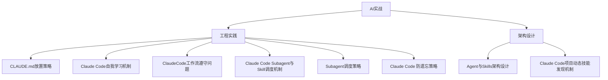

## 目录结构

## 笔记索引

### 工程实践
- [[../../npm/AI实战/工程实践/CLAUDE.md放置策略]] #claude-code
- [[../../npm/AI实战/工程实践/Claude Code自我学习机制]] #Claude-Code
- [[../../npm/AI实战/工程实践/ClaudeCode工作流遵守问题]] #AI工程
- [[工程实践/Claude Code Subagent与Skill调度机制]] #claude-code
- [[工程实践/Subagent调度策略]] #Claude-Code #Subagent #Skill
- [[工程实践/Claude Code 防遗忘策略]] #AI工程 #ClaudeCode #工作流

### 架构设计
- [[../../npm/AI实战/架构设计/Agent与Skills架构设计]] #Agent
- [[../../npm/AI实战/架构设计/Claude Code项目动态技能发现机制]] #claude-code

## 概览

- 📂 目录：`AI实战`
- 📝 笔记总数：8
- 📁 子目录数：2
- 📅 生成日期：2026-05-12
- 📅 更新日期：2026-05-24
