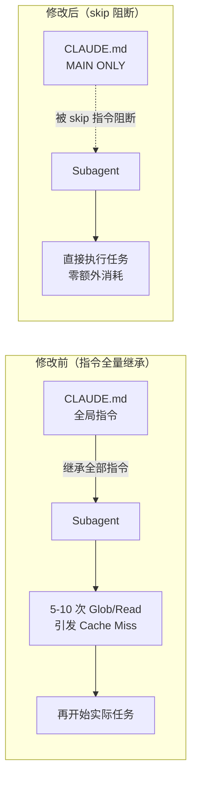

# Subagent Token 吞噬与缓存失效分析

## 背景

在基于 Claude Code Subagent 的多 Agent 编排架构中，虽然自动化程度大幅提升，但实际运行中暴露出了一个核心矛盾：**Agent 越自动，Token 消耗越失控**。本文记录在实际工程中遇到的 Token 暴涨与缓存失效问题，以及总结出的优化策略。

---

## 一、核心痛点

### Token 消耗雪崩

Subagent 架构的直观好处是分工明确、各司其职，但在实践中极易陷入 ==Token 暴涨黑洞==。一个简单的"美化笔记"任务，可能消耗数万甚至数十万 Token，远超预期。

### 缓存命中率极低（Cache Miss）

大模型 API 的 Prompt Caching 依赖 ==前缀完全匹配==。动态状态和多 Agent 轮询切换频繁破坏前缀一致性，导致缓存命中率极低，每次调用都按全价计费。

---

## 二、Subagent 消耗 Token 的"三大幕后黑手"

### 1. System Prompt 乘数效应

每个 Subagent 都携带独立的系统提示词（角色定义、工具列表、SOP 流程）。当主路由在多个 Subagent 之间频繁切换时，这些**长文本 System Prompt 被反复计费**。

> [!example] 典型场景
> 一个工作流涉及 4 个 Subagent（collector / curator / writer / beautifier），每次切换都要重新加载一套完整的 System Prompt。假设每个 Prompt ~1500 tokens，4 次切换光 Prompt 就消耗 6000 tokens，而这还不算实际任务内容。

相关 Subagent 路由机制可参考 [[Subagent调度策略]]。

### 2. 上下文雪崩（Context Carrying）

为了维持上下文连贯性，主路由通常会将前序 Agent 的输出、思考过程和历史对话**完整打包**传给下一个 Agent。结果：

- Agent A 输出 2000 tokens
- Agent B 收到 A 的输出 + 自己的历史 ≈ 5000 tokens
- Agent C 收到 A+B 的输出 + 自己的历史 ≈ 9000 tokens
- ...上下文像滚雪球般膨胀，**最终 Agent 的输入远超实际需要**

### 3. 反思内耗（Reasoning Loop）

这是最隐蔽、也最容易被忽视的消耗点。Agent 在执行复杂任务时，内部会进行多轮 **"规划 → 执行 → 观察 → 反思 → 修正"** 的隐式循环。

**量化数据**（基于实际观测）：

| 环节 | 典型 Token 消耗 | 说明 |
|------|----------------|------|
| 单次工具调用 + 结果处理 | 500–2000 | 正常的单步操作 |
| 隐式反思循环（每轮） | 1000–3000 | Agent 内部"想一下再干" |
| 复杂任务总隐性消耗 | 3000–15000 | 3–5 轮反思循环后，最终输出可能仅 100 字 |

> [!bug] 真实案例代价
> 某次 Beautify 任务中，Subagent 最终产出的笔记正文约 3000 tokens，但**中间反思和重试消耗了超过 2 万 tokens**，占比高达 ==87%==。

---

## 三、典型反面教材：Beautify Git 实战笔记案例剖析

在执行"Beautify Git 实战笔记"任务时，该 Subagent 表现出了典型的**无边界感行为**：

### 1. 广撒网的模糊搜索（Glob 轰炸）

```bash
# 实际发生的搜索行为
Glob .claude/skills/*/SKILL.md          # 查找所有技能定义
Glob OpenSpec*.md                        # 搜索 OpenSpec 文件
Glob Superpowers*.md                     # 搜索 Superpowers 文件
Glob **/Git*.md                          # 搜索所有 Git 相关笔记
```

**后果**：每次搜索扫出的文件名列表不同 → 上下文 Hash 值改变 → **直接引发 Cache Miss**。

### 2. 毫无节制的全量读取（Read 轰炸）

在动手修改前，Subagent 全量读取了大量**周边但不必要的背景文件**：
- `Git MOC.md`
- `分支管理最佳实践.md`
- `Claude Code 防遗忘策略-笔记.md`

**后果**：大文件被全量塞进 Context → **上下文污染 + Token 计数器暴涨**。其中一些文件与当前 Beautify 任务完全无关。

### 3. 动态状态污染

Subagent 在执行过程中频繁调用本地命令（`ls`、`mkdir` 等），并将这些**瞬态结果**（临时文件路径、目录结构等）插入到 Prompt 中。

**后果**：动态变量出现在 Prompt 靠前或中间位置 → **直接破坏大模型的自上而下缓存匹配机制**。即使前面的 System Prompt 完全一致，一旦中间插入动态值，整个缓存前缀就断裂了。

---

## 四、Token 拯救指南：高内聚、低耦合的 Agent 优化策略

### 策略 1：打造"缓存友好型"Prompt 结构

大模型 Prompt Caching 的匹配规则是**自上而下、前缀完全一致**。因此 Prompt 内部的结构排列直接影响缓存命中率。

#### 糟糕结构（极易 Miss）

```
[固定角色定义]          ← 这部分匹配缓存
[动态 TODO / 上次结果]  ← 动态内容打破了前缀一致性 → Cache Miss
[庞大工具列表]          ← 重新加载，全价计费
[静态 Skill 定义]
```

#### 优化结构（高 Hit 率）

```
[固定角色定义]          ← 匹配缓存
[庞大工具列表]          ← 匹配缓存
[静态 Skill 定义]       ← 匹配缓存
[缓存截断点]           ← 标记：此处之前可缓存
───────────────────────
[当前动态输入]          ← 仅这部分按新内容计费
[TODO 状态]
```

> [!tip] 关键原则
> 把所有**静态内容**（角色、工具列表、Skill 定义）前置排列，把**动态内容**（TODO 状态、文件路径、上一步结果）统一后置，让静态前缀尽可能长。

### 策略 2：限制工具权限，实施"精准喂食"

#### 剥夺盲目搜索权

在 Subagent 的 Prompt 中**明确禁止**随意调用 Glob 扫盘：

```
## 工作约束
- 禁止使用 Glob **/* 全盘搜索
- 只允许操作主路由传递的指定文件路径
- 如需查找文件，先查阅 TODO.md 中的路径记录
```

#### 按需裁剪（Slimming）

由主路由先进行低成本检索，**只把当前步骤绝对必需**的知识切片喂给 Subagent：

> [!danger] 错误做法
> Subagent 自行 Glob 搜索 → 读取多个大文件

> [!success] 正确做法
> 主路由预先检索 → 裁剪出关键段落 → 传递给 Subagent

**主路由自身也有成本**，但实测对比显示：

| 策略 | 总 Token 消耗 | 说明 |
|------|--------------|------|
| Subagent 自行搜索 | 8000–25000 | 含多次 Glob + 全量读取大文件 |
| 主路由裁剪后投喂 | 2000–5000 | 主路由裁剪消耗 ~500 tokens，投喂内容 ~2000 tokens |
| **节省比例** | ==60–75%== | 裁剪策略净节省显著 |

### 策略 3：使用"单向快照"代替"全量历史"

#### 斩断思考历史

Subagent 之间通信时，**禁止传递全量思考过程**（Thought Process）。思考过程中的反思、试错、回退等对下游 Agent **毫无价值**。

#### 轻量化交付（Handover）

> [!danger] 错误做法
> Agent A 的全部对话历史（5000 tokens）→ Agent B

> [!success] 正确做法
> Agent A 的输出成果/交付物（500 tokens）→ Agent B

Agent A 结束工作时，仅总结提炼出一份精简的 **Artifact（交付物）** 传给 Agent B，切断无意义的 Token 累积。

---

## 五、方案选型与架构改进

### 根因诊断：CLAUDE.md 的全局继承问题

当前 `CLAUDE.md` 中的三段指令设计时**只考虑了主 Agent**，但没有明确排除 Subagent（参见 [[CLAUDE.md放置策略]]）：

| 指令段 | 对 Subagent 的影响 |
|--------|-------------------|
| Resource Discovery | Subagent 启动时执行大量 Glob 搜索 |
| Pre-Task Init | Subagent 执行无意义的配置读取 |
| Mandatory Triggered Reads | Subagent 读取不需要的大文件 |

由于 Claude Code 的系统提示注入机制，所有 Subagent 都会**继承这些全局指令**，导致启动时先做 5–10 次无意义的搜索和读取，然后才开始真正的任务。

### 架构变更示意



### 方案对比

| 方案 | 优点 | 缺点 | 选择 |
|------|------|------|------|
| **A: Agent 定义加 skip 指令** | 最小改动，精准控制 | 每个 agent 都要改 | ✅ 主要方案 |
| **B: CLAUDE.md 分离 main-only** | 从源头解决 | 影响面大，需验证所有 agent | ❌ |
| **C: 修复路径验证范围** | 解决具体症状 | 不解决全局继承问题 | ✅ 补充方案 |

**最终选择：A + C 组合**
- **方案 A** 解决全局继承问题（根源）
- **方案 C** 解决 Subagent 内部的低效搜索（症状）

### 跨阶段路径传递改进

扩展 TODO.md 格式，为每个 Phase 记录输入/输出路径，让后续 Subagent **精确获取所需内容，无需自己搜索**：

```markdown
## Phase 1: Collect
- [x] 完成收集
  - input: N/A（用户输入）
  - output: {SYSTEM_ROOT}/0-inbox/{topic}/raw/

## Phase 2: Curate
- [ ] 整理资料
  - input: {SYSTEM_ROOT}/0-inbox/{topic}/raw/
  - output: {SYSTEM_ROOT}/1-curated/{topic}/
```

### Wikilink 验证范围优化

Subagent 在验证文件链接时，也常做不必要的全盘搜索（参见 [[../架构设计/Agent与Skills架构设计]]）：

> [!danger] 旧行为
> Glob **/目标名.md → 扫描整个 vault，返回大量无关结果

> [!success] 新行为
> Glob {OUTPUT_PATH}/目标名.md → 只在目标目录搜索<br/>Glob {SYSTEM_ROOT}/**/目标名.md → 只在系统目录搜索

搜索范围从整个 Vault 缩小到 1–2 个目录，**减少 80%+ 的 Glob 结果**。

---

## 六、总结与行动清单

> [!quote] 关键认知
> 1. **Subagent 的自动不等于高效** — 自动化程度越高，越需要约束机制
> 2. **Cache Miss 比 Token 消耗更隐蔽** — 不仅浪费 Token，还降低响应速度
> 3. **优化是系统工程** — 需要 Prompt 结构、工具权限、通信协议三管齐下

### 可立即实施的优化项

- [ ] 检查所有 Subagent 的 Prompt，将静态内容前置、动态内容后置
- [ ] 在 Subagent Prompt 中加入"禁止全局搜索"指令
- [ ] 建立 Agent 间通信的 Handover 规范（只传交付物，不传思考过程）
- [ ] 扩展 TODO.md 格式，加入路径记录
- [ ] 修剪 Glob 搜索范围，避免全盘扫描
- [ ] 量化当前每个 Subagent 的 Token 消耗基线（优化前），用于后续对比验证

---

## 参考资料

- [[Claude Code 防遗忘策略]] — 相关的 Subagent 行为规范
- [[../../../GitHub项目/CodeGraph实战笔记]] — Agent 架构上下文感知的实践
- [[../sortspec]] — 排序与规范化相关经验
- [[Subagent调度策略]] — Subagent 调度与路由机制
- [[../架构设计/Agent与Skills架构设计]] — Agent 系统架构设计参考
- [[CLAUDE.md放置策略]] — CLAUDE.md 指令隔离策略
