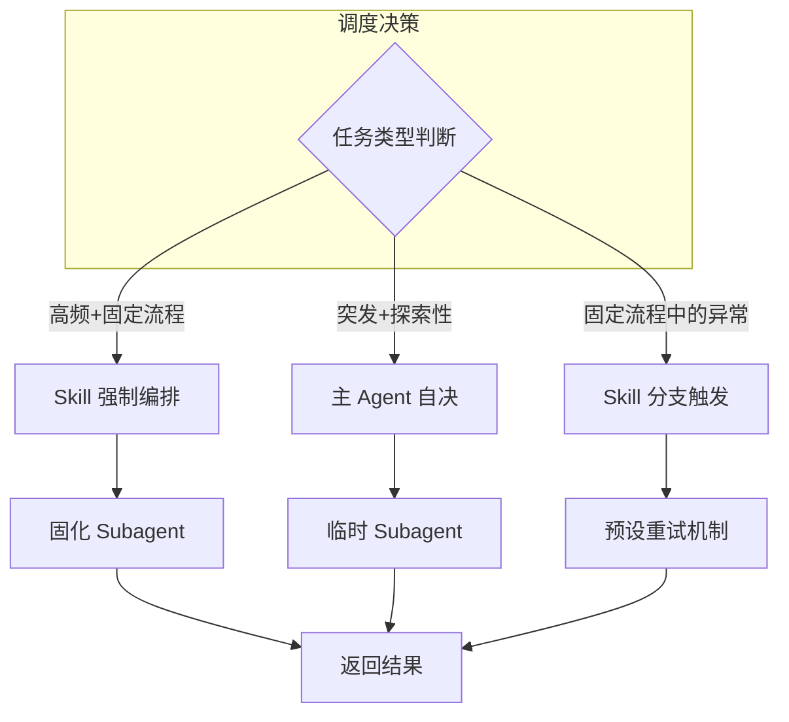

# Subagent 调度策略

> [!question] 核心问题
> 什么时候该用 Skill 强制编排，什么时候该让 AI 自由发挥？

---

## 核心结论

没有绝对的唯一解。核心原则是：

| 任务类型 | 推荐策略 | 模式 |
|:---------|:--------|:-----|
| 核心的、高频的常规工作流 | 写在 Skills 里强制执行 | 正规军模式 |
| 突发的、探索性的任务 | 交给主 Agent 动态决定 | 游击战模式 |

> [!tip] 一句话总结
> 把摸透规律的、结构化的防错机制用 Skills 固化下来；把未知的、需要试错的精力留给主 Agent 去动态拉起。这样既有流水线的稳定，又有专家的灵活。

---

## 两种模式对比

### 正规军模式：Skill 强制编排

把 Subagent 的调用逻辑硬编码到 Skill 中，构建稳定流水线。

#### 核心优势

1. **消除信息衰减** — 避免主 Agent 派发任务时"缺斤少两"。可以强制规定上下文传递格式：
   > "调用测试 Agent 时，必须带上完整的 pytest 报错日志"

2. **权限隔离** — 结合 `.claude/agents/` 的 `tools` 字段实现细粒度控制：
   ```yaml
   # 只读 Agent 示例
   tools: Read, Grep, Glob  # 无法 Write、Edit、Bash
   ```

3. **模块化** — 长篇 Prompt 拆解为独立步骤，像搭积木一样易维护

#### 适用场景

> [!info] 特征判断
> 3 步以上 + 逻辑固定

- **代码提交流程**：编码 → linter → test
- **架构解析**：多只读 Agent 分区收集 → 汇总输出

#### Skill 强制编排示例

在 Skill 中定义分支逻辑和调用规则：

```markdown
## 自动化重构与审查工作流

执行代码重构时，请按以下步骤执行：

1. 你（主 Agent）负责分析架构，执行代码重写
2. 完成后，调用 `code-reviewer` Subagent，把代码路径和修改意图传给它
3. 如果测试失败 → 调用 `test-runner` 尝试修复
4. **最多重试 3 次**，仍失败则返回错误报告
```

> [!example] 权限隔离配置
> ```yaml
> # .claude/agents/code-reviewer.md
> name: code-reviewer
> description: 代码审查专家
> tools: Read, Grep, Glob  # 只读，无法 Write/Edit
> ```

---

### 游击战模式：主 Agent 自由发挥

不写死，依赖大模型的判断力，遇到障碍时自行召唤"临时工"。

#### 核心优势

1. **应对突发状况** — 巨型日志、奇怪报错，临时拉起 Subagent 最灵活
2. **探索性试错** — 面对陌生 API，可以分头探路

#### 适用场景

- **死胡同排错**：连续修复失败后，开子进程查文档
- **复杂环境**：PVE、Docker 网络等千奇百怪的配置

---

## 混合调度架构

"主干稳定，分支灵活"的混合模式：



> [!note] 图注
> - 左侧节点为调度入口，根据任务类型分流
> - Skill 节点（蓝）= 固化流程，Agent 节点（绿）= 动态决策

| 场景 | 策略 | 示例 |
|:-----|:-----|:-----|
| 标准化工作流 | Skill 强制 | 重构后必须 Reviewer 检查 |
| 预期的异常处理 | Skill 分支 | "报错时调用 test-runner，最多重试 3 次" |
| 未知的突发阻碍 | 主 Agent 自决 | 读不懂的内核日志，拉临时工处理 |

> [!see-also] 相关概念
> 详见 [[Claude Code Subagent与Skill调度机制]] 中的 **Operator Pattern** 团队架构图

---

## 补充考量

### Token 消耗

| 模式 | 特点 |
|:-----|:-----|
| **Skill 模式** | 流程稳定，但可能产生更多对话轮次 |
| **动态模式** | 更灵活，可能用更少 token 解决单次问题 |

### 可观测性

| 模式 | 特点 |
|:-----|:-----|
| **Skill 模式** | 执行链路清晰，易于日志追踪 |
| **动态模式** | 需要额外机制记录"何时拉起了什么 Agent" |

---

## 思考题

1. 你的工作流中，哪些场景符合"3 步以上 + 逻辑固定"的特征，适合用 Skill 模式？
2. 如果一个任务同时包含固定流程和突发状况，你会如何拆分？
3. 如何判断某个场景是否需要"物理级权限隔离"？
4. 混合架构下，如何设计监控机制来追踪动态拉起的 Agent？
5. 如果 Skill 模式反而增加了 token 消耗，如何优化？

---

## 来源

[来源: 个人经验]

> [!check] 已验证
> - "物理级权限隔离"：`tools` 字段确实支持细粒度控制（Read-only Agent 可配置）

---

## 相关笔记

- [[Claude Code Subagent与Skill调度机制]] — 更详细的调度机制说明
- [[../../../AI学习/Claude Code 教程/Subagent 实战练习]] — 动手实践 Subagent 的配置与调用
