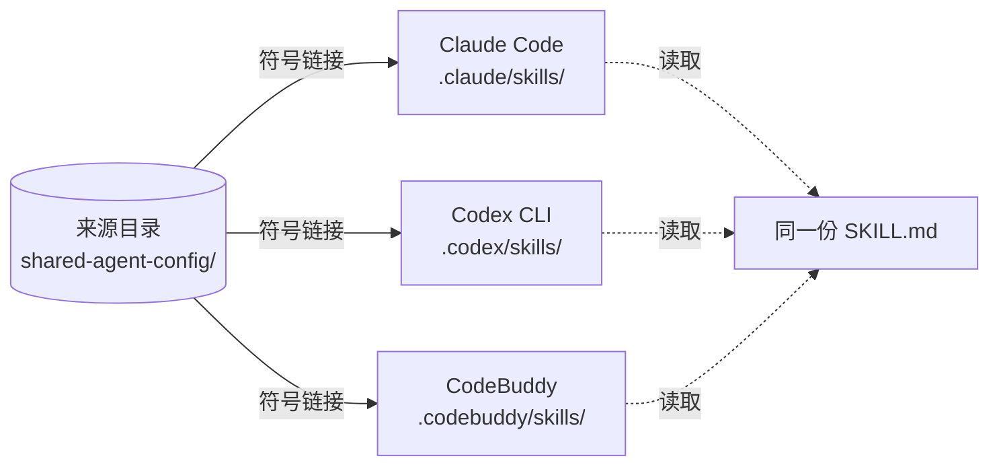
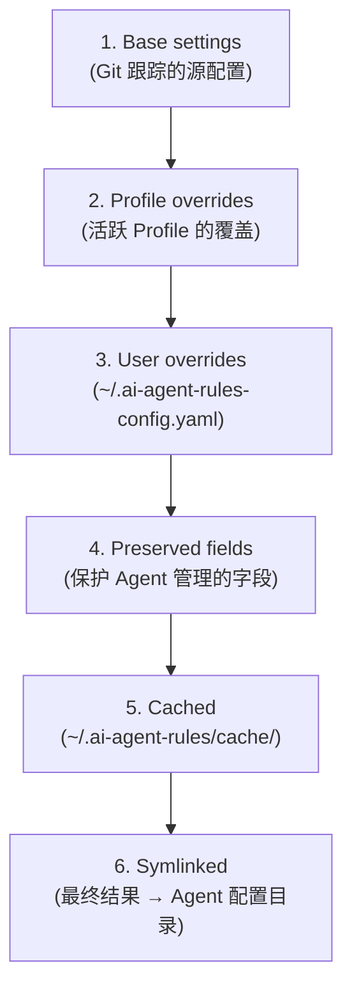
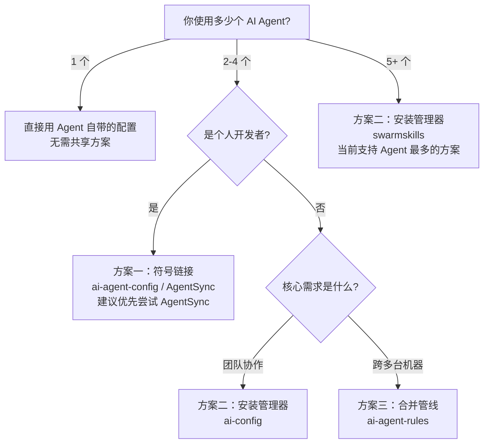

# 多 AI Agent 配置文件共享方案

## 背景与痛点

### 问题描述

如果你同时使用多个 AI 编码助手（Claude Code、Codex CLI、CodeBuddy 等），你的项目目录里可能会长成这个样子：

```
your-project/
├── .claude/          # Claude Code 的配置
│   ├── settings.json
│   ├── skills/       # 技能
│   └── agents/       # 子代理
├── .codex/           # Codex CLI 的配置
│   ├── config.toml
│   ├── skills/       # 同样的技能，再复制一份
│   └── agents/       # 同样的子代理，再复制一份
├── .codebuddy/       # CodeBuddy 的配置
│   ├── settings.json
│   └── skills/       # 同样的技能，再复制第三份
├── CLAUDE.md         # Claude Code 的项目说明
└── AGENTS.md         # Codex 的项目说明（内容几乎一样）
```

这是 **重复配置** 的典型困境：每个 Agent 使用不同的目录名、不同的文件格式、不同的发现路径，但核心内容（Skills、Rules、子代理定义）基本一致。[来源: R4]

### 重复配置的代价

| 问题 | 表现 | 后果 |
|------|------|------|
| **更新不一致** | 在 `.claude/skills/` 里更新了一个 skill，忘记同步到 `.codex/skills/` | 不同 Agent 行为不一致，调试困难 |
| **配置漂移** | 时间长了，两个 Agent 的同一个 skill 版本不同 | 团队协作时 "你的 Agent 能跑，我的不能" |
| **维护负担** | 每次新增一个 skill 要操作 3 个目录 | 摩擦成本高，容易遗漏 |
| **心智负荷** | 要记住每个 Agent 的文件格式差异 | 切换 Agent 时频繁查文档 |

### 核心矛盾

> [!abstract] 核心矛盾
> 每个 Agent 的配置**目录结构**不同、**文件格式**不同，但**配置内容**高度重叠。[来源: R10]

解决方案就是：**一份来源，分发到所有 Agent**。

---

## 各 Agent 配置结构速览

要共享配置，首先得知道每个 Agent 的配置放在哪里、长什么样子。

### Claude Code 配置结构

Claude Code 使用双层目录系统：项目级 `.claude/`（提交到 Git）和用户级 `~/.claude/`（个人偏好）。[来源: R1]

```
your-project/
├── CLAUDE.md                    # 核心项目指令（每次会话加载）
├── CLAUDE.local.md              # 个人覆盖（自动 gitignore）
├── .mcp.json                    # MCP 服务器配置（项目根目录）
└── .claude/
    ├── settings.json            # 权限、钩子、模型配置
    ├── settings.local.json      # 个人覆盖（gitignored）
    ├── rules/                   # 路径作用域的模块化规则
    │   ├── code-style.md
    │   └── testing.md
    ├── skills/                  # 可复用工作流（目录 + SKILL.md）
    │   └── deploy/SKILL.md
    ├── commands/                # 斜杠命令（已合并到 skills）
    ├── agents/                  # 子代理定义（Markdown + YAML frontmatter）
    └── agent-memory/            # 持久化子代理记忆
```

**关键文件格式**：Markdown（YAML frontmatter），配置文件为 JSON。[来源: R1]

### Codex CLI 配置结构

Codex CLI 使用 TOML 格式，配置存储在 `.codex/config.toml`。项目必须标记为 `trusted` 才能加载本地配置。[来源: R2]

```
your-project/
├── AGENTS.md                    # 项目指令（兼容 CLAUDE.md）
├── .codex/
│   ├── config.toml              # 主配置（TOML 格式）
│   ├── agents/
│   │   ├── reviewer.toml        # 子代理定义（TOML 格式）
│   │   └── explorer.toml
│   ├── skills/                  # 技能目录
│   └── hooks/                   # 生命周期钩子
├── .agents/
│   └── skills/                  # Codex 的技能发现路径
└── ~/.agents/skills/            # 用户级技能路径
```

**关键特点**：
- Config 是 TOML 格式，Agent 定义也是 TOML
- 支持 Profiles（通过 `codex -p <name>` 切换）
- 明确支持 symlink 跟随 [来源: R2]
- 内置从 Claude Code 的迁移向导（`/import`）

> [!tip] Codex 与 Claude Code 兼容性
> Codex CLI 支持读取 `AGENTS.md` 作为项目指令，内容与 `CLAUDE.md` 90%+ 相同。它还提供了 `/import` 命令，可以从 Claude Code 配置自动迁移。[来源: R2, R4]

### CodeBuddy 配置结构

CodeBuddy（腾讯云 AI 编码助手）使用 JSON 格式的三层配置系统。[来源: R3]

```
your-project/
├── .codebuddy/
│   ├── settings.json            # 共享项目设置（提交到 Git）
│   ├── settings.local.json      # 本地项目设置（自动 gitignore）
│   ├── agents/                  # 子代理定义
│   │   └── reviewer.md
│   ├── skills/                  # 技能目录
│   └── memories/                # 团队记忆
└── ~/.codebuddy/settings.json   # 用户设置（所有项目通用）
```

**关键特点**：
- 与 Claude Code 结构最相似（Markdown agent 定义）
- 支持 `models.json` 自定义模型配置
- `autoMode` 字段**不在共享配置中读取**（安全设计）[来源: R3]
- 钩子系统支持 PreToolUse

### AGENTS.md 开放标准

AGENTS.md 是由 Linux Foundation 下的 Agentic AI Foundation 维护的**开放标准**——由 OpenAI、Google、Cursor、Factory 等公司背书。2026 年已被 **60,000+ 开源项目**和 **30+ 工具**采用。[来源: R4]

**核心原则**：
- 纯标准 Markdown，无 required fields、无 frontmatter、无条件加载
- 30+ 工具支持（Codex、Jules、Cursor、Windsurf、Aider、VS Code、JetBrains Junie、GitHub Copilot、Gemini CLI 等）
- "nearest file wins" 解析规则

**与 CLAUDE.md 的关系**：90%+ 的内容完全相同，只有高级特性不同。[来源: R4]

### Agent 配置格式对比总表

| 维度 | Claude Code | Codex CLI | CodeBuddy | AGENTS.md 标准 |
|------|-------------|-----------|-----------|----------------|
| 主指令文件 | `CLAUDE.md` | `AGENTS.md` | (settings.json) | `AGENTS.md` |
| 配置格式 | JSON | TOML | JSON | Markdown |
| 子代理格式 | Markdown + YAML | TOML | Markdown + YAML | — |
| 技能格式 | 目录 + SKILL.md | 目录 + SKILL.md | 目录 + SKILL.md | — |
| 技能发现路径 | `.claude/skills/` | `.agents/skills/` + `.codex/skills/` | `.codebuddy/skills/` | — |
| 支持 symlink | 有限支持（/skills 列表可能不显示） | 明确支持 | 待验证 | — |
| 配置作用域 | project + user + enterprise | project + user + enterprise | project + user | project（层级覆盖） |

[来源: R1, R2, R3, R4, R12]

---

## 方案一：符号链接方案（Symlink-Based Sharing）

### 原理

将所有配置文件存放在一个**中立的来源目录**中，然后通过操作系统符号链接（symlink），将每个 Agent 的配置发现路径指向这个来源目录。编辑来源文件 = 所有 Agent 同时更新。[来源: R5]



### 目录结构

```
shared-agent-config/          # Git 仓库，单一来源
├── GLOBAL.md                 # 全局指令
├── skills/                   # 技能目录（通用格式）
│   ├── code-review/SKILL.md
│   └── test-writer/SKILL.md
├── agents/                   # 子代理定义（Markdown 格式）
├── codex-agents/             # 从 agents/ 自动生成的 TOML 版本
├── codex-config.example.toml # Codex 配置模板
└── install/
    ├── link-claude.sh
    ├── link-codex.sh
    └── link-all.sh
```

### 链接映射：ai-agent-config 的方案

| 来源文件 | Claude Code 目标 | Codex CLI 目标 |
|----------|-----------------|----------------|
| `GLOBAL.md` | `~/.claude/CLAUDE.md` | `~/.codex/AGENTS.md` |
| `agents/` | `~/.claude/agents` | — 需转换为 TOML |
| `codex-agents/` (TOML) | — | `~/.codex/agents` |
| `skills/` | `~/.claude/skills` | `~/.codex/skills` |
| `codex-config.toml` | — | `~/.codex/config.toml` |

[来源: R5]

### 实际操作

**方案 A：手动创建 symlink**

```bash
# 设置来源目录
mkdir -p ~/shared-agent-config/skills

# 为 Claude Code 创建链接
ln -s ~/shared-agent-config/skills/code-review ~/.claude/skills/code-review

# 为 Codex CLI 创建链接
ln -s ~/shared-agent-config/skills/code-review ~/.agents/skills/code-review
```

[来源: R12]

**方案 B：使用 AgentSync（Rust CLI）**

AgentSync 是一个用 Rust 编写的便携式同步 CLI，通过 TOML 配置文件管理所有 symlink。[来源: R11]

```bash
# 安装
npm install -g @dallay/agentsync
# 或使用 Cargo
cargo install agentsync

# 初始化
cd your-project
agentsync init --wizard    # 从现有配置迁移

# 应用 symlink
agentsync apply
agentsync apply --dry-run  # 预览变更

# 检查状态
agentsync status
agentsync doctor           # 健康检查
```

AgentSync 的配置文件 `.agents/agentsync.toml`：

```toml
source_dir = ".agents"
default_agents = ["claude", "codex"]

[agents.claude]
enabled = true

[agents.claude.targets]
  [agents.claude.targets.instructions]
  source = "AGENTS.md"
  destination = "CLAUDE.md"
  type = "symlink"

  [agents.claude.targets.skills]
  source = "skills"
  destination = ".claude/skills"
  type = "symlink-contents"
  pattern = "*/SKILL.md"
```

**方案 C：使用 ai-agent-config（GitHub: casoon/ai-agent-config）**

一个更简单的 Python 脚本方案，专注于 Claude Code + Codex CLI 配对。[来源: R5]

```bash
git clone https://github.com/casoon/ai-agent-config.git
cd ai-agent-config
./install/link-all.sh
git config core.hooksPath .githooks  # 启用 pre-commit 自动转换
```

这个方案还包含一个 pre-commit 钩子，自动将 Markdown agent 定义转换为 Codex 所需的 TOML 格式。[来源: R5]

### Symlink 的兼容性注意事项

| Agent | Symlink 支持 | 注意事项 |
|-------|-------------|---------|
| **Claude Code** | 有限 | 直接调用 `/skill-name` 可用，但 `/skills` 列表**可能不显示** symlink 的技能 |
| **Codex CLI** | 明确支持 | 在扫描时会跟随 symlink 目标 |
| **CodeBuddy** | 待验证 | 文档中未明确提及 symlink 支持 |
| **Gemini CLI** | 支持 | 通过 agentalign 方案支持 |

[来源: R12]

> [!warning] Claude Code 的 symlink 限制
> Claude Code 在某些版本中对 symlink 支持的 skill 在 `/skills` 列表中不可见，但直接通过 `/skill-name` 调用仍然可用。如果你依赖 `/skills` 列表浏览可用技能，需要评估这个限制。[来源: R12]

### 优点与缺点

**优点**：
- 单一来源，一处编辑处处生效，**零同步延迟**
- 使用操作系统原生 symlink，无运行时守护进程
- 支持格式转换（Markdown -> TOML）
- Git 跟踪，版本控制

**缺点**：
- 跨平台兼容性问题（Windows 需要开发者模式）
- Claude Code 的 `/skills` 列表可能不显示 symlink 技能
- 每个机器需要手动运行安装脚本
- 没有内置的回滚机制

**适合场景**：个人开发者，2-3 个 Agent，追求"一改全改"的即时性。

---

## 方案二：统一安装管理器（Installer-Based Sharing）

### 原理

中心化配置源 + 安装器脚本。配置存在一个 Git 仓库中，运行安装器时将配置**复制**到每个 Agent 的目录。与 symlink 方案的核心区别：**不是链接，是拷贝**。[来源: R10]

### 方案 A：ai-config（azat-io）

一个统一的配置管理器，支持 Claude Code、Codex、Gemini CLI 和 OpenCode。[来源: R10]

```bash
npx @azat-io/ai-config
```

安装器会交互式询问：
1. 需要配置哪些 Agent
2. 安装范围（项目级还是用户级）
3. 需要安装哪些 MCP 服务器

**项目级安装效果**：

```bash
your-project/
├── CLAUDE.md                     # 来自 ai-config
├── AGENTS.md                     # 来自 ai-config
├── .claude/
│   ├── commands/
│   ├── agents/
│   ├── skills/
│   ├── hooks/
│   └── settings.json
├── .codex/
│   ├── agents/*.toml
│   ├── skills/
│   └── config.toml
├── .gemini/
│   ├── commands/
│   ├── agents/
│   ├── skills/
│   └── settings.json
└── .opencode/
    ├── commands/
    ├── agents/
    └── opencode.json
```

**支持的功能矩阵**：

| Agent | 指令 | 命令 | Skills | 子代理 | 钩子 | MCP |
|-------|------|------|--------|--------|------|-----|
| Claude Code | Yes | Yes | Yes | Yes | Yes | Yes |
| Codex | Yes | No | Yes | Yes | No | Yes |
| Gemini CLI | Yes | Yes | Yes | Yes | Yes | Yes |
| OpenCode | Yes | Yes | Yes | Yes | No | Yes |

[来源: R10]

**优点**：显式安装、版本可控、支持交互式选择
**缺点**：修改源后需要**重新运行安装器**；不是即时更新

### 方案 B：swarmskills

swarmskills 既是 CLI 也是 MCP 服务器，管理约 **45 个 Agent** 的技能同步。[来源: R9]

```bash
npm install -g swarmskills

# 检测已安装的 Agent
swarmskills detect

# 同步技能到所有 Agent
swarmskills sync --all

# 列出技能
swarmskills list

# 搜索技能
swarmskills search code-review
```

**核心能力**：
- 内置约 45 个 Agent 的发现路径（包括 Claude Code、Codex、CodeBuddy、Cursor 等）
- 默认使用 symlink 同步，也可用文件拷贝
- 支持 MCP 协议（作为 MCP Server 运行）
- 支持插件机制：安装、启用、禁用

**关键设计**：
- 可变操作返回 `requiresRestart: true`——大多数 CLI Agent 在会话启动时读取技能状态 [来源: R9]
- 原子写入：写入 `.tmp` 再 rename
- 遵循 XDG 标准

### 优点与缺点

**优点**：
- 支持 Agent 数量最多（swarmskills 约 45 个）
- 显式同步，适合有审查流程的团队
- 不依赖 symlink，兼容性最好
- 支持交互式选择（ai-config）

**缺点**：
- 源修改后需手动或脚本触发重新同步
- 每次同步有一定延迟（不是即时的）
- 对不支持的 Agent 需要自定义配置

**适合场景**：团队协作场景，或者使用 5+ 个以上 Agent 的重度用户。

---

## 方案三：配置合并管线（Merge Pipeline）

### 原理

不是简单地将配置复制/链接到目标位置，而是通过**多阶段合并管线**将配置组装起来。支持 Profile 继承、用户覆盖、跨机器同步。[来源: R7]

### 代表工具：ai-agent-rules（wpfleger96）

用 Python 编写，通过 PyPI 发布。管理 5 个 Agent（Amp、Claude Code、Codex CLI、Gemini CLI、Goose）。[来源: R7]

```bash
# 安装
uvx --from ai-agent-rules ai-agent-rules setup
```

### 合并管线工作流程



[来源: R7]

### Profile 继承机制

三个内置 Profile，继承链：**default -> personal -> work**

```yaml
# ~/.ai-agent-rules-config.yaml
profile: work

profiles:
  personal:
    settings_overrides:
      claude:
        model: "claude-sonnet-4-20260514"

  work:
    extends: personal  # 继承 personal 的设置
    settings_overrides:
      claude:
        model: "claude-opus-4-20260514"
    mcp_overrides:
      jira:
        enabled: true
```

### 跨机器同步

配置源通过 Git 跟踪，不同机器通过 `~/.ai-agent-rules-config.yaml` 设置各自的机器特定值（如不同的 Claude 模型）。Profile 机制支持工作/个人环境切换。[来源: R7]

### 关键特性

- **合并管线**：不是简单的 symlink，而是在写入前从多个来源合并设置
- **Profile 继承**：支持上下文相关的配置（工作 vs 个人）
- **保留字段**：Agent 管理的字段（如 `enabledPlugins`、`hooks`）受保护不被覆盖
- **Git 跟踪源**：所有配置变更版本化，支持跨机器同步

### 优点与缺点

**优点**：
- 精细控制：支持分层覆盖（base -> profile -> user）
- Profile 继承机制适合复杂的多环境场景
- 保留 Agent 自身管理的字段，不破坏 Agent 状态
- 跨机器同步有成熟的 Git + user-override 方案

**缺点**：
- 复杂度最高（管线概念、Profile 继承、缓存管理）
- 设置和学习成本较高
- 支持 Agent 数量有限（目前 5 个）
- Python 3.10+ + uv 依赖

**适合场景**：跨多个机器工作的开发者，或有复杂 Profile 需求的团队。

---

## 方案对比与选型建议

### 对比总表

| 维度 | 方案一：符号链接 | 方案二：安装管理器 | 方案三：合并管线 |
|------|----------------|-------------------|----------------|
| **设置难度** | 低（简单命令或 CLI） | 中（交互式安装器） | 高（需理解管线概念） |
| **维护成本** | 低（一改全改） | 中（需显式同步） | 中（配置文件管理） |
| **传播速度** | 即时（OS 原生） | 按需（运行 CLI） | 按需（运行 CLI） |
| **Agent 支持数** | 2-8 个（取决于工具） | 45 个（swarmskills） | 5 个（ai-agent-rules） |
| **格式转换** | 需手动或 pre-commit | 内置自动转换 | 通过管线处理 |
| **回滚支持** | 无（手动备份） | 无 | 有（缓存 + 恢复） |
| **跨机器同步** | Git + 手动 | Git + 重新运行 | Git + user-override |
| **工具成熟度** | 中（社区项目） | 中-高（npm 包） | 低（Python 包早期） |
| **依赖** | 无 | Node.js (ai-config) / Node.js (swarmskills) | Python 3.10+ + uv |

[来源: R5, R7, R9, R10, R11]

### 决策流程图



---

## 实战：在你的项目中落地

以下是一个逐步实施指南——假设你正在使用 Claude Code + Codex CLI + CodeBuddy，想要统一管理配置。

### 第一步：审计现有配置

```bash
# 1. 列出所有 Agent 配置目录
echo "=== Claude Code ==="
ls -la .claude/skills/ 2>/dev/null || echo "（不存在）"
echo "=== Codex CLI ==="
ls -la .agents/skills/ 2>/dev/null
ls -la .codex/skills/ 2>/dev/null
echo "=== CodeBuddy ==="
ls -la .codebuddy/skills/ 2>/dev/null || echo "（不存在）"

# 2. 检查 CLAUDE.md 和 AGENTS.md 是否内容重复
diff .claude/CLAUDE.md AGENTS.md 2>/dev/null || echo "文件不存在或不同"
```

### 第二步：选择方案并初始化

对于个人开发者场景（2-3 个 Agent），推荐使用 **AgentSync**（方案一）。

```bash
# 安装 AgentSync
npm install -g @dallay/agentsync

# 在项目根目录初始化
cd your-project
agentsync init --wizard
```

初始化向导会带你：
1. 创建 `.agents/agentsync.toml` 配置文件
2. 选择需要管理的 Agent（claude、codex、copilot 等）
3. 扫描现有配置并迁移

### 第三步：迁移配置

手动整理共享配置到一个来源目录：

```
your-project/.agents/
├── AGENTS.md              # 核心指令（Claude Code 读为 CLAUDE.md）
├── skills/                # 共享技能
│   ├── code-review/SKILL.md
│   └── test-writer/SKILL.md
└── agentsync.toml         # AgentSync 配置
```

**跨 Agent 兼容的 SKILL.md 模板**：

```yaml
---
name: code-review
description: >
  Perform a structured code review for correctness, security,
  performance, and readability.
license: MIT
metadata:
  owner: platform-team
  version: "1.0.0"
---
```

> [!tip] Skill 命名规范
> 保持 `name` 与父目录名一致，使用小写+连字符，1-64 字符。[来源: R12]

### 第四步：应用并验证

```bash
# 应用 symlink
agentsync apply --dry-run  # 先预览
agentsync apply            # 实际创建

# 验证状态
agentsync status
agentsync doctor           # 运行诊断

# 检查 symlink 是否正确
ls -la .claude/skills/
# 期望输出:
# lrwxr-xr-x  code-review -> ../../.agents/skills/code-review

ls -la .codex/skills/ 2>/dev/null || ls -la .agents/skills/
# 期望看到类似的 symlink
```

### 第五步：验证 Agent 是否能加载

```bash
# Claude Code：尝试直接调用技能
cd your-project
claude
# 在会话中输入 /code-review（如果技能被正确加载）

# Codex CLI：启动会话检查技能列表
codex
# 在会话中，技能应该出现在自动建议中
```

### 第六步：日常维护

```bash
# 新增技能后，重新应用 symlink
git add .agents/skills/new-skill/
agentsync apply

# 定期检查 symlink 健康状态
agentsync status
```

### 踩坑提醒

> [!warning] 坑点 1：Claude Code 的技能列表不显示 symlink
> **现象**：`/skills` 列表看不到 symlink 的技能，但直接 `/skill-name` 调用可用。
> **原因**：Claude Code 在某些版本中扫描技能时对 symlink 支持不完善。
> **解决**：直接用技能名调用，或使用 Claude Code 的 native 配置方式。[来源: R12]

> [!warning] 坑点 2：Codex 的 trust level
> **现象**：Codex 不加载项目级 `.codex/` 配置。
> **原因**：项目必须显式标记为 `trusted`。
> **解决**：在 `~/.codex/config.toml` 中添加 `[projects."/absolute/path"] trust_level = "trusted"`。[来源: R2]

> [!warning] 坑点 3：不要共享敏感信息
> **教训**：API key、token 等机密信息不应放在共享配置中。
> **实践**：使用环境变量引用（如 `${API_KEY}`），或放在各机器的 local 配置中。[来源: R1]

---

## 进阶：高级模式

### 1. Hook 驱动的 MCP 注入

通过 Agent 的钩子系统（hooks），在每次工具调用前动态注入或修改 MCP 配置。[[MCP协议|MCP 协议]] 和 Codex 都支持 PreToolUse 和 PostToolUse 钩子。[来源: R1, R2]

```json
// Claude Code hooks
{
  "hooks": {
    "PreToolUse": {
      "Bash": "echo '激活项目特定的 MCP 配置...'"
    }
  }
}
```

### 2. 密钥分离（Secret Splitting）——agentalign

agentalign 是一个 Rust 工具，实现了更高级的"规范存储"模式：[来源: R6]

- 所有配置集中在 `~/.agents/` 目录
- 敏感字段（api_key、token、password）自动提取到 OS 密钥链
- 使用 `${ENV_AGENTALIGN_SECRET_*}` 占位符替换
- 支持 8+ 个 Agent（Claude Code、Cursor、Gemini CLI、Codex、OpenCode 等）

```bash
# 扫描现有配置到规范存储
agentalign migrate

# 同步到所有 Agent
agentalign sync

# 回滚最后一次同步
agentalign restore

# 启用自动双向同步（macOS LaunchAgent）
agentalign magic
```

### 3. Git 驱动的技能市场

SkillCaddy 提供了一个中央技能库管理方案：[来源: R8]

```
~/AISkills/
├── official/     # 官方技能
├── github/       # 从 GitHub 克隆的技能
├── personal/     # 用户自创技能
└── archived/     # 已归档技能
```

通过双层 symlink 策略将技能注入项目：

```
~/AISkills/official/my-skill/SKILL.md
       |
       | Layer 1: 从中央库到项目
       v
project/.agents/skills/my-skill -> ~/AISkills/official/my-skill
       |
       | Layer 2: 从跨 Agent 标准路径到 Claude 特定路径
       v
project/.claude/skills/my-skill -> ../../.agents/skills/my-skill
```

SkillCaddy 还提供 Web UI 和 TUI 界面，支持技能推荐、批量拉取 GitHub 源。[来源: R8]

### 4. 多 Agent 任务路由（HagiCode 架构）

HagiCode 项目展示了生产环境的多 Agent 协作架构——通过统一的 Provider 接口和工厂模式管理多个 Agent：[来源: R12]

| Agent | 模型提供商 | 角色 |
|-------|-----------|------|
| ClaudeCodeCli | Anthropic | 生成技术方案 |
| CodexCli | OpenAI/Zed | 执行精确的代码变更 |
| CodebuddyCli | Zhipu GLM | 优化文档 |
| IFlowCli | Zhipu GLM | 归档方案 |

它们的 **ACP 协议**（基于 JSON-RPC 2.0）标准化了 Agent 间的通信，任务管线将工作路由到最适合的 Agent。[来源: R12]

---

## 总结与建议

### 核心结论

1. **共享配置的核心矛盾**：目录结构不同、文件格式不同，但内容高度重叠。解决思路是"一份来源，多处分发"。

2. **三种方案对应不同复杂度**：
   - 符号链接：最简单、最即时，适合个人开发者
   - 安装管理器：显式同步、Agent 支持最多，适合团队
   - 合并管线：精细控制、支持 Profile 继承，适合多环境

3. **AGENTS.md 是未来趋势**：作为 Linux Foundation 标准，被 60,000+ 项目和 30+ 工具支持，建议优先使用。

4. **Skill 格式已经标准化**：目录 + SKILL.md + YAML frontmatter 是跨 Agent 的通用格式。

### 给你的建议

如果你是**个人开发者**使用 2-4 个 Agent：
> 从 **AgentSync**（方案一）开始。它简单、轻量、配置清晰。等需求变复杂后再切换到 agentalign 或 ai-agent-rules。

如果你是**团队**需要统一 Agent 行为：
> 使用 **ai-config**（方案二），配合 Git 仓库管理配置源。每次配置变更走 PR 审查流程，然后运行安装器更新。

如果你**跨多台机器**（工作/个人/公司电脑）：
> 尝试 **ai-agent-rules**（方案三），它的 Profile 继承机制天然适合多环境。

### 一句话记住

> [!quote] 核心原则
> **同一份 skill 内容，放到不同 Agent 的路径下——用 symlink 做到"一改全改"，用 installer 做到"显式可控"，用 merge pipeline 做到"精细分层"。**

---

## 思考题

1. 你的项目中同时使用了哪几个 AI Agent？它们的配置文件目录、格式分别是什么？画一张表对比出来。

2. 假设你选择 symlink 方案，但发现 Claude Code 的 `/skills` 列表看不到 symlink 的技能——你怎么调试？有哪些替代方式确认技能已被加载？

3. 团队场景中，如果成员 A 在家用 MacBook 跑 Claude Code，成员 B 在公司用 Windows 跑 Codex，你会推荐哪种共享方案？为什么？

4. agentalign 的"事务性同步 + SHA-256 校验 + 回滚"架构与简单的 symlink 方案相比，增加了哪些能力？哪些场景下你说"值得这个复杂度"？

5. 思考这个边界情况：你写了一个 skill（`test-writer`），其中使用了 Claude Code 特有的 `allowed-tools` 和 `context: fork` 特性。这个 skill 如何在不破坏 Codex 兼容性的前提下，同时给两个 Agent 使用？
